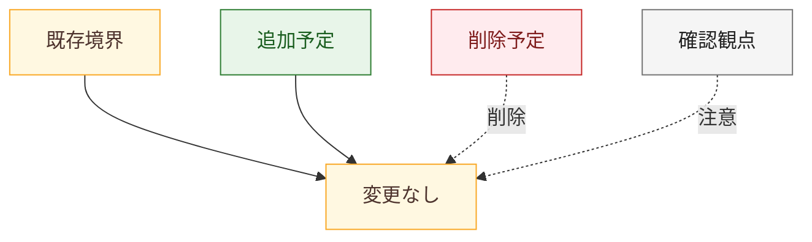
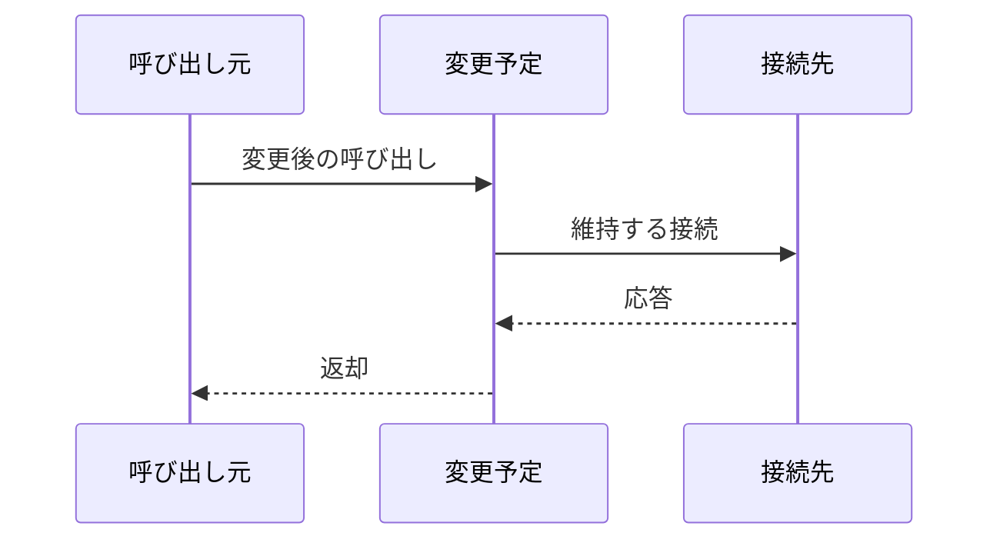

# <task-name> review diff

## 概要

- 図化目的: <人間レビューまたは実装着手判断で確認する内容>
- 根拠参照: <task 内成果物または docs 正本>
- 範囲: <予定変更箇所と接続先の最小範囲>

## コンポーネント図

## 差分凡例

- 赤: 削除する要素または経路を示す。
- 緑: 追加する要素または経路を示す。
- 黄色: 変更しない要素または経路を示す。

## 各箱の説明

- 既存境界: 変更しない接続先を示す。
- 追加予定: 新しく追加する要素または経路を示す。
- 削除予定: 削除または廃止する要素または経路を示す。
- 変更なし: 接続または責務を維持する要素を示す。
- 確認観点: 人間レビューで確認する制約または注意を示す。

## シーケンス図

## 検証

- Mermaid 記述確認: Mermaid コードブロック、図種別、箱または参加者、接続を確認する。
