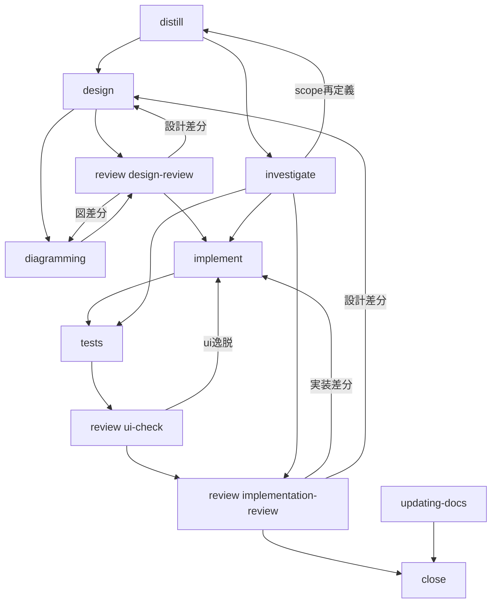

# Codex ワークフロー概要

この文書は live workflow の鳥瞰図です。
本文は新 skill 名だけで書き、旧名は末尾の対応表だけに残します。

## 全体像

`orchestrate` が唯一入口です。
`docs-only` 以外の task_mode は共通入口として `distill` を呼びます。
`docs-only` は human 承認済みの時だけ `updating-docs` へ handoff します。
その後は role ごとの skill を最小構成で呼び、close 条件と validation だけを管理します。

## Skill Roles

- `distill`: facts、constraints、gaps、required reading、related code pointer、recommended next skill を返す
- `investigate`: reproduce、trace、temporary-logging、reobserve、risk-report を扱う
- `design`: requirements、ui-mock、scenario、implementation-brief を扱う
- `implement`: `task_mode` と `implementation_target: frontend|backend|mixed` に従って実装する
- `tests`: `test_mode: scenario-implementation|unit` を扱う
- `review`: `review_mode: design-review|ui-check|implementation-review` を扱う
- `diagramming`: `diagram_mode: structure-diff|d2|plantuml` を扱う
- `updating-docs`: human 承認済み docs-only の docs 正本更新を扱う

## task_mode ごとの標準順序

### implement

- `distill` で facts / constraints / gaps を固定する
- `design` で requirements、必要時 ui-mock、scenario、implementation-brief を固める
- 構造差分や source 更新が必要な時だけ `diagramming` を使う
- `review design-review` を通す
- `implement`、`tests`、`review ui-check`、`review implementation-review` の順に進む

### fix

- `distill` で known facts と関連コードを絞る
- `investigate` で reproduce、trace、必要時 temporary-logging / reobserve を行う
- narrow scope が作れたら `implement` へ進む
- 修正後に `tests` を行う
- `review ui-check` と `review implementation-review` を通す
- residual risk が残る時だけ `investigate risk-report` を使う

### refactor

- `distill` で影響範囲と不変条件を整理する
- `design implementation-brief` を固める
- 振る舞い変更の可能性がある時は requirements と design-review を追加する
- `implement`、必要な `tests`、`review` を通す

### investigate

- `distill` を起点にする
- `investigate` だけで evidence を固定して close してよい
- 修正が必要と確定した時だけ `task_mode` を切り替える

### docs-only

- human 承認済みの時だけ `updating-docs` を使う
- `distill` は通さない
- 未承認なら停止理由を plan に残す

## Contract Layout

- quick overview contract は `orchestrate/references/orchestrate.to.<skill>.json`
- mode 別 handoff 正本は `orchestrate/references/contracts/orchestrate.to.<skill>.<mode>.json`
- mode 別返却正本は `<skill>/references/contracts/<skill>.to.orchestrate.<mode>.json`
- detailed guide は `<skill>/references/mode-guides/` に置く
- `updating-docs` は single-mode だが docs-only formalization のため guide / contract を持つ

## Legacy Name Map

- `orchestrating-*` -> `orchestrate`
- `phase-1-distill` / `distilling-fixes` / `explore` -> `distill`
- `reproduce-issues` / `tracing-fixes` / `logging-fixes` / `reporting-risks` / `analyzing-fixes` -> `investigate`
- `phase-1.5-functional-requirements` / `phase-2-ui` / `phase-2-scenario` / `phase-2-logic` -> `design`
- `phase-6-implement-*` / `implementing-fixes` -> `implement`
- `phase-5-test-implementation` / `phase-7-unit-test` -> `tests`
- `phase-2.5-design-review` / `phase-6.5-ui-check` / `phase-8-review` / `reviewing-fixes` -> `review`
- `diagramming-*` -> `diagramming`
- `working-light` -> `orchestrate` routing
