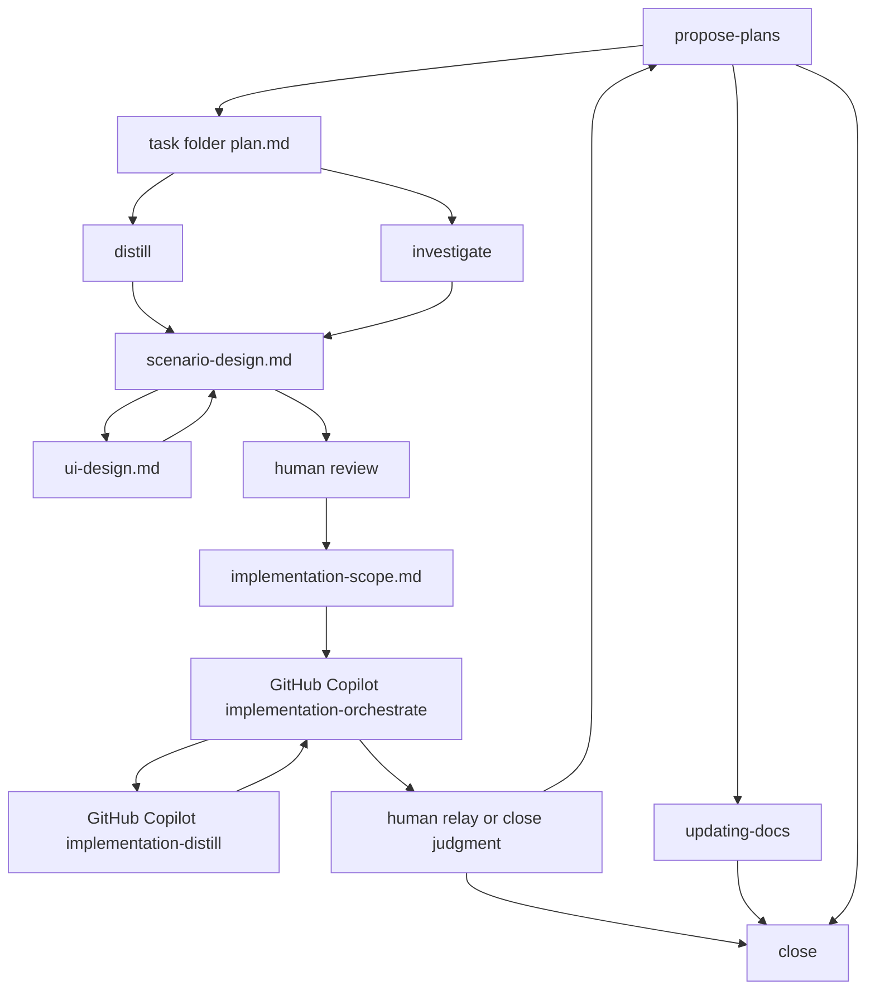

# Codex ワークフロー補助図

この file は補助図である。
live workflow の説明本文と判断基準の正本は [README.md](/Users/iorishibata/Repositories/AITranslationEngineJP/.codex/README.md) とする。

Codex は設計を担当します。
GitHub Copilot は実装を担当します。

## 位置づけ

この file は全体の向きを素早く確認するための補助図である。
live の role 境界、handoff、stop 条件、docs 正本化判断は [README.md](/Users/iorishibata/Repositories/AITranslationEngineJP/.codex/README.md) を使う。

## 参照先

- Codex workflow 正本: [README.md](/Users/iorishibata/Repositories/AITranslationEngineJP/.codex/README.md)
- Copilot 実装入口: [implementation-orchestrate](/Users/iorishibata/Repositories/AITranslationEngineJP/.github/skills/implementation-orchestrate/SKILL.md)
- docs 仕様入口: [docs/index.md](/Users/iorishibata/Repositories/AITranslationEngineJP/docs/index.md)

## 旧名対応

- `orchestrate` -> `propose-plans`
- `design` -> `scenario-design` / `ui-design` / `implementation-scope`
- 旧 flat file 形式の exec-plan -> task folder 形式
- Codex `implement` / `tests` / `review` -> GitHub Copilot 側へ移管
- Codex `distill` の implement / fix / refactor mode -> Copilot `implementation-distill`
- Copilot `orchestrate` -> `implementation-orchestrate`
