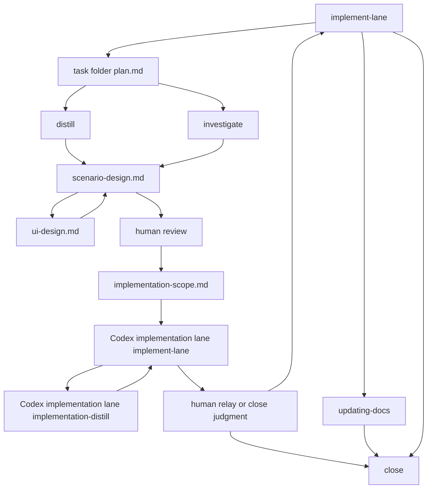

# Codex ワークフロー補助図

この file は補助図である。
live workflow の判断は、対象 skill と agent runtime の規約に従う。

Codex は設計を担当します。
Codex implementation lane は実装を担当します。

## 位置づけ

この file は全体の向きを素早く確認するための補助図である。
live の role 境界、handoff、stop 条件、docs 正本化判断は、対象 skill と agent runtime の規約を使う。

## 参照先

- Codex implementation lane 実装入口: [implement-lane](/Users/iorishibata/Repositories/AITranslationEngineJP/.codex/skills/implement-lane/SKILL.md)
- docs 仕様入口: [docs/index.md](/Users/iorishibata/Repositories/AITranslationEngineJP/docs/index.md)
