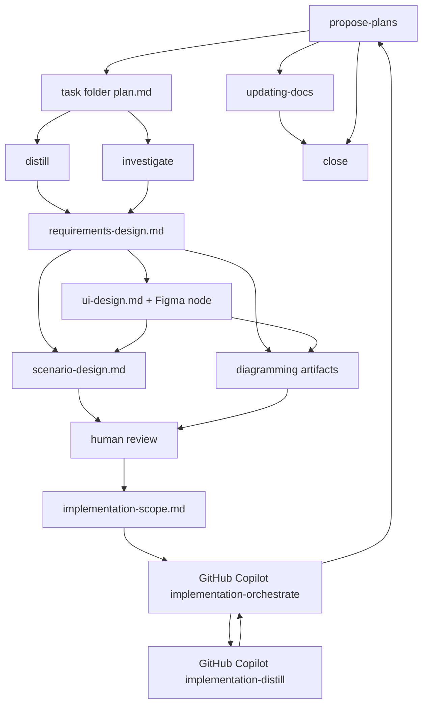

# Codex ワークフロー概要

Codex は設計を担当します。
GitHub Copilot は実装を担当します。

## 全体像

`propose-plans` が Codex 側の入口です。
要件、UI、シナリオ、実装スコープを task folder に分けて固定します。

実装と実装時調査は `.github/skills/implementation-orchestrate/SKILL.md` に渡します。
実装前の文脈整理は `.github/skills/implementation-distill/SKILL.md` が扱います。
Codex は product code と product test を変更しません。

## Codex 側 skill

- `propose-plans`: task folder、設計 gate、handoff、close を管理する
- `distill`: 設計前の入口情報を facts、constraints、gaps に圧縮する
- `investigate`: 設計前の再現、trace、risk を evidence として返す
- `requirements-design`: capability、制約、不変条件、未決事項を固定する
- `ui-design`: Figma file/node、主要操作、状態差分、確認証跡を固定する
- `scenario-design`: system test 観点、受け入れ条件、観測点を固定する
- `implementation-scope`: human review 後に Copilot handoff を固定する
- `diagramming`: 必要な図だけ作成または更新する
- `updating-docs`: human 承認済み docs 正本だけを更新する

## Exec Plan Folder

新規 task は `docs/exec-plans/active/<task-id>/` に置きます。
`plan.md` は索引として扱い、詳細は skill ごとの資料に分けます。

標準構成は次です。

- `plan.md`
- `requirements-design.md`
- `ui-design.md` または `N/A`
- `scenario-design.md`
- `implementation-scope.md` は human review 後だけ

## 設計の流れ

- `plan.md` を作る
- `requirements-design.md` で要件、制約、不変条件、非目標、未決事項を整理する
- UI が関係する場合は Figma file/node を主 artifact とし、`ui-design.md` に参照、判断、状態差分、確認証跡を残す
- `scenario-design.md` でシステムテストの観点と期待結果を scenario に含める
- 必要な図だけ同じ task folder に作る
- AI design review は行わない
- design bundle 完了後に human review で停止する
- human 承認後に `implementation-scope.md` を作る

## Copilot handoff

`implementation-scope.md` は Copilot への唯一の実行正本です。
実装前の文脈整理は Copilot 側 `implementation-distill` が扱います。
実装時の再現、trace、再観測、review 補助は Copilot 側 `implementation-investigate` が扱います。
次を必ず含めます。

- `copilot_entry`
- `handoff_runtime`
- `source_artifacts`
- `owned_scope`
- `depends_on`
- `validation_commands`
- `completion_signal`

## docs 正本化

Copilot は docs 正本を書きません。
Codex は human 承認済み artifact だけを `updating-docs` に渡します。

## 旧名対応

- `orchestrate` -> `propose-plans`
- `design` -> `requirements-design` / `ui-design` / `scenario-design` / `implementation-scope`
- 旧 flat file 形式の exec-plan -> task folder 形式
- Codex `implement` / `tests` / `review` -> GitHub Copilot 側へ移管
- Codex `distill` の implement / fix / refactor mode -> Copilot `implementation-distill`
- Copilot `orchestrate` -> `implementation-orchestrate`
