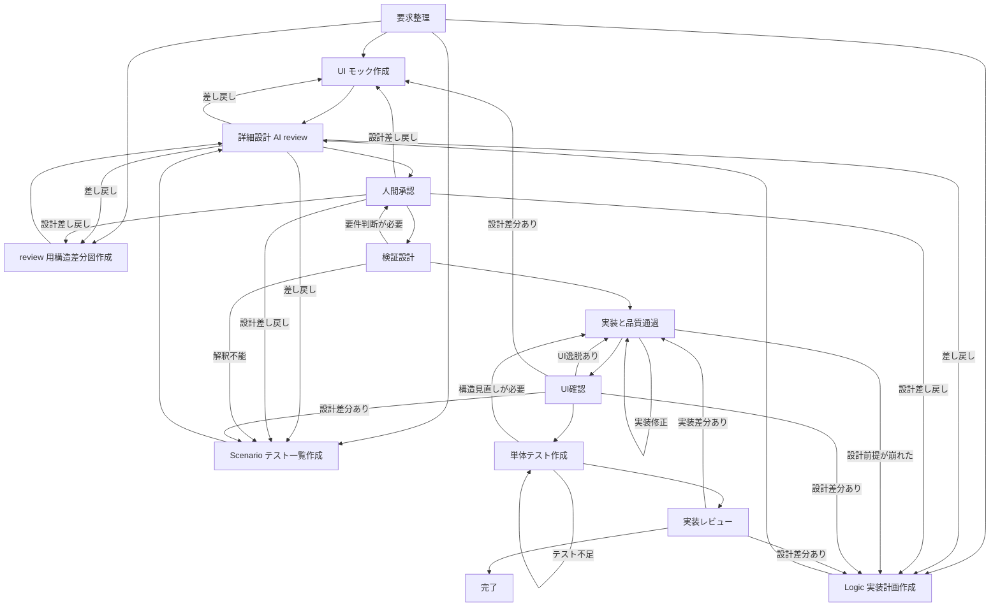

# Codex ワークフロー概要

この文書は `../workflow-docs/codex/` 配下の workflow 図を文章で補足する鳥瞰図です。
図は流れを示し、このページは lane ごとの目的、分岐条件、close 条件を短く固定します。

## 正本

- live workflow の正本は `.codex/README.md` と各 `SKILL.md`
- 鳥瞰図の図版正本は `../workflow-docs/codex/workflow_overview.d2`
- implementation detail の図版正本は `../workflow-docs/codex/implementation_skill_flow.d2`
- fix detail の図版正本は `../workflow-docs/codex/fix_skill_flow.d2`
- このページは diagram を読むための索引であり、diagram と矛盾する独自フローを追加しない

## 図版一覧

- 鳥瞰図: `../workflow-docs/codex/workflow_overview.d2`
- 実装詳細図: `../workflow-docs/codex/implementation_skill_flow.d2`
- 修正詳細図: `../workflow-docs/codex/fix_skill_flow.d2`

## 命名規則

- workflow 記述では、論理名と実名をできるだけ同じ行に置く
- 初出または重要な参照は `論理名 (`actual-name`)` を優先する
- 人間 review で意味が先に分かり、actual name でも検索できる記述を優先する

## 用語集

- この章では、本文で日本語化する用語と、対応する英語の呼び方を残します。

- 実装レーン: `implementation lane`
- 修正レーン: `fix lane`
- 要求整理: `requirements definition`
- 詳細設計: `detailed design`
- 詳細設計 AI review: `detailed design AI review`
- 人間承認: `human approval`
- 実装計画: `implementation planning`
- 検証設計: `verification design`
- 実装と品質通過: `implementation and gate`
- UI確認: `UI check`
- 完了: `close`
- 作業計画: `active plan`
- 参照必須資料: `required reading`
- 文脈要約: `context summary`
- 実装要約: `implementation brief`
- 受け入れ確認: `acceptance checks`
- 検証コマンド: `validation commands`
- 品質通過条件: `gate`
- 差し戻し: `reroute`
- 全体検証: `full harness`
- 人間 review: `human review`
- AI review: `AI review`

## 全体像

`User request` を起点に、workflow は `実装レーン` と `修正レーン` の 2 系統に分かれます。
feature / change は、要求整理から入り、詳細設計を固定し、人間 review を通した後に実装へ進みます。bug / regression は、事実整理、原因確認、回帰防止、修正、review の順で進みます。
どちらの lane も最後に review を 1 回だけ行い、`pass` なら close します。`reroute` なら直前の適切な工程へ戻します。

## 実装レーン

標準順序は `要求整理 -> UI モック作成 / Scenario テスト一覧作成 / Logic 実装計画作成 / review 用構造差分図作成 -> 詳細設計 AI review -> 人間承認 -> 検証設計 -> 実装と品質通過 -> UI確認 -> 単体テスト作成 -> 実装レビュー -> 完了` の段階で固定します。
implementation orchestrator (`orchestrating-implementation`) は自身で実装や詳細調査を抱え込まず、各 phase skill を `fork_context: false` のサブエージェントで呼び出す配線役として扱います。

ウォーターフォールとしての原則は次の 4 点です。

- 前工程の成果物を固定してから次工程へ進む。
- 実装工程は承認済み作業計画を実装へ落とす工程であり、詳細設計工程をやり直さない。
- 差し戻しは直前工程へ戻す。詳細設計のやり直しが必要な時だけ上流へ戻す。
- 完了条件は `成果物固定`、`品質通過条件の通過`、`記録更新` の 3 つを同時に満たすこととする。

### 第1段階 要求整理

- 実装要求の入口として、要求、制約、未確定事項、関連文書を整理する。
- この段階では、詳細設計に進むために必要な前提だけを固定する。
- この段階で固定する成果物は、日本語の作業計画、参照必須資料、文脈要約、詳細設計に必要な前提である。
- 要求が不足している時は、詳細設計へ進めずこの段階で止める。

### 第2段階 詳細設計

- 詳細設計として、`UI モック作成 (phase-2-ui)`、`Scenario テスト一覧作成 (phase-2-scenario)`、`Logic 実装計画作成 (phase-2-logic)`、`review 用構造差分図作成 (diagramming-structure-diff)` を固める。
- `phase-2-ui`、`phase-2-scenario`、`phase-2-logic`、`diagramming-structure-diff` は、オーケストレーターが並列で進める設計対象とする。
- オーケストレーターは、4 つの設計対象の依存関係を見ながら、必要な同期点だけを設けて詳細設計全体をまとめる。
- `UI モック作成 (phase-2-ui)` は、画面実装の正本ではなく、HTML / CSS / 必要最小限の素の JavaScript で主要導線と状態変化をある程度再現する page mock として扱う。画面構造、情報の優先順位、主要な操作の置き場所を固定し、実装都合の component 名や framework 記法は持ち込まない。
- 共通の画面設計と visual design の正本は `docs/screen-design/` に置き、task-local の UI モック working copy は `docs/exec-plans/active/<task-id>.ui.html` に置く。active exec-plan には path、最終正本 path、要点だけを残す。
- `Scenario テスト一覧作成 (phase-2-scenario)` は、説明文の列挙ではなく、要件から見出されるホワイトボックステストの一覧として扱う。正常系、主要な例外系、状態遷移、責務境界の確認点を test case 単位で固定し、後続工程はこの一覧を証明対象として引き継ぐ。
- task-local の Scenario テスト一覧 working copy は `docs/exec-plans/active/<task-id>.scenario.md` に置く。active exec-plan には path、最終正本 path、要点だけを残す。
- `Logic 実装計画作成 (phase-2-logic)` は、責務腐敗を避けながら implementation brief を先に固定する工程として扱う。どの task が何を担当し、どの依存解消後に実装へ進むかを `実装計画` として固める。
- `review 用構造差分図作成 (diagramming-structure-diff)` は、`structure_diagrammer` が `proposal_diff` mode で担当し、正本のコンポーネント図があるかどうかを判断する。正本がある時は更新対象図を、正本がない時は新規作成対象図を決めたうえで、review 用差分 `.d2` / `.svg` を active exec-plan 配下へ作る。
- この段階の出口成果物は、並列に固めた HTML モック artifact、Scenario テスト一覧 artifact、active exec-plan 内の `実装計画`、必要な時だけ作る review 用差分図、差分正本適用先である。
- 設計判断が揺れている間は次工程に渡さない。

### 第2.5段階 詳細設計 AI review

- 詳細設計が固まった後に、AI review を 1 回だけ行う。
- 実作業では detailed design AI review (`phase-2.5-design-review`) がこの段階を担当する。
- review の対象は、主要なページの動きまである程度再現した UI モック artifact、Scenario テスト一覧 artifact、active exec-plan の `実装計画`、必要なら review 用差分図を含む詳細設計全体とする。
- review では、要件取りこぼし、責務腐敗、検証不足、構造差分の不整合に加え、主要導線と状態変化の再現不足を確認する。
- review の時点で、要件が最後まで揺れている、要件が曖昧である、またはここを決めないと先へ進められない論点が残る場合は、人間確認が必要な論点として明示する。
- AI review で差し戻しが出た時は詳細設計へ戻し、修正後に再度この段階を通す。
- AI review が `pass` でも、人間確認が必要な論点が残る時は、その論点を第3段階へ持ち上げて固定する。
- AI review が `pass` で、人間確認が必要な論点も整理済みの時だけ人間承認に進む。

### 第3段階 人間承認

- human LGTM は作業計画の `承認記録` と `HITL 状態` に記録する。
- 詳細設計と要件の摩擦が残った場合は、人間確認が必要な論点をこの段階で明示し、承認または決定として固定する。
- 実装工程は承認前に起動しない。
- human review で設計差し戻しが出た時は、implementation orchestrator (`orchestrating-implementation`) が指摘を `UI モック作成 (phase-2-ui)`、`Scenario テスト一覧作成 (phase-2-scenario)`、`Logic 実装計画作成 (phase-2-logic)`、`review 用構造差分図作成 (diagramming-structure-diff)` の修正単位へ切り分け、対応するサブエージェントを起動して artifact と active exec-plan の参照情報を更新させる。
- human review の review-back を反映した後は、第2.5段階の detailed design AI review (`phase-2.5-design-review`) を再実行し、`pass` を確認してから第3段階へ戻す。
- 人間確認が必要な論点が未決のままなら、この段階を通過したとみなさない。
- この段階の品質通過条件は `承認済み作業計画` の 1 点である。

### 第4段階 実装計画

- `phase-4-plan` は live workflow から外し、`Logic 実装計画作成 (phase-2-logic)` へ吸収した。
- したがって新しい handoff は行わず、第3段階の承認は第2段階で固定済みの `実装計画` をそのまま承認対象とする。
- 第4段階は欠番として残し、過去の記録以外では使わない。

### 第5段階 検証設計

- この段階は、第2段階で固定した Scenario テスト一覧 artifact を、そのまま tests、fixtures、受け入れ確認、検証コマンドへ適用する工程とする。
- 実作業では test implementation phase (`phase-5-test-implementation`) がこの段階を担当する。
- この段階では、新しい検証観点や新しい要件解釈を増やさない。
- 必要な test / fixture は最小範囲で用意し、第2段階で決めた証明対象を機械的に実行できる状態にする。
- Scenario テスト一覧 artifact をそのまま適用できない時は、第5段階で解釈を足さず、第2段階または第3段階へ戻す。

### 第6段階 実装と品質通過

- 担当範囲に従って実装する。
- 実作業では implementation phase (`phase-6-implement-frontend` / `phase-6-implement-backend`) がこの段階を担当する。
- この段階の各タスクは、ワーカーごとに独立したコンテキストで実装可能であることを前提にする。
- implementation orchestrator (`orchestrating-implementation`) は第2段階の `phase-2-logic` で固定した並列 task group と依存関係に従って、独立した task を並列に handoff する。
- ただし、第7段階以降と同時に進める必要はなく、段階としては第6段階を先に完了させる。
- ローカル検証を通した後に、品質通過条件、静的検査、単発 review、全体検証を順に通す。
- 品質通過条件、review、全体検証のいずれかで失敗した時は実装工程へ戻り、必要最小限の修正後に品質通過条件へ復帰する。設計前提が崩れた時だけ詳細設計工程へ戻す。

### 第7段階 UI確認

- 第6段階を通過した後に、主要導線と画面状態を UI から確認する。
- 実作業では UI check phase (`phase-6.5-ui-check`) がこの段階を担当する。
- `chrome-devtools` を使い、HTML モック artifact、Scenario テスト一覧 artifact、受け入れ確認に沿って最小限の操作確認を行う。
- この段階では、新しい仕様解釈や見た目の好みを追加しない。
- UI 逸脱や導線不整合が見つかった時は第6段階へ戻す。設計差分が見つかった時だけ第2段階または第3段階へ戻す。
- 証跡は、必要な console、network、screen capture、DOM 状態の要約として残す。

### 第8段階 単体テスト作成

- 第7段階を通過した後に、単体テストを追加または拡張する。
- 実作業では unit test phase (`phase-7-unit-test`) がこの段階を担当する。
- この段階の各タスクも、ワーカーごとに独立したコンテキストで実装可能であることを前提にする。
- ただし、第6段階と並列に進める必要はなく、実装完了後に順番に進める。
- 単体テストは、実装した責務と主要な分岐を対象にして、第2段階で固定した `実装計画` と矛盾しない範囲で作成する。
- カバレッジは 70% を目標ではなく通過基準として扱い、70% 未満はハーネスで失敗とする。
- カバレッジ不足が見つかった時は、この段階で単体テストを補い、必要なら実装工程へ戻って観測しやすい構造へ整える。

### 第9段階 実装レビュー

- 第8段階を通過した後に、実装レビューを 1 回だけ行う。
- 実作業では implementation review phase (`phase-8-review`) がこの段階を担当する。
- この review は、実装が詳細設計と違うことをしていないか、だけを確認するゲートとする。
- review では、新しい改善提案や新しい要件解釈は追加しない。
- 詳細設計との差分が見つかった時は、実装工程へ戻すか、必要なら第2段階または第3段階へ戻して設計を固定し直す。
- 詳細設計との整合が確認できた時だけ最終段階へ進む。

### 最終段階 完了

- 品質通過条件が解消し、review が `pass` で、さらに全体検証が通った時だけ承認済み差分の正本適用、review 用差分図削除、commit、完了に進む。
- implementation orchestrator (`orchestrating-implementation`) は完了前に、task-local の UI モック working copy を `docs/mocks/<page-id>/index.html` へ、task-local の Scenario テスト一覧 working copy を `docs/scenario-tests/<topic-id>.md` へ移す。
- UI確認で主要導線と画面状態の不整合がないことを完了条件に含める。
- 単体テスト作成の結果として、カバレッジ 70% 以上を満たしていることを完了条件に含める。
- 実装レビューで、詳細設計との差分がないことを確認していることを完了条件に含める。
- review 用差分図を使った時は、完了で承認済み差分を正本図へ適用する。
- コンポーネント図を製本した後は、AST ベースの構造解析にかけ、実際のコード構造とコンポーネント図に乖離があれば失敗として落とす。
- AST ベースの構造解析で乖離が見つかった時は、図の修正だけでなく、詳細設計、実装、または図の正本化手順のどこに差分原因があるかを戻り先として確定してからやり直す。
- `reroute` は実装工程で受け、詳細設計のやり直しが必要な時だけ上流へ戻す。

## 修正レーン

標準順序は `事実整理 -> 原因分析 -> 再現と回帰防止の検証設計 -> 修正実装 -> review -> 完了` です。
fix orchestrator (`orchestrating-fixes`) は自身で恒久修正や詳細調査を抱え込まず、各 skill を `fork_context: false` のサブエージェントで呼び出す配線役として扱います。

- bugfix 要求の入口では、既知事実、再現条件、関連仕様、関連コードを整理する。
- 画面起点で確認できる bug は、事実整理の中で `chrome-devtools` により先に再現確認し、結果を `Known Facts` と `Required Evidence` に残す。
- 原因分析では、原因仮説を順位付けし、必要な観測だけを最小限で行う。一時観測は恒久修正と混ぜない。
- 修正前に、再現条件を tests / 受け入れ確認 / 検証コマンド に落とし、必要な回帰 test / fixture を先に実装する。
- 実装では、承認済み範囲の恒久修正を行う。
- review は impl lane と同じ正式観点で単発 review する。
- 必要な時だけ残留リスクを短くまとめる。

diagram 上では、原因分析は常に通ります。
一時観測は temporary logging が必要な時だけ挿入され、不要なら直接分析に進みます。

## 差し戻しと完了

- `pass` なら commit して完了する
- `reroute` なら方向づけ工程に戻し、作業計画、tests、実装を必要最小限で更新する
- `docs/` 正本更新は通常 lane の close 条件に含めず、human が `updating-docs` を直接起動した時だけ扱う

## 記録と証跡

- 非自明な変更は `docs/exec-plans/active/` に plan を置く
- 完了後は `docs/exec-plans/completed/` へ移す
- `UI モック` の working copy は `docs/exec-plans/active/<task-id>.ui.html` に置き、完了前に `docs/mocks/<page-id>/index.html` へ移す
- `Scenario テスト一覧` の working copy は `docs/exec-plans/active/<task-id>.scenario.md` に置き、完了前に `docs/scenario-tests/<topic-id>.md` へ移す
- 共通の画面設計と visual design の正本は `docs/screen-design/` に残し、page mock と Scenario テストの正本置き場と混同しない
- `実装計画` は active exec-plan の `実装計画` section に残し、後続 skill はこの section を implementation brief として使う
- `orchestrating-* -> downstream skill` の handoff contract 例は、各 orchestrating skill 配下の `references/*.json` を見る
- `downstream skill -> orchestrating-*` の返却 contract 例は、各 downstream skill 配下の `references/*.json` を見る
- harness は `python3 scripts/harness/run.py --suite structure|design|execution|all` を入口にする
