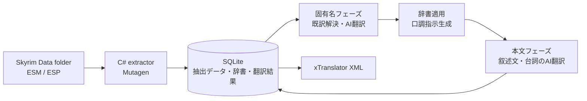

# AITranslationEngineJP

Skyrim Special Edition のプラグイン構造と会話メタデータに特化した、英日 AI 翻訳デスクトップアプリケーションです。

汎用翻訳器ではありません。

Skyrim のレコード種別、話者、声型、感情、固有名、実行時タグを翻訳判断へ使い、人手では全件へ維持しにくい口調、文体、訳語の一貫性を適用します。

> [!IMPORTANT]
> 個人利用を目的として開発中のプロジェクトです。
> 一般利用者向けの配布物、インストーラー、サポート体制は整備していません。
> 現在の実行方法は開発環境を前提とします。

## 目的

AITranslationEngineJP は、単文として流暢なだけではなく、Skyrim のゲーム内文脈に適合した日本語を作るために開発しています。

翻訳品質を次の要素の組み合わせとして扱います。

- 話者ごとの一貫した口調と、台詞内の感情に合う表現
- 人物名、地名、装備名などの固有名詞の一貫性
- レコードとフィールドの用途に合う翻訳スタイル
- Skyrim の実行時記法を壊さない正確性
- 大量の文字列へ同じ判断基準を適用する再現性

設計目標は、Skyrim を理解した人間が行う判断を翻訳パイプラインへ組み込み、Mod 全体で一貫して適用することです。

## 主な特徴

### レコード別の翻訳スタイル

Skyrim の `REC:FIELD` は、レコード種別とフィールドを表す識別子です。

抽出した文字列を `REC:FIELD` で分類し、用途に対応した翻訳指示を適用します。

- 武器、防具、薬などの物品説明
- 呪文、付呪、特典などの効果説明
- ロード画面や種族解説などの世界観断片
- 書物本文
- クエストログや目標などの日記体
- 操作名、龍語の語義、固有名、台詞

同じ英語でも、ゲーム内で果たす役割に応じて文体、文末、長さ、品詞を変えます。

### NPC ごとの口調を生成

話者の声型、性別、年齢区分、種族、対人姿勢、台詞の感情を組み合わせて翻訳用の口調指示を生成します。

声型から横柄、高慢、粗暴、皮肉、温厚などの傾向を引き、台詞の感情強度と組み合わせて基底口調を決めます。

性別、年齢区分、種族、基底口調に対応する日本語例文を Few-shot 例として与えます。

カジートとアルゴニアンには種族固有の話し方を追加します。

名指し話者、複数話者で共有される汎用台詞、プレイヤーの選択肢は異なる経路で扱います。

### 固有名詞を先に確定

武器、防具、人物、地名、勢力などの名前を本文より先に翻訳します。

公式日本語版などの既訳、事前作成辞書、対象 Mod 内で確定した AI 訳を使い分けます。

同じ固有名は種別ごとに一つの翻訳単位へまとめます。

本文と台詞に現れる既知の固有名を最長一致で検出し、確定した訳語を翻訳前に適用します。

NPC の氏名から安全に取り出せる短縮名も、本文内の人名解決へ利用します。

### Skyrim の実行時記法を保護

`<Alias=...>`、`<Global=...>`、`<BribeCost>` などの実行時タグを翻訳中の書き換えから保護します。

AI の出力後に元のタグが残っているかを検証し、欠落または改変された訳文を確定しません。

### 大量翻訳を継続可能にする

抽出結果、マスター辞書、口調ルール、翻訳ジョブ、翻訳結果を SQLite で管理します。

アプリケーションを再起動しても翻訳結果を保持し、対象プラグイン単位で作業を継続できます。

同期翻訳に加え、OpenAI と xAI の非同期バッチ翻訳を扱います。

バッチは一定件数で分割し、未訳だけの再送信、状態確認、結果の取込を行います。

### xTranslator XML を出力

翻訳結果は xTranslator 互換 XML として出力します。

xTranslator 上で結果を確認し、既存の Skyrim Mod 翻訳作業へ接続できます。

## 翻訳の流れ



## アーキテクチャ

翻訳対象の抽出と翻訳処理を別の実行環境へ分離しています。

| 領域 | 技術 | 責務 |
| --- | --- | --- |
| デスクトップアプリケーション | Wails v2 | 画面と Go バックエンドの接続 |
| フロントエンド | Svelte 5 / TypeScript / Tailwind CSS / daisyUI | 対象選択、設定、実行監視、結果表示 |
| 翻訳エンジン | Go | 分類、辞書適用、口調生成、AI翻訳、XML出力 |
| 翻訳対象抽出 | C# / .NET / Mutagen | Skyrim プラグインの読込と SQLite への書込 |
| 永続化 | SQLite / sqlx | 抽出データ、辞書、ルール、ジョブ、結果の管理 |
| AI 接続 | OpenAI 互換 API | OpenAI、LM Studioなどへの翻訳要求 |

内部境界と依存方向は [`docs/architecture.md`](docs/architecture.md) に記載しています。

翻訳対象の概念モデルは [`docs/concept-model.md`](docs/concept-model.md) に記載しています。

## 現在の状態

開発環境では、Skyrim プラグインの抽出、固有名と本文の翻訳、翻訳結果の永続化、xTranslator XML の出力まで実行できます。

主な未整備項目は次のとおりです。

- 一般利用者向けの配布ビルドとインストーラー
- 配布物への C# 抽出プロセスの同梱
- 翻訳結果の編集、検索、詳細な絞り込み
- 会話ツリー全体を利用した長い文脈の翻訳
- 一部のクラウド AI プロバイダ

最新の課題は [`docs/known-issues.md`](docs/known-issues.md) を参照してください。

## 開発環境

現在の開発経路では次のツールを使用します。

- Go 1.25
- Node.js と npm
- .NET SDK 10
- Wails CLI v2
- `sh` を実行できる環境

依存関係を準備します。

```sh
npm install
npm --prefix frontend install
go mod download
dotnet restore tools/extractor
```

開発サーバーを起動します。

```sh
npm run dev:wails:run
```

起動後のブラウザー接続先は `http://localhost:34115` です。

## 検証

バックエンドのテストを実行します。

```sh
npm run test:backend
```

フロントエンドのテストを実行します。

```sh
npm run test:frontend
```

バックエンドのテストと境界検査を実行します。

```sh
npm run verify:backend
```

フロントエンドの静的検査を実行します。

```sh
npm run lint:frontend
```

## 設計資料

- [`docs/requirements.md`](docs/requirements.md): 業務要件
- [`docs/system_requirements.md`](docs/system_requirements.md): システム要件
- [`docs/concept-model.md`](docs/concept-model.md): 翻訳の概念モデル
- [`docs/architecture.md`](docs/architecture.md): 内部境界と依存方向
- [`docs/er.md`](docs/er.md): SQLite のデータモデル
- [`docs/tech-selection.md`](docs/tech-selection.md): 技術選定
- [`docs/changelog.md`](docs/changelog.md): 設計判断と変更履歴

## 公開方針

リポジトリは実装例と設計資料の参照を目的として公開しています。

一般利用者向けの動作保証と個別サポートは行っていません。

ライセンスは未整備のため、コードの利用条件と再配布条件は現時点で定めていません。
