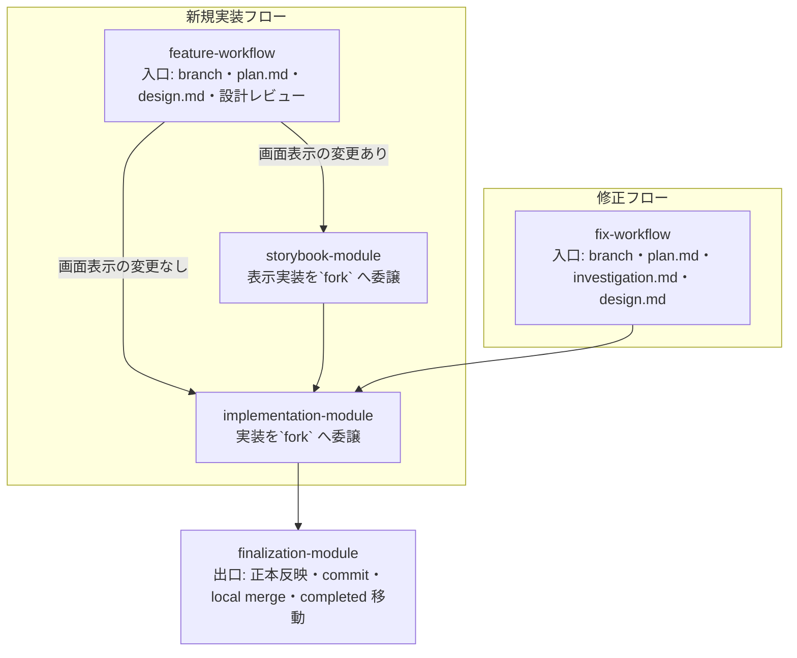

# AI 運用ワークフロー（ai-operations-workflow）

## 目的

このドキュメントは、`.claude/skills/` に置かれた skill 群が、プロダクト変更 task をどの順で通し、どこで人間が入るかを 1 枚に整理する。
skill の中身（各 SKILL.md の手順）はここに写さない。ここが固定するのは、skill の役割区分と、task 種別ごとの通過経路である。

skill は 3 層に分かれる。

- 入口オーケストレーター: task の入口で branch と `plan.md`、設計を固定し、下流の段へ渡す。新規実装は `feature-workflow`、修正は `fix-workflow`。
- 実行モジュール: 入口の後で表示実装・実装を進める段。`storybook-module`、`implementation-module`、`finalization-module`。
- 作業プロトコル: モジュール内で読む判断基準。単独では task を進めない。

## 全体像

プロダクト変更 task は、入口オーケストレーターで branch と設計を固定し、下流の段を通り、出口で統合先 branch へ取り込む。

新規実装 task は `feature-workflow` を通す。task の軽重で入口を bypass しない。
修正 task（バグ修正、refactor）は `fix-workflow` を通す。仕様変更や機能追加が要ると分かった場合は `fix-workflow` を止め、`feature-workflow` へ迂回する。

## 入口オーケストレーター

2 つの入口が、それぞれのフローの branch と `plan.md`、設計（`design.md`）を固定する。

| オーケストレーター | 入る条件（TRIGGER） | 固定する成果 | 次 |
| --- | --- | --- | --- |
| feature-workflow | プロダクト変更を伴う実装系 task の入口 | branch、`plan.md`、`design.md`（実装方針・検討事項）、人間設計レビュー通過 | 画面表示の変更あり→storybook / なし→implementation |
| fix-workflow | 修正系 task（バグ修正・refactor）の入口 | branch、`plan.md`、`investigation.md`（再現確認・原因究明）、`design.md`（どう直すか）、人間修正レビュー通過 | implementation |

入口が固定するアーティファクトは役割を分ける。

- `plan.md`: branch 情報とこの task でやること・やらないことの要点。設計判断・判断履歴・検証結果は持たない。
- `investigation.md`: 修正フローだけが作る。再現確認と原因究明（観測済み問題・画面再現確認・原因仮説・観測ログ検証・確定原因）。どう直すかは持たない。
- `design.md`: どう実装し、どう直すかだけを持つ。実装方針＝現状 AS-IS と変更後 TO-BE を対にし、流れ・関係・責務が変わる箇所は図を添える。再現確認・原因究明は持たない。検討が必要なことを持ち、未解決の論点が残る間は下流へ進まない。両フロー共通の 1 テンプレート。

## 実行モジュール

入口の後で実装を進める 3 段。表示とロジックの分離、出口の正本反映を固定する。

| モジュール | 入る条件 | 固定する成果 | `fork` 委譲 |
| --- | --- | --- | --- |
| storybook-module | 画面表示の変更がある | story と svelte 表示コンポーネント（画面の正本）、人間レビュー通過 | 表示実装・表示修正の作業本体 |
| implementation-module | design.md の実装方針、または fix-workflow の実装への引き継ぎから実装へ入る | backend、frontend ロジック、統合境界、テスト、観測ログ、最終検証通過 | 実装・テスト・観測・最終検証の作業本体 |
| finalization-module | 最終検証通過後 | 正本反映（`docs/architecture.md` に限定）、commit、local merge、completed 移動 | しない（本体が実行） |

分担の境界は 3 点で固定する。

- **画面表示とロジックの分離**: 表示（layout、文言、style、story、fixture）は `storybook-module`。state / API / Wails bridge / ルーティング / 副作用 / validation ロジックは `implementation-module`。
- **`fork` 委譲**: `storybook-module` と `implementation-module` の作業本体は、親の文脈とモデルを継承する`fork`へ委譲する。目的は本体セッションの文脈を実装詳細で汚さないこと。`fresh` への分割はしない。
- **正本反映の限定**: `finalization-module` が docs へ反映する正本は `docs/architecture.md` だけ。判断・変更履歴は `docs/changelog.md`、画面の正本は Storybook。

## 作業プロトコル skill

モジュール内で読む判断基準。単独では task を進めず、必ず呼び出し元モジュールがある。

| プロトコル | 呼び出し元 | 使う主体 | 役割 |
| --- | --- | --- | --- |
| coding-protocol | implementation-module | `fork` | backend / frontend ロジック / 境界 / テスト / 観測を 1 文脈で縦通しする判断基準 |
| fix-decision | fix-workflow | 本体 | 観測記録から仮説・確定原因・修正方針・禁止修正を固定する判断基準 |
| presentation | 任意（feature-workflow ほか、人間や module） | 本体 | 人間が読む説明 md と図（AS-IS→TO-BE の 2 図）を作る作法 |
| conflict-resolver | finalization-module | conflict_resolver agent | local merge で発生した conflict だけを解消する手順 |

## 保守系 skill

task の段には入らず、ワークフロー契約そのものを点検・変更する。

| skill | 対象 | 役割 |
| --- | --- | --- |
| workflow-contract-maintenance | `.claude` 配下の skill・agent 定義・許可済みコマンド・CLAUDE.md の作業流れ記述 | 別セッションでも同じ境界で読める契約に保つ監査・変更手順 |
| skill-cleanup | 単一 SKILL.md | 規約節の漏れ・依存漏れ出し・要約余地を点検し、人間承認後にだけ反映する手順 |

## task 種別ごとの経路

入口のフローで通る段が決まる。

- **新規実装・画面表示の変更なし**: feature-workflow → implementation-module → finalization-module。
- **新規実装・画面表示の変更あり**: feature-workflow → storybook-module → implementation-module → finalization-module。
- **修正系 task**: fix-workflow → implementation-module → finalization-module。仕様変更が要れば feature-workflow へ迂回する。
