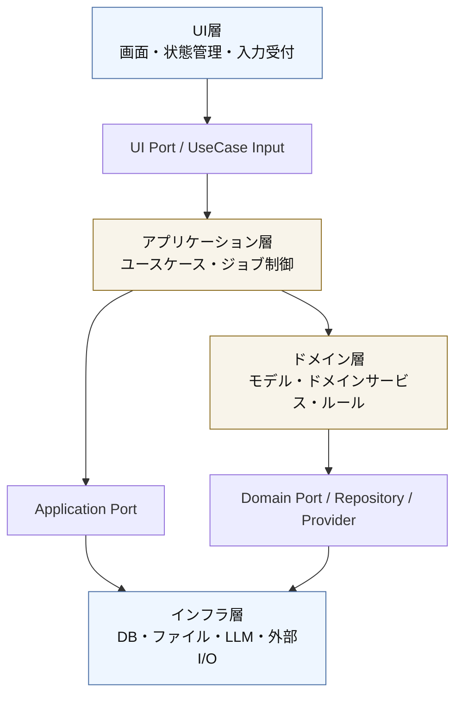
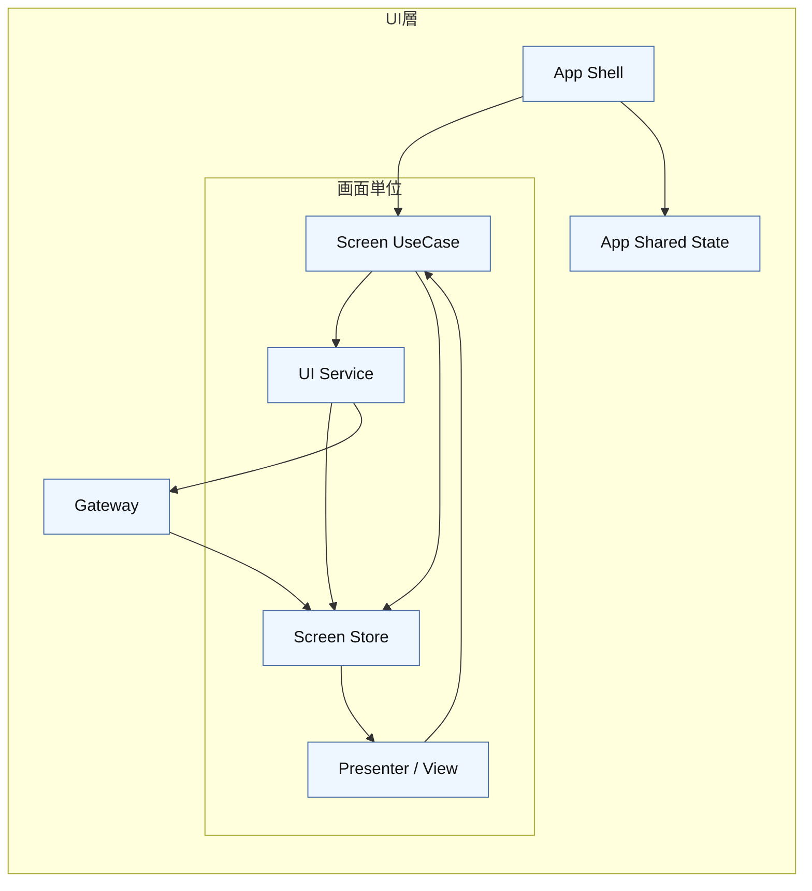

# アーキテクチャ仕様

関連文書: [`index.md`](./index.md), [`spec.md`](./spec.md), [`core-beliefs.md`](./core-beliefs.md), [`tech-selection.md`](./tech-selection.md), [`executable-specs.md`](./executable-specs.md)

本書は、システムの内部構成と責務分割を定義する。

## 1. 層構成

システムは以下の 4 層で構成する。

- `UI層`
- `アプリケーション層`
- `ドメイン層`
- `インフラ層`

4 層すべてで Dependency Inversion Principle (DIP) を適用する。
依存方向は常に内側の方針へ向け、具体実装は外側に配置する。

依存の原則は以下の通りとする。

- `UI層` はアプリケーション層の入力ポートに依存し、具体ユースケース実装に直接依存しない
- `アプリケーション層` はドメインモデルと出力ポートの抽象に依存し、永続化や外部 API の実装詳細に依存しない
- `ドメイン層` はドメインルールを保持し、リポジトリや AI プロバイダは抽象としてのみ参照する
- `インフラ層` は各ポートや trait を実装するが、上位層の方針を変更しない

## 2. 各層の境界方針

### 2.1 UI層

UI層はユースケースの interface に依存する。
具体的なジョブ実行器、Repository、AI プロバイダ実装を直接参照しない。

UI層の内部構成は以下を基本とする。

- `App Shell`: デスクトップアプリ全体のレイアウト、主要画面の切替、共有 UI 状態の保持を担う
- `Screen UseCase`: UI イベントを受け取り、画面操作単位の処理フロー、状態更新、画面遷移を制御する
- `UI Service`: 画面入力の解釈、表示用データ整形、画面内ルールなどの UI 向けロジックを担う
- `Presenter / View`: 表示専用とし、受け取った表示データとイベント通知のみを扱う
- `Screen Store`: 画面単位の表示状態、選択状態、入力状態、ロード状態を保持する
- `Gateway`: Tauri の `invoke` / event を閉じ込め、DTO の送受信を担う

デスクトップ UI はブラウザ的な URL ルーティングを主軸にせず、単一ウィンドウの `App Shell` 配下で画面を切り替える。
画面ごとに `Screen UseCase` と `Screen Store` を持ち、共有が必要な状態のみを `App Shell` 配下へ引き上げる。

UI層の依存ルールは以下の通りとする。

- `Presenter / View` は入力ポート、`Gateway`、Tauri API に依存しない
- `Screen UseCase` は `UI Service` と `Screen Store` に依存できる
- `UI Service` は入力ポート、`Gateway`、`Screen Store` に依存できる
- `Screen Store` は UI 表示状態の保持に専念し、Tauri API や具体ユースケース呼び出しを直接持たない
- `Gateway` は UI からバックエンドへの接続境界としてのみ機能し、画面表示ロジックを持たない

UI が扱う状態は以下の 3 種に分ける。

- `画面ローカル状態`: 入力値、フィルタ、開閉状態、選択中タブなどの一時的状態
- `画面単位状態`: 一覧、詳細、ロード中、エラー表示など、画面として保持すべき状態
- `アプリ共有状態`: 実行中ジョブの要約、通知、現在の対象選択など、複数画面で共有する最小限の状態

### 2.2 アプリケーション層

アプリケーション層は入力ポートと出力ポートを定義し、具体実装はインフラ層へ委譲する。
ドメイン層のルールを利用するが、SQLite やファイル I/O には直接依存しない。

### 2.3 ドメイン層

ドメイン層は最も内側の方針として安定させる。
永続化、UI、LLM SDK への依存は禁止し、必要な外部機能は trait や interface で抽象化する。

### 2.4 インフラ層

インフラ層は Repository、Provider、Writer などの具体実装を持つ。
依存は上位層が定義した抽象へ向け、インフラ都合の型を上位層へ漏らさない。

## 3. 層間ポート方針

4 層すべての接続点はポートで定義する。

- `UI -> アプリケーション層`: UseCase Input Port
- `アプリケーション層 -> UI`: Query Model / DTO
- `アプリケーション層 -> ドメイン層`: Domain Service, Factory, Specification
- `アプリケーション層 -> インフラ層`: Repository, Unit of Work, Event Store, Output Writer
- `ドメイン層 -> インフラ層`: TranslationProvider, DictionarySource, PersonaSource などの抽象

各ポートの interface / trait は内側の層で定義し、外側の層で実装する。

## 4. DTO 境界

フロントエンドとバックエンド間のデータ受け渡しは DTO を明示的に定義して行う。

## 5. 型安全方針

- バックエンドの中核ロジックは Rust の型で定義する
- UI は TypeScript の型で定義する
- xEdit JSON はロード時に型検証する
- xTranslator XML は内部ドメインモデルから生成する
- ジョブフェーズ種別は DB テーブルではなくアプリケーション定数として定義する
- DB の内部主キーはシーケンシャル整数を採用し、外部 FormID は別列で保持する

## 6. 永続化方針

- `PLUGIN_EXPORT` 配下の入力データは SQLite 上の実行キャッシュとして保持する
- 実行キャッシュは `TRANSLATION_JOB` が参照する
- `TRANSLATION_JOB` が `Completed`, `Canceled`, `Failed` のいずれかになり、同一 `PLUGIN_EXPORT` に未完了ジョブが残っていない場合は入力キャッシュを削除する
- JSON 原本は削除せず、必要時に再取り込み可能とする
- `MASTER_PERSONA`, `MASTER_PERSONA_ENTRY`, `MASTER_DICTIONARY`, `MASTER_DICTIONARY_ENTRY` はジョブ完了後も保持する
