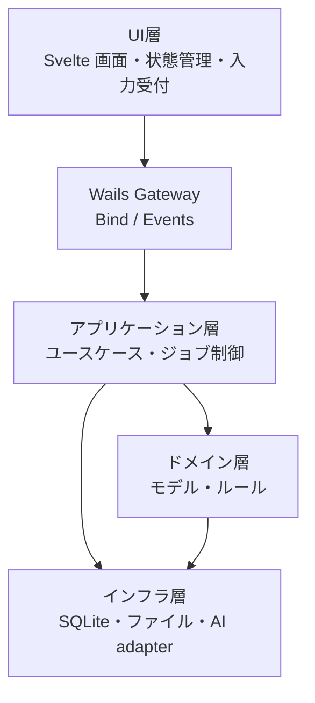

# アーキテクチャ仕様

関連文書: [`index.md`](./index.md), [`spec.md`](./spec.md), [`core-beliefs.md`](./core-beliefs.md), [`tech-selection.md`](./tech-selection.md)

本書は、システムの内部構成と責務分割を定義する。
詳細設計や細かな振る舞いは、対応する tests / acceptance checks / validation commands で実行可能な形にする。
要件レベルではない細かな仕様は、テストで担保し、その成立を主張する。

## 1. 層構成

システムは以下の 4 層で構成する。

- `UI層`
- `アプリケーション層`
- `ドメイン層`
- `インフラ層`

4 層すべてで Dependency Inversion Principle (DIP) を適用する。
依存方向は常に内側の方針へ向け、具体実装は外側に配置する。

依存の原則は以下の通りとする。

- `UI層` はアプリケーション層の input boundary に依存し、Go の具体実装へ直接依存しない
- `アプリケーション層` はドメインモデルと出力 port の抽象に依存し、永続化や外部 API の実装詳細に依存しない
- `ドメイン層` はドメインルールを保持し、repository や AI provider は抽象としてのみ参照する
- `インフラ層` は各 port を実装するが、上位層の方針を変更しない
- `Wails Gateway` は transport boundary であり、業務判断の置き場にしない

## 2. Wails transport boundary

Wails の `Bind` は frontend から backend への primary request / response boundary とする。
frontend は generated `wailsjs` を直接 app 全体へ広げず、`gateway/wails` に閉じ込める。

- request / response: `frontend/src/gateway/wails/` から generated `wailsjs` を呼ぶ
- backend bind: `internal/gateway/wails/` が public method を公開する
- push 通知: backend は `runtime.EventsEmit` で frontend へ進捗や通知を送る
- runtime API や generated wrapper は transport として扱い、domain rule を持ち込まない

Wails event は progress、notification、background completion のような push 用に限定し、通常の query / command の主経路には使わない。

## 3. 各層の境界方針

### 3.1 UI層

UI層はユースケースの interface に依存する。
具体的な repository、AI provider、SQLite 実装を直接参照しない。

UI層の内部構成は以下を基本とする。

- `App Shell`: デスクトップアプリ全体のレイアウト、主要画面の切替、共有 UI 状態の保持
- `Screen UseCase`: 画面操作単位の処理フロー、状態更新、画面遷移の制御
- `Presenter / View`: 表示専用。受け取った表示データとイベント通知のみを扱う
- `Screen Store`: 画面単位の表示状態、選択状態、入力状態、ロード状態を保持
- `Gateway`: Wails bindings と runtime events を閉じ込める adapter

UI層の依存ルールは以下の通りとする。

- `Presenter / View` は `wailsjs`、runtime API、永続化、外部通信へ直接依存しない
- `Screen UseCase` は `Gateway` と `Screen Store` に依存できる
- `Screen Store` は UI 表示状態の保持に専念し、副作用の起点にならない
- `Gateway` は UI から backend への接続境界としてのみ機能し、画面表示ロジックを持たない

### 3.2 アプリケーション層

アプリケーション層は input / output port を定義し、具体実装はインフラ層へ委譲する。
translation flow では phase orchestration と runtime selection を分けて扱う。

- import、dictionary rebuild、persona generation、body translation は use case 単位で分離する
- AI provider selection は application layer が受けるが、接続実装は infra に置く
- job-local persona と master persona は同じ runtime を共有してよいが、保存先の境界は分ける

### 3.3 ドメイン層

ドメイン層は最も内側の方針として安定させる。
Wails、SQLite driver、filesystem、LLM SDK への依存は禁止し、必要な外部機能は interface で抽象化する。

### 3.4 インフラ層

インフラ層は Repository、Provider、Writer などの具体実装を持つ。
依存は上位層が定義した抽象へ向け、インフラ都合の型を上位層へ漏らさない。

## 4. 初期レイアウト

`Wails + Go + Svelte` の初期レイアウトは以下を正本とする。

- repo root
  - `main.go`: Wails bootstrap と app 起動
  - `wails.json`: Wails project config
  - `frontend/`: frontend package root
  - `internal/`: Go の application / domain / infra / gateway
- `frontend/`
  - `src/ui/`: App Shell、screen、view、store
  - `src/application/`: screen usecase、frontend 側 boundary
  - `src/gateway/wails/`: generated binding wrapper と runtime event adapter
  - `src/shared/contracts/`: UI が依存する DTO / query model
  - `wailsjs/`: generated bindings。hand-edit しない
- `internal/`
  - `application/`: usecase、DTO、input / output port
  - `domain/`: model、service、rule
  - `infra/`: SQLite、file、HTTP、provider adapter
  - `gateway/wails/`: bound struct と transport mapping

## 5. DTO 境界

frontend と backend のデータ受け渡しは DTO を明示して行う。

- Go 側の public bind method は request / response struct を明示する
- DTO は `json` tag を付け、field 名を暗黙変換に任せない
- frontend は generated `wailsjs` の型を `gateway/wails` の中で `src/shared/contracts/` へ写像する
- UI は shared contract だけを前提にし、generated type や Go 内部構造を直接前提にしない

## 6. 型安全方針

- バックエンドの中核ロジックは `Go` の型で定義する
- UI は `TypeScript` の型で定義する
- xEdit JSON はロード時に型検証する
- xTranslator 互換出力は domain の canonical translation unit から再構成する
- ジョブフェーズ種別は DB テーブルではなく application constant として保持してよい
- DB の内部主キーはシーケンシャル整数を採用し、外部 FormID は別列で保持する

## 7. 永続化方針

- 入力データの raw JSON はファイルシステム上の正本とする
- `SQLite` は入力キャッシュ、基盤マスター、翻訳ジョブの実行状態を保持する
- schema 変更は repo-owned SQL migration で管理し、起動時 bootstrap で一度だけ適用する
- repository は DML と transaction に専念し、DDL 実行や schema 準備を通常 use case へ混ぜない
- `MASTER_PERSONA` と `MASTER_DICTIONARY` はジョブ完了後も保持する
- job-local persona と job output artifact はジョブ単位で保持する
