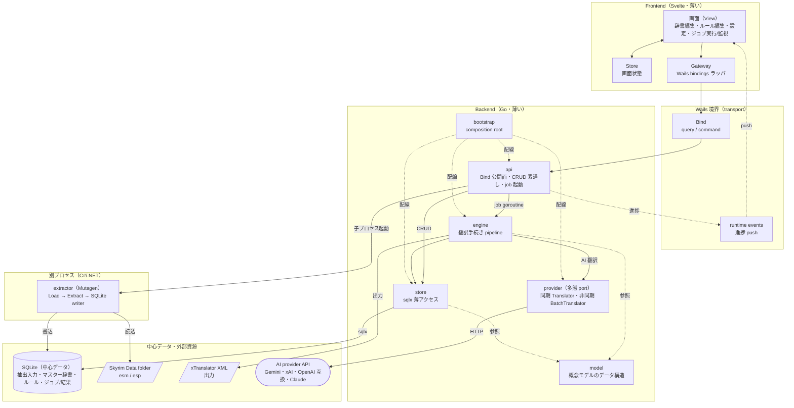

# アーキテクチャ仕様

関連文書: [`index.md`](./index.md), [`requirements.md`](./requirements.md), [`system_requirements.md`](./system_requirements.md), [`concept-model.md`](./concept-model.md), [`tech-selection.md`](./tech-selection.md), [`core-beliefs.md`](./core-beliefs.md)

本書は、システムの内部境界、依存方向、コンポーネント構成を定義する。
画面表示の設計は Storybook（story と svelte コンポーネント）が正本で、本書は扱わない。
データモデルの概念は [`concept-model.md`](./concept-model.md) が正本で、本書は実装上の境界だけを扱う。

## 1. 全体方針

- 中心は Skyrim のデータであり、翻訳は中心データに対する一本の手続きである。
- データ中心かつ手続き中心の処理に合わせ、層を薄くする。旧構成の `UseCase` / `Service` / per-entity `Repository` / `Presenter` 層は持たない。
- 抽象（interface ＝ port）は、実装が複数に分かれる AI provider の境界 1 つだけに置く。
- 手動 DI は composition root（`bootstrap`）1 箇所に集約し、それ以外の層で concrete 実装を new しない。
- 抽出（C#/Mutagen）と翻訳（Go）は別 runtime で、受け渡しの境界は SQLite とする。境界専用の中間形式（JSON 等）は持たない。
- Wails は transport boundary であり、domain rule や画面状態の正本ではない。

## 2. コンポーネント図

```mermaid
flowchart TB
    subgraph FE["Frontend（Svelte・薄い）"]
        View["画面（View）<br/>辞書編集・ルール編集・設定・ジョブ実行/監視"]
        Store["Store<br/>画面状態"]
        Gateway["Gateway<br/>Wails bindings ラッパ"]
    end

    subgraph WAILS["Wails 境界（transport）"]
        Bind["Bind<br/>query / command"]
        Events["runtime events<br/>進捗 push"]
    end

    subgraph BE["Backend（Go・薄い）"]
        API["api<br/>Bind 公開面・CRUD 素通し・job 起動"]
        Engine["engine<br/>翻訳手続き pipeline"]
        StoreGo["store<br/>sqlx 薄アクセス"]
        Provider["provider（多態 port）<br/>同期 Translator・非同期 BatchTranslator"]
        Model["model<br/>概念モデルのデータ構造"]
        Bootstrap["bootstrap<br/>composition root"]
    end

    subgraph EXT["別プロセス（C#/.NET）"]
        Extractor["extractor（Mutagen）<br/>Load → Extract → SQLite writer"]
    end

    subgraph DATA["中心データ・外部資源"]
        SQLite[("SQLite（中心データ）<br/>抽出入力・マスター辞書・ルール・ジョブ/結果")]
        DataFolder[/"Skyrim Data folder<br/>esm / esp"/]
        XML[/"xTranslator XML<br/>出力"/]
        AIAPI(["AI provider API<br/>Gemini・xAI・OpenAI 互換・Claude"])
    end

    View <--> Store
    View --> Gateway
    Gateway --> Bind
    Bind --> API
    API -. 進捗 .-> Events
    Events -. push .-> View

    API -->|CRUD| StoreGo
    API -->|job goroutine| Engine
    API -->|子プロセス起動| Extractor
    Engine --> StoreGo
    Engine -->|AI 翻訳| Provider
    Engine -->|出力| XML
    Provider -->|HTTP| AIAPI
    StoreGo -->|sqlx| SQLite

    Extractor -->|読込| DataFolder
    Extractor -->|書込| SQLite

    Engine -. 参照 .-> Model
    StoreGo -. 参照 .-> Model
    Bootstrap -. 配線 .-> API
    Bootstrap -. 配線 .-> Engine
    Bootstrap -. 配線 .-> StoreGo
    Bootstrap -. 配線 .-> Provider
```

## 3. 各コンポーネントの責務

### Frontend（Svelte・薄い）

- `画面（View）`: Svelte コンポーネント。表示と DOM event を扱う。辞書編集、ペルソナルール編集、プロバイダ設定、翻訳ジョブの実行と監視の各画面を持つ。
- `Store`: 画面状態を保持する。
- `Gateway`: Wails の generated bindings を呼ぶ frontend adapter。画面から transport を直接呼ばせない。

### Backend（Go・薄い）

- `api`: Wails Bind の公開面。辞書・ルール・設定の CRUD を `store` へ素通しし、翻訳ジョブを `engine` の goroutine として起動し、進捗を runtime events で push する。
- `engine`: 翻訳手続きの本体（orchestration）。中心データを読み、取込段で抽出生テーブルを種別ごとに箱別テーブル（叙述文・固有名・定型句・台詞）へ振り分け（重複排除を含む）、辞書解決・ペルソナ生成のうえ、固有名を本文より先に訳す固有名フェーズ→叙述文・定型句・台詞の本文フェーズの順に AI 翻訳し、配置へ書き戻し、xTranslator XML を出力する純 Go の手続き。GUI から切り離して単体テストでき、CLI からも起動できる。翻訳プロンプトの組み立て・固有名派生・役割語照合などの純粋不変ルールは `core` が持ち、`engine` は store・provider・os の IO を伴ってそれらを束ねる。完成プロンプトを `provider` へ渡す。
- `core`: 副作用のない決定的な計算ロジック（functional core）の集積。`internal/core/<name>` に純粋不変ルールを 1 つずつ別 package で持つ（辞書置換 `dictionary`、プロンプト組立 `prompt`、固有名派生 `termderive`・用法集計 `termusage`、役割語 `rolespeech`、行特徴抽出 `linefeatures`、口調指示組立 `personatone`、基底口調分類 `tone`、batch 管理の決定規則 `batchplan`）。os・provider・store・engine を import せず、`engine`・`api` 等が一方向に import する。不変ルールはユニットテスト 100% カバレッジを基準にする。
- `store`: SQLite への薄いデータアクセス。sqlx を使い、entity ごとの repository interface は作らず関数で持つ。プロンプトテンプレート（base 指示・口調指示の雛形）の CRUD を含む。残存の keyring secret store を secret 子に置く。
- `provider`: AI クライアントの port と実装。多態 port を 2 つ持つ。同期の `Translator`（完成プロンプトを 1 件ずつ送り即時に訳文を受ける。OpenAI 互換・LM Studio 実装）と、非同期の `BatchTranslator`（大量リクエストを batch で送り、後から状態確認と結果取得を行う。xAI batch 実装）。どちらも `engine` が組んだ完成プロンプトを受け取って送るだけで、プロンプトの文面構築はしない。
- `model`: [`concept-model.md`](./concept-model.md) の箱に対応するデータ構造。`engine` と `store` が参照する。
- `bootstrap`: composition root。`store` と `provider` を生成し、`engine` と `api` へ注入する唯一の場所。

### 別プロセス（C#/.NET）

- `extractor`（Mutagen）: Skyrim の Data folder を明示パスで読み、対象 plugin の各 field を english と japanese の 2 言語で解決して抽出し、結果（原文 source と、英日対のある行の訳文 dest）を SQLite へ書く。抽出の正しさは C# テスト（`ModelInvariantTests` / `ExtractedFieldSqliteWriterTests` ほか）で担保する。

### 中心データ・外部資源

- `SQLite`: 中心データ。抽出入力、Mod 横断のマスター辞書、ペルソナルール、翻訳ジョブと結果キャッシュを 1 つの DB に持つ。
- `Skyrim Data folder`: 入力の esm / esp。registry 自動検出ではなく明示パスで指定する。
- `xTranslator XML`: 翻訳結果の出力形式。
- `AI provider API`: 外部の翻訳 AI（4 系統）。

## 4. 依存方向と手動 DI

- `bootstrap` だけが concrete 実装を new する。
- 上位は下位を、`bootstrap` で wire された値経由で参照する。
- 多態の port（実装が複数に分かれる抽象）は `provider` 境界の 2 つ（同期 `Translator`・非同期 `BatchTranslator`）。`engine` は両 interface に依存し、具体実装を直接参照しない。
- `store` は concrete を渡す。`engine`・`api` へ SQLite driver 固有 API を漏らさない。単体テストのため、`engine`・`api` は `store` の使う分だけを写した狭い interface（実装は `store` 1 つ）を consumer 側で宣言してよい。これは多態の port ではなく、テスト容易性のための切り離しとする。
- frontend と backend は Wails 境界で接続する。

### 4.1 境界の機械検査（arch-lint と境界走査）

§4 の依存方向と、§5・§6 の漏れ禁止を、2 つの検査で機械的に強制する。どちらも `npm run lint:backend`（および backend 検証 1 コマンド `npm run verify:backend`）から回る。

- import 方向の検査（`.go-arch-lint.yml`、go-arch-lint）。component を実ディレクトリへ対応づけ、`mayDependOn` で許す import 先を固定する。現状の対応は次のとおり。
    - `main`（root）→ `bootstrap`。
    - `bootstrap` → `api`・`engine`・`provider`・`store`・`lexicon`・`rolespeech`（concrete を new し、asset の os 読みを行う唯一の層）。
    - `api` → `model`・`provider`・`engine`・`dictionary`・`prompt`。
    - `engine` → `model`・`provider`・`core/*`（`dictionary`・`prompt`・`termderive`・`termusage`・`rolespeech`・`linefeatures`・`personatone`・`tone`・`batchplan`）。`engine` は orchestration として core の純粋ルールを一方向に import する。
    - `core/*`（`internal/core/<name>`、functional core）は純粋ルール。内部依存は一方向のみ（`prompt`→`provider`、`batchplan`→`provider`・`model`、`termusage`→`termderive`、`linefeatures`→`tone`、`personatone`→`tone`・`model`・`rolespeech`）。`dictionary`・`termderive`・`rolespeech`・`tone` は leaf。core は engine・store・os を import しない。
    - `store` → `model`・`migrations`。`secret` は store 子（残存の keyring）。
    - `lexicon`（感情辞書 NRC の concrete アダプタ、os 読みを持つ）は leaf。`engine` は `core/linefeatures.EmotionLexicon` interface に依存し `lexicon` を import しない。
    - `harness`（合成 golden のテスト基盤）→ `api`・`engine`・`provider`・`store`・`linefeatures`・`rolespeech`。テスト用の composition root として層をまたぐことを明示的に許す。
    - `goldcap`（実データ golden 捕獲ツール）→ `api`・`engine`・`harness`・`lexicon`・`rolespeech`。
    - 現状、この依存グラフに対し違反 0（`OK - No warnings found`）。
- 責務違反の走査（`scripts/lint/run-boundary-scan.sh`）。arch-lint は vendor import をどの層でも許す設定（`depOnAnyVendor: true`）のため、vendor の閉じ込めは本走査で強制する。
    - Wails runtime（`github.com/wailsapp/wails`）は `api`・`bootstrap`・root `main` だけ（§5 の runtime handle 閉じ込め）。
    - SQLite driver（`modernc.org/sqlite`）は `store`・`harness`・`cmd`・`scripts` だけ（§6 の driver 閉じ込め）。
    - 現状、いずれも違反 0。

## 5. Wails 境界

- frontend の query / command は `Gateway` 経由で generated bindings を呼ぶ。
- backend の Bind 公開面は `api` が担う。
- 翻訳ジョブの進捗など backend から frontend への push は runtime events を使う。
- query / command の主経路は Bind call とし、event は push 通知専用に使う。
- runtime の concrete handle は `bootstrap` と `api`（Bind 公開面）に閉じ込める。`api` は runtime を進捗 push（events）とファイル選択ダイアログに使う。`engine`・`store`・`provider`・`model` へは漏らさない。

## 6. C#↔Go 境界（SQLite 契約）

- 抽出（C#）と翻訳（Go）は別 runtime で、受け渡しは SQLite を介す。
- C#↔Go の契約は SQL schema 1 本とする。schema は repo-owned の SQL migration を正本にする。
- Go app は起動時に schema を適用する。`extractor` は書き込み前に同じ schema を冪等に ensure する。
- schema version を DB に刻み、Go は読み込み時に version を検査する。
- 出荷形態では Go app と `extractor` が同居し、Go app が `extractor` を子プロセスとして起動する。
- 開発機（macOS）でも Mutagen は動く。Skyrim の Data folder を明示パスで与えれば抽出を実走できる。
- 抽出の正しさは C# テストで担保し、JSON 中間形式と Python 検証スクリプトは持たない。

## 7. ディレクトリ正本

### backend（Go・`internal/` 配下）

- `internal/bootstrap`: composition root
- `internal/api`: Wails Bind 公開面
- `internal/engine`: 翻訳手続き pipeline（orchestration）。純粋ルールは `internal/core/*` を import して束ねる
- `internal/core/`: 副作用のない純粋不変ルールの集積（functional core）。1 ルール 1 package（`dictionary`・`prompt`・`termderive`・`termusage`・`rolespeech`・`linefeatures`・`personatone`・`tone`・`batchplan`）。os・provider・store・engine を import しない
- `internal/store`: SQLite アクセス（sqlx）。keyring secret store は secret 子（`internal/store/secret`）に置く
- `internal/provider`: AI クライアントの port と実装。多態 port 2 つ（同期 `Translator`・非同期 `BatchTranslator`）
- `internal/model`: [`concept-model.md`](./concept-model.md) 対応のデータ構造
- `db/`: SQL schema 正本（repo-owned migration）と migration の適用（`db.Apply`）。`store` は起動時に `db.Apply` へ委譲する

### frontend（`frontend/src/` 配下）

- `frontend/src/ui/`: 画面（View）、表示コンポーネント、Store、Storybook story と fixture
- `frontend/src/gateway/`: Wails bindings ラッパ
- `frontend/src/application/diagnostic/`: logger（generic、残存）

### 別プロセス（`tools/` 配下）

- `tools/extractor/`: C#/.NET Mutagen 抽出（SQLite writer を追加）
- `tools/extractor.Tests/`: 抽出検証（`ModelInvariantTests` / `ExtractedFieldSqliteWriterTests` / `OracleExtractionTests` ほか）

## 8. 現在の状態と移行（2026-06-14）

- backend は `greenfield-reset` task（2026-06-06）で削減済み。残存は keyring 2 ファイルのみ。
- frontend は `frontend-greenfield` task（2026-06-06）で削減済み。残存は `ui/stores/shell-state.ts` と diagnostic logger のみ。
- `extractor` は対象 plugin の全 translatable REC:FIELD の文字列を素朴に吸い出して中心 DB の `extracted_field`（生バッファ）へ書き、話者属性（speaker / race / faction / voice_type）と INFO→speaker の橋渡し（`extracted_info_speaker`）も書く。箱（叙述文・固有名・定型句・台詞）の判定は持たない。`engine` の取込段が `record_type_master` で `extracted_field` を `narration`（叙述文・定型句）・`proper_noun`（固有名）・`line`（台詞）へ振り分け、固有名を本文より先に AI 翻訳してから叙述文・定型句・台詞を訳す。台詞は話者属性からのペルソナ口調指示を注入する。本文翻訳の進捗は runtime events で frontend へ push する。
- T4（prompt-persona-customization、2026-06-20）で次を足した。プロンプト構築を `provider` から `engine` の純粋関数へ移し、`provider` は完成プロンプトを送るだけにした。プロンプトテンプレート（base 指示・口調指示の雛形）を中心 DB の専用テーブル `prompt_template`（単一行）へ永続し、抽出データと別に保つ。`api` の Wails 公開面に `GetPromptTemplate` / `SavePromptTemplate` を足した。結果取得（`ListResultsPage`）は各行で辞書とテンプレートを当て直し、機械置換内訳（`ResultView.terms`）と実プロンプト（`ResultView.prompt`）を再構成して供給する。口調指示は `prompt_template` の口調テンプレートの `{traits}` へ話者の性質列を差し込んで組む。
- record-type-translation-expansion（2026-06-23）で次を足した。翻訳対象を `BOOK:DESC`・`INFO:NAM1` の 2 種別から全 translatable REC:FIELD へ広げた。C# 抽出器を箱判定なしの素朴吸い出しにし、箱の振り分けを `engine` の取込段（`extracted_field` → `record_type_master` で `narration`／`proper_noun`／`line` へ）へ集約した。固有名を本文より先に確定する固有名フェーズを足し、確定訳は `master_term`（権威訳）∪ `proper_noun`（実行内の AI 訳）を本文へ機械置換注入する。プロンプトを Base 指示 ＋ REC:FIELD ごとの指示文（`directive`、口調は `{traits}` 変数）へ一般化し、口調指示の供給を `prompt_template` の口調テンプレートから口調 `directive` へ移した。`api` の Wails 公開面に `GetDirectiveEditing` / `SaveDirective` を足した。
- gemini-xai-batch-translation（2026-07-20）で xAI の非同期 batch 配送を足した。`provider` に 2 つ目の多態 port `BatchTranslator`（送信・状態確認・結果取得）と xAI 実装（`XAIBatch`、batch 専用）を足し、同期 `Translator`（`OpenAICompatible`）は変えない。batch の管理（送信・状態解釈・進行段遷移・結果適用・再送信可否）の純粋規則を `internal/core/batchplan`（100% カバレッジ）へ寄せ、IO は `engine` の薄いシェルが束ねる。xAI の翻訳は固有名 batch → 本文 batch の 2 段逐次で、送信の時点と反映の時点（起動時・画面操作の時点だけ状態確認）に割れる。batch 固有の永続（外部 batch ID・送信行対応・進行段）は専用テーブル（`batch_translation`・`batch_request`、migration 0013）へ閉じ、対象 plugin 単位の永続（`target_plugin`）の削除に手続き DELETE で連動する。結果適用（既存訳流用・タグ欠落 skip・skippable 失敗 skip）は同期と共有し、外から見て同期と batch の結果は区別が付かない。UI 導線は後続 task。
- strings-based-reference（2026-07-24）で参照訳と固有名の確定訳語の供給源を xTranslator 英日 XML から Data フォルダの Strings（english / japanese）へ移した。C# `extractor` が両言語を解決して `extracted_field` の dest 列（migration 0014）へ日本語本文を書き、`engine` は DB（`extracted_field`・`record_type_master`）だけから `reference_translation`・`master_term` を組む（`DeriveMasterTerms` に FULL 完全形→派生の固定順で集約）。XML 読み込み経路（`core/termxml`・`MasterTermXmlWriter`・termsXMLDir 配線）を削除し、`engine` は `termderive`・`termusage` を直接 import する。`api` の Wails 公開面に `GetStringsPresence`（Data フォルダの Strings の言語別有無判定。片側欠け時の画面警告の判定材料）を足した。xTranslator XML は出力専用として残る。
- 本骨格への再構築は `docs/exec-plans/active/` の active plan で進める。
