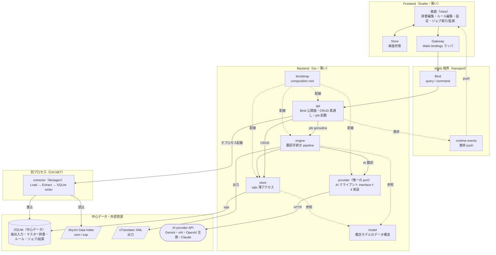

# アーキテクチャ仕様

関連文書: [`index.md`](./index.md), [`requirements.md`](./requirements.md), [`system_requirements.md`](./system_requirements.md), [`concept-model.md`](./concept-model.md), [`tech-selection.md`](./tech-selection.md), [`core-beliefs.md`](./core-beliefs.md)

本書は、システムの内部境界、依存方向、コンポーネント構成を定義する。
画面表示の設計は Storybook（story と svelte コンポーネント）が正本で、本書は扱わない。
データモデルの概念は [`concept-model.md`](./concept-model.md) が正本で、本書は実装上の境界だけを扱う。

## 1. 全体方針

- 中心は Skyrim のデータであり、翻訳は中心データに対する一本の手続きである。
- データ中心かつ手続き中心の処理に合わせ、層を薄くする。旧構成の `UseCase` / `Service` / per-entity `Repository` / `Presenter` 層は持たない。
- 抽象（interface ＝ port）は、実装が複数に分かれる AI provider の境界 1 つだけに置く。
- 手動 DI は composition root（`bootstrap`）1 箇所に集約し、それ以外の層で concrete 実装を new しない。
- 抽出（C#/Mutagen）と翻訳（Go）は別 runtime で、受け渡しの境界は SQLite とする。境界専用の中間形式（JSON 等）は持たない。
- Wails は transport boundary であり、domain rule や画面状態の正本ではない。

## 2. コンポーネント図

```mermaid
flowchart TB
    subgraph FE["Frontend（Svelte・薄い）"]
        View["画面（View）<br/>辞書編集・ルール編集・設定・ジョブ実行/監視"]
        Store["Store<br/>画面状態"]
        Gateway["Gateway<br/>Wails bindings ラッパ"]
    end

    subgraph WAILS["Wails 境界（transport）"]
        Bind["Bind<br/>query / command"]
        Events["runtime events<br/>進捗 push"]
    end

    subgraph BE["Backend（Go・薄い）"]
        API["api<br/>Bind 公開面・CRUD 素通し・job 起動"]
        Engine["engine<br/>翻訳手続き pipeline"]
        StoreGo["store<br/>sqlx 薄アクセス"]
        Provider["provider（唯一の port）<br/>AI クライアント interface＋4 実装"]
        Model["model<br/>概念モデルのデータ構造"]
        Bootstrap["bootstrap<br/>composition root"]
    end

    subgraph EXT["別プロセス（C#/.NET）"]
        Extractor["extractor（Mutagen）<br/>Load → Extract → SQLite writer"]
    end

    subgraph DATA["中心データ・外部資源"]
        SQLite[("SQLite（中心データ）<br/>抽出入力・マスター辞書・ルール・ジョブ/結果")]
        DataFolder[/"Skyrim Data folder<br/>esm / esp"/]
        XML[/"xTranslator XML<br/>出力"/]
        AIAPI(["AI provider API<br/>Gemini・xAI・OpenAI 互換・Claude"])
    end

    View <--> Store
    View --> Gateway
    Gateway --> Bind
    Bind --> API
    API -. 進捗 .-> Events
    Events -. push .-> View

    API -->|CRUD| StoreGo
    API -->|job goroutine| Engine
    API -->|子プロセス起動| Extractor
    Engine --> StoreGo
    Engine -->|AI 翻訳| Provider
    Engine -->|出力| XML
    Provider -->|HTTP| AIAPI
    StoreGo -->|sqlx| SQLite

    Extractor -->|読込| DataFolder
    Extractor -->|書込| SQLite

    Engine -. 参照 .-> Model
    StoreGo -. 参照 .-> Model
    Bootstrap -. 配線 .-> API
    Bootstrap -. 配線 .-> Engine
    Bootstrap -. 配線 .-> StoreGo
    Bootstrap -. 配線 .-> Provider
```

## 3. 各コンポーネントの責務

### Frontend（Svelte・薄い）

- `画面（View）`: Svelte コンポーネント。表示と DOM event を扱う。辞書編集、ペルソナルール編集、プロバイダ設定、翻訳ジョブの実行と監視の各画面を持つ。
- `Store`: 画面状態を保持する。
- `Gateway`: Wails の generated bindings を呼ぶ frontend adapter。画面から transport を直接呼ばせない。

### Backend（Go・薄い）

- `api`: Wails Bind の公開面。辞書・ルール・設定の CRUD を `store` へ素通しし、翻訳ジョブを `engine` の goroutine として起動し、進捗を runtime events で push する。
- `engine`: 翻訳手続きの本体。中心データを読み、訳の単位化（重複排除）、辞書解決、ペルソナ生成、AI 翻訳、配置への書き戻し、xTranslator XML 出力を順に行う純 Go の手続き。GUI から切り離して単体テストでき、CLI からも起動できる。
- `store`: SQLite への薄いデータアクセス。sqlx を使い、entity ごとの repository interface は作らず関数で持つ。残存の keyring secret store を secret 子に置く。
- `provider`: AI クライアントの interface と 4 実装（Gemini / xAI / OpenAI 互換 / Claude）。本構成で唯一の port。
- `model`: [`concept-model.md`](./concept-model.md) の箱に対応するデータ構造。`engine` と `store` が参照する。
- `bootstrap`: composition root。`store` と `provider` を生成し、`engine` と `api` へ注入する唯一の場所。

### 別プロセス（C#/.NET）

- `extractor`（Mutagen）: Skyrim の Data folder を明示パスで読み、対象 plugin を抽出し、結果を SQLite へ書く。抽出の正しさは C# テスト（`CountParityTests` / `ModelInvariantTests`）で担保する。

### 中心データ・外部資源

- `SQLite`: 中心データ。抽出入力、Mod 横断のマスター辞書、ペルソナルール、翻訳ジョブと結果キャッシュを 1 つの DB に持つ。
- `Skyrim Data folder`: 入力の esm / esp。registry 自動検出ではなく明示パスで指定する。
- `xTranslator XML`: 翻訳結果の出力形式。
- `AI provider API`: 外部の翻訳 AI（4 系統）。

## 4. 依存方向と手動 DI

- `bootstrap` だけが concrete 実装を new する。
- 上位は下位を、`bootstrap` で wire された値経由で参照する。
- 多態の port（実装が複数に分かれる抽象）は `provider` 1 つだけ。`engine` は `provider` interface に依存し、具体実装を直接参照しない。
- `store` は concrete を渡す。`engine`・`api` へ SQLite driver 固有 API を漏らさない。単体テストのため、`engine`・`api` は `store` の使う分だけを写した狭い interface（実装は `store` 1 つ）を consumer 側で宣言してよい。これは多態の port ではなく、テスト容易性のための切り離しとする。
- frontend と backend は Wails 境界で接続する。

## 5. Wails 境界

- frontend の query / command は `Gateway` 経由で generated bindings を呼ぶ。
- backend の Bind 公開面は `api` が担う。
- 翻訳ジョブの進捗など backend から frontend への push は runtime events を使う。
- query / command の主経路は Bind call とし、event は push 通知専用に使う。
- runtime の concrete handle は `bootstrap` と `api`（Bind 公開面）に閉じ込める。`api` は runtime を進捗 push（events）とファイル選択ダイアログに使う。`engine`・`store`・`provider`・`model` へは漏らさない。

## 6. C#↔Go 境界（SQLite 契約）

- 抽出（C#）と翻訳（Go）は別 runtime で、受け渡しは SQLite を介す。
- C#↔Go の契約は SQL schema 1 本とする。schema は repo-owned の SQL migration を正本にする。
- Go app は起動時に schema を適用する。`extractor` は書き込み前に同じ schema を冪等に ensure する。
- schema version を DB に刻み、Go は読み込み時に version を検査する。
- 出荷形態では Go app と `extractor` が同居し、Go app が `extractor` を子プロセスとして起動する。
- 開発機（macOS）でも Mutagen は動く。Skyrim の Data folder を明示パスで与えれば抽出を実走できる。
- 抽出の正しさは C# テストで担保し、JSON 中間形式と Python 検証スクリプトは持たない。

## 7. ディレクトリ正本

### backend（Go・`internal/` 配下）

- `internal/bootstrap`: composition root
- `internal/api`: Wails Bind 公開面
- `internal/engine`: 翻訳手続き pipeline
- `internal/store`: SQLite アクセス（sqlx）。keyring secret store は secret 子（`internal/store/secret`）に置く
- `internal/provider`: AI クライアント interface と 4 実装
- `internal/model`: [`concept-model.md`](./concept-model.md) 対応のデータ構造
- `db/`: SQL schema 正本（repo-owned migration）と migration の適用（`db.Apply`）。`store` は起動時に `db.Apply` へ委譲する

### frontend（`frontend/src/` 配下）

- `frontend/src/ui/`: 画面（View）、表示コンポーネント、Store、Storybook story と fixture
- `frontend/src/gateway/`: Wails bindings ラッパ
- `frontend/src/application/diagnostic/`: logger（generic、残存）

### 別プロセス（`tools/` 配下）

- `tools/extractor/`: C#/.NET Mutagen 抽出（SQLite writer を追加）
- `tools/extractor.Tests/`: 抽出検証（`CountParityTests` / `ModelInvariantTests`）

## 8. 現在の状態と移行（2026-06-14）

- backend は `greenfield-reset` task（2026-06-06）で削減済み。残存は keyring 2 ファイルのみ。
- frontend は `frontend-greenfield` task（2026-06-06）で削減済み。残存は `ui/stores/shell-state.ts` と diagnostic logger のみ。
- `extractor` は in-memory の `ExtractionResult` を作り件数検証するところまで実装済み。SQLite writer は未実装。
- 本骨格への再構築は `docs/exec-plans/active/` の active plan で進める。
