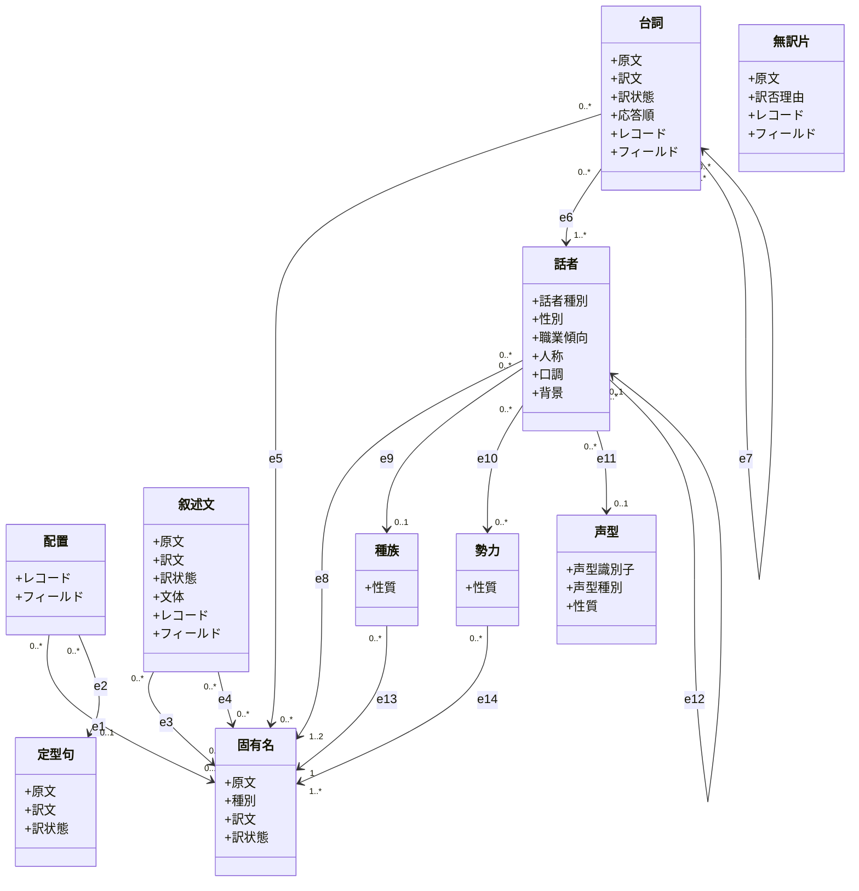

# 翻訳概念モデル

本書は、AITranslationEngineJp が行う**翻訳という営み**を、「訳の質と手数を何が決めるか」という基準で構造化した概念モデルを固定する。

[`skyrim-structure-model.md`](./skyrim-structure-model.md) が「世界に何があるか」（入力）を固定するのに対し、本書は「その世界のテキストをどう訳すか」に登場する概念を固定する。両者は層が違う。Skyrim 構造体モデルが本書の入力になる。

実 architecture（layer 名、port、ディレクトリ）は扱わない（`architecture.md` の責務）。実現方式（永続性、スコープ、生成手段）も扱わない。それは [`system_requirements.md`](./system_requirements.md) の責務で、本書は意図的に引きずられない。

関連文書: [`requirements.md`](./requirements.md)（業務要件）, [`skyrim-structure-model.md`](./skyrim-structure-model.md)（入力＝世界の構造）

## やろうとしていることの正体

抽出された英語テキスト片を日本語へ移す作業だが、テキスト片には 2 種類ある。

- **訳が文脈で変わらないもの**（固有名詞・定型短文）: `Iron Sword` はどこに出ても「鉄の剣」。同じ原文が大量に重複する。→ **訳の単位を 1 つにまとめ、複数の配置がそれを指す**。一度だけ訳して使い回す（重複排除）。一貫性はこの副産物として無料で付く。
- **訳が文脈で変わるもの**（叙述文・台詞）: 叙述文は文体（説明体/書物体/日記体）が要り、台詞は同じ原文でも話者で口調が変わる（衛兵の「何か用か？」と貴婦人の「何かご用かしら？」）。→ **配置ごとに自前で訳す**。重複排除できない。文中の固有名詞は `固有名` を言及して揃える。

> 補足: 既訳辞書（公式日本語版）の実測では、同一原語の訳ゆれは同一 plugin 内で 1.7%、横断の見かけ 20% もほぼ同綴り異義・override・版違い（USSEP）で、真の訳ゆれはごく少ない。よって一貫性は独立目的ではなく重複排除の副産物として扱う。口調（業務要件3）が本丸。

## 重複排除の要：訳の単位と配置を分ける

これが本モデルの背骨。

```
配置(レコード+フィールド) ──┐
配置(レコード+フィールド) ──┼──→ 固有名(原文+種別+訳)   多対1。同じ固有名詞は1つ＝一度訳す
配置(レコード+フィールド) ──┘
```

- `固有名`・`定型句` は**訳の単位（概念）**で、原文と訳文を持つがレコード情報は持たない。同じ原文（同じ種別）は 1 つにまとまる。
- `配置` は**どのレコード（FormID/EDID）のどのフィールドに出るか**という翻訳レコード情報を持ち、固有名 or 定型句を指す。複数の配置が同じ訳の単位を指す＝重複排除。出力時はこの配置へ訳を戻す。
- `叙述文`・`台詞` は重複しないので、訳の単位を分けず自前の `原文`・`訳文`・`レコード`・`フィールド` を持つ。

## 採用原則

- **class** = 翻訳の決定に効く概念を捉える。世界の entity ではなく、翻訳という営みに登場する概念を class にする。
- **訳の単位と配置を分ける**: 文脈で訳が変わらない固有名詞・定型短文は、訳の単位（`固有名`・`定型句`）を 1 つ持ち、複数の `配置` がそれを指す。これで「同じものは一度訳す」が構造に乗る。
- **文脈依存は自前で訳す**: `叙述文`（文体）・`台詞`（話者の口調）は配置ごとに訳す。重複排除しない。
- **言及は固有名へ**: 叙述文・台詞の文中の固有名詞は `固有名` を参照して訳を揃える。
- **手掛かりの箱は中身を持つ**: ペルソナ素材（種族・勢力・声型）は名前だけでなく `性質` を持つ。性質が話者で合成されて口調になる**関係**で表す。
- **実現方式を持ち込まない**: 永続・スコープ・生成手段は class にしない。
- **edge** = 訳の決定に効く参照・依存の関係。多重度を付け、依存する側から依存される側へ向ける。関連端は 10 文字以内。

## クラス図



`無訳片` は訳の単位にも繋がらない独立 class。`固有名` がハブで、配置（e1）・叙述文/台詞の言及（e3/e4/e5）・話者/種族/勢力の名前（e8/e13/e14）が集まる。

## 関連端

| id | A | B | 関係種別 | A から見た B | B から見た A |
|---|---|---|---|---|---|
| e1 | 配置 | 固有名 | association | 指す固有名 | 名の配置 |
| e2 | 配置 | 定型句 | association | 指す定型句 | 句の配置 |
| e3 | 叙述文 | 固有名 | association | 説明する名 | 名の説明文 |
| e4 | 叙述文 | 固有名 | association | 言及する名 | 言及元叙述 |
| e5 | 台詞 | 固有名 | association | 言及する名 | 言及元台詞 |
| e6 | 台詞 | 話者 | association | 発する話者 | 持ち台詞 |
| e7 | 台詞 | 台詞 | self-association | 先行する節 | 後続の節 |
| e8 | 話者 | 固有名 | association | 名乗る名 | 名の持ち主 |
| e9 | 話者 | 種族 | association | 生まれの種族 | 種族の体現者 |
| e10 | 話者 | 勢力 | association | 所属する組織 | 組織の構成員 |
| e11 | 話者 | 声型 | association | 持ち声 | 声の主 |
| e12 | 話者 | 話者 | self-association | 形態の元 | 派生した形態 |
| e13 | 種族 | 固有名 | association | 名乗る名 | 名の種族 |
| e14 | 勢力 | 固有名 | association | 名乗る名 | 名の勢力 |

- e1（`配置 "0..*" --> "0..1" 固有名`）が重複排除の核: 同じ固有名詞は 1 つの固有名にまとまり、訳を 1 つ持つ。複数の配置（武器の配置・別 plugin の同名）がそれを指す。一貫性はこの共有の副産物。
- e8（`話者 "0..*" --> "1..2" 固有名`）は話者の氏名（FULL）と短名（SHRT）。種族・勢力の名前（e13/e14）も固有名。entity を残したものも畳んだものも、名前は一様に固有名を指す。
- 叙述文・台詞は固有名を「言及」で参照する（e3/e4/e5）が、自前の `訳文` を持つ。言及は文中の固有名詞を揃えるためだけ。

## 概念と業務要件の対応

| 業務要件 | 本モデルでの担い手 |
|---|---|
| 1 翻訳したい | 固有名・定型句（複数配置で 1 訳を共有）＋ 叙述文・台詞（自前で訳す）。叙述文の `文体`・台詞の口調が訳の質を決める |
| 2 一貫性を保ちたい | e1 の重複排除（複数配置が 1 つの固有名・1 訳を指す）の副産物＋ 叙述文・台詞が固有名を言及して文中も揃える（e3/e4/e5）。独立した機構は持たない |
| 3 口調を保ちたい | e6（台詞に話者を結ぶ）＋ 素材（種族 e9・勢力 e10・声型 e11 の `性質`、形態元 e12、性別・職業傾向・名前 e8）の合成で決まる話者の `人称`/`口調`/`背景` |
| 4 xTranslator 形式で出力 | 各配置・叙述文・台詞の `訳文` を `レコード`＋`フィールド`（REC:FIELD）へ戻す |

## Skyrim 構造体モデルとの対応

| 本書の箱 | Skyrim 構造体モデルの class（代表 REC:FIELD） |
|---|---|
| 固有名 | Equipment/Consumable/Magic/Item/Location/Quest/Book/Shout/Perk… の FULL。Speaker の氏名(NPC_:FULL)・短名(SHRT)、Race の名称(RACE:FULL)、Faction の名称(FACT:FULL)・階級称号(MNAM/FNAM) も固有名 |
| 定型句 | Activator(RNAM＝起動動作)、Message(ITXT＝ボタン)、Word(WOOP:TNAM＝龍語の語義) |
| 配置 | 上記固有名・定型句が現れた各レコード（FormID/EDID）＋フィールド。同じ名前が複数レコードに出れば複数の配置 |
| 叙述文 | DESC/DNAM 系（武器・呪文の説明、MGEF:DNAM、BOOK 本文、QUST:CNAM ログ・NNAM 目標、LSCR） |
| 台詞 | INFO:NAM1（NPC 返答）、INFO:RNAM（選択肢上書き）、DIAL:FULL（選択肢既定文） |
| 無訳片 | Word(WOOP:FULL＝龍語綴り、翻訳禁止) |
| 話者 | Player（抽出対象外）、Speaker(NPC_/TACT) |
| 種族 | Race(RACE) |
| 勢力 | Faction(FACT) |
| 声型 | VoiceType(VTYP)。VTCK で話者に紐づく。識別子のみで訳さない |

## note

- **固有名 / 定型句（訳の単位）**: `原文`＋`訳文` を持つがレコード情報は持たない。同じ原文（同じ種別）は 1 つにまとまり、一度だけ訳す。固有名は固有名詞（武器・地名・人名・呪文・任務・本タイトル）、定型句は文脈で訳が変わらない非固有名の短い語句（起動動作 RNAM・ボタン ITXT・龍語の語義 WOOP:TNAM）。「用語」では地名・人名を含むのに術語の語感で合わないため `固有名` にした。
- **種別（固有名）**: 重複排除でまとめるときの同定キー。原文だけでまとめると同綴り異義（`Chest`＝宝箱/胸）を誤って統合するため、レコード種別（WEAP/CONT/LCTN…）を併せ持って区別する。種別（`proper_noun.category`）で粗く分ける方針を採り、同種別内の別物は分けきれず誤統合しうるが、一貫性と正確性のトレードオフとしてそのコストを受容する。
- **配置**: 訳の単位がどのレコード（FormID/EDID）のどのフィールドに出るかという翻訳レコード情報（`レコード`＋`フィールド`）。固有名 or 定型句を指す（e1/e2）。複数の配置が同じ訳の単位を指すことが重複排除そのもの。出力時はここへ訳を戻す。
- **レコード / フィールド**: `レコード` は FormID/EDID（どのレコードか）、`フィールド` は FULL/DESC/NAM1 など（レコードのどの欄か）。両者で xTranslator の String 行を一意に指す。
- **言及（e3/e4/e5）**: 叙述文・台詞の文中の固有名詞を `固有名` に結び、その訳に揃える。e3 は叙述文の説明対象（武器の説明文→武器の名前）、e4/e5 は文中の言及。実装は [`er.md`](./er.md)（`narration_described`・`narration_mention`・`line_mention`）にある。
- **名前は固有名**: 話者の氏名・短名、種族の名称、勢力の名称・階級称号は固有名詞なので `固有名`。話者・種族・勢力が固有名を参照する（e8/e13/e14）。entity を残したものも畳んだものも、名前を一様に固有名へ向けることで「話者だけ名前を別扱い」する非対称を避ける。
- **叙述文の文体**: 説明体（武器・呪文の説明）/ 書物体（本）/ 日記体（クエストログ・目標）/ 世界観断片（ロード画面）。重複排除しない代わりに文体が訳し方の手掛かり。
- **台詞**: 同じ原文でも話者（e6）で口調が変わるため重複排除しない。会話の流れ（e7）も文脈。純汎用台詞（声型単位で多数の NPC が共有する台詞）は e6 を `1..*` とし、話せる話者すべてを指す。口調はその共有話者群に共通する素性（多くは声型の `性質`）で決める。
- **話者**: 台詞を発する人格。`話者種別` で 固有 / 形態 / プール / 声型代表 / 役割のみ / 喋るオブジェクト を分ける。主人公（Player）は抽出されず声はユーザー設定、NPC（Speaker）は素性から声が決まる。
- **ペルソナにしうる素性（全列挙）**: 話者の `人称`/`口調`/`背景` を決めうる手掛かり。`性別`・`職業傾向`・`話者種別`（話者属性）、`名前`（e8）、`種族`（e9）、`勢力`（e10、複数可）、`声型`（e11、口調に最も効く）、`形態の元`（e12）。
- **素材の性質**: 種族・勢力・声型は `性質`（種族の気質、勢力の気風、声型の演技層など、話者に与える人物特徴）を持つ。例: 種族ノルド＝「北方の武人気質」、勢力帝国軍＝「規律的な官僚組織」、声型 MaleNord＝「壮年男性の張りのある声」。
- **性質の合成で口調が決まる**: 話者の口調は各素材の `性質` と話者属性の合成結果である。

## 既知の課題

概念モデルに残る未解決の課題（会話の流れ e7・名乗る名 e8/e13/e14 の実体化）は [`known-issues.md`](./known-issues.md) に集約する。
