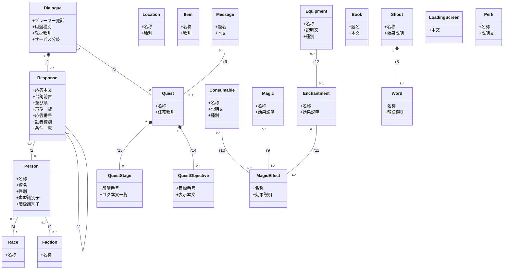

# 概念モデル

本書は、AITranslationEngineJp が扱う **Skyrim 世界**を、翻訳判定が要る context という基準で構造化した概念モデルを固定する。

実 architecture（layer 名、port、ディレクトリ）はここでは扱わない。`architecture.md` の責務。
`extractData.pas`（xEdit script）の現在の emit 状況はここでは扱わない。末尾の `実装の制約` 節で実装側の取得状況を別途整理する。

## 採用原則

- **class** = Skyrim 世界において翻訳判定 context に効く entity を捉える。世界に存在し翻訳に効くものは class に書く。`extractData.pas` の現状 emit 状況は raw data 取得の制約であり、class の存在を縛る根拠ではない（制約は制約、golden ではない）。
- **class の split 基準**: 次のいずれかを満たす時に分ける。
    - **属性集合が翻訳上 違う**: name/desc 以外に必要な field が違う。
    - **世界観として別 category**: その世界の中でカテゴリが異なる。
    - 上記を満たさない差は class 分けせず、`種別` attribute で表現する。
- **edge** = 世界の中で翻訳判定 context として効く reference 関係。pas が emit しない関係でも、世界の構造として実在し翻訳判定に効くなら edge に書く。pas は raw data の取得制約として扱い、class 同士の自然な構造（hierarchy、tree、所属、構成）は本書側で構築する。**ただし「世界の構造として存在するが翻訳判定上は意味が薄い」関係は edge にしない。**
- **edge には多重度を付ける**（`"0..*"` 等）。owner 側が child を所有する構造は composition（`*--`）で示す。自己参照や tree / DAG 構造は多重度で形状を表現する。
- 関連端は 10 文字以内、A から見て B が世界で何に見えるかを書く。reverse mirror（同じことを言い換えただけ）にしない。
- 属性と関連端の合計で、その class が「世界の何であるか」を理解できる粒度にする。
- **note は最小限**にする。属性と関連端で世界の意味が立ち上がる構造を作り、説明的補足が要らないようにする。どうしても構造で表現できない opaque な convention（識別子文字列の意味解釈など）だけ note に残す。

## クラス図（v17）

## 関連端

各行 1 関連。A から見た B、B から見た A をそれぞれ 10 文字以内で書く。多重度は class 図側で表記。

| id | A | B | 関係種別 | A から見た B | B から見た A |
|---|---|---|---|---|---|
| r1 | Dialogue | Response | composition | 抱える応答 | 所属話題 |
| r2 | Response | Person | association | 台詞の発話者 | 発話した台詞 |
| r3 | Person | Race | association | 生まれの種族 | 種族の体現者 |
| r4 | Person | Faction | association | 所属する組織 | 組織の構成員 |
| r5 | Dialogue | Quest | association | 話題を生む任務 | 任務上の発話話題 |
| r6 | Message | Quest | association | 告知元の任務 | 任務状態の通知 |
| r7 | Response | Response | self-association | 先行応答 | 後続応答群 |
| r8 | Shout | Word | composition | 構成する龍語 | 用いる叫び |
| r9 | Magic | MagicEffect | association | 発動する効果 | 効果元の術 |
| r10 | Consumable | MagicEffect | association | 含む効果 | 効果を持つ品 |
| r11 | Enchantment | MagicEffect | association | 付与する効果 | 効果元の付与 |
| r12 | Equipment | Enchantment | association | 適用された付与 | 付与先の装備 |
| r13 | Quest | QuestStage | composition | 抱える段階 | 所属任務 |
| r14 | Quest | QuestObjective | composition | 抱える目標 | 所属任務 |

r7 の多重度（`Response "0..*" -- "0..1" Response`）が tree/DAG shape を表す:
- 各 Response の **先行応答は 0..1**（INFO.PNAM single）
- 各 Response の **後続応答は 0..\***（INFO.TCLT 複数）
- 同じ先行を共有する Response が複数あれば fork、複数の先行を辿る経路で同じ Response に至れば DAG（PNAM 単一の縛りで通常は tree）

## note

属性と関連端で意味が立ち上がらない、または opaque な convention に依存する点だけ残す。

- **Person.声型識別子**: 例 `MaleNord`、`FemaleArgonian`。文字列規約から「性別 + 種族傾向 + 演技層」を読み取る Skyrim convention に依存する。
- **Person.階級識別子**: 例 `EncWarrior01Class`。文字列規約から職業傾向を読み取る convention に依存する。
- **Dialogue.プレーヤー発話**: subtype が TOPIC 系では player が選ぶ topic 台詞、reaction 系（HELO / GBYE / ATCK 等）では空または trigger label となる。`発火種別` の解釈を伴う。
- **Dialogue.発火種別**: DIAL.DATA の subtype byte（TOPIC / HELO / GBYE / ATCK / FAVORS / SERVICES 等）。Response の `話者種別` を決める根拠で、TOPIC 系は個別、reaction 系は汎用に傾く。値の集合は SSEEdit / UESP の DIAL Subtype enum に従う。
- **Response.話者種別**: `個別` = r2 で Person 1 件、player-targeted な特定 NPC 台詞。`汎用` = r2 で Person 0 件、声型一覧（Response.声型一覧）が候補話者集合を担う（HELO / GBYE / リアクション等）。`発火種別` と speaker_id 存在から derive。
- **Response.条件一覧**: INFO.CTDA の list。各 entry は function id、引数（faction 参照、race 参照、sex 値、global 値など）、比較演算子、比較値で構成。世界側で「この Response がどんな対象に対して発火するか」を決める。汎用 Response の候補話者を声型一覧から更に絞る用途で効く。
- **QuestStage.ログ本文一覧**: 1 stage（INDX）に対して 0..\* の CNAM 文字列を持つ。各 CNAM は player の Quest log に表示される 1 つの進捗 text。条件付きで発火する CNAM もあるため list で扱う。

## 既知の弱点（指摘の入口）

| # | 論点 |
|---|---|
| 1 | **Dialogue 配下の応答 tree（r7）の context 長さ**: LLM に Dialogue 単位で tree 全体を投入する設計を取った場合、長い Dialogue（数百 Response を含む quest 中心 dialogue）は context 上限を超える。tree subtree 単位の分割 or root path 抜粋などの工夫が翻訳実装で要る |

## 実装の制約（pas 抽出状況）

本書 class / edge / attribute のうち、現 `extractData.pas` で raw data を populate できる範囲と、できない範囲を整理する。
本書は世界の構造を表すものであり、現 pas で populate されないからといって class や edge を削らない。pas を拡張するか、別 source（手作業 dictionary、別 script、SSEEdit プラグイン等）で補う方針は実装側で決める。

### pas が現在 populate するもの

- Dialogue（DIAL）の `プレーヤー発話`、`用途種別`、`サービス分岐`、`r1（応答との composition）`、`r5（任務）`
- Response（INFO）の `応答本文`、`台詞前置`、`並び順`、`声型一覧`、`応答番号`、`r2（発話者）`、`話者種別`（speaker_id 存在から derive）、`r7 の back-link 側`（INFO.PNAM、先行応答 0..1）
- Person（NPC_）の `名称`、`短名`、`性別`、`声型識別子`、`階級識別子`、`r3（種族）`
- Race（RACE）の `名称`
- Quest（QUST）の `名称`、`任務種別`
- QuestStage の `段階番号`、`ログ本文一覧`（pas は QUST 内 INDX + CNAM を平坦な list で emit、現状は Quest 配下の段階一覧 attribute だが、本書では QuestStage class として扱う）
- QuestObjective の `目標番号`、`表示本文`（pas は QUST 内 NNAM + NAM0 を平坦な list で emit、現状は Quest 配下の目標一覧 attribute だが、本書では QuestObjective class として扱う）
- Message（MESG）の `題名`、`本文`、`r6（任務）`
- LoadingScreen（LSCR）の `本文`
- Perk（PERK）の `名称`、`説明文`
- Item（KEYM / MISC / LIGH / CONT / SLGM / DOOR / FLOR / FURN）の `名称`、`種別`（pas の type field から派生）
- Equipment（WEAP / ARMO / AMMO）の `名称`、`説明文`（enchanted item で populate）、`種別`
- Consumable（SCRL / ALCH / INGR）の `名称`、`説明文`、`種別`
- Book（BOOK）の `題名`、`本文`
- Magic（SPEL）の `名称`、`効果説明`
- Enchantment（ENCH）の `名称`、`効果説明`
- MagicEffect（MGEF）の `名称`、`効果説明`
- Shout（SHOU）の `名称`、`効果説明`
- Location（CELL / LCTN / WRLD）の `名称`、`種別`（pas の `type` field から派生）

### pas が現在 populate しないもの（拡張または別 source で補う）

- Dialogue.発火種別（DIAL.DATA の subtype byte、SSEEdit / UESP で field 確認可）
- Response.条件一覧（INFO.CTDA list、SSEEdit / UESP で field 確認可）
- Faction（FACT）と Person ↔ Faction（r4）
- r7 の forward-link 側（INFO.TCLT、後続応答 0..\*）
- Word（WOOP）と Shout ↔ Word（r8、SHOU.WNAM → WOOP.TNAM）
- r9 Magic ↔ MagicEffect の参照解決（SPEL の Effects[] → MGEF link 解決）
- r10 Consumable ↔ MagicEffect の参照解決（SCRL / ALCH / INGR の Effects[] → MGEF link 解決）
- r11 Enchantment ↔ MagicEffect の参照解決（ENCH の Effects[] → MGEF link 解決）
- r12 Equipment ↔ Enchantment の参照解決（WEAP / ARMO / AMMO の EITM field → ENCH link 解決）
- **master plugin の同時取り込み**: ESP の header MAST 宣言で参照される master file（Skyrim.esm / Update.esm / Dawnguard.esm 等）の record を一緒に emit していない。`dictionaries/` 実測で Response.speaker_id が export 内 npcs に存在しない NPC を指す例があり（Dawnguard 17 件、Lucien 3 件）、これは master 側 NPC を未取り込みなため発生する。SSEEdit / xEdit script は master を先に load する仕組みで参照解決できるため、pas を MAST 走査するよう拡張すれば取り込める。世界側 model に欠落は無く、pas 抽出範囲の課題
