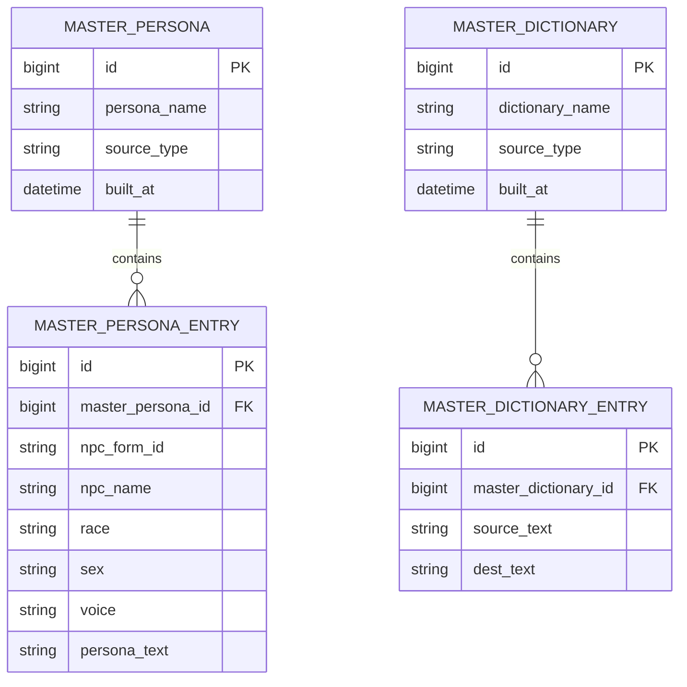
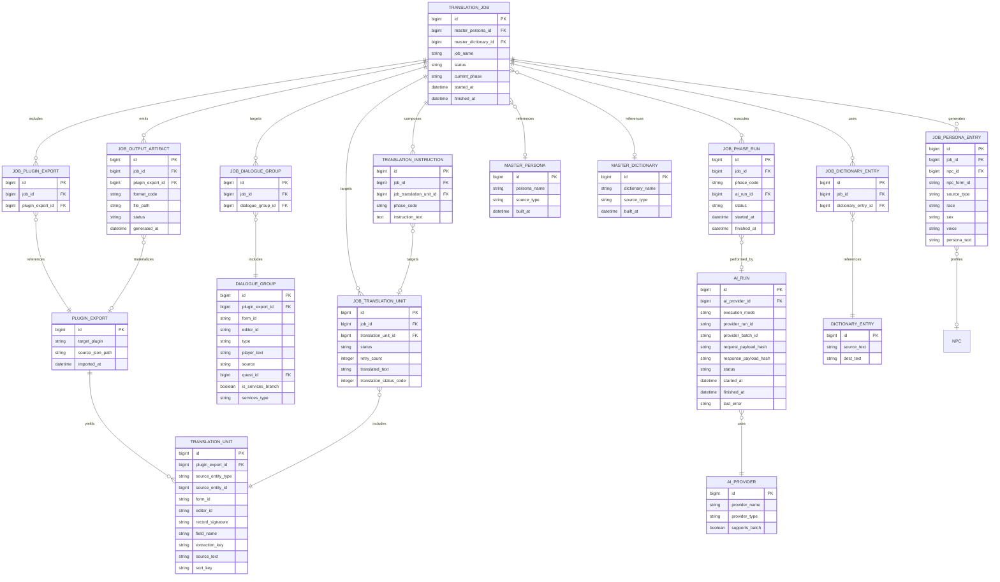

# データモデル / ER 図仕様

関連文書: [`index.md`](./index.md), [`spec.md`](./spec.md), [`architecture.md`](./architecture.md)

本書は、入力データ、基盤マスター、翻訳ジョブを含む現行データモデルの正本とする。
ファイル名 `er-draft.md` は既存リンク互換のため維持するが、内容はドラフトではなく現在の採用構造を表す。
未解消論点は末尾に明示し、解決までは本書に記載した構造を現行仕様として扱う。

- `extractData.pas` の抽出ロジックを正として、raw JSON の出力カテゴリと項目を整理
- 抽出 JSON は正本、DB は `PLUGIN_EXPORT` 単位の実行キャッシュとして扱う
- 内部主キーはシーケンシャル PK、外部 FormID は `form_id` として別保持する
- `dialogue_groups -> responses` の階層をそのままエンティティ化
- raw JSON 互換項目と、DB 正規化後に採用する canonical 項目を分けて記述する
- 辞書は単純化して `source_text` / `dest_text` のみ保持

## 入力データ ER 図

### JSON 入力

```mermaid
erDiagram
    PLUGIN_EXPORT ||--o{ DIALOGUE_GROUP : contains
    PLUGIN_EXPORT ||--o{ QUEST : contains
    PLUGIN_EXPORT ||--o{ ITEM : contains
    PLUGIN_EXPORT ||--o{ MAGIC : contains
    PLUGIN_EXPORT ||--o{ LOCATION : contains
    PLUGIN_EXPORT ||--o{ SYSTEM_RECORD : contains
    PLUGIN_EXPORT ||--o{ MESSAGE : contains
    PLUGIN_EXPORT ||--o{ LOAD_SCREEN : contains
    PLUGIN_EXPORT ||--o{ NPC : contains

    DIALOGUE_GROUP ||--o{ DIALOGUE_RESPONSE : has
    QUEST ||--o{ QUEST_OBJECTIVE : has
    QUEST ||--o{ QUEST_STAGE_LOG : has
    DIALOGUE_GROUP }o--o| QUEST : references
    DIALOGUE_RESPONSE }o--o| NPC : speaks
    DIALOGUE_RESPONSE }o--o| DIALOGUE_RESPONSE : follows
    MESSAGE }o--o| QUEST : references

    PLUGIN_EXPORT {
        bigint id PK
        string target_plugin
        string source_json_path
        datetime imported_at
    }

    DIALOGUE_GROUP {
        bigint id PK
        bigint plugin_export_id FK
        string form_id
        string editor_id
        string type
        string player_text
        string source
        bigint quest_id FK
        boolean is_services_branch
        string services_type
        string nam1
    }

    DIALOGUE_RESPONSE {
        bigint id PK
        bigint dialogue_group_id FK
        string form_id
        string editor_id
        string type
        integer response_order
        string source
        string text
        string prompt
        string topic_text
        string menu_display_text
        bigint speaker_npc_id FK
        string speaker_form_id
        integer index
        bigint previous_response_id FK
    }

    QUEST {
        bigint id PK
        bigint plugin_export_id FK
        string form_id
        string editor_id
        string source
        string name
        string type
    }

    QUEST_OBJECTIVE {
        bigint id PK
        bigint quest_id FK
        string objective_index
        string type
        string parent_id
        string parent_editor_id
        string text
    }

    QUEST_STAGE_LOG {
        bigint id PK
        bigint quest_id FK
        integer stage_index
        integer log_index
        string type
        string parent_id
        string parent_editor_id
        string text
    }

    ITEM {
        bigint id PK
        bigint plugin_export_id FK
        string form_id
        string editor_id
        string type
        string source
        string name
        string description
        string text
        string type_hint
    }

    MAGIC {
        bigint id PK
        bigint plugin_export_id FK
        string form_id
        string editor_id
        string type
        string source
        string name
        string description
    }

    LOCATION {
        bigint id PK
        bigint plugin_export_id FK
        string form_id
        string editor_id
        string type
        string source
        string name
        string parent_id
    }

    SYSTEM_RECORD {
        bigint id PK
        bigint plugin_export_id FK
        string form_id
        string editor_id
        string type
        string source
        string name
        string description
    }

    MESSAGE {
        bigint id PK
        bigint plugin_export_id FK
        string form_id
        string editor_id
        string type
        string source
        string text
        string title
        bigint quest_id FK
    }

    LOAD_SCREEN {
        bigint id PK
        bigint plugin_export_id FK
        string form_id
        string editor_id
        string type
        string source
        string text
    }

    NPC {
        bigint id PK
        bigint plugin_export_id FK
        string form_id
        string editor_id
        string type
        string source
        string name
        string race
        string voice
        string sex
        string class_name
    }

    DICTIONARY_ENTRY {
        bigint id PK
        string source_text
        string dest_text
    }
```

### 基盤マスター

## 翻訳ジョブ ER 図

## 入力データ補足

- `PLUGIN_EXPORT` は JSON のルートにある `target_plugin` を表す親エンティティ
- `PLUGIN_EXPORT` は JSON 原本に対応する実行キャッシュ親であり、ジョブ実行中だけ DB に入力データを保持する
- `dialogue_groups` は `DIALOGUE_GROUP`、その `responses` は `DIALOGUE_RESPONSE` として分離
- `quests`, `items`, `magic`, `locations`, `system`, `messages`, `load_screens` は、JSON のトップレベル配列ごとに独立エンティティ化
- raw JSON には互換のため `cells` ルートも出るが、`extractData.pas` の現行実装では常に空配列であり、DB 取り込み対象にはしない
- `DIALOGUE_GROUP.nam1` は、`extractData.pas` の `ExtractDialogue` が条件付きで出力する補助項目
- `QUEST_OBJECTIVE` と `QUEST_STAGE_LOG` は、`extractData.pas` の `ExtractQuest` が出力する `objectives` / `stages` を分解したもの
- `ITEM.text` と `ITEM.type_hint` は、`extractData.pas` の `ExtractItem` が出力する追加プロパティ
- `npcs` は配列ではなく ID をキーにしたオブジェクトなので、永続化時は `NPC.id` をキーとして正規化する想定
- `DIALOGUE_GROUP.quest_id` と `MESSAGE.quest_id` は抽出時に正規化し、表示用文字列とは別に `QUEST.id` を参照する FK として保持する
- `DIALOGUE_RESPONSE.previous_response_id` は抽出時に正規化し、前段応答を自己参照 FK で保持する
- `extractData.pas` の raw JSON は `speaker_id` と `voicetype` を出すが、DB では `speaker_npc_id` / `speaker_form_id` と `NPC.voice` を canonical とし、`voicetype` は互換入力としてのみ扱う
- `CELL FULL` は `extractData.pas` では `locations` 配列へ `type = "CELL FULL"` として入るため、独立した `CELL` エンティティは持たず `LOCATION` に集約する
- `MASTER_PERSONA` と `MASTER_DICTIONARY` は、仕様上の基盤データとして JSON 入力とは独立に持つ
- 外部 FormID は `form_id` として別保持し、DB の関連は内部シーケンシャル PK で張る
- `TRANSLATION_UNIT` は import 時に各 translatable field から生成する canonical 翻訳単位であり、xTranslator 出力と標準配布形式出力の両方の基準にする
- Mermaid では参照先コメントを列に埋め込まず、関係線と `FK` 表記で外部キーを表現する

## 翻訳ジョブ補足

- `TRANSLATION_JOB` は 1 つ以上の `PLUGIN_EXPORT` を `JOB_PLUGIN_EXPORT` 経由で参照し、複数入力ファイルをまとめて 1 ジョブで扱える
- `TRANSLATION_UNIT` は `record_signature` / `field_name` / `form_id` / `editor_id` / `source_text` を保持し、xTranslator XML の `<String>` を lossless に再構成できる
- `JOB_TRANSLATION_UNIT` はジョブごとの翻訳進捗、リトライ回数、翻訳文、xTranslator `Status` 相当の `translation_status_code` を保持する
- `JOB_PHASE_TYPE` はテーブル化せず、`phase_code` を定数としてアプリケーション側で管理する前提にした
- `JOB_DIALOGUE_GROUP` は、ジョブがどの会話グループを対象にしているかを表す中間テーブル
- `JOB_DICTIONARY_ENTRY` は、ジョブが再利用する辞書項目を表す中間テーブル
- `JOB_PERSONA_ENTRY` は mod 追加 NPC を含むジョブ内ペルソナを保持し、`MASTER_PERSONA` は基盤データ、`JOB_PERSONA_ENTRY` は実行時生成データとして分離する
- `AI_RUN` は provider 側の run / batch 識別子と時刻、失敗理由を保持し、中断 / 再開 / 進捗観測に使う
- `JOB_OUTPUT_ARTIFACT` は format ごとの出力ファイルと生成状態を保持し、UI 観測と再出力判断に使う
- 入力キャッシュ削除判定は `PLUGIN_EXPORT` 単位で行い、同一 `PLUGIN_EXPORT` を参照する未完了ジョブが `JOB_PLUGIN_EXPORT` 上に残っていない場合のみ削除する
