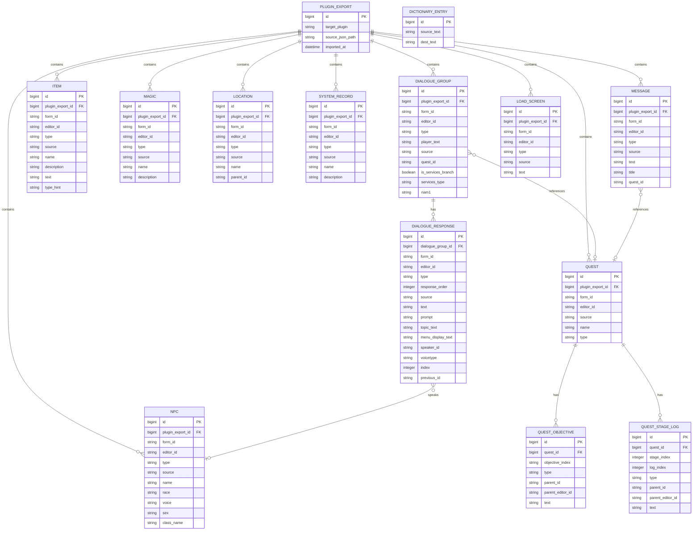
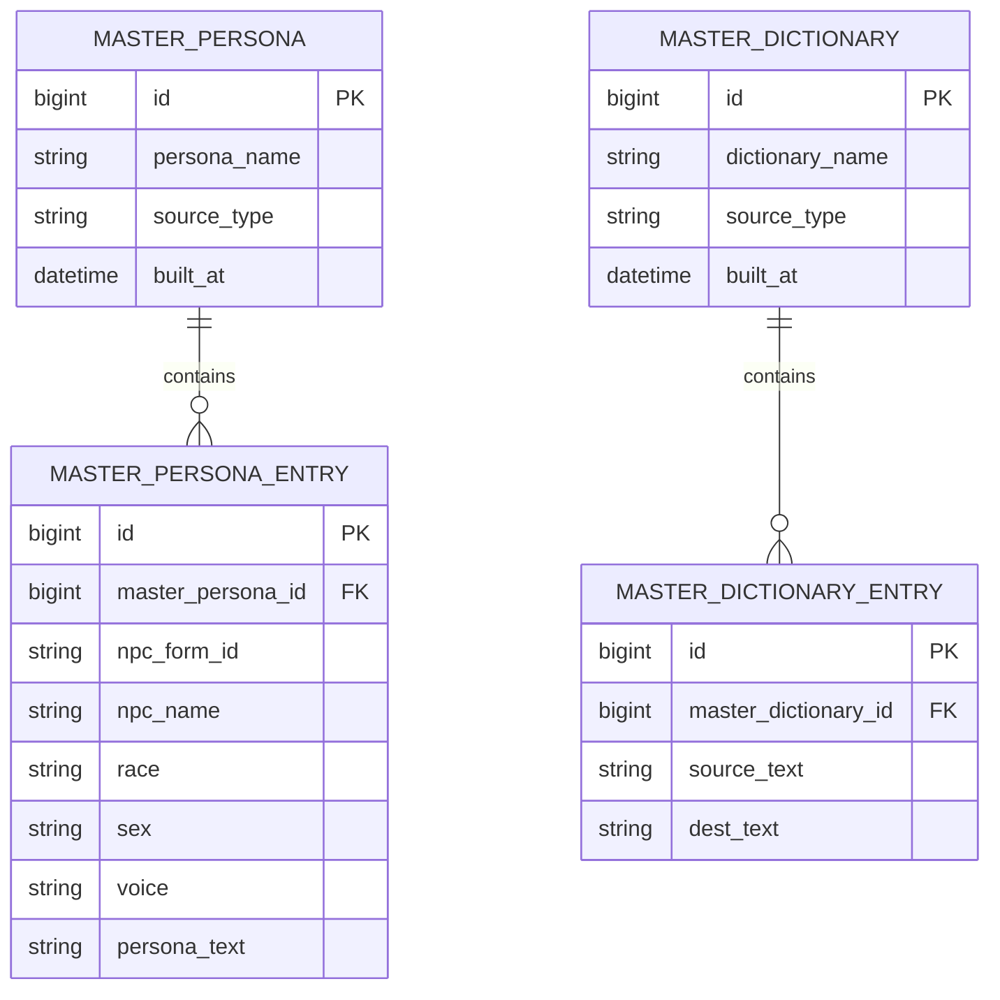
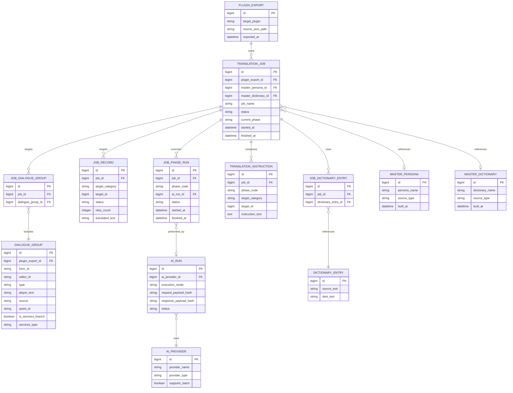

# ER 図ドラフト

`docs/spec.md` と `extractData.pas` をもとにした、概念レベルの ER 図たたき台。

- `extractData.pas` の抽出ロジックを正として、出力カテゴリと項目を整理
- 抽出 JSON は正本、DB は `PLUGIN_EXPORT` 単位の実行キャッシュとして扱う
- 内部主キーはシーケンシャル PK、外部 FormID は `form_id` として別保持する
- `dialogue_groups -> responses` の階層をそのままエンティティ化
- 辞書は単純化して `source_text` / `dest_text` のみ保持

## 入力データ ER 図

### JSON 入力

### 基盤マスター

## 翻訳ジョブ ER 図

## 入力データ補足

- `PLUGIN_EXPORT` は JSON のルートにある `target_plugin` を表す親エンティティ
- `PLUGIN_EXPORT` は JSON 原本に対応する実行キャッシュ親であり、ジョブ実行中だけ DB に入力データを保持する
- `dialogue_groups` は `DIALOGUE_GROUP`、その `responses` は `DIALOGUE_RESPONSE` として分離
- `quests`, `items`, `magic`, `locations`, `system`, `messages`, `load_screens` は、JSON のトップレベル配列ごとに独立エンティティ化
- `DIALOGUE_GROUP.nam1` は、`extractData.pas` の `ExtractDialogue` が条件付きで出力する補助項目
- `QUEST_OBJECTIVE` と `QUEST_STAGE_LOG` は、`extractData.pas` の `ExtractQuest` が出力する `objectives` / `stages` を分解したもの
- `ITEM.text` と `ITEM.type_hint` は、`extractData.pas` の `ExtractItem` が出力する追加プロパティ
- `npcs` は配列ではなく ID をキーにしたオブジェクトなので、永続化時は `NPC.id` をキーとして正規化する想定
- `CELL FULL` は `extractData.pas` では `cells` 配列ではなく `locations` 配列へ `type = "CELL FULL"` として入る
- `cells` 配列は `extractData.pas` 上は出力枠があるが、現行ロジックでは実質未使用
- `MASTER_PERSONA` と `MASTER_DICTIONARY` は、仕様上の基盤データとして JSON 入力とは独立に持つ
- 外部 FormID は `form_id` として別保持し、DB の関連は内部シーケンシャル PK で張る
- Mermaid では参照先コメントを列に埋め込まず、関係線と `FK` 表記で外部キーを表現する
- `DIALOGUE_GROUP.quest_id` と `MESSAGE.quest_id` は、現状の JSON では表示用文字列を含む参照なので、厳密 FK にする前にパース仕様を決める必要がある
- `DIALOGUE_RESPONSE.previous_id` も文字列参照なので、必要なら後で自己参照 FK に変換する

## 翻訳ジョブ補足

- `JOB_RECORD` はカテゴリ横断で使えるよう、`target_category` と `target_id` で翻訳対象を指す単純形にしている
- `JOB_PHASE_TYPE` はテーブル化せず、`phase_code` を定数としてアプリケーション側で管理する前提にした
- Mermaid を壊しやすいポリモーフィック関連は図から省略し、`JOB_RECORD` の属性で表現している
- `JOB_DIALOGUE_GROUP` は、ジョブがどの会話グループを対象にしているかを表す中間テーブル
- `JOB_DICTIONARY_ENTRY` は、ジョブが再利用する辞書項目を表す中間テーブル
- `TRANSLATION_JOB` は `PLUGIN_EXPORT` を必須参照し、完了後は同一 `PLUGIN_EXPORT` に未完了ジョブが残っていない場合のみ入力キャッシュを削除する

## 次に詰める候補

1. `quest_id` と `previous_id` を文字列のまま持つか、抽出時に正規化するか
2. `JOB_RECORD` をポリモーフィック参照のままにするか、カテゴリ別に分けるか
3. `NPC.voice` と `DIALOGUE_RESPONSE.voicetype` の関係を統一するか
4. `cells` が使われるサンプルを追加で見て、エンティティ化するか
