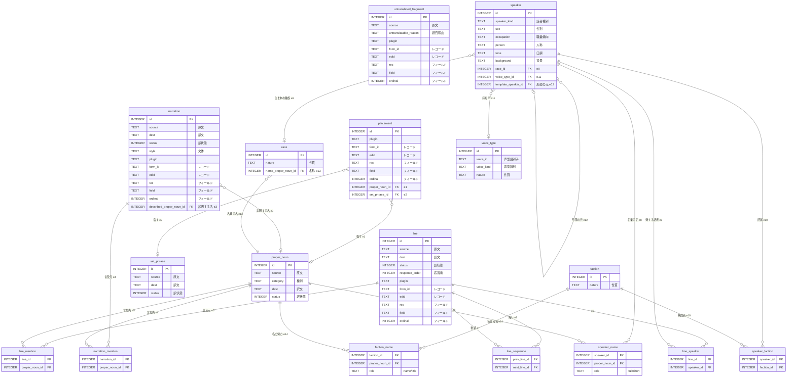

# ER 設計（抽出入力）

関連文書: [`index.md`](./index.md), [`concept-model.md`](./concept-model.md)（概念の正本）, [`skyrim-structure-model.md`](./skyrim-structure-model.md)（入力＝世界の構造）, [`architecture.md`](./architecture.md)（境界と依存方向）, [`tech-selection.md`](./tech-selection.md)（採用技術）, [`references/xtranslator_ref.md`](./references/xtranslator_ref.md)（出力形式）

本書は、[`concept-model.md`](./concept-model.md) の箱・属性・関連を `SQLite` のテーブルへ 1 対 1 で写した ER 設計を固定する。
論理 ER（テーブル、カラム、型、関係）を扱う。実行可能な SQL DDL は `db/` の repo-owned migration が正本であり、本書には DDL を二重に持たない（`architecture.md` §7）。

## 採用原則

- **概念モデルから外れない**: テーブルは [`concept-model.md`](./concept-model.md) の箱と 1 対 1 にする。箱を統合せず、属性も落とさない。関連 e1〜e14 を FK または連関テーブルへそのまま写す。
- **実現方式を持ち込まない**: 重複排除をいつ誰が畳むか、属性をいつ埋めるか、永続化するかは扱わない。それは `concept-model.md` L7 のとおり実現方式（`system_requirements.md`・migration）の責務で、ER は構造だけを固定する。
- **レコード識別だけ具体化する**: 出力（xTranslator）が String 行を一意に指すために、concept-model の `レコード`・`フィールド` を物理キーへ具体化する。これは概念の改変ではなく、出力に必要な識別の具体化に限る。

## スコープ

- 対象は**抽出入力**。`concept-model.md` の 10 箱（固有名・定型句・配置・叙述文・台詞・無訳片・話者・種族・勢力・声型）と関連 e1〜e14。
- 対象外は、Mod 横断マスター辞書、ペルソナルール、翻訳ジョブと結果キャッシュ、schema version 管理。同じ `SQLite` に同居するが（`architecture.md` §3）、本書では設計しない。

## レコード識別の具体化

concept-model の `配置`・`叙述文`・`台詞`・`無訳片` が持つ `レコード`・`フィールド` を、xTranslator String 行（`references/xtranslator_ref.md` §3）へ一意対応させる。

- `レコード`（FormID/EDID）→ `plugin` + `form_id`（`0x` hex）+ `edid`。
- `フィールド`（REC:FIELD）→ `rec`（record signature 4 字）+ `field` + `ordinal`（同一フィールドに複数値が出る `MESG:ITXT`・`QUST:CNAM` 等の序数）。
- String 行の一意キーは `(plugin, form_id, rec, field, ordinal)`。
- `訳状態` の値域は xTranslator `Status` を踏襲する。`0`=未訳、`1`=訳済、`2`=部分、`3`=仮、`4`=承認。

## ER 図

## テーブル定義

型は `SQLite` の type affinity（`INTEGER` / `TEXT`）。`id` は `INTEGER PRIMARY KEY`。カラム名は concept-model の属性に対応させる。

### 訳の単位（重複排除する）

| テーブル | concept-model の箱 | カラム（concept-model 属性） |
|---|---|---|
| proper_noun | 固有名 | source（原文）, category（種別）, dest（訳文）, status（訳状態） |
| set_phrase | 定型句 | source（原文）, dest（訳文）, status（訳状態） |

- `proper_noun` 一意制約: UNIQUE(category, source)。種別で同綴り異義を分ける（`concept-model.md` 弱点 1）。
- `set_phrase` 一意制約: UNIQUE(source)。

### 配置・叙述文・台詞・無訳片（レコード情報を持つ）

| テーブル | concept-model の箱 | concept-model 固有の属性 |
|---|---|---|
| placement | 配置 | （原文・訳文を持たない。固有名 or 定型句を指す） |
| narration | 叙述文 | source, dest, status, style（文体） |
| line | 台詞 | source, dest, status, response_order（応答順） |
| untranslated_fragment | 無訳片 | source, untranslatable_reason（訳否理由） |

- 4 テーブル共通のレコード識別カラム: plugin, form_id, edid, rec, field, ordinal。
- 一意制約: UNIQUE(plugin, form_id, rec, field, ordinal)。
- `placement` は `proper_noun_id`（e1, 0..1）と `set_phrase_id`（e2, 0..1）を nullable FK で持ち、どちらか一方を指す。出力時はここへ訳の単位の `dest` を戻す。
- `narration`・`line`・`untranslated_fragment` は自前の `source`（・`dest`）を持つ。重複排除しない。

### 話者・素材

| テーブル | concept-model の箱 | カラム（concept-model 属性） |
|---|---|---|
| speaker | 話者 | speaker_kind（話者種別）, sex（性別）, occupation（職業傾向）, person（人称）, tone（口調）, background（背景） |
| race | 種族 | nature（性質） |
| faction | 勢力 | nature（性質） |
| voice_type | 声型 | voice_id（声型識別子）, voice_kind（声型種別）, nature（性質） |

- `speaker` の関連 FK: race_id（e9, 0..1）, voice_type_id（e11, 0..1）, template_speaker_id（e12, 自己参照 0..1）。
- `race` の関連 FK: name_proper_noun_id（e13, 1）。
- `speaker`・`race`・`faction`・`voice_type` は識別のため plugin, form_id, edid も持つ（一意制約 UNIQUE(plugin, form_id)）。これは抽出元レコードの識別で、concept-model の箱の同定に対応する。
- 注: `人称`・`口調`・`背景`（話者）と `性質`（種族・勢力・声型）は concept-model の属性として写す。これらを生成系として永続化するか保存系とするかは実現方式（`system_requirements.md` §3）の判断で、ER は概念の属性として持つに留める。

### 連関テーブル（多対多・自己参照・1..2／1..*）

| テーブル | 対応関連 | カラム | 主キー |
|---|---|---|---|
| narration_mention | e4 叙述文↔固有名（言及） | narration_id, proper_noun_id | (narration_id, proper_noun_id) |
| line_mention | e5 台詞↔固有名（言及） | line_id, proper_noun_id | (line_id, proper_noun_id) |
| line_speaker | e6 台詞→話者（発話、1..*） | line_id, speaker_id | (line_id, speaker_id) |
| line_sequence | e7 台詞→台詞（会話の流れ、自己参照） | prev_line_id, next_line_id | (prev_line_id, next_line_id) |
| speaker_name | e8 話者→固有名（氏名/短名、1..2） | speaker_id, proper_noun_id, role | (speaker_id, role) |
| speaker_faction | e10 話者↔勢力（所属） | speaker_id, faction_id | (speaker_id, faction_id) |
| faction_name | e14 勢力→固有名（名称/階級称号、1..*） | faction_id, proper_noun_id, role | (faction_id, proper_noun_id) |

- `speaker_name.role` は `full`（氏名 FULL）/ `short`（短名 SHRT）。e8 の多重度 1..2 を表す。
- `faction_name.role` は `name`（名称 FULL）/ `title`（階級称号 MNAM/FNAM）。e14 の多重度 1..* を表す。

## concept-model 関連端との対応

| id | concept-model の関連 | 本書での実装 |
|---|---|---|
| e1 | 配置→固有名（0..*→0..1） | placement.proper_noun_id（FK） |
| e2 | 配置→定型句（0..*→0..1） | placement.set_phrase_id（FK） |
| e3 | 叙述文→固有名（説明、0..*→0..1） | narration.described_proper_noun_id（FK） |
| e4 | 叙述文↔固有名（言及、0..*→0..*） | narration_mention（連関） |
| e5 | 台詞↔固有名（言及、0..*→0..*） | line_mention（連関） |
| e6 | 台詞→話者（0..*→1..*） | line_speaker（連関） |
| e7 | 台詞→台詞（自己、0..*→0..*） | line_sequence（連関） |
| e8 | 話者→固有名（0..*→1..2） | speaker_name（連関、role） |
| e9 | 話者→種族（0..*→0..1） | speaker.race_id（FK） |
| e10 | 話者→勢力（0..*→0..*） | speaker_faction（連関） |
| e11 | 話者→声型（0..*→0..1） | speaker.voice_type_id（FK） |
| e12 | 話者→話者（自己、0..*→0..1） | speaker.template_speaker_id（FK） |
| e13 | 種族→固有名（0..*→1） | race.name_proper_noun_id（FK） |
| e14 | 勢力→固有名（0..*→1..*） | faction_name（連関、role） |

## 正規化の根拠

ER は concept-model の箱を写すが、関連の物理化とレコード識別では正規化の判断が要る。概念モデルからの構造変形にあたるため、各判断の根拠を示す。

### 1. 多対多と可変多重度は連関テーブルにする（第1正規形）

- 対象: e4・e5・e10（多対多）、e6（1..*）、e7（自己参照の多対多）、e8（1..2）、e14（1..*）。
- 根拠: 1 行に可変個の参照を持たせると第1正規形に違反する（繰り返し群）。叙述文行に言及固有名の id を複数列やカンマ区切りで持つと、結合・検索・件数制約ができない。連関テーブル（交差エンティティ）が標準解。
- 代替の却下: 参照列を固定本数だけ並べる案（name_1, name_2, …）は上限を決め打ちにし、e14（階級称号は男女×階級で可変）で破綻する。
- e8 の選択: e8 は 1..2 で固定 2 本（FULL/SHRT）の 2 FK でも第1正規形を満たす。連関＋role を採ったのは、e14 が連関必須で、話者と勢力の名前参照を同型にして読み手の解釈を 1 つにするため。2 FK との差は対称性のトレードオフで、単純さを優先するなら 2 FK へ変えてよい。

### 2. 1 対多は連関を作らず FK 1 本にする

- 対象: e1・e2・e3（0..1）、e9・e11・e12（0..1）、e13（1）。
- 根拠: 一方の多重度が高々 1 の関連は、「多」側に FK 1 本を置けば第1正規形を満たす。連関テーブルにすると行を増やすだけで冗長。連関は多対多と可変多重度だけに限定する。

### 3. 訳の単位を配置から分離する（更新異常の除去）

- 対象: 固有名（proper_noun）・定型句（set_phrase）を配置（placement）から分ける。e1/e2。
- 根拠: 同じ固有名詞は複数レコードに配置される。訳文を配置側に持つと、N 箇所に同じ訳文が重複し、1 箇所だけ直すと不整合になる（更新異常）。訳の単位に訳文を 1 つ持てば更新異常が消える。これは concept-model の背骨（e1 の重複排除）と一致し、原文→訳文 の従属を 1 箇所へ寄せる第3正規形の動機にも合う。

### 4. レコード識別を原子値へ分解する（第1正規形と出力要件）

- 対象: concept-model の `レコード`・`フィールド` を plugin/form_id/edid/rec/field/ordinal へ分解。
- 根拠: 出力（xTranslator）は plugin ごとの XML 生成、FormID 照合（`Use FormID Reference`）、フィールド種別での扱い分けを要求する。単一文字列のままでは各構成要素で検索・照合できない。原子値へ分解して第1正規形を満たす。
- ordinal: 同一 (plugin, form_id, rec, field) に複数値が出るレコード（MESG:ITXT 配列、QUST:CNAM 複数）があり、ordinal なしでは一意キーが衝突する。一意キーに ordinal を含める。

### 5. 意図的な冗長（form_id と edid の同居）

- 同一レコードで form_id → edid は機能従属し、厳密には冗長で、正規化を貫くなら record テーブルへ分けて参照する形になる。だが xTranslator String 行は EDID と FORMID の両方を出力に要求し、レコード行が両方を自己完結で持たないと出力できない。出力テーブルとしての自己完結を優先し、この冗長は意図的に許容する。正規化を全面適用しない判断であることを明示する。

## 既知の論点

- 同綴り異義の粗分け、言及（e4/e5）の検出方式、純汎用台詞の話者群の口調決定は、いずれも `concept-model.md` の「既知の弱点」に対応する。本書は構造だけを与え、検出・合成の方式は実現方式で決める。
- 実 SQL DDL（PRIMARY KEY 型、index、外部キーの `ON DELETE`、schema version 刻み）は `db/` migration が固定する（`architecture.md` §6/§7）。本書は論理 ER に限定する。
