# ER 設計（中心 DB）

関連文書: [`index.md`](./index.md), [`concept-model.md`](./concept-model.md)（概念の正本）, [`skyrim-structure-model.md`](./skyrim-structure-model.md)（入力＝世界の構造）, [`architecture.md`](./architecture.md)（境界と依存方向）, [`tech-selection.md`](./tech-selection.md)（採用技術）, [`references/xtranslator_ref.md`](./references/xtranslator_ref.md)（出力形式）

本書は、[`concept-model.md`](./concept-model.md) に基づいて作り、実装のため正規化した中心 DB のテーブル設計を固定する。
論理 ER（テーブル、カラム、型、関係）を扱う。実行可能な SQL DDL は `db/` の repo-owned migration が正本であり、本書には DDL を二重に持たない（`architecture.md` §7）。

## 採用原則

- **概念モデルに基づく（厳密 1 対 1 は強制しない）**: テーブルは [`concept-model.md`](./concept-model.md) の箱・関連を出発点にする。実装の都合で正規化・分割・統合してよいが、各テーブルがどの概念箱・関連に由来するか、または実現方式（横断辞書・プロンプト構築・抽出バッファ等）のどれにあたるかを必ず追えるようにする。概念モデルと無関係に作らない。
- **由来を 3 種に分けて明示する**: テーブルを「概念箱由来」「実装・運用（正規化・実現方式）」「未実装（概念由来・後続 task）」へ分けて書く。実装・運用テーブルも概念モデルのどの必要から生じたかを 1 行で示す。
- **実 DDL は migration が正本**: PRIMARY KEY 型・index・外部キーの `ON DELETE`・schema version 刻みは `db/` migration が固定する（`architecture.md` §6/§7）。本書は論理 ER に限定する。
- **レコード識別だけ具体化する**: 出力（xTranslator）が String 行を一意に指すために、concept-model の `レコード`・`フィールド` を物理キーへ具体化する。これは概念の改変ではなく、出力に必要な識別の具体化に限る。

## レコード識別の具体化

concept-model の `配置`・`叙述文`・`台詞`・`無訳片` が持つ `レコード`・`フィールド` を、xTranslator String 行（`references/xtranslator_ref.md` §3）へ一意対応させる。

- `レコード`（FormID/EDID）→ `plugin` + `form_id`（`0x` hex）+ `edid`。
- `フィールド`（REC:FIELD）→ `rec`（record signature 4 字）+ `field` + `ordinal`（同一フィールドに複数値が出る `MESG:ITXT`・`QUST:CNAM` 等の序数）。
- String 行の一意キーは `(plugin, form_id, rec, field, ordinal)`。
- `訳状態`（`status`）の値域は xTranslator `Status` を踏襲する。`0`=未訳、`1`=訳済、`2`=部分、`3`=仮、`4`=承認。

## ER 図（実装済みテーブル）

```mermaid
erDiagram
    proper_noun {
        INTEGER id PK
        TEXT plugin "非共有スコープ"
        TEXT source "原文"
        TEXT category "種別"
        TEXT dest "訳文"
        INTEGER status "訳状態"
    }
    narration {
        INTEGER id PK
        TEXT source "原文"
        TEXT dest "訳文"
        INTEGER status "訳状態"
        TEXT style "文体(directive キー)"
        TEXT plugin
        TEXT form_id "レコード"
        TEXT edid "レコード"
        TEXT rec "フィールド"
        TEXT field "フィールド"
        INTEGER ordinal "フィールド"
    }
    line {
        INTEGER id PK
        TEXT source "原文"
        TEXT dest "訳文"
        INTEGER status "訳状態"
        INTEGER response_order "応答順"
        TEXT plugin
        TEXT form_id "レコード"
        TEXT edid "レコード"
        TEXT rec "フィールド"
        TEXT field "フィールド"
        INTEGER ordinal "フィールド"
    }
    speaker {
        INTEGER id PK
        TEXT speaker_kind "話者種別"
        TEXT sex "性別"
        TEXT occupation "職業傾向"
        TEXT person "人称"
        TEXT tone "口調"
        TEXT background "背景"
        INTEGER race_id FK "e9"
        INTEGER voice_type_id FK "e11"
        INTEGER template_speaker_id FK "形態の元 e12"
        TEXT plugin
        TEXT form_id
        TEXT edid
    }
    race {
        INTEGER id PK
        TEXT nature "性質"
        TEXT plugin
        TEXT form_id
        TEXT edid
    }
    faction {
        INTEGER id PK
        TEXT nature "性質"
        TEXT plugin
        TEXT form_id
        TEXT edid
    }
    voice_type {
        INTEGER id PK
        TEXT voice_id "声型識別子"
        TEXT voice_kind "声型種別"
        TEXT nature "性質"
        TEXT plugin
        TEXT form_id
        TEXT edid
    }
    line_speaker {
        INTEGER line_id FK
        INTEGER speaker_id FK
    }
    speaker_faction {
        INTEGER speaker_id FK
        INTEGER faction_id FK
    }
    master_term {
        INTEGER id PK
        TEXT source "原文"
        TEXT dest "確定訳"
        TEXT category "種別"
    }
    narration_mention {
        INTEGER narration_id FK "e4"
        INTEGER proper_noun_id FK "排他: どちらか一方"
        INTEGER master_term_id FK "排他: どちらか一方"
    }
    line_mention {
        INTEGER line_id FK "e5"
        INTEGER proper_noun_id FK "排他: どちらか一方"
        INTEGER master_term_id FK "排他: どちらか一方"
    }
    narration_described {
        INTEGER narration_id PK "e3"
        INTEGER proper_noun_id FK
    }
    prompt_template {
        INTEGER id PK "=1"
        TEXT base_directive "base 指示"
        TEXT persona_template "旧口調雛形"
    }
    directive {
        TEXT key PK "指示文キー"
        TEXT instruction "指示文"
        TEXT variables "変数(JSON)"
    }
    record_type_master {
        TEXT rec PK "フィールド"
        TEXT field PK "フィールド"
        TEXT box "箱"
        TEXT directive FK "割り当て指示文"
        TEXT logical_name "論理名"
    }
    persona_character {
        INTEGER id PK
        TEXT speaker_plugin
        TEXT speaker_form_id
        INTEGER attitude_band "対人段階"
        INTEGER emotion_band "感情段階"
        INTEGER marked "印"
        TEXT decision_path "決定経路"
        INTEGER hand_edited "手修正"
    }
    line_analysis {
        INTEGER id PK
        TEXT source_hash "本文ハッシュ"
        INTEGER sentence_count
        INTEGER polite_count
        INTEGER insult_count
        INTEGER is_imperative
        INTEGER exclaim_count
        INTEGER elong_count
        INTEGER emotion_count
    }
    extracted_field {
        INTEGER id PK
        TEXT plugin
        TEXT form_id "レコード"
        TEXT edid "レコード"
        TEXT rec "フィールド"
        TEXT field "フィールド"
        INTEGER ordinal "フィールド"
        TEXT source "原文"
    }
    extracted_info_speaker {
        TEXT info_plugin FK
        TEXT info_form_id FK
        INTEGER speaker_id FK
    }
    line_condition {
        INTEGER line_id PK,FK
        TEXT sex "条件由来"
    }
    extracted_info_condition {
        TEXT info_plugin
        TEXT info_form_id
        TEXT sex
    }
    tone_default {
        INTEGER id PK
        TEXT generic_tone_text
        TEXT pc_tone_text
        TEXT pc_sex
    }

    record_type_master }o--|| directive : "割り当て"
    line ||--o{ line_speaker : "e6"
    line ||--o| line_condition : "条件由来の性別"
    speaker ||--o{ line_speaker : "発する話者 e6"
    speaker }o--o| race : "生まれの種族 e9"
    speaker ||--o{ speaker_faction : "所属 e10"
    faction ||--o{ speaker_faction : "構成員 e10"
    speaker }o--o| voice_type : "持ち声 e11"
    speaker }o--o| speaker : "形態の元 e12"
    speaker ||--o{ extracted_info_speaker : "INFO 橋渡し"
    narration ||--o{ narration_mention : "言及 e4"
    proper_noun ||--o{ narration_mention : "言及される名 e4"
    master_term ||--o{ narration_mention : "言及される語 e4"
    line ||--o{ line_mention : "言及 e5"
    proper_noun ||--o{ line_mention : "言及される名 e5"
    master_term ||--o{ line_mention : "言及される語 e5"
    narration ||--o| narration_described : "説明対象 e3"
    proper_noun ||--o{ narration_described : "名の説明文 e3"
```

## テーブル定義

型は `SQLite` の type affinity（`INTEGER` / `TEXT`）。`id` は `INTEGER PRIMARY KEY`。

### 1. 概念箱由来のテーブル

[`concept-model.md`](./concept-model.md) の箱を写したテーブル。

| テーブル | 概念箱 | カラム | 一意制約 |
|---|---|---|---|
| proper_noun | 固有名 | plugin, source, category, dest, status | UNIQUE(plugin, category, source) |
| narration | 叙述文（＋定型句を収容） | source, dest, status, style, plugin, form_id, edid, rec, field, ordinal | UNIQUE(plugin, form_id, rec, field, ordinal) |
| line | 台詞 | source, dest, status, response_order, plugin, form_id, edid, rec, field, ordinal | UNIQUE(plugin, form_id, rec, field, ordinal) |
| speaker | 話者 | speaker_kind, sex, occupation, person, tone, background, race_id(FK e9), voice_type_id(FK e11), template_speaker_id(FK e12), plugin, form_id, edid | UNIQUE(plugin, form_id) |
| race | 種族 | nature, plugin, form_id, edid | UNIQUE(plugin, form_id) |
| faction | 勢力 | nature, plugin, form_id, edid | UNIQUE(plugin, form_id) |
| voice_type | 声型 | voice_id, voice_kind, nature, plugin, form_id, edid | UNIQUE(plugin, form_id) |
| line_speaker | e6 台詞→話者（発話、1..*） | line_id, speaker_id | PK(line_id, speaker_id) |
| speaker_faction | e10 話者↔勢力（所属） | speaker_id, faction_id | PK(speaker_id, faction_id) |
| narration_mention | e4 叙述文→固有名（言及、0..*→0..*） | narration_id, proper_noun_id, master_term_id | 部分 UNIQUE(narration_id, proper_noun_id)・(narration_id, master_term_id) |
| line_mention | e5 台詞→固有名（言及、0..*→0..*） | line_id, proper_noun_id, master_term_id | 部分 UNIQUE(line_id, proper_noun_id)・(line_id, master_term_id) |
| narration_described | e3 叙述文→固有名（説明、0..*→0..1） | narration_id, proper_noun_id | PK(narration_id) |

- 正規化の判断: `proper_noun` は `UNIQUE(plugin, category, source)` で plugin スコープの非共有にする。同綴り異義は種別（`category`）で分け（`concept-model.md` 弱点 1）、mod 固有の AI 訳は plugin ごとに別行にして横断共有しない（本文機械置換のノイズと Job 境界の緩みを避ける）。
- 統合（正規化）: 概念の `定型句` 箱は独立テーブルにせず `narration` へ収容し、`style`（割り当て directive のキー）で文体・定型句を区別する。理由は §4。
- `proper_noun` は実行内で AI 翻訳した固有名訳を持つ。横断・権威の確定訳は `master_term`（§2）に分ける。
- 言及（e4/e5）の相手は排他 2 列（`proper_noun_id` / `master_term_id` のどちらか一方だけ非 NULL）で持つ。理由は §5。
- e3 は `narration` の FK 列でなく専用テーブル `narration_described` で持つ。理由は §6。取込段（`engine` の `Ingest`）が言及・説明対象を検出して書く。

### 2. 実装・運用テーブル（正規化・実現方式・横断機構）

概念箱の直接の写しではないが、概念モデルの実現（横断辞書・プロンプト構築・口調生成・抽出受け渡し）から生じたテーブル。

| テーブル | 由来（どの実現方式か） | カラム | 一意制約 |
|---|---|---|---|
| master_term | 固有名の確定訳を Mod 横断で永続するマスター辞書（権威訳）。`proper_noun`（実行内 AI 訳）と分離 | source, dest, category | UNIQUE(category, source) |
| prompt_template | プロンプト構築の雛形（base 指示）。単一行 | base_directive, persona_template | PK(id=1) |
| directive | REC:FIELD ごとの翻訳指示文。口調・文体・固有名・定型句を 1 つの「指示文」へ一般化（口調は `{traits}` 変数） | key, instruction, variables(JSON) | PK(key) |
| record_type_master | REC:FIELD → box + directive の割り当て正本（取込段の振り分け表） | rec, field, box, directive(FK), logical_name | PK(rec, field) |
| persona_character | 話者 box の口調属性を実現する生成ペルソナ（生成・キャッシュ） | speaker_plugin, speaker_form_id, attitude_band, emotion_band, marked, decision_path, hand_edited | UNIQUE(speaker_plugin, speaker_form_id) |
| line_analysis | 台詞本文の解析キャッシュ（口調生成の中間、本文ハッシュで 1 度だけ） | source_hash, sentence_count, polite_count, insult_count, is_imperative, exclaim_count, elong_count, emotion_count | UNIQUE(source_hash) |
| extracted_field | C# 抽出の生バッファ（箱判定前）。取込段が `record_type_master` で `narration`/`proper_noun`/`line` へ振り分ける | plugin, form_id, edid, rec, field, ordinal, source | UNIQUE(plugin, form_id, rec, field, ordinal) |
| extracted_info_speaker | INFO→speaker の橋渡し staging。`line` 作成後に `line_speaker` へ解決する | info_plugin, info_form_id, speaker_id(FK) | PK(info_plugin, info_form_id, speaker_id) |
| extracted_info_condition | INFO→条件由来の性別の橋渡し staging。`line` 作成後に `line_condition` へ解決する | info_plugin, info_form_id, sex | PK(info_plugin, info_form_id) |
| line_condition | 台詞の条件由来の性別（話者を解決できない汎用台詞の一人称・語尾の根拠）。台詞 1 件あたり 0..1 | line_id(PK,FK), sex | PK(line_id) |
| tone_default | 話者なし台詞（汎用・PC）の口調設定。汎用・PC の自由記述口調と PC 性別。単一行。app だけが編集 | generic_tone_text, pc_tone_text, pc_sex | PK(id=1) |

- `prompt_template.persona_template` は旧経路の口調雛形。口調指示の供給は口調 `directive`（`{traits}` 入り）へ移行済みで、現状の本文フェーズは `directive` を引く（`architecture.md` §8 参照）。
- `directive` と `record_type_master` の seed（指示文 7・REC:FIELD 割り当て 65）は migration 0006 が持つ。
- `extracted_info_condition`・`line_condition`・`tone_default` は migration 0007（generic-voice-tone-fallback）が持つ。話者を解決できない汎用台詞・PC 発話へ口調を付けるための実現テーブル。`extracted_info_speaker`→`line_speaker` と対称に、INFO の条件由来の性別を staging から domain へ解決する。

### 3. 未実装（概念モデル由来・後続 task）

`concept-model.md` の箱・関連だが、現時点で物理テーブルを持たない。設計判断で畳んだものはそのまま残し、後続 task で実装するものの開放条件は [`known-issues.md`](./known-issues.md) に集約する。

| 概念要素 | 概念モデル | 現状 |
|---|---|---|
| set_phrase（定型句の独立箱） | 定型句 | `narration` へ畳んで収容（§1）。独立テーブルは作らない |
| placement（配置, e1/e2） | 配置→固有名/定型句 | 物理テーブル無し。固有名は `proper_noun.category` で直接識別する |
| untranslated_fragment（無訳片） | 無訳片 | 物理テーブル無し（`WOOP:FULL` 等は翻訳対象外として除外） |

会話の流れ（line_sequence e7）・名乗る名（speaker_name e8・faction_name e14）と関連 FK（e13）は未実装の後続 task で、開放条件を [`known-issues.md`](./known-issues.md) に集約する。各関連の実装状態は次の「concept-model 関連端との対応」表に載せる。

## concept-model 関連端との対応

| id | concept-model の関連 | 本書での実装 | 状態 |
|---|---|---|---|
| e1 | 配置→固有名（0..*→0..1） | （placement 未実装。`proper_noun.category` で識別） | 未実装 |
| e2 | 配置→定型句（0..*→0..1） | （placement 未実装。定型句は narration へ収容） | 未実装 |
| e3 | 叙述文→固有名（説明、0..*→0..1） | narration_described（専用テーブル、§6） | 実装済み |
| e4 | 叙述文↔固有名（言及、0..*→0..*） | narration_mention（連関、排他 2 列 §5） | 実装済み |
| e5 | 台詞↔固有名（言及、0..*→0..*） | line_mention（連関、排他 2 列 §5） | 実装済み |
| e6 | 台詞→話者（0..*→1..*） | line_speaker（連関） | 実装済み |
| e7 | 台詞→台詞（自己、0..*→0..*） | line_sequence（連関） | 未実装 |
| e8 | 話者→固有名（0..*→1..2） | speaker_name（連関、role） | 未実装 |
| e9 | 話者→種族（0..*→0..1） | speaker.race_id（FK） | 実装済み |
| e10 | 話者→勢力（0..*→0..*） | speaker_faction（連関） | 実装済み |
| e11 | 話者→声型（0..*→0..1） | speaker.voice_type_id（FK） | 実装済み |
| e12 | 話者→話者（自己、0..*→0..1） | speaker.template_speaker_id（FK） | 実装済み |
| e13 | 種族→固有名（0..*→1） | race の FK（未追加） | 未実装 |
| e14 | 勢力→固有名（0..*→1..*） | faction_name（連関、role） | 未実装 |

## 正規化・統合の根拠

ER は概念モデルを出発点にしつつ、実装のため正規化・統合する。概念モデルからの構造変形にあたる判断の根拠を示す。

### 1. レコード識別を原子値へ分解する（第1正規形と出力要件）

- 対象: concept-model の `レコード`・`フィールド` を plugin/form_id/edid/rec/field/ordinal へ分解。
- 根拠: 出力（xTranslator）は plugin ごとの XML 生成、FormID 照合（`Use FormID Reference`）、フィールド種別での扱い分けを要求する。単一文字列のままでは各構成要素で検索・照合できない。原子値へ分解して第1正規形を満たす。
- ordinal: 同一 (plugin, form_id, rec, field) に複数値が出るレコード（MESG:ITXT 配列、QUST:CNAM 複数）があり、ordinal なしでは一意キーが衝突する。一意キーに ordinal を含める。

### 2. 意図的な冗長（form_id と edid の同居）

- 同一レコードで form_id → edid は機能従属し、厳密には冗長で、正規化を貫くなら record テーブルへ分けて参照する形になる。だが xTranslator String 行は EDID と FORMID の両方を出力に要求し、レコード行が両方を自己完結で持たないと出力できない。出力テーブルとしての自己完結を優先し、この冗長は意図的に許容する。

### 3. 定型句を叙述文テーブルへ統合する

- 対象: 概念の `定型句` 箱を独立テーブルにせず `narration` へ収容する。
- 根拠: 定型句と叙述文はともに「レコード由来の本文を AI 翻訳する」単位で、列構成が一致する。区別は翻訳の指示文（`style` = 割り当て directive のキー）だけで足り、テーブルを分けると取込段・本文フェーズ・結果取得が同じ処理を 2 経路に分岐させるだけになる。箱の区別は `record_type_master.box` と `narration.style` で追える。

### 4. 横断辞書と実行内辞書を分ける

- 対象: 固有名の確定訳を `master_term`（権威・横断・永続）と `proper_noun`（実行内・AI 訳）へ分ける。
- 根拠: 既訳の権威訳は Mod をまたいで一貫させるため横断辞書に置き、実行ごとの AI 訳は実行内テーブルに置く。本文フェーズの機械置換は両者の和（`master_term` ∪ `proper_noun`）を注入する。供給源を分けることで、AI 訳が権威訳を上書きしない（`architecture.md` §8）。

### 5. 言及の相手を排他 2 列で持つ（e4/e5 と横断辞書の合流）

- 対象: `narration_mention`・`line_mention` の相手を `proper_noun_id` / `master_term_id` の排他 2 列（CHECK で片方だけ非 NULL）で持つ。
- 根拠: 概念の言及（e4/e5）は固有名箱（`proper_noun`）への関連だが、本文の機械置換は `master_term` ∪ `proper_noun` を注入する（§4）。base ゲーム由来の名前は `master_term` にしか載らず、注入語の事後検証（`known-issues.md` 2 番）にはその言及も要る。言及の相手を注入の供給源と一致させるため、どちらか一方を指す排他 2 列にした。同一原語が両方にある場合は機械置換辞書と同じ先勝ち（`master_term` 優先）で片方だけを指す。
- 一意性: SQLite の UNIQUE 索引は NULL 同士を別値と扱うため、排他 2 列は複合 UNIQUE で重複を止められない。片列ずつの部分 UNIQUE 索引（非 NULL の行だけ対象）で `INSERT OR IGNORE` の冪等を成立させる。

### 6. e3 を FK 列でなく専用テーブルで持つ

- 対象: 概念の e3（叙述文→説明対象の固有名、0..*→0..1）を `narration.described_proper_noun_id` 列でなく `narration_described` テーブルで持つ。
- 根拠: C# 抽出器は全 migration SQL を毎回冪等 ensure する（C#↔Go 契約）ため、`ALTER TABLE ADD COLUMN` は再実行で失敗し使えない（migration 0007 の注記と同じ制約）。`line_condition` と同型の専用テーブルにし、`narration_id` を PRIMARY KEY にして 0..1 の多重度を schema で強制する。
- 導出: 説明対象は本文でなくレコード構造から決まる。同一レコード（plugin, form_id, rec）の FULL（`extracted_field`）を `proper_noun`（category, source）へ結んで解決する。box='叙述文' の行だけが持ち、定型句は持たない。

## 設計の範囲

- 実 SQL DDL（PRIMARY KEY 型、index、外部キーの `ON DELETE`、schema version 刻み）は `db/` migration が固定する（`architecture.md` §6/§7）。本書は論理 ER に限定する。
- 未実装テーブル（言及 e4/e5・会話の流れ e7・名乗る名 e8/e14 など）の開放条件は [`known-issues.md`](./known-issues.md) に集約する。
