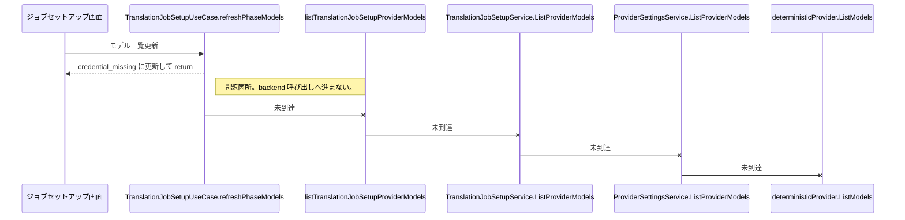

# 原因箇所シーケンス図

## 判定

- 原因箇所: `TranslationJobSetupUseCase.refreshPhaseModels`
- 問題: `credentialStatus === "missing"` の時点で backend 呼び出し前に終了する。
- 影響: fake provider の `ListModels` が実装されていても、一覧取得が走らない。
- 修正方針: missing credential でも gateway 呼び出しへ進める。

## シーケンス

## 根拠参照

- [translation-job-setup.usecase.ts](/Users/iorishibata/Repositories/AITranslationEngineJP/frontend/src/application/usecase/translation-job-setup/translation-job-setup.usecase.ts)
frontend/src/application/usecase/translation-job-setup/translation-job-setup.usecase.ts:805

- [deterministic_fake_provider.go](/Users/iorishibata/Repositories/AITranslationEngineJP/internal/infra/ai/deterministic_fake_provider.go)
internal/infra/ai/deterministic_fake_provider.go:27

- [translation_job_setup_service.go](/Users/iorishibata/Repositories/AITranslationEngineJP/internal/service/translation_job_setup_service.go)
internal/service/translation_job_setup_service.go:557

## 未決事項

- なし。
