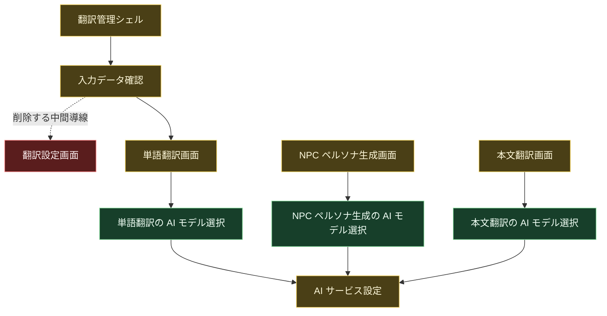

# 設計差分図: ジョブセットアップ画面廃止と AI モデル選択移動

- `diagram_type`: 設計差分図
- `status`: ready-for-human-review
- `source_plan`: `./plan.md`
- `detail_spec_diff`: `./detail-spec-diff.md`
- `screen_design_diff`: `./screen-design-diff.translation-management.md`, `./screen-design-diff.translation-input-review.md`, `./screen-design-diff.translation-job-setup.md`, `./screen-design-diff.term-translation-phase.md`, `./screen-design-diff.persona-generation-phase.md`, `./screen-design-diff.body-translation-phase.md`

## 概要

ジョブセットアップ画面を削除し、AI モデル選択を 3 つの翻訳段階画面へ追加する。
各翻訳段階画面は、常時表示する詳細要素を減らして、開始判断、実行状態、結果判断を中心に整理する。
入力データ確認は翻訳ジョブ作成後に単語翻訳へ進む。

## コンポーネント図

## 差分凡例

- 赤: 削除予定。
- 緑: 追加予定。
- 黄: 変更しない接続先。

## 各箱の説明

- 翻訳管理シェル: 翻訳管理内の段階表示と下位画面表示領域である。
- 入力データ確認: 登録済み入力データを選び、翻訳ジョブ作成後に単語翻訳へ進む。
- 翻訳設定画面: 削除するジョブセットアップ画面である。
- 単語翻訳の AI モデル選択: 単語翻訳開始前に使う AI 設定を選ぶ追加領域である。
- NPC ペルソナ生成の AI モデル選択: NPC ペルソナ生成開始前に使う AI 設定を選ぶ追加領域である。
- 本文翻訳の AI モデル選択: 本文翻訳開始前に使う AI 設定を選ぶ追加領域である。
- AI サービス設定: 接続先と認証状態を持つ既存の設定画面である。

## 追加予定

- 単語翻訳画面の AI モデル選択領域。
- NPC ペルソナ生成画面の AI モデル選択領域。
- 本文翻訳画面の AI モデル選択領域。
- 入力データ確認から単語翻訳へ進む導線。

## 削除予定

- 翻訳設定画面。
- 入力データ確認から翻訳設定画面へ進む導線。
- 翻訳管理の段階表示にある `翻訳設定`。
- 翻訳段階画面で常時表示していた詳細診断、snapshot、digest、内部 ID、重複した失敗情報。

## 変更しない接続先

- AI サービス設定は、接続先と認証状態の参照元として残す。
- 未完了ジョブ一覧から現在段階へ再開する導線は残す。

## 検証

- Mermaid 構文確認: 未実行。
