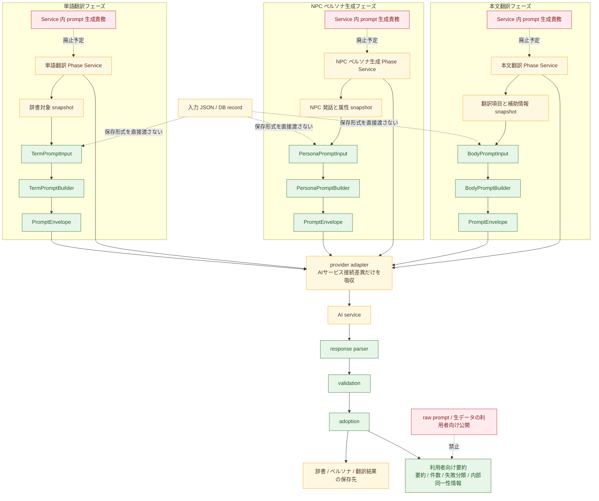

# phase-prompt-builder-boundary review diff

## 概要

- 図種別: `設計差分図`
- 図化目的: 各 Phase Service から prompt 生成責務を分離し、フェーズ別 `PromptInput`、フェーズ別 `PromptBuilder`、`provider adapter`、`response parser`、`validation`、`adoption` の責務境界を人間設計レビューで確認できるようにする。
- 根拠参照: [plan.md](./plan.md)、[detail-spec-diff.md](./detail-spec-diff.md)
- 範囲: 単語翻訳、NPC ペルソナ生成、本文翻訳の 3 フェーズに共通する境界差分と、変更しない接続先の最小範囲だけを扱う。

## コンポーネント差分図

## 差分凡例

- 赤: 廃止する責務、または禁止する公開経路を示す。
- 緑: 追加または明確化する責務境界を示す。
- 黄色: この差分図では変更しない接続先、運用単位、保存側の外枠を示す。

## 各箱の説明

- `単語翻訳 Phase Service`、`NPC ペルソナ生成 Phase Service`、`本文翻訳 Phase Service`: 利用者が開始、停止、再開、再試行を判断する既存の運用単位である。外側のフェーズ境界は維持する。
- `Service 内 prompt 生成責務`: 既存 Service に混在している prompt 生成責務である。Phase Service から切り離す対象として示す。
- `TermPromptInput`、`PersonaPromptInput`、`BodyPromptInput`: 各フェーズで prompt 生成に必要な値だけを持つ入力形である。入力 JSON や DB record の保存形式を直接表さない。
- `TermPromptBuilder`、`PersonaPromptBuilder`、`BodyPromptBuilder`: 各フェーズ専用の prompt 生成境界である。生成指示、対応識別子、利用者向け要約の元情報を作るが、AI 呼び出しや採用判断は持たない。
- `PromptEnvelope`: builder が作る AIサービス要求の受け渡し単位である。Phase Service と `provider adapter` の間で使う。
- `provider adapter`: AIサービス接続差異の吸収に閉じる。prompt 文言の組み立て、応答解釈、採用判断は持たない。
- `response parser`: AIサービス応答を候補へ変換し、対応識別子と件数を判断できる状態へ整える。
- `validation`: 応答件数、対応識別子、空値、本文翻訳では保持要素の同一性を検査する。
- `adoption`: 有効な候補だけを辞書、ペルソナ、翻訳結果へ反映する。
- `利用者向け要約`: raw prompt を出さず、要約、件数、失敗分類、内部同一性情報だけを扱う利用者向け情報である。
- `raw prompt / 生データの利用者向け公開`: 利用者向け情報へ出してはいけない範囲である。障害調査用の内部情報に留める。
- `入力 JSON / DB record`: prompt 都合の interface を直接生やさない元の保存形式である。

## 追加予定

- 各フェーズ専用の `PromptInput` を追加する。
- 各フェーズ専用の `PromptBuilder` を追加または明確化する。
- `response parser`、`validation`、`adoption` を分離した責務として扱う。
- 利用者向け情報を raw prompt ではなく要約中心へ寄せる。

## 削除予定

- 各 Phase Service が prompt 文言を直接組み立てる責務を残す構成をやめる。
- raw prompt や生データを利用者向け情報へそのまま出す経路を持たせない。
- 入力 JSON や DB record が prompt 用の保存形式兼 interface を兼ねる構成を採らない。

## 変更しない接続先

- 3 フェーズを利用者の運用単位として扱う外側のフェーズ境界は維持する。
- `provider adapter` から `AI service` を呼ぶ接続は維持する。
- 採用後に辞書、ペルソナ、翻訳結果の保存先へ反映する外側の保存先は維持する。

## 未決事項

- なし

## 実装範囲で確認する事項

- `PromptBuilder` の配置は、承認済みの責務境界を崩さない範囲で実装時に確定する。
- 既存の `PromptDigest` の残し方は、利用者向け情報へ出さない前提を維持したまま実装時に確認する。

## 検証

- Markdown 確認: Mermaid コードブロック、概要、差分凡例、各箱の説明、追加予定、削除予定、変更しない接続先、未決事項、実装範囲で確認する事項を記載した。
- Mermaid 記述確認: `flowchart TB`、箱、接続、色分け class を含み、赤、緑、黄色の差分凡例に対応していることを確認した。
