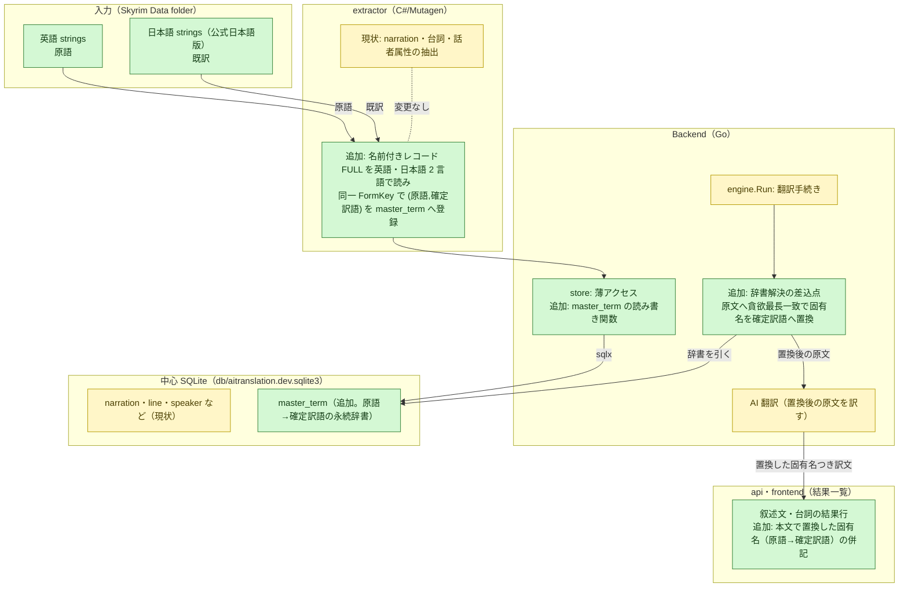

# 設計差分図: 2026-06-14-master-dictionary（趣旨訂正後）

図化目的: 固有名の訳を辞書化し、叙述文・台詞の本文へ機械置換して一貫させる機構を、どのコンポーネントへ何を足すかで固定する。
根拠参照: `plan.md`（趣旨訂正・適用＝本文機械置換）、`docs/concept-model.md`（固有名・言及 e3/e4/e5）、`docs/architecture.md`（§3 engine・store 責務、§6 SQLite 契約）、`docs/system_requirements.md`（§2 永続マスター辞書）。

## 概要

既訳流用主軸・本文機械置換の機構を次の流れで作る。

1. 辞書構築: extractor が名前付きレコード（武器・防具・NPC・地名など FULL を持つレコード）の FULL を、英語 strings（原語）と日本語 strings（公式既訳）の 2 言語で読み、同一 FormKey で突き合わせる。既訳のある語を `(原語, 確定訳語)` として永続マスター辞書 `master_term` へ登録する。
2. 辞書解決の差込点（engine 新設）: engine が `master_term` を読み込み、叙述文・台詞の原文（英語）に対し、辞書の原語を貪欲最長一致で照合する。照合は最長一致優先・語境界・大文字始まりを手掛かりにする。
3. 機械置換: 照合した固有名を確定訳語（日本語）へ置換してから AI 翻訳する。AI は周りの英語だけを訳し、差し込んだ日本語固有名はそのまま残る。訳文に必ず確定訳語が入る。
4. 一貫性: 辞書が永続するため、同一原語は複数レコード・複数 Mod で常に同一訳語へ置換される。

固有名そのものを訳の単位として出力する経路（`proper_noun`/`placement`）は本 task の対象外。本文への置換に絞る。

## コンポーネント差分図

## 各箱の説明

- 英語 strings / 日本語 strings（追加）: base master は localized で、固有名の表示名は言語別 strings にある。英語が原語、日本語（公式日本語版）が既訳。`dictionaries/Data/strings/` から読む。
- extractor 辞書構築（追加）: 名前付きレコードの FULL を 2 言語で読み、同一 FormKey で原語と既訳を突き合わせ、既訳のある語を `master_term` へ登録する。現状の narration・台詞・話者抽出は変更しない。
- store 追加: `master_term` の読み書き関数を足す。
- engine 辞書解決の差込点（追加・新設）: `master_term` を読み込み、叙述文・台詞の原文へ貪欲最長一致で固有名を照合し、確定訳語へ機械置換してから AI 翻訳へ渡す。置換は副作用のない純関数として書き、単体テストする。
- master_term（追加）: 原語 → 確定訳語の永続辞書。中心 SQLite に同居（案A）。
- 結果行の併記（追加）: 叙述文・台詞の結果行に、その本文で置換した固有名（原語 → 確定訳語）を併記する。口調指示の併記と同じ要領。

## 差分凡例

- 緑（追加）: 本 task で新設するコンポーネント・接続・テーブル。
- 黄（変更なし）: 既存のまま使う（narration・台詞の抽出と AI 翻訳の本体）。
- 赤（削除）: なし。

## 追加予定 / 削除予定 / 変更しない接続先

- 追加予定: 日本語 strings 読み（既訳）、`master_term` 構築、store の辞書アクセス、engine の辞書解決差込点（貪欲最長一致置換）、`master_term` テーブル、結果行への置換固有名の併記。
- 削除予定: なし（方向違いの独立パネルは巻き戻し済み）。
- 変更しない接続先: narration・台詞・話者属性の抽出経路、AI 翻訳本体、口調注入、provider、Wails 境界の進捗 push。

## 検証観点

- 貪欲最長一致の置換が純関数として正しいこと（最長一致優先・語境界・大文字始まり・同綴り異義の扱い）。単体テストで担保する。
- 同一原語が複数の叙述文・台詞・複数 Mod で常に同一訳語へ置換されること。
- 既訳の無い固有名は置換されず、本文翻訳の AI 訳は従来どおり動くこと。
