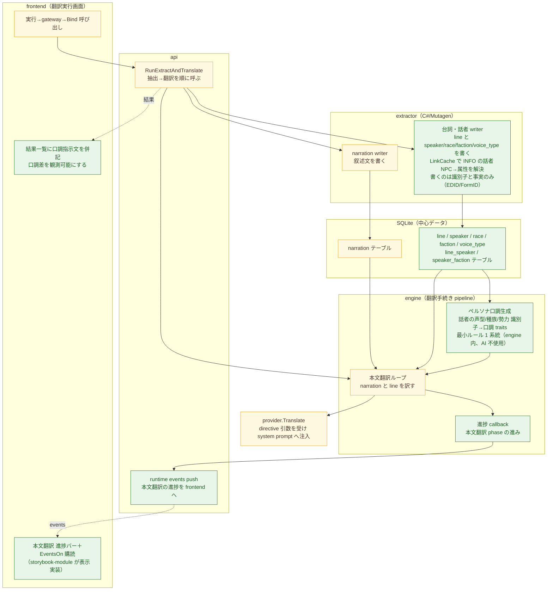
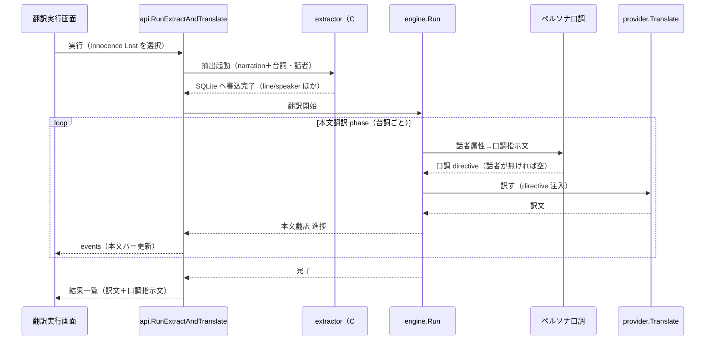

# persona-dictionary-pipeline 設計差分図

本 task は固有名（辞書）を扱わず、ペルソナ口調に絞る。固有名解決は `2026-06-14-master-dictionary`（T3）へ移す。

## 概要

- 図化目的: 重 task の人間設計レビューで、実 mod を画面から流して台詞のペルソナ口調つき本文翻訳・進捗表示を一気通貫で観測する縦切りの、追加・変更箇所と接続先を確認する。
- 根拠参照: `plan.md`（完了定義・scope）、`docs/architecture.md`（§3 engine 責務、§5 runtime events、§6 C#↔Go 境界、§8 現在の状態）、`docs/er.md`（line/speaker/race/faction/voice_type/line_speaker/speaker_faction）、`docs/system_requirements.md` §3（ペルソナ＝ルールベース、機械テンプレート、AI 不使用）、backup branch `cdd8798c`（engine 側 seam の再利用候補）。
- 範囲: extractor の台詞・話者書き込み、engine のペルソナ口調・本文翻訳・進捗、provider の directive 注入、api の進捗 event、frontend の進捗バーと口調併記に限る。変更しない既存経路（narration 抽出・翻訳、画面の基本骨格）は接続先としてのみ示す。固有名（辞書）は範囲外。

## コンポーネント図

緑の箱に入る既存箱への追加振る舞い:
- `本文翻訳ループ`（黄）に、ペルソナ口調を畳んだ directive 注入と line 翻訳を足す。
- `provider.Translate`（黄）に、directive 引数と system prompt 後段への注入を足す。
- `RunExtractAndTranslate`（黄）に、台詞抽出の起動と進捗 event 配線を足す。

## 差分凡例

- 赤: 削除する要素または経路を示す。本 task では削除なし（該当なし）。
- 緑: 追加する要素または経路を示す。
- 黄色: 変更しない要素または経路を示す。本 task では既存箱への接続先として示す。

## 各箱の説明

追加（緑）:
- 台詞・話者 writer: extractor が in-memory 抽出済みの台詞（INFO:NAM1）を `line` へ書き、INFO の話者条件（ANAM・CTDA）から話者 NPC を LinkCache で解決し、`speaker` と `race`/`faction`/`voice_type` および `line_speaker`/`speaker_faction` を書く。書く値は識別子と事実（EDID/FormID）に限り、口調などの解釈は書かない。
- line ほか追加テーブル: `docs/er.md` の論理 ER に対応する物理テーブル。backup `cdd8798c` の `db/migrations/0002` を再利用する。
- ペルソナ口調生成: 話者の声型/種族/勢力の識別子から口調 traits を引く最小ルール 1 系統を engine 内に置き、`buildPersonaDirective`（backup `persona.go`）で口調指示文へ畳む。解釈（識別子→口調）は engine の責務とする。
- 進捗 callback: engine が本文翻訳 phase の進み（処理済み件数・総件数）を呼び出し元へ渡す。
- 進捗 event push: api が進捗を Wails runtime events で frontend へ push する（§5 の event 用途）。
- 進捗バー＋購読: frontend が events を購読し、本文翻訳の進捗バーを描く。表示の実装は storybook-module。
- 口調指示文の併記: 結果一覧の各行に、その台詞へ注入した口調指示文を併記し、話者ごとの口調差を画面で観測可能にする。

変更しない接続先（黄）:
- narration writer・narration テーブル・既存の本文翻訳の中核・既存 provider・`RunExtractAndTranslate` の骨格・画面の実行骨格は責務を維持し、上記追加を載せる土台とする。

## シーケンス図（実 mod 実行の流れ）

## 確認観点（人間レビューで確認する制約・注意）

- 責務境界: 事実の抽出は extractor（C#）、口調などの解釈は engine（Go）に置く。extractor は識別子と事実だけを書き、`nature`/口調は engine の最小ルールで与える。この分担で良いか。
- ペルソナの最小ルール: T2 のルールは engine 内の固定 1 系統（声型/種族/勢力 識別子→口調 traits）。ルールの永続化と編集 UI は T4（対象外）。最小ルールで Innocence Lost の話者に観測可能な口調差が出るか。
- 話者解決の不確実性: Innocence Lost の話者は base-game NPC で esp 内に NPC レコードが無い（speakers 0）。INFO の ANAM・CTDA から話者 NPC を LinkCache で解決できる台詞がどれだけあるかは未確認。解決できない台詞は line だけ書き口調無しで訳す。観測可能な口調差を出せる話者数が足りるかを、実装初期に実 extractor で確認する（足りなければ対象 mod の見直し）。
- 固有名（辞書）の移送: 本 task は固有名解決を扱わない。`proper_noun` 抽出、`line_mention`（e5）、name 関連（e8/e13/e14）、辞書解決の差込点は `2026-06-14-master-dictionary`（T3）へ送る。
- 進捗の phase 設計: 本文翻訳 phase 1 本に進捗バーを 1 本置く。抽出中は phase 表示で示す。台詞 0 件のときのバー表示（空・即完了）も決める。
- architecture.md 反映: 構造（コンポーネント・依存方向・port）は変えない。反映は §8「現在の状態」の更新（extractor が台詞・話者も書く、engine がペルソナ・進捗を持つ、進捗に runtime events を使う）に限る見込み。最終判断は finalization-module。

## 検証

- Mermaid 記述確認: コンポーネント図（flowchart TB）と シーケンス図（sequenceDiagram）の 2 図。箱・参加者・接続・差分 class（added/unchanged）・凡例（赤緑黄）が揃う。削除（赤）は該当なしと明記。
- 根拠整合確認: 追加テーブルは `docs/er.md` の論理 ER と 1 対 1。engine 側 seam（`buildPersonaDirective`）は backup `cdd8798c` と一致。責務分担は `docs/architecture.md` §3/§6 と一致。固有名を外したことが scope（含まない）と一致。
