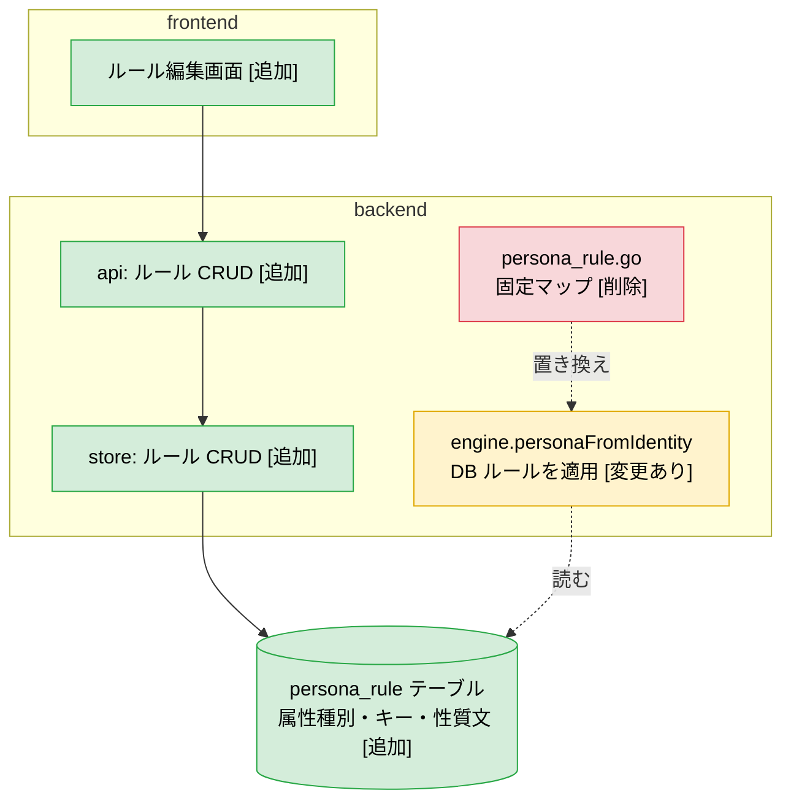
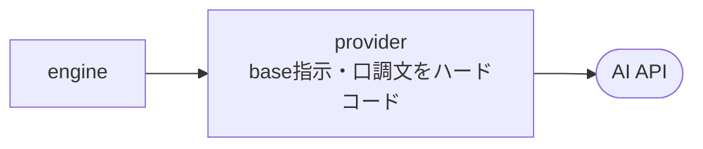
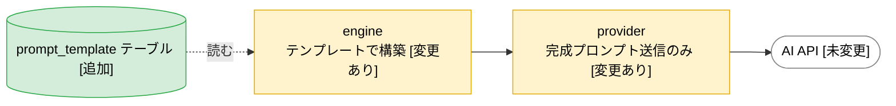
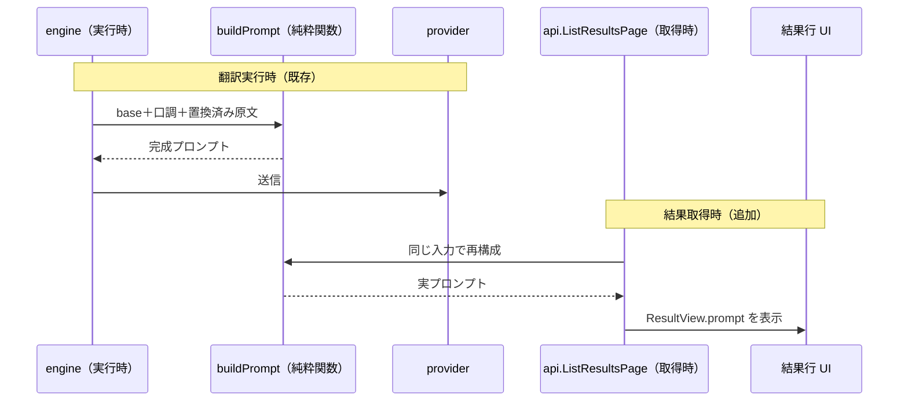
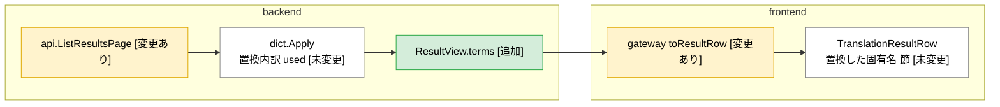
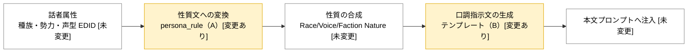
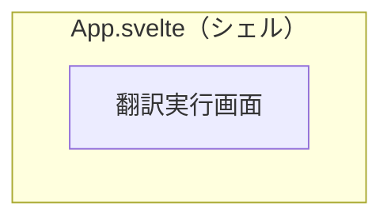
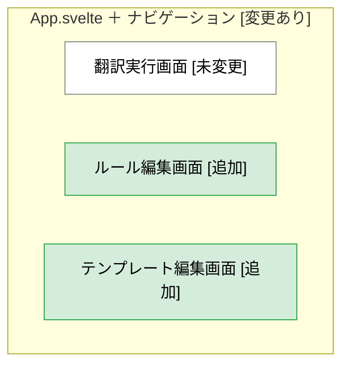

# 設計レビュー材料: prompt-persona-customization（T4）

判断材料であり仕様正本ではない。正本は `docs/architecture.md` ほか。
根拠: `docs/system_requirements.md` §3、`docs/concept-model.md`、`docs/architecture.md`、本 plan の `完了定義`、Explore による現状調査（2026-06-20）。

## 主張（この材料で判断してほしいこと）

口調ルールとプロンプトの「作り方」を、Go コードのハードコードから、ユーザーが翻訳前に編集できるデータ駆動へ移す。
あわせて、実行時に捨てている機械置換の内訳と実プロンプトを、結果取得時に決定的に再構成して画面へ出す。
新しい層や新しい外部依存は足さず、`architecture.md` の図に既にある未実装スロット（ルール編集・設定 CRUD・ルール/設定テーブル）を実体化する。

判断してほしいのは、後段「確認してほしい点」の 5 件である。残りは Claude 側で確定して進める。

## 背景と課題

現状は、口調の決まり方とプロンプトの文面がすべて Go コードに固定されている。

- 種族・勢力・声型から口調指示文（翻訳ディレクティブ）を作るルールは `internal/engine/persona_rule.go` にハードコードされ、種族 10 件・勢力 4 件・声型の文字列判定だけを持つ。`persona_rule.go:11` に「ルールの永続化と編集 UI は後続 task（T4）で扱う」と明記がある。本 task が T4 にあたる。
- 本文翻訳の base 指示文は `internal/provider/openai_compatible.go:152` の定数、口調指示文の言い回しは `internal/engine/persona.go` のリテラルで、どちらも編集できない。
- 機械置換の内訳（どの原語をどの確定訳語へ置換したか）は `internal/engine/engine.go:95,108` で `dict.Apply` の第 2 戻り値を捨てている。画面側の表示器（`TranslationResultRow.svelte` の「置換した固有名」節）は実装済みだが、backend が供給しないため常に空になる。
- 実際に AI へ投げた完全なプロンプトを画面で確認する手段がない。口調が訳文に効かない原因（口調指示が弱い／届いていない）を切り分けられない。

課題は 2 つである。第 1 に、口調の調整がコード改修を要し、ユーザーが翻訳前に試せない。第 2 に、実行の中身（置換内訳・実プロンプト）が観測できず、品質改善の根拠が取れない。

## 図の凡例（全図共通）

差分は色とラベルの両方で示す。色は補助、ラベルが主とする。

- `[未変更]` 変えず再利用する。色は白。
- `[変更あり]` 既存を直す。色は黄。
- `[追加]` 新規に足す。色は緑。
- `[削除]` 廃止する。色は赤。

シーケンス図は色を付けにくいため、ラベルと Note を主な区別手段にする。

## 採用方針

各方針は、まず「最も伝えたい関係」を 1 つ決め、それに合う図種別を選ぶ。

### A. 口調ルールのデータ駆動化（属性 → 翻訳指示）

主張: `persona_rule.go` のハードコードを、中心 DB の専用テーブル `persona_rule` へ移す。ルールは「属性種別（種族／勢力／声型）＋ キー（EditorID もしくは声型パターン）＋ nature（性質文）」を持つ。`engine` はこのテーブルを読んで話者の性質を組む。

最も伝えたい関係は「層をまたぐ編集経路と依存」なので、層を `subgraph` で囲んだ構造差分図にする。

- `persona_rule.go` の固定マップ [削除]: 種族・勢力・声型 → 性質文の固定対応をやめる。
- 編集画面・CRUD・`persona_rule` テーブル [追加]: 属性種別・キー・性質文を編集し永続化する。抽出データと分離し、起動時消去の対象にしない。
- `engine.personaFromIdentity` [変更あり]: ハードコードではなく DB ルールを読んで性質を組む。
- 代替案: 既存の `race`／`faction`／`voice_type` テーブルの `nature` カラムを使う。
- 却下理由: これらは抽出データ（plugin 由来）で、抽出のたびに行が入れ替わる。ユーザー編集ルールを載せると再抽出で消える。

### B. プロンプトテンプレートの編集（所在を provider から engine へ移す）

主張: base 翻訳指示文と口調指示テンプレートを永続化して編集可能にする。あわせて、プロンプト構築の責務を `provider`（AI クライアント＝transport）から `engine`（翻訳手続き）へ移し、`provider` は完成プロンプトを送るだけにする。

最も伝えたい関係は「責務の所在の移動」なので、同じ図種別の Before / After 2 枚で示す。

Before（現状）:

After（変更後）:

- 構造変更: `architecture.md` §3 で `provider` は transport、プロンプト構築は翻訳手続きの責務。所在を正す変更である。
- `prompt_template` テーブル [追加]: base 指示文と口調テンプレートを保持する。起動時消去の対象にしない。

### C. 実プロンプト参照（実行時と取得時で同じ構築関数を使う）

主張: 実際に投げた完全プロンプト（base 指示 ＋ 口調指示 ＋ 置換済み原文）を、結果取得時に再構成して結果行に出す。実行時に保存せず、構築の純粋関数を実行時と取得時の両方で呼ぶ。

最も伝えたい関係は「時間順のやり取り」なので、`sequenceDiagram` にする。色は付けず、Note で追加経路を示す。

- 同じ `buildPrompt` を 2 経路で使うため、表示する実プロンプトが実行時と必ず一致する。

### D. 機械置換内訳（terms）の供給

主張: 結果取得時に各行の原文へ `dict.Apply` を当て、置換内訳を再構成して `ResultView.terms` へ載せる。`dict.Apply` は決定的なので、実行時保存と等価になる。表示器は実装済みのため触らない。

最も伝えたい関係は「層をまたぐデータの流れ」なので、層を `subgraph` で囲んだ流れ図にする。

- `dict.Apply`・表示器 [未変更]: 置換内訳を返す純粋ロジックと「置換した固有名」節をそのまま使う。
- 代替案: 実行時に内訳を DB へ保存する。
- 却下理由: 保存テーブルの追加と起動時消去の整合が要る。取得時再構成は保存不要で、`dict.Apply` の純粋ロジック 1 つに検証を集約できる。
- 注意: マスター辞書を実行後に書き換えると再構成内訳が実行時とずれる可能性があるが、辞書は安定資源のため稀と判断する。

### E. 口調の精緻化（属性 → 性質 → 口調指示 → 注入の合成チェーン）

主張: A（ルールのデータ化）と B（テンプレート編集）で、合成チェーンの 2 箇所をユーザーが直せるようにする。口調が実プロンプトへ合成されることを C で確認する。

最も伝えたい関係は「値の変換順序」なので、変換チェーンの流れ図にする。本 task で編集可能になる 2 箇所を `[変更あり]` で示す。

- `[変更あり]` の 2 箇所: 属性から性質文への変換規則（A）と、性質から口調指示文を作るテンプレート（B）をユーザー編集可能にする。
- 実 LLM での訳文の自然さは実データ目視の補助観測にとどめる（plan の `含まない` に従う）。

### F. 画面構成（storybook-module へ渡す）

主張: 現状の単一画面・ルーター無しに、軽量なナビゲーションを入れ、ルール編集とテンプレート編集の画面を足す。画面表示の設計は storybook-module が Storybook で扱う。

最も伝えたい関係は「シェルが画面を内包する所属の変化」なので、`subgraph` 内包で所属を示し、Before / After 2 枚で並べる。所属を表す矢印は引かない。

Before（現状）:

After（変更後）:

- `App.svelte` [変更あり]: 単一画面の直 mount から、画面を切り替えるナビゲーションを持つシェルへ変える。
- 翻訳実行画面 [未変更]・ルール編集／テンプレート編集画面 [追加]: 既存画面は残し、編集画面 2 つを足す。
- `shell-state.ts` に画面遷移の型契約が既にあるため、これを実体化する。ルーター配線は implementation-module で扱う。

## 影響と注意

- `architecture.md` への反映: 層・依存・Wails 境界の構成自体は変えない。§2 図に既にある「ルール編集・設定」「ルール／設定テーブル」を実体化する。プロンプト構築の所在を `provider` から `engine` へ移す点だけ、§3 の責務記述に 1 行の明確化が要る見込み。完了時に §8「現在の状態」を更新する。大きな改訂は要らない。
- 起動時消去の意向との関係: 抽出・翻訳結果を起動ごとに空にしたい意向がある。ルールとテンプレートは「設定」であり、消すと編集の意味がない。よって抽出データとは別テーブルに置き、消去対象から外す。

## テストの要点（方針のみ。詳細は implementation-scope.md に固定済み）

- `dict.Apply`（純粋ルール、置換内訳）: 単体テストで境界条件まで覆う。terms 供給はこの再利用で足りる。
- ルール適用・口調指示・プロンプト構築（`engine` の組み立てロジック）: DB と LLM を切り離した純粋部分を単体テストで覆う。プロンプト構築は LLM 出力品質に直結するため対象にする。
- store の CRUD と Wails 境界、画面ロジック、フォーム検証は単体テストで書かず、実画面操作（実データ）で確かめる。

## 確認してほしい点

1. ルールとテンプレートの保存先を、中心 DB 内の専用テーブル（抽出データと分離、起動時消去の対象外）にする方針でよいか。起動ごとに中心 DB を空にしたい意向と、この分離整理が両立するという理解でよいか。
2. プロンプト構築の責務を `provider` から `engine` へ移す構造変更を許すか。
3. 置換内訳と実プロンプトを「取得時再構成（保存しない）」で出す方式でよいか。これに伴い、plan の `完了定義` #5 の観測点を「engine が used を保持」から「取得時に `dict.Apply` で再構成する純粋ロジックの単体テスト」へ更新する。
4. 実装の進め方を縦切り 4 段で進めてよいか。順序案: ① 置換内訳の供給 → ② 実プロンプト参照 → ③ ルール編集・永続化・反映 → ④ テンプレート編集・口調精緻化。各段は単体で画面から観測できる成果にする。
5. 実プロンプト参照は「実行後に結果行で確認」で満たす方針でよいか（翻訳前のプレビュー画面は本 task に含めない）。

## レビュー結果（2026-06-20、人間設計レビュー承認済み）

確認してほしい点はすべて承認された。実装範囲とテスト設計は `implementation-scope.md` に固定済み。

- 1（保存先）: 専用テーブルに分離する案で承認。起動時消去の対象外にする。
- 2（プロンプト構築の所在）: `provider` から `engine` へ移す案で承認。
- 3（内訳・実プロンプトの出し方）: 取得時再構成で承認。`完了定義` #5 の観測点を単体テスト方式へ更新済み。
- 4（進め方）: 縦切り 4 段（① 置換内訳 → ② 実プロンプト参照 → ③ ルール編集 → ④ テンプレート編集）でこの順に進める。
- 5（実プロンプト参照の範囲）: 実行後の結果行で確認する案で承認。翻訳前プレビューは含めない。
