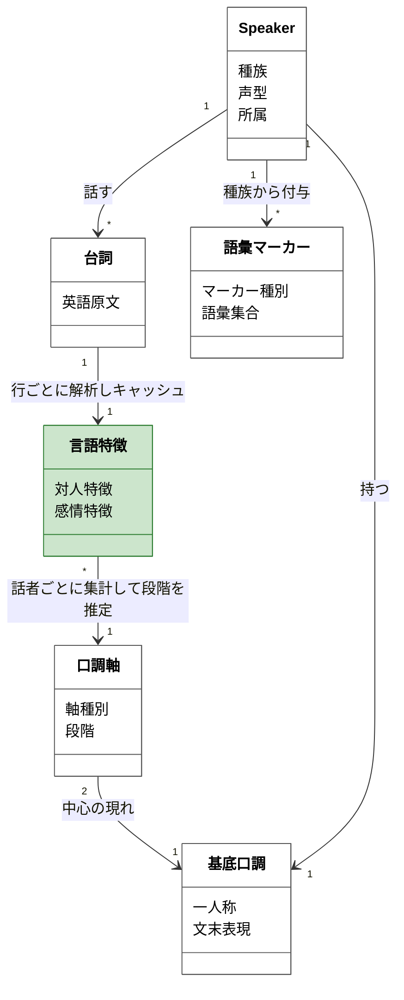
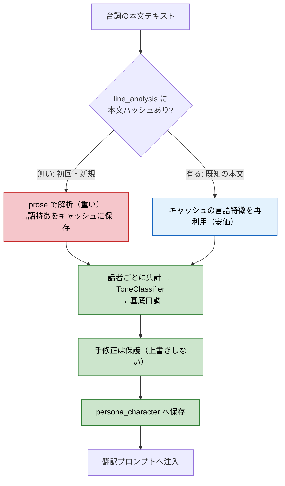

# 口調・ペルソナ本実装の設計（人間レビュー材料 v2、2026-06-22）

本書は design-module の設計成果物である。PoC で実証した対話由来の口調分類を、既存の翻訳パイプラインへ嵌める構造と、純粋 IO クラスの境界、永続化、統合を固める。v1 への人間レビュー反映済み。根拠は `plan.md`（完了定義・R1〜R11）、`persona-signal-map.md`、`poc-tone-report.md`、既存コード（`internal/engine/persona*.go`、`engine.go`、`internal/model/line.go`）。

## 主張（設計の核）

ペルソナは、Speaker に生える口調の箱（基底口調・対人・感情・語彙マーカー）として持つ。値は対話由来の機械分類で生成し、台詞集合のハッシュで内容アドレス化したキャッシュに置く。台詞が変わればハッシュが変わり再生成する。既存のメタデータ専用ペルソナ機構（声質・種族・所属の気質をハードコード表で引く形）は維持価値が無いため作り直す。LLM は使わない（含意の尊大は既知の許容誤差）。

## Speaker に生える箱（モデル構造）

概念モデル（`tone-concept-model.md`）の口調軸 2 軸と基底口調へ忠実に写す。本設計は、概念モデルが入力経路として除いた「台詞 → 言語特徴 → 2 軸の値」を足し、Speaker に基底口調と語彙マーカーを生やす。対人態度軸と感情表出軸は独立した別の箱にし、1 つの属性へ混ぜない。既存の `SpeakerPersona`（声質・種族・所属の気質文）はこの箱へ置き換える。

この図が「明確」である基準を先に置く。第 1 に、すべての箱が実在の概念で、関係の多重度で表せるもの（集合など）を箱にしない。第 2 に、すべての属性が 1 概念で、概念モデルの箱は同名・同属性を保ち、属性を減らす時は理由を書く。第 3 に、追加と流用を色で分け、ステレオタイプで概念を分類しない。第 4 に、概念モデルからの差分が、足した推定の入力経路だけだと一目で分かる。

色の凡例（色だけに頼らずラベルでも示す）: 緑＝本設計の追加（言語特徴と、台詞から段階を推定する経路）。白＝既存（Speaker・台詞）または概念モデルからの流用（口調軸・基底口調・語彙マーカー）。

概念モデルとの差分:
- 追加した箱は言語特徴だけである。概念モデルが入力経路として除いた「台詞から口調軸の段階を推定する」部分にあたる。
- 言語特徴は台詞 1 行ごとに持つ（台詞 1:1 言語特徴）。行の特徴は本文テキストだけで決まるため、本文をキーにキャッシュし、品詞解析（prose）を本文ごとに 1 度だけ実行する。これが最も重い処理で、キャッシュの本命である。
- 口調軸の段階は、話者の行の言語特徴を集計して推定する（言語特徴 \*:1 口調軸）。集計はキャッシュ済み特徴の合算で安価。
- 台詞は既存の Line を関係で参照する。台詞集合を箱にせず、Speaker から台詞への多重度 `*` で集合を表す。
- 口調軸・基底口調・語彙マーカーは概念モデルの箱を同名・同属性で流用し、軸種別を減らさず保つ。話者ごとに口調軸は 2 インスタンス（軸種別が対人態度と感情表出）あり、各々が段階を持つ。基底口調はこの 2 つで決まる。

属性を箱から外したもの（理由つき）:
- スコア・印・決定経路: 口調の概念でなく推定の品質指標。純粋 IO クラスの出力に持つ（下の境界節）。
- 説明行・few-shot: 概念でなく基底口調の実現。翻訳統合で扱う。

各箱と属性の意味:
- Speaker（既存）: 話者。「種族」「声型」「所属」は extractor が master 連鎖で解決した同定情報（EditorID）。
- 台詞（既存 Line）: 話者が話す英語原文。属性の正本は `internal/model/line.go`。本図は分析入力の「英語原文」だけ示す。
- 言語特徴（追加）: 話者の台詞群から機械で数える特徴。「対人特徴」は命令文・罵倒・丁寧定型の量、「感情特徴」は感嘆・引き伸ばし・NRC 感情語の量。
- 口調軸（概念）: 「軸種別」は対人態度か感情表出のどちらか、「段階」はその軸上のこの話者の値（対人態度なら尊大・中立・丁寧、感情表出なら抑制・中・激情）。言語特徴から段階を推定し、台詞が足りなければ voice 気質 prior で段階を決める。
- 基底口調（概念）: 2 つの口調軸の中心の段階が決める口調の核。「一人称」と「文末表現」を決める。
- 語彙マーカー（概念）: 「マーカー種別」は種族訛りなどの型、「語彙集合」は置換する語（Khajiit 三人称など）。種族 EDID で付与する。古風さ（thee/thou）は skyrim に一貫使用のキャラがおらず雑音のため入れない。

## 永続化（重いのは行ごとの prose。そこをキャッシュする）

最も重い処理は行ごとの品詞解析（prose）である。行の言語特徴は本文テキストだけで決まるため、本文をキーにキャッシュし、ユニークな本文ごとに 1 度だけ prose を実行する。生成はキャッシュ済み特徴の集計だけで安価になる。

ペルソナ用の追加テーブルは 3 つ。抽出データ本体（line・speaker・voice_type）はキャッシュで、再構築・初期化してよい。

- 追加テーブル 1: line_analysis（重い処理のキャッシュ。本命）。本文テキストのハッシュをキーに、行の言語特徴（命令文判定 is_imperative ＋ 各カウント）を持つ。本文が同じなら再利用し、prose を回さない。共有・プール台詞（同一英文を多数が話す）も 1 回で済む。再抽出で line 行が作り直されても本文ハッシュ一致で残る。
- 追加テーブル 2: persona_character（生成結果＋手修正）。解決した話者ごとに、生成した基底口調（対人段階・感情段階）と、UI 表示用の信頼度（印・決定経路）、手修正フラグを持つ。生成は line_analysis を引いて集計するだけで安価のため、ハッシュで再生成可否を判定する必要はない。手修正は保護し、再生成で上書きしない。
- 追加テーブル 3: 属性割当（手動）。種族・汎用声型グループへ人手で割り当てた基底口調。台詞の少ない話者（印不足）の基底口調はここから引く（signal map の voice prior 経路の保存先）。
- 解決順: 翻訳時、話者に persona_character があればそれを使い、無ければ属性割当（種族・声型グループ）へ畳む。signal map の「印 10 以上＝本文／未満＝voice prior」に対応する。
- 生成は一括（バッチ）。オンデマンドのボタン起動にしない。

## 純粋 IO クラスの境界（R10）

不変ルールを単一の純粋 IO クラスへ閉じる。

- 入力: キャラの台詞群の言語特徴（line_analysis から引いたキャッシュ済み特徴の列）、voice 気質ラベル（メタ）。
- 出力: 基底口調（対人段階・感情段階）、対人スコア、感情スコア、決定経路、印。
- 内側に閉じる不変ルール: 特徴量からの 2 軸採点、印の集計、帯分けのしきい値、voice prior 融合。100% カバレッジで固定する。
- 外へ出す副作用: DB 読み書き、品詞解析（prose）、ハッシュ計算は純粋クラスの外。prose を含む行ごとの特徴抽出は line_analysis のキャッシュ段に置き、純粋クラスへはキャッシュ済み特徴を渡す。これで純粋クラスは prose に依存せず 100% テストできる。

## few-shot とマーカーの矛盾の検討（人間指摘への回答）

few-shot は基底口調の性質ごとに作る（R3）。語彙マーカー（種族訛り）と性質（基底口調の few-shot）は、一人称と語尾で衝突しうる。実際に矛盾が出る箇所と、避ける合成順を示す。

- 衝突 1（一人称）: 基底口調「温厚」の few-shot が一人称「私」を焼き込む一方、Khajiit 訛りマーカーは三人称自称（「この者は…」）を課す。同じ一人称スロットを取り合う。
- 衝突 2（語尾粒子）: 基底口調が語尾「〜です」を固定する一方、Khajiit 訛りが語尾粒子を重ねると「〜ですにゃ」のような二重化が起きうる。

避け方（合成順を定義する）:
- 基底口調 few-shot は、態度（敬度・感情の出方）と基本の語尾を固定する核にし、一人称スロットは可変として持つ。
- 語彙マーカー（種族訛り）は直交レイヤー（R7）として、一人称スロットを上書きし、語尾粒子を重ねる。precedence はマーカーが基底口調の一人称・粒子へ優先する。
- few-shot 例は、マーカーが乗りうるキャラでも壊れないよう、一人称を 1 箇所に閉じ、態度と語尾の核を一人称非依存で示す。

結論: 矛盾は一人称と語尾粒子で実在する。few-shot をマーカー対応に設計（一人称スロットを可変、マーカー優先の合成順）すれば回避できる。few-shot 例文の具体は実装で詰める。

## 既存ペルソナ機構の置き換え

`internal/engine/persona_rule.go`（`voiceNature`・`raceNatureByEDID`・`factionNatureByEDID`）と `persona.go` の性質文組み立ては、メタデータ専用で維持価値が無い。新しい箱（基底口調＋マーカー）と生成・キャッシュへ作り直す。`buildPersonaDirective` の差し込み口（`{traits}`）と `ComposePrompt` は再利用する。voice 気質の対応（横柄・臆病・温厚老 等）は ToneClassifier の voice prior 辞書へ移す。

## アーキテクチャ反映（finalization で §8 へ）

- 追加: ToneClassifier（engine 内の純粋 IO クラス）、ペルソナ用の追加テーブル 2 つ（キャラペルソナ・属性割当、store＋db migration）、一括生成の手続き（engine）、ペルソナ取得・割当・生成起動の api binding、画面（storybook-module）。
- 変更: ペルソナ生成をメタデータ専用から対話由来＋マーカーへ作り直し。
- 不変: 層・port（provider が唯一）・Wails 境界の方向・Bootstrap の DI。

## 確認してほしい点

- Speaker に箱が生える構造（基底口調・語彙マーカー。性質文は基底口調セルの固有属性）と、抽出キャッシュ＋追加テーブル 2 つ（キャラペルソナ＝セリフ由来・ハッシュ、属性割当＝手動）の永続化が、意図どおりか。
- few-shot とマーカーの合成順（マーカー優先で一人称・粒子を上書き）でよいか。
- この設計を承認できるか。承認後に `実装範囲` と `テスト設計` を確定する。
