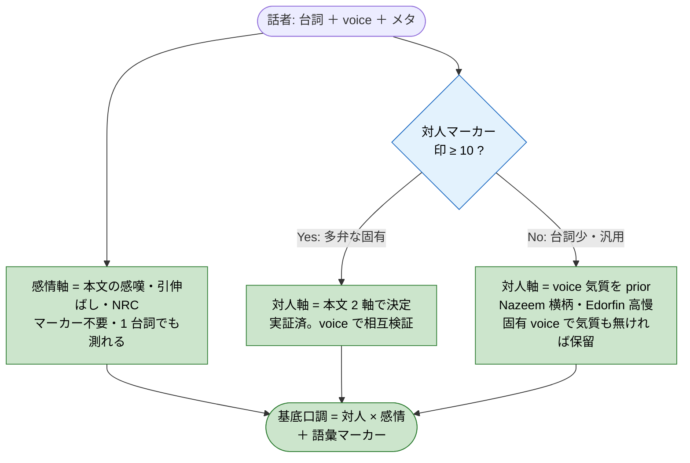

# 人物像の信号マップ（設計の土台、2026-06-21）

本書は、口調・人物像をどの信号から決めるかの戦略を、設計前に固めるための判断材料である。仕様正本ではない。根拠は `poc-tone-report.md`、`plan.md`、本セッションの voice＋感情の融合検証である。

## 主張（結論）

人物像の信号源は 3 つあり、**対人マーカー（印）の有無で主従が入れ替わる縮退合成**にすると、多弁な固有キャラから 1 台詞の固有キャラ・汎用テンプレまで、連続して人物像を出せる。鍵は、対人軸は本文マーカーを要するが、感情軸と voice 気質はマーカー無しでも取れることである。全経路が決定的な機械処理で、LLM は使わない。表層で取れない含意の尊大（丁寧な言葉で横柄）は、特別対応せず既知の許容誤差として受け入れる。

## 縮退の判定フロー

話者ごとに、使える信号で対人軸の決め方を切り替える。感情軸はどの経路でも本文から並行して測る。

凡例（色だけに頼らず、形とラベルでも区別する）:
- 菱形・青（判定）: 分岐の条件。印の数で経路が変わる。
- 角丸四角・緑（機械処理）: 決定的な機械処理。語を数えるかメタを引くだけで、再現できる。
- 角丸端（入出力）: 入力の話者と、出力の基底口調。全経路が機械処理で、LLM は無い。

各ノードの意味:
- 感情軸（E）: 感嘆符・引き伸ばし・NRC 感情語の密度。語彙の丁寧さに依らないので、台詞が 1 件でも、対人マーカーが無くても測れる。
- 印の判定（Q）: 対人マーカー（命令文・罵倒・丁寧定型）を含む台詞数。10 以上なら本文で対人を測れる。
- 本文 2 軸（D1）: 多弁な固有キャラの経路。対人を本文で決め、voice 気質を相互検証に使う。
- voice 気質 prior（D2）: 台詞が少ない、または汎用 voice の経路。対人を voice の気質ラベルで代替する。固有 voice（名前そのもの）で気質も無い場合だけ保留する。

## 3 つの信号源と提供物

| 信号源 | 与える軸 | マーカー無しで取れるか | 入手状況 |
| --- | --- | --- | --- |
| 本文 2 軸 | 対人 ＋ 感情 | 対人は印が要る／感情は常時可 | 実装済（`cmd/poc-tone`） |
| voice 気質 | 対人の prior（横柄・臆病・温厚 等） | 取れる（メタ） | DB 済。99 種の含意辞書化が未了 |
| template フラグ | 固有 / テンプレの戦略選択 | 取れる（メタ） | 未抽出。extractor 拡張が要る |
| faction 所属 | 役割・ギルド（口調を変える要素） | 取れる（メタ） | DB 済（843 話者）。未活用 |

## 実証（融合が筋の通る根拠）

マーカーの少ない固有キャラで、voice 気質と感情が人物像になることを確かめた。

| 話者 | voice | 台詞 | 本文の対人 | 融合での判定 |
| --- | --- | --- | --- | --- |
| Nazeem | Condescending | 5 | 印 2 で不可 | 横柄（voice で確定。わずかな本文 −1.00 と一致） |
| Grelod | OldGrumpy | 14 | 印 1 で無意味 | 気難な老女 ＋ 激情（感嘆密度 1.29） |
| Edorfin | ElfHaughty | 1 | 無し | 高慢（唯一の信号が voice） |
| Farkas | Brute | 135 | 印 10 で丁寧 +0.20 | 本文が voice の粗暴を上書き（精緻化の例） |

Nazeem は voice の横柄と、わずかな本文の見下しが一致する。voice の prior が恣意でない証拠である。Farkas は逆に、voice は粗暴だが本文は温厚で、本文が prior を精緻化する。両者は prior と精緻化の関係を示す。

## 残る前提と注意

- 個別と汎用の分離は台詞の所有で足りる: 個として扱う NPC は、台詞が `line_speaker` で本人へ紐づく（台詞を所有する）。汎用ボイスでも本人の台詞があれば、その台詞を使えばよい。真の汎用 NPC（山賊の bark 等）は紐づかないプール台詞（line の 38%）に散り、個別 speaker に現れにくい。よって「台詞を所有するか」が個別と汎用を分け、template 継承の抽出は本 task に要らない（template の当初の意図＝汎用ボイス個別と真の汎用の分離は、台詞所有で達せられる）。真の汎用 NPC は型として扱う対象で、本図の per-speaker 経路の外にある。
- extractor 拡張は本 task の対象外: template・occupation・AI データの抽出は加えない。穴は固有ボイス×台詞少の端役 106 人（12%）に限られ、翻訳量も小さい。完全網羅（未聴取 NPC もメタだけで分類）が後で要るなら、別 task として切り出す。
- 含意の尊大は対応しない: 表層の機械手法は採用条件（過学習しない・他 NPC を尊大にしない）を満たさず、特別対応の効果も小さい。Maven 型は中立へ分類される既知の許容誤差として受け入れ、LLM 分岐も設けない。

## 確認してほしい点

- 縮退の主従（印 10 で本文優先、未満で voice 優先）の閾値が妥当か。
- この信号マップを設計（純粋 IO クラス、全経路が機械処理）の土台として固定してよいか。

（extractor 拡張の要否は決着済み。本 task に含めず、台詞所有で個別と汎用を分ける。）
