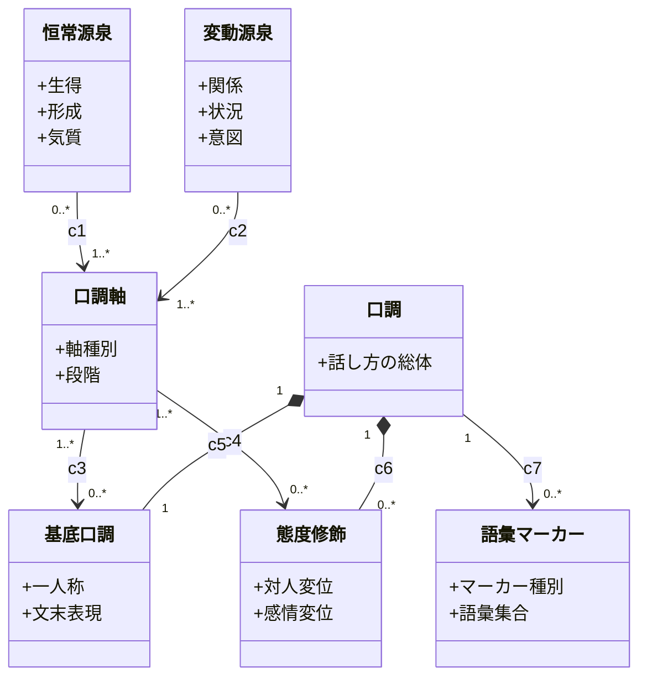

# 口調概念モデル

本書は、口調を「どこから生まれ、なぜ違うのか」で分解し、分類の軸を固定する。目的は、口調の発生と差異の構造と、分類に使う軸を、箱・属性・関連で確定することである。

本書は口調そのものの概念だけを扱う。台詞・言語特徴・観測・DB は、口調を後から推定する入力経路であって口調の概念ではないため、本書に含めない。固定済みの方針（機械分類、2 レイヤー、few-shot 固定など）は `plan.md` に置く。

## 採用原則

- 源泉（なぜ違うか）と、現れの軸（どう違うか）を別の箱にする。分類は源泉ではなく現れの軸で行う。
- 源泉を恒常（その人に固定）と変動（場面で変わる）に分ける。恒常は基底口調へ、変動は態度修飾へ現れる。
- 口調軸は対人態度と感情表出の 2 軸に確定する。自己呈示と様式は対人態度軸へ畳む。
- 態度修飾は 2 軸の上の台詞ごとの変位、語彙マーカーは 2 軸の外のキャラ固定の語彙型にする。両者を混ぜない。
- 古風さ・種族訛り・役割語型は語彙マーカーにし、基底口調へ重ねる。

## 口調軸の確定（2026-06-21）

口調軸を次の 2 軸に確定する。いずれも独立に確立した言語学の枠組みに対応し、かつ日本語の一人称・文末を分けるのに直接効く。

- 対人態度軸: 相手への地位・距離の取り方。謙る・丁寧 ⇔ 対等 ⇔ 粗野・尊大。一人称と敬語段階を決める。裏付けは Halliday の tenor（参与者の対人関係）と politeness 理論である。自己呈示（謙遜 ⇔ 尊大）と様式（砕け ⇔ 硬い）はこの軸へ畳む。
- 感情表出軸: 感情をどれだけ出すか。抑制・冷静 ⇔ 中 ⇔ 激情・熱。文末の強さと感嘆を決める。裏付けは Appraisal 理論の affect（感情の表出）である。

古風さ・種族訛り・役割語型は感情でも対人でもなく、語彙の型のため、軸にせず語彙マーカー層へ置く。

## 態度修飾と語彙マーカーの区別

口調に重なるものは 2 種ある。両者は軸・粒度・源で別物のため、混ぜない。

| 観点 | 態度修飾 | 語彙マーカー |
|---|---|---|
| 軸 | 基底口調と同じ 2 軸の上の変位 | 2 軸と直交する語彙の型 |
| 粒度 | 台詞ごと（動的に測る） | キャラごと（静的に固定） |
| 源 | 変動源泉（場面・感情） | 恒常源泉の軸外成分（種族・世代・類型） |
| 効き | 語尾の強弱・敬体の上下 | 語尾・語彙の置換 |
| 例 | 基底より熱い台詞へ「！」を足す | お嬢様型で「です」を「ですわ」に |

態度修飾のラベルは 2 軸の言葉（より熱い／冷たい、より粗野／丁寧）に限定する。古風・お嬢様・皮肉のような 2 軸外の型は語彙マーカーであり、態度修飾に入れない。

## クラス図

## 箱の意味

- 口調: 話し方の傾向の総体。基底口調 1 と態度修飾 0..N の合成に、語彙マーカー 0..N を重ねて立ち上がる。
- 恒常源泉: その人に固定で、場面で変わらない源泉。生得（種族・性別）、形成（年齢／世代・育ち・社会階層・教育・職業・信仰・人生経験）、気質（性格・知性・自尊・感情の振れ方）を持つ。
- 変動源泉: 場面で変わる源泉。関係（相手との上下・親疎・敵味方）、状況（公的／私的・儀礼／日常・平静／興奮）、意図（説得・威嚇・媚び・隠蔽）を持つ。
- 口調軸: 多くの源泉が収束する現れの抽象次元。軸種別（対人態度・感情表出）と段階を持つ。
- 基底口調: 恒常源泉が口調軸の中心値として現れた、口調の排他の核。一人称と文末表現を決める。キャラで 1 つに固定する。
- 態度修飾: 同じ 2 軸の上で、ある台詞が基底の中心値からどれだけ外れるかの変位。対人変位と感情変位を持つ。台詞ごとに測る。
- 語彙マーカー: 2 軸の外にあるキャラ固定の語彙型。マーカー種別（古風・種族・役割語型）と語彙集合を持つ。基底口調へ重ね、語尾・語彙を置換する。

## 関連端

各行 1 関連。A から見た B、B から見た A をそれぞれ 10 文字以内で書く。多重度はクラス図側で表記する。

| id | A | B | 関係種別 | A から見た B | B から見た A |
|---|---|---|---|---|---|
| c1 | 恒常源泉 | 口調軸 | association | 効かす軸 | 恒常の源 |
| c2 | 変動源泉 | 口調軸 | association | 効かす軸 | 変動の源 |
| c3 | 口調軸 | 基底口調 | association | 中心の現れ | 占める軸 |
| c4 | 口調軸 | 態度修飾 | association | 変位の現れ | 占める軸 |
| c5 | 口調 | 基底口調 | composition | 排他の核 | 核の口調 |
| c6 | 口調 | 態度修飾 | composition | 台詞の変位 | 変位の母体 |
| c7 | 口調 | 語彙マーカー | association | 重ねる語彙 | 重なる口調 |

## 残る開放論点

口調軸は確定した。基底口調を具体化するために、次を分析する。

1. 各軸を何段階に切るか。対人態度軸と感情表出軸をそれぞれ何段階にするか（3×3=9 か、粗く 3×2=6 か）。
2. 恒常源泉・変動源泉が各軸へどう効くか。効きの規則を機械で書けるか。
3. 語彙マーカー（古風・種族・役割語型）の初期範囲。Skyrim 世界観でどこまでを v1 に入れるか。
