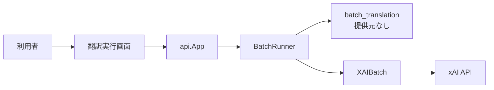
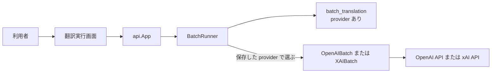

# Design: add-openai-provider

`design.md` は「どう実装するか」を人間が読んで判断するための説明を持つ。要求は `plan.md`、確定仕様は `spec.md` が持つ。
`design.md` と `spec.md` が食い違う場合は `spec.md` を優先する。

---

## R-1 OpenAI Batch API で翻訳できるようにする

### 結論

OpenAI Batch API を `BatchTranslator` の新しい実装として追加する。既存の `BatchRunner` は固有名から本文へ進む手続きを維持し、進行に保存した提供元に対応する `OpenAIBatch` または `XAIBatch` を呼ぶ。

OpenAI公式資料では、`gpt-5.6-luna` は Batch と Chat Completions と構造化出力に対応する。Batch API は通常 API より 50% 安く、完了時間は最大24時間である。OpenAI batch の各行は既存の xAI batch と同じ `/v1/chat/completions` の要求本文を使えるため、完成プロンプトと訳文の JSON schema は共有する。

根拠:

- [`gpt-5.6-luna` のモデル情報](https://developers.openai.com/api/docs/models/gpt-5.6-luna)
- [OpenAI Batch API](https://developers.openai.com/api/docs/guides/batch)
- [OpenAI batch 作成 API](https://developers.openai.com/api/reference/resources/batches/methods/create)

### 現況の理解

`internal/provider/batch.go` の `BatchTranslator` は、送信、状態確認、結果取得の 3 操作を持つ。`internal/provider/xai_batch.go` の `XAIBatch` だけが実装し、`internal/bootstrap/bootstrap.go` の `NewApp` が 1 個の `XAIBatch` を `engine.NewBatchRunner` へ渡す。

`internal/engine/batch.go` の `BatchRunner` は、固有名 batch を送信し、固有名を取り込んでから本文 batch を送信する。`BatchRunner` は 1 個の `BatchTranslator` だけを持つため、進行ごとに提供元を選べない。

`db/migrations/0013_batch_translation.sql` の `batch_translation` は、翻訳対象 plugin と 1 対 1 で、model、stage、固有名と本文の外部 batch ID を持つ。提供元を持たないため、外部 batch ID が OpenAI と xAI のどちらで発行されたかを再起動後に判定できない。`internal/model/batch_translation.go` の `BatchTranslation` と `internal/store/batch_translation.go` の読み書きも同じ列だけを扱う。

`internal/api/app.go` の `RunRequest` と `BatchPluginRequest` は提供元を受け取らない。`SubmitBatchTranslation`、`GetBatchProgress`、`RefreshBatchTranslations` は、常に同じ `BatchRunner` を呼ぶ。

`frontend/src/ui/screens/translation-run/translation-run-view.ts` の `TranslationProvider` は `sync` と `xai` だけを持つ。`frontend/src/ui/screens/translation-run/TranslationRunContainer.svelte` は xAI を選んだ時だけ batch の送信、状態確認、取り込みを表示する。

要求は、翻訳対象 plugin 1 件の batch 進行に、選択した提供元を対応付ける。既存テーブルの一意キーは plugin だけである。1 plugin に同時に 1 進行だけという既存の不変条件を維持し、提供元は一意キーへ加えず進行の属性として保存する。

| | 単位 |
| --- | --- |
| 要求が扱う対象 | 翻訳対象 plugin 1 件について選択した OpenAI batch または xAI batch |
| 受け皿が持つキー | `batch_translation.plugin` の一意キーと、追加する `provider` 列 |

#### 現況

現在の `BatchRunner` と `batch_translation` は、全ての batch を xAI として扱う。OpenAI の外部 batch ID を保存しても、状態確認と結果取得は xAI API へ送られる。

### あるべき形

`OpenAIBatch` は OpenAI Batch API の送信、状態確認、結果取得を `BatchTranslator` の値へ写す。送信では JSONL を Files API へ `purpose=batch` で upload し、`/v1/batches` へ `endpoint=/v1/chat/completions` と `completion_window=24h` を指定する。

状態確認では OpenAI の `status` と `request_counts` を `BatchStatus` へ写す。`completed`、`failed`、`expired`、`cancelled` は終端として扱う。結果取得では batch の `output_file_id` と `error_file_id` を取得し、Files API から両方の JSONL を読む。成功行は `choices[0].message.content` から訳文を取り出す。失敗行は既存の失敗種別へ写し、未訳のまま残す。終端で結果 file が無い場合は空の結果として取り込みを終え、同じ plugin の未訳を再送信できる状態へ進める。

`batch_translation` は `provider` を保存する。既存行は全て xAI の進行なので、migration の既定値は `xai` とする。`BatchRunner` は送信時に提供元を保存し、状態確認と取り込みでは画面から渡された提供元と保存済みの提供元が一致することを確認してから、対応する `BatchTranslator` を選ぶ。不一致の場合は外部 API と DB を変更せず、利用者へエラーを返す。

翻訳実行画面は `sync`、`openai`、`xai` を持つ。`openai` と `xai` は同じ batch 操作を表示する。`openai` の初期 endpoint は `https://api.openai.com/v1` とし、モデル一覧へ `gpt-5.6-luna` を置いて初期選択する。OpenAI API キーが空の場合は batch の送信、状態確認、取り込みを有効にしない。

OpenAI のモデル一覧を取得した場合は、取得結果に `gpt-5.6-luna` があれば先頭へ置く。他のモデルは削除しない。提供元を切り替えた場合は取得済みモデルと進行表示を消し、選択先の初期 endpoint とモデルへ替える。

#### あるべき形

あるべき形で増える要素は `OpenAIBatch` と提供元による選択である。`BatchRunner` が持つ固有名から本文への順序、完成プロンプト、結果の書き戻しは変更しない。

### 変更点

- `internal/provider/batch.go` へ OpenAI と xAI の提供元を表す既存値を定数として置き、Chat Completions 用 JSONL の生成を `XAIBatch` と `OpenAIBatch` が共有できる形へ移す。`BatchTranslator` の 3 操作は変更しない。
- `internal/provider/openai_batch.go` を追加し、`NewOpenAIBatch`、`SubmitBatch`、`PollBatch`、`FetchResults` を実装する。OpenAI の batch object、出力 JSONL、失敗 JSONL を `BatchStatus` と `BatchResult` へ写す。
- `internal/provider/xai_batch.go` は Chat Completions 用 JSONL の生成を `internal/provider/batch.go` の共通処理へ渡す。xAI 固有の upload、batch 作成、状態確認、結果取得は維持する。
- `internal/core/batchplan/batchplan.go` は xAI 固有の説明を OpenAI batch と xAI batch に共通する説明へ直す。固有名から本文へ進む判断規則は変更しない。
- `db/migrations/0018_batch_translation_provider.sql` を現在の migration の末尾へ追加し、`batch_translation.provider` を `TEXT NOT NULL DEFAULT 'xai'` で追加する。既存の xAI 進行を維持する。
- `internal/model/batch_translation.go` の `BatchTranslation` に `Provider` を追加する。
- `internal/store/batch_translation.go` の `StartBatchProgression`、`GetBatchProgression`、`ListActiveBatchProgressions` は提供元を書き込み、読み出す。
- `internal/engine/batch.go` の `BatchRunner` は提供元ごとの `BatchTranslator` を持つ。`NewBatchRunner`、`SubmitBatch`、`ensureNoActiveProgression`、`ProgressStatus`、`RefreshPlugin`、`refreshOne`、`sendStage`、`applyResults` は、送信要求または保存済み進行の提供元を使う。状態確認と取り込みでは画面から渡された提供元と保存済みの提供元の一致を確認する。xAI 固有の説明とエラー文は batch 共通の文へ直す。
- `internal/bootstrap/bootstrap.go` の `NewApp` は `OpenAIBatch` と `XAIBatch` を生成し、提供元と対応付けて `BatchRunner` へ渡す。
- `internal/api/app.go` の `RunRequest` と `BatchPluginRequest` に `Provider` を追加する。`SubmitBatchTranslation`、`GetBatchProgress`、`RefreshBatchTranslations` は提供元を `BatchRunner` へ渡す。xAI 固有の説明は batch 共通の説明へ直す。
- `frontend/wailsjs/go/models.ts` は Wails の生成 command で更新し、`RunRequest` と `BatchPluginRequest` の `provider` を frontend から渡せる形にする。
- `frontend/src/gateway/translation-gateway.ts` の batch 送信、状態確認、取り込みは提供元を backend へ渡す。xAI 固有の説明は batch 共通の説明へ直す。
- `frontend/src/ui/screens/translation-run/translation-run-view.ts` の `TranslationProvider` に `openai` を追加する。
- `frontend/src/ui/screens/translation-run/translation-run-presentation.ts` の `providerFields`、`PROVIDER_OPTIONS`、`PROVIDER_LABEL`、`MODEL_HINT` は OpenAI（batch）を表示し、batch 共通の文言と提供元ごとの接続情報を返す。
- `frontend/src/ui/screens/translation-run/TranslationRunContainer.svelte` の endpoint 初期値、`canSubmit`、追加する batch 操作可否、`onLoadModels`、`onProviderChange`、`onSubmit`、`onCheckStatus`、`onApply` は OpenAI batch と xAI batch を扱い、提供元を gateway へ渡す。OpenAI API キーが空の場合は batch 操作可否を false にする。
- `frontend/src/ui/screens/translation-run/TranslationRunScreen.svelte` の `Props`、`mainActionDisabled`、batch 進行の表示条件、状態確認ボタンの無効条件は、OpenAI batch と xAI batch を扱う。Container から受け取る batch 操作可否が false の場合は、状態確認と取り込みも無効にする。xAI 固有の説明は batch 共通の文へ直す。
- `frontend/src/ui/screens/translation-run/BatchProgressPanel.svelte` は xAI 固有の説明を batch 共通の文へ直す。
- `frontend/src/ui/screens/translation-run/BatchProgressPanel.stories.ts` は xAI 固有の説明を batch 共通の文へ直す。
- `frontend/src/ui/screens/translation-run/translation-run.fixtures.ts` と `frontend/src/ui/screens/translation-run/TranslationRunScreen.stories.ts` に、OpenAI（batch）、公式 endpoint、`gpt-5.6-luna`、API キー入力済み、送信後、処理中、取り込み可能の表示を追加する。画面表示が変わるため、下流は `storybook-module` を経由する。
- `docs/architecture.md` の `BatchTranslator` が xAI batch だけを持つ記述は、実装と最終検証の完了後に `finalization-module` の正本化判断へ渡す。
- `docs/er.md` の `batch_translation` の説明と列一覧へ OpenAI batch と `provider` を反映する。人間が今回の task に限る `finalization-module` の反映対象制限の例外として、2026-08-01 に更新を承認した。

---

## 検討が必要なこと

- なし。`docs/er.md` は人間が今回の task に限る例外として更新を承認した。
