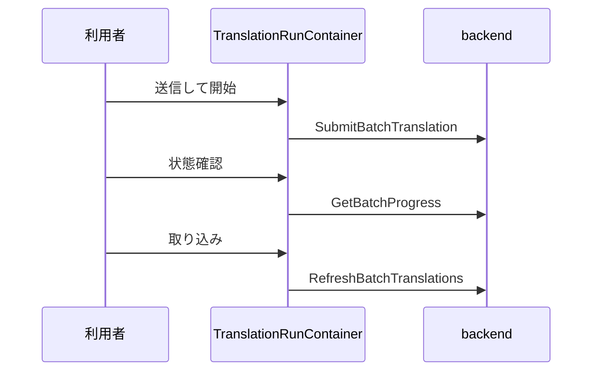
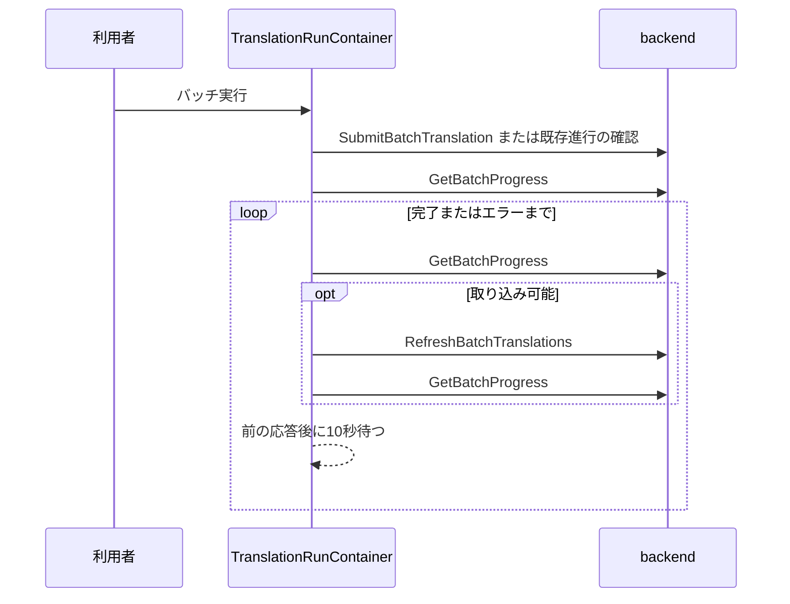
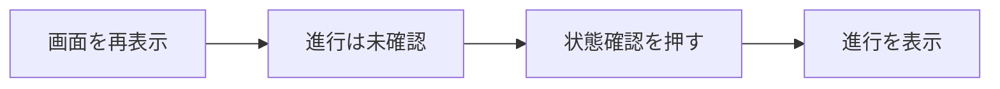
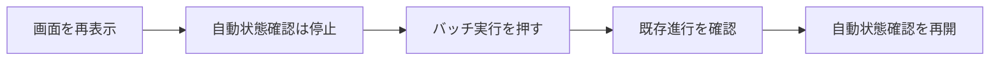

# Design: batch-auto-polling

バッチ実行を一度押した後は、画面が開いている間、固有名段から本文段の完了まで自動で進める。画面を閉じた場合は状態確認を止め、再表示後のバッチ実行で保存済みの進行を再開する。

---

## R-1 バッチ実行後は完了まで自動で状態確認する

### 現況の理解

`frontend/src/ui/screens/translation-run/TranslationRunContainer.svelte` の `onSubmit` は外部 batch の送信だけを行う。`onCheckStatus` は `getBatchProgress` を使って進行を観測する。`onApply` は `refreshBatchTranslations` を一度呼び、完了結果の取り込みと次の送信を進める。

`internal/api/app.go` の `RefreshBatchTranslations` と `internal/engine/batch.go` の `RefreshPlugin` は、現在の外部 batch を状態確認する。現在の外部 batch が完了していれば、結果の取り込み、同じ段の次チャンク送信、または固有名段から本文段への移行を行う。処理待ちなら書き換えずに戻る。

| | 単位 |
| --- | --- |
| 要求が扱う対象 | 利用者が押した一回のバッチ実行 |
| 受け皿が持つキー | 対象 plugin と保存済みの batch 進行 ID |

### あるべき形

`TranslationRunContainer.svelte` が、バッチ実行を押した後の自動状態確認を持つ。新しい外部 batch の送信直後は、`getBatchProgress` を一度呼んで現在の進行状況を表示する。以降は、前の呼び出しが終わってから10秒後に次の呼び出しを行う。

各回は `getBatchProgress` を一度呼ぶ。処理待ちなら次回だけを予約する。取り込み可能なら `refreshBatchTranslations` を一度呼び、結果一覧と次の進行状況を取得する。進行段が `done` になるまで同じ順序を繰り返す。呼び出しを直列にするため、応答が10秒を超えても状態確認は重複しない。

`internal/provider/openai_batch.go` の `PollBatch` は OpenAI の `status=failed` を外部 batch ID と `errors.data` の理由を含むエラーにする。`ProgressStatus`、`App.GetBatchProgress`、Wails の呼び出しを通って `getBatchProgress` が例外を返すため、新しい表示用 field は追加しない。`failed` を含むエラーが返った場合は自動状態確認を止め、既存の画面エラー経路へ理由を表示する。自動再送信は行わない。

### 変更点

- `frontend/src/ui/screens/translation-run/TranslationRunContainer.svelte` の `onSubmit`、`onCheckStatus`、`onApply` を、一回の開始操作と自動状態確認へ組み直す。開始時の入力値を使い、10秒ごとの次回呼び出しを `setTimeout` で一つだけ予約する。
- `frontend/src/ui/screens/translation-run/TranslationRunContainer.svelte` は、自動状態確認の各回で `getBatchProgress` を呼ぶ。`canApply` の場合だけ `refreshBatchTranslations` を呼び、続けて `fetchPage` と次の `getBatchProgress` を扱う。`done` またはエラーで次回予約を止める。
- `frontend/src/ui/screens/translation-run/TranslationRunContainer.test.ts` は、送信後の自動状態確認、固有名段から本文段、複数チャンク、完了、エラー停止を時間制御付きで確かめる。

### 現況

### あるべき形

---

## R-2 画面を閉じた後は人の操作で既存のバッチ実行を再開する

### 現況の理解

`TranslationRunContainer.svelte` の `onMount` は結果一覧と同期実行の進行通知だけを読み込む。batch の進行は自動で取得しない。再表示直後の `batchProgress` は未確認であり、現在の主操作は新規送信として扱われる。

batch の進行は backend の `batch_translation` に保存される。接続情報は保存されず、`getBatchProgress` と `refreshBatchTranslations` の呼び出しごとに画面から渡される。

| | 単位 |
| --- | --- |
| 要求が扱う対象 | 画面を閉じた一回のバッチ実行 |
| 受け皿が持つキー | 対象 plugin。provider は保存済みの batch 進行が持つ属性 |

### あるべき形

画面の終了、対象 plugin の変更、provider の変更では、予約済みの次回状態確認を取り消す。現在の実行を識別する値も更新し、古い `refreshBatchTranslations`、`getBatchProgress`、`fetchPage` の応答で変更後の画面を更新しない。すでに backend へ渡した一回は完了する可能性があるが、新しい状態確認は開始しない。

画面を再表示しただけでは状態確認を開始しない。利用者がバッチ実行を押すと、`getBatchProgress` で保存済みの進行を確認する。固有名段または本文段なら新しい外部 batch を送信せず、自動状態確認を再開する。進行が無い場合は新しい外部 batch を送信して自動状態確認を開始する。

選択した provider が保存済みの進行の provider と異なる場合は、backend の provider 不一致エラーを表示する。新しい外部 batch の送信と自動状態確認は開始しない。

### 変更点

- `TranslationRunContainer.svelte` は予約済みの `setTimeout` と現在の実行を識別する値を持つ。`onMount` の終了処理、plugin 変更、`onProviderChange` で次回予約を無効にする。
- `TranslationRunContainer.svelte` の開始操作は、未確認時に `getBatchProgress` を先に呼ぶ。保存済みの途中進行があれば再開し、進行が無ければ `submitBatchTranslation` を呼ぶ。
- `TranslationRunContainer.test.ts` は、画面終了後に次の状態確認を呼ばないこと、plugin または provider の変更後に古い応答を画面へ反映しないこと、再表示後の開始操作が既存進行を新規送信せず再開すること、provider が異なる進行を新規送信しないことを確かめる。

### 現況

### あるべき形

---

## R-3 状態確認ボタンを削除する

### 現況の理解

`TranslationRunScreen.svelte` は batch 用に状態確認ボタンと主操作ボタンを並べる。`translation-run-presentation.ts` の `batchMainAction` は、未確認時の送信、固有名段の取り込み、本文段の取り込み、未訳の再送信を主操作へ割り当てる。`BatchProgressPanel.svelte` と表示文言は、人が状態確認と取り込みを押す前提を案内する。

| | 単位 |
| --- | --- |
| 要求が扱う対象 | OpenAI と xAI のバッチ実行画面 |
| 受け皿が持つキー | `provider` と `batchProgress` |

### あるべき形

OpenAI と xAI は主操作を一つだけ表示する。未開始または再表示後は「バッチ実行」、自動状態確認中は「実行中…」、途中で止まっている場合は「バッチ実行を再開」、未訳が残る完了後は「未訳だけを再送信」、未訳が無い完了後は「完了」と表示する。

開始操作を押した直後から「実行中…」を表示し、開始処理と自動状態確認の両方が終わるまで無効にする。「完了」も無効にする。エラーで自動状態確認が止まった場合は「バッチ実行を再開」を有効にし、画面のエラー表示を残す。provider 不一致の場合は保存済みの進行を変更せず、「バッチ実行」を有効な状態へ戻す。

状態確認ボタンと、人が取り込みを押すよう促す文言は表示しない。進行状況パネルは、自動状態確認で取得した固有名段、本文段、件数、完了を表示する。

### 変更点

- `frontend/src/ui/screens/translation-run/TranslationRunScreen.svelte` の `Props` から `onCheckStatus`、`checking`、手動の `onApply`、`applying` を外し、状態確認ボタンを削除する。主操作は開始、再開、未訳の再送信だけを呼ぶ。
- `frontend/src/ui/screens/translation-run/translation-run-presentation.ts` の `batchMainAction` と batch の案内文を、自動状態確認と一つの主操作に合わせる。
- `frontend/src/ui/screens/translation-run/BatchProgressPanel.svelte` の未確認、処理待ち、取り込み可能の案内を、自動状態確認または再開操作を説明する文へ変える。
- `frontend/src/ui/screens/translation-run/TranslationRunScreen.stories.ts` と `translation-run.fixtures.ts` は、状態確認ボタンを持たない各表示状態へ更新する。
- `frontend/src/ui/screens/translation-run/TranslationRunContainer.test.ts` と表示用純関数のテストは、状態確認ボタンが無いことと、主操作の表示・活性を確かめる。

---

## 検討が必要なこと

- なし。
