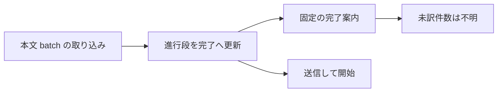
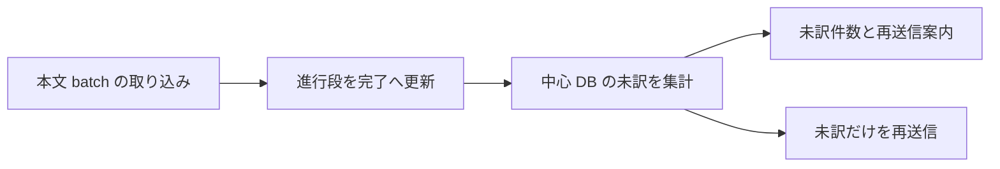
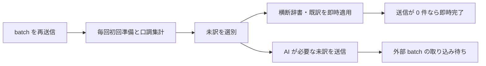
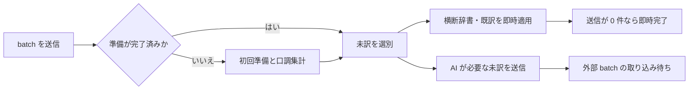
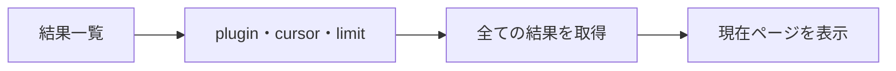
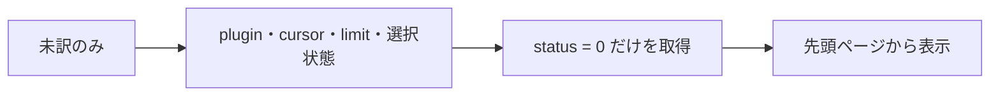

# Design: batch-retry-untranslated-records

`design.md` は「どう実装するか」を人間が読んで判断するための説明を持つ。
要求は `plan.md`、確定仕様は `spec.md` が持つ。両者が食い違う場合は `spec.md` を優先する。

---

## R-1 batch の完了画面で未訳と再送信を示す

### 現況の理解

`internal/api/app.go` の `GetBatchProgress` は、`BatchRunner.ProgressStatus` が返す現在段の総数、処理待ち、成功、失敗、取り込み可否を `BatchProgressView` へ写す。完了段では外部 batch を確認しないため、現在段の件数は全て 0 になる。対象 plugin に残る未訳件数は返さない。

`frontend/src/ui/screens/translation-run/TranslationRunContainer.svelte` の `onApply` は、本文 batch の取り込み後に結果一覧と進行状況を読み直す。ただし、案内には `APPLIED_BODY_NOTICE` の固定文を設定する。`onCheckStatus` も完了段の未訳件数を案内へ設定しない。

`frontend/src/ui/screens/translation-run/translation-run-presentation.ts` の `batchMainAction` は、完了段を新規送信と同じ「送信して開始」として表示する。通常実行だけが `untranslatedNotice` で未訳件数と再実行対象を表示する。

`internal/store/target_plugin.go` の `CountUntranslated` は、対象 plugin の `narration`、`line`、`proper_noun` に残る `status = 0` を合計する。`proper_noun` では、機械派生した人名の部分形を翻訳対象から除外する。batch の取り込み結果を適用した後も同じ数え方を使える。

| | 単位 |
| --- | --- |
| 要求が扱う対象 | OpenAI または xAI の batch の取り込み後に未訳のまま残った翻訳対象 1 件 |
| 受け皿が持つキー | `narration.id`、`line.id`、`proper_noun.id`。対象 plugin の集計キーは各 table の `plugin` |

### 現況

### あるべき形

OpenAI と xAI の batch が完了した場合、状態確認結果は対象 plugin に残る未訳件数を持つ。画面は未訳が 1 件以上ある場合に件数と再送信の案内を表示し、主操作を未訳の再送信であると分かる文言にする。

未訳が 0 件の場合、画面は未訳の案内を表示しない。本文の取り込みが完了した案内は維持する。

batch の外部処理中に表示する「失敗」は外部 batch の処理結果である。取り込み後に表示する未訳件数は、結果の適用後に中心 DB に残る件数である。画面は両者を同じ値として扱わない。

### 変更点

- `internal/api/app.go` の `BatchProgressView` と `GetBatchProgress`: 完了段では `CountUntranslated` を使い、対象 plugin に残る未訳件数を状態確認結果へ加える。集計に失敗した場合は状態確認をエラーにし、未訳 0 件として返さない。
- `frontend/src/gateway/translation-gateway.ts` の `BatchProgress` と `getBatchProgress`: backend が返す未訳件数を画面の表示値へ写す。
- `frontend/src/ui/screens/translation-run/translation-run-view.ts` の `BatchProgressView`: 完了後の未訳件数を持たせる。
- `frontend/src/ui/screens/translation-run/translation-run-presentation.ts`: batch 向けの未訳案内と、完了後に未訳が残る場合の主操作文言を純関数で組む。
- `frontend/src/ui/screens/translation-run/TranslationRunContainer.svelte` の `onCheckStatus` と `onApply`: 完了段の状態確認結果から未訳案内を設定する。本文取り込み後に未訳が 0 件なら既存の完了案内を設定する。本文の取り込みが成功した後に未訳件数の取得だけが失敗した場合は、取り込み済みで未訳件数の更新に失敗したことをエラーへ表示する。
- `frontend/src/ui/screens/translation-run/TranslationRunScreen.stories.ts` と `translation-run.fixtures.ts`: OpenAI と xAI の batch について、取り込み後に未訳が残り、未訳件数と再送信操作を確認できる story を追加する。未訳 0 件は既存の完了 story で確認する。
- `frontend/src/ui/screens/translation-run/translation-run-presentation.test.ts` と `internal/api/app_test.go`: batch の未訳案内、主操作文言、完了段の未訳件数、集計失敗を確認する。

---

## R-2 batch の再送信では未訳だけを処理する

### 現況の理解

`internal/api/app.go` の `SubmitBatchTranslation` は送信のたびに `prepareForTranslation` を呼ぶ。`prepareForTranslation` は対象 plugin の登録時に `sync_retry_ready` を 0 へ戻し、既訳の収集、抽出、横断辞書の派生、取込を実行する。

`internal/engine/batch.go` の `SubmitBatch`、`planProperRequests`、`planBodyRequests` は `status = 0` の固有名、叙述文、台詞だけを処理対象として選ぶ。横断辞書または既訳を適用できる未訳はその場で訳を書き戻し、外部 batch へ載せない。訳のある行も送信計画へ入らない。一方、`planBodyRequests` は送信のたびに `GeneratePersonas` を呼び、全話者の口調を再集計する。

`target_plugin.sync_retry_ready` は、既訳の収集、抽出、横断辞書の派生、取込、口調の集計が完了し、保存済みの材料から未訳を処理できることを表す。同期翻訳は値を読んで準備を省略するが、batch 送信は値を読まない。

| | 単位 |
| --- | --- |
| 要求が扱う対象 | 登録済み plugin に残る未訳の翻訳対象 1 件 |
| 受け皿が持つキー | `target_plugin.plugin` と、各翻訳対象の `id`、`plugin`、`status` |

### 現況

### あるべき形

batch の送信は `sync_retry_ready` を読み、準備が完了済みの場合は既訳の収集、抽出、横断辞書の派生、取込を呼ばない。本文 batch の送信文面を組む際も全話者の口調を再集計せず、保存済みの口調を読む。送信結果は準備済みの材料を使ったかと、横断辞書または既訳だけで処理を完了して外部 batch を作らなかったかを返す。画面は再送信時に保存済みの準備を使って未訳だけを処理したことを案内する。

固有名、叙述文、台詞は既存の `status = 0` の選別を使う。横断辞書または既訳を適用できる未訳は外部 batch へ載せず、その場で訳を書き戻す。残りの未訳だけを外部 batch へ載せる。訳のある行は送信せず、書き換えない。外部 batch へ送る必要がある未訳の固有名がある場合は固有名 batch を先に再送信し、取り込み後に残る未訳の本文を本文 batch へ送る。

準備の完了が保存されていない場合は、初回と同じ準備を実行する。

横断辞書または既訳だけで全ての未訳を処理し、外部 batch を作らず完了した場合は、送信直後に結果一覧と完了段の状態確認結果を読み直す。送信は成功したが結果一覧または状態確認結果の読み直しに失敗した場合は、送信の成功を取り消さず、送信済みで画面更新に失敗したことをエラーとして表示する。

### 変更点

- `internal/api/app.go` の `BatchSubmitResult` と `SubmitBatchTranslation`: `IsSyncRetryReady` を読み、準備済みなら `prepareForTranslation` を呼ばずに `BatchRunner.SubmitBatch` へ進み、準備済みの材料を使ったことと外部 batch なしで完了したかを返す。準備が未完了なら既存の初回経路を保つ。
- `internal/engine/batch.go` の `BatchSubmitOutcome`、`BatchStore`、`SubmitBatch`、`submitBodyBatch`、`planBodyRequests`: `IsSyncRetryReady` を読み、準備済みの再送信では `GeneratePersonas` を呼ばず、保存済みの口調から未訳本文の送信文面を組む。初回の本文 batch では口調を集計してから `MarkSyncRetryReady` を保存する。外部 batch を作らず完了した場合は完了状態を返す。
- `frontend/src/gateway/translation-gateway.ts` の `submitBatchTranslation`、`frontend/wailsjs/go/api/App.js`、`App.d.ts`、`models.ts`: 準備済みの材料を使ったかと外部 batch なしで完了したかを frontend へ渡す。Wails の生成物は生成 command で更新する。
- `frontend/src/ui/screens/translation-run/TranslationRunContainer.svelte` の `onSubmit` と `onApply`: 通常の送信案内と未訳だけを処理する再送信案内を分ける。外部 batch なしで完了した場合と本文の取り込み後は、結果一覧の先頭ページと状態確認結果を一時値へ読み、両方が成功してから画面へまとめて反映する。どちらかが失敗した場合は以前の一覧と状態を保ち、送信または取り込みが成功済みで画面更新に失敗したことを表示する。
- `frontend/src/ui/screens/translation-run/translation-run-presentation.ts` と `translation-run-presentation.test.ts`: 保存済みの準備を使って未訳だけを処理したことを示す案内を定義し、表示文を確認する。
- `internal/api/app_test.go` の `TestSubmitBatchTranslationReusesPreparedTarget`、`internal/engine/batch_integration_test.go` の `TestBatchRetryUsesOnlyPendingRowsWithoutPersonaRegeneration`、`internal/harness/batch_retry_untranslated_test.go` の `TestBatchRetriesOnlyUntranslatedRows`、`frontend/src/ui/screens/translation-run/TranslationRunContainer.test.ts` の `即時完了時に一覧と状態をまとめて更新する` と `送信または取り込み成功後の画面更新失敗で以前の表示を保つ`: 準備済みの batch 再送信が準備と口調集計を繰り返さず、横断辞書または既訳を適用できない未訳だけを送信し、再送信と取り込みの後も以前から訳のある本文を保つことと、画面更新の途中失敗で部分更新しないことを確認する。

---

## R-3 結果一覧を未訳だけに絞る

### 現況の理解

`frontend/src/ui/screens/translation-run/ResultsPanel.svelte` は、現在ページの結果、対象 plugin の総件数、ページ送りを表示する。表示条件を選ぶ入力は持たない。

`frontend/src/ui/screens/translation-run/TranslationRunContainer.svelte` は keyset cursor と現在ページを持ち、`listResultsPage` を `plugin`、`cursor`、`limit` で呼ぶ。対象 plugin や実行結果が変わった場合は先頭ページへ戻す。

`internal/api/app.go` の `ListResultsPage`、`pageRows`、`countAll` は、叙述文、台詞、翻訳対象の固有名を id 順に連結して返す。`internal/store` の各ページ取得と件数取得は対象 plugin だけを条件にし、訳の有無では絞らない。未訳は `status = 0` であり、翻訳対象の固有名からは機械派生した人名の部分形を除く。

| | 単位 |
| --- | --- |
| 要求が扱う対象 | 対象 plugin の結果一覧にある未訳 1 件 |
| 受け皿が持つキー | `narration.id`、`line.id`、`proper_noun.id` と各 table の `plugin`、`status` |

### 現況

### あるべき形

結果一覧は「未訳のみ」のチェックボックスを持つ。選択時は現在ページに読み込まれた行を画面内で間引かず、backend のページ取得から `status = 0` だけに絞る。総件数とページ送りも同じ条件を使うため、未訳件数がページをまたいでも漏れない。ページ取得結果は絞り込み後の総件数と、絞り込み前の総件数を分けて持つ。xTranslator への書き出し操作は絞り込み前の総件数で表示する。

チェックボックスを切り替えた場合は、選択後の条件で先頭ページを取得してから、チェック状態、結果、cursor の履歴、ページ番号をまとめて更新する。取得に失敗した場合はチェック状態、結果、cursor の履歴、ページ番号を変更せず、エラーを表示する。未訳が 0 件の場合は「未訳はありません」と表示する。選択していない場合は既存どおり訳の有無を問わず表示する。

「未訳のみ」は画面の結果一覧だけを絞る。xTranslator への書き出しは中心 DB にある全 plugin を扱う既存の動作を保つ。

### 変更点

- `internal/store/narration.go` の `NarrationsAfter`、`internal/store/line.go` の `LinesAfter`、`internal/store/proper_noun.go` の `ProperNounsAfter`: 未訳だけを取得する場合は `status = 0` を条件へ加える。固有名は既存の翻訳対象除外条件も維持する。
- `internal/api/app.go` の `Store`、`ResultPage`、`ListResultsPage`、`buildResultsPage`、`pageRows`、`pageBuilder`、`countAll`: 「未訳のみ」の選択をページ取得全体へ渡す。選択時の総件数は `CountUntranslated` と同じ数え方にし、xTranslator への書き出し操作のために絞り込み前の総件数も返す。
- `internal/api/app_test.go` の `fakePageStore`、`frontend/wailsjs/go/api/App.js`、`App.d.ts`、`models.ts`: `Store` と Wails 境界の引数および戻り値変更へ追従する。Wails の生成物は生成 command で更新する。
- `frontend/src/gateway/translation-gateway.ts` の `listResultsPage`: 「未訳のみ」の選択と、絞り込み前後の総件数を Wails 境界で写す。
- `frontend/src/ui/screens/translation-run/TranslationRunContainer.svelte` の `loadPage` とチェックボックス変更処理: 選択状態を持ち、切り替え後の先頭ページ取得に成功してから結果、チェック状態、cursor 履歴、ページ番号を更新する。失敗時は変更前の表示を保つ。
- `frontend/src/ui/screens/translation-run/TranslationRunScreen.svelte` と `ResultsPanel.svelte`: チェックボックスの値と変更操作、絞り込み前の結果の有無を props で渡し、「未訳のみ」のチェックボックスと「未訳はありません」の表示を出す。xTranslator への書き出し操作は絞り込み前の結果があれば表示する。
- `frontend/src/ui/screens/translation-run/ResultsPanel.stories.ts`、`TranslationRunScreen.stories.ts`、`translation-run.fixtures.ts`: 未訳のみを選択した一覧と、未訳がない空状態を確認できる story を追加する。
- `internal/api/app_test.go` の `TestListResultsPageFiltersUntranslatedAcrossSections` と `TestListResultsPageFailsWhenUnfilteredTotalCannotBeCounted`、`frontend/src/ui/screens/translation-run/ResultsPanel.test.ts` の `未訳のみの選択と未訳なしを表示する`、`TranslationRunContainer.test.ts` の `未訳のみの取得失敗時に選択前の一覧とページを保つ`: plugin 全体を未訳だけに絞った未訳件数、機械派生した人名の部分形の除外、ページ取得、絞り込み前の件数取得失敗、チェックボックス、「未訳はありません」の表示、xTranslator への書き出し操作の維持、取得失敗時の状態維持を確認する。

---

## 検討が必要なこと

- なし
