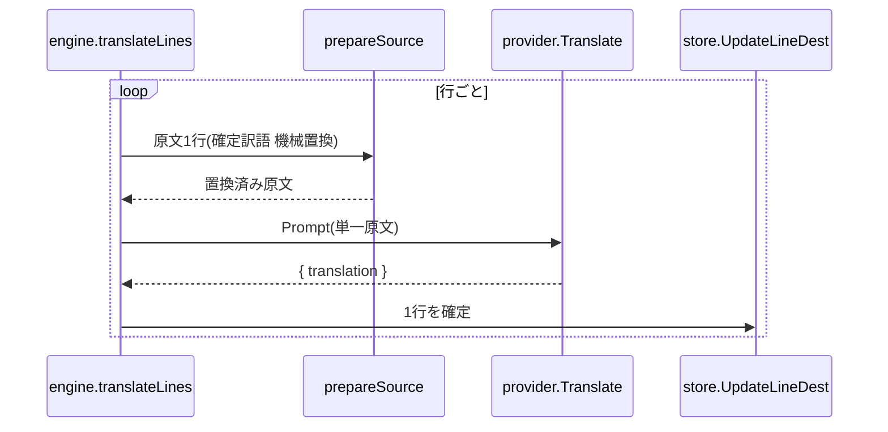
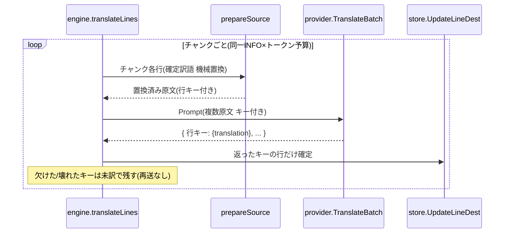

# Design: bulk-line-translation

`design.md` は「どう実装し、どう変えるか」だけを持つ。実装範囲の scope 列挙とテスト設計は持たない（実装モジュールが扱う）。

本 task（slice 1）はバルク翻訳機構を作る。会話フロー抽出（slice 2）は本書末尾に後続 task として起動条件つきで残す。

## 実装方針

### 何を変えるか（結論）

台詞翻訳を「1 行 1 リクエスト」から「会話でまとまる行をチャンク単位でまとめた 1 リクエスト」へ変える。出力を単一訳文からキー配列へ変え、返ったキーだけ確定する部分成功にする。1 チャンクのサイズは行数でなくトークン予算（1 リクエストの最大トークンの目安）で区切り、接続・モデルごとに可変にする。壊れた行・欠けた行は未訳のまま残し、再実行で拾う。

slice 1 のグループ化は、抽出子・スキーマを変えずに既に持っている同一 INFO（同じ `form_id` の複数応答行、`response_order` で並ぶ）を単位にする。会話フロー全体へのグループ拡張は slice 2 が担う。

### AS-IS（現状）と TO-BE（変更後）

**AS-IS**: `internal/engine/engine.go` の `translateLines` が行を 1 件ずつループし、各行で `provider.Translate` を 1 回呼ぶ。プロンプトは base 指示・persona 指示・原文 1 行の合成（`internal/core/prompt/prompt.go` の `ComposePrompt`）。出力スキーマは単一フィールド `{ "translation": string }`（`internal/provider/openai_compatible.go` の `translationSchema`）。会話の周辺文脈は一切渡さない。

**TO-BE**: `translateLines` がまず行を同一 INFO 単位でグループ化し、グループをトークン予算で区切ってチャンクにする。チャンクの各行に既存の `prepareSource`（`dict.Apply` による確定訳語の機械置換、実行時タグの mask/restore）を通してから、複数行を 1 リクエストで送る。出力はキー配列 `{ "<行キー>": { "translation": string }, ... }` で受け、返ったキーの行を確定する。欠けたキー・壊れたキーの行は未訳のまま残す。

観測点: 実データ（同一 INFO に複数応答行を持つ plugin）を実 app で翻訳し、複数行が 1 リクエストで訳し戻ること、一部キーが欠けても他の行が確定する部分成功を確かめる。機構本体は単体テスト（engine のチャンク分割・キー対応・部分成功、provider のキー配列スキーマ組み立てと解析）で守る。

翻訳ループの呼び出し順が変わるため、AS-IS と TO-BE をシーケンス図で対にして示す。

#### AS-IS: 1 行 1 リクエスト

#### TO-BE: チャンク単位のキー配列リクエスト

AS-IS から変わる点は 3 つある。第 1 に、ループの単位が「行」から「チャンク（同一 INFO をトークン予算で区切った塊）」へ変わる。第 2 に、`provider.Translate`（単一）に加えてキー配列を送受信する経路が増える（図では `provider.TranslateBatch` と表記。実際の名前は実装で確定する）。第 3 に、確定処理が「1 行を確定」から「返ったキーの行だけ確定し、欠けたキーは未訳で残す」へ変わる。

### 翻訳対象を選んだ plugin へ絞る（scope 修正）

**AS-IS**: `engine.Run` は `ListUntranslatedProperNouns/Narrations/Lines(ctx)`（いずれも plugin 引数なし）で DB 内の全 plugin の未訳行を取得し翻訳する。選んだ plugin を抽出した後も、他 plugin の未訳行まで翻訳が進む（実画面確認で発覚。1 plugin の実行が別 plugin を巻き込む）。

**TO-BE**: `engine.Run` に対象 plugin（`filepath.Base(pluginPath)` の plugin 名）を渡し、3 つの `ListUntranslated*` を対象 plugin で絞る。既存の paging 用クエリ（`LinesAfter` 等）が持つ「plugin が空なら全 plugin」規約に沿い、空文字は従来どおり全件にする。`line`・`narration`・`proper_noun` は 3 つとも plugin 列を持つため（`proper_noun` は migration 0009 で plugin スコープ化済み）、共有語彙の例外なく 3 つとも絞る。進捗の総数も対象 plugin の未訳件数になる。

観測点: 実 app で 1 つの plugin を翻訳しても、別 plugin の未訳件数が変わらないことを確かめる。store の plugin スコープ絞り込みと engine の対象 plugin 限定を単体テストで守る。

### provider の変更

`internal/provider/openai_compatible.go` の単一経路（`Translate` と `translationSchema`）は残す。単独行は従来どおり単一経路を通す。複数行用に、キー集合を入力で受けてキー配列スキーマ（`{ "<行キー>": { "translation": string }, "additionalProperties": false }`）を組み、応答をキーごとに解析する経路を並置する。`translationSchema` のコメントが記す既定方針「将来の複数対象一括は別 plan で配列版へ育てる」に沿う。

### engine の変更

`translateLines` にチャンク分割とチャンク翻訳を足す。既存の早期スキップ（原文が参照訳と完全一致する行は AI を呼ばず既訳を流用）はチャンク化の前に効かせ、AI へ送る行だけをチャンクにする。既存の失敗時の扱い（実行時タグ欠落・構造化出力の解析失敗は該当行を未訳のまま残し再実行で拾う）へ、バルクの欠けたキー・壊れたキーを合流させる。

### 行キー

行キーは `line.id` を直接使う。JSON のキーは `line.id` の数値文字列になる。run 内で一意で、応答のキーから対象行へ直接引き戻せるため、別の対応表を持たない。

### トークン予算（チャンクの切り方）

チャンクは行数でなくトークン予算（1 リクエストの最大トークンの目安）で切る。行ごとにトークン長が大きく振れるため、行数で切ると 1 リクエストの実トークン量が不揃いになり、コンテキスト超過や弱いモデルの破綻を招く。原文のトークン数を積み上げ、予算に達したらそこで区切る。長い台詞は少なく、短い台詞は多くまとまる。行数の上限は持たない。

トークン数は接続先（OpenAI 互換の任意モデル）ごとに正確な tokenizer を持てないため、安価な概算（原文の文字数ベースの推定）で求める。予算は厳密上限でなく目安として使う。

トークン予算は接続・モデルごとに可変にする。`provider.Connection` と同様に、永続化せず画面から都度渡す。弱いローカルモデルは小さく、クラウドモデルは大きく指定する。

入力の単位は k（千トークン）にする。桁数が大きく扱いにくいため、画面では千トークン単位で受ける（例: 2 は約 2000 トークン）。k からトークン数への換算（×1000）は配線層で行う。

slice 1 はトークン予算の入力欄（画面表示変更）を含む。画面表示変更があるため、経路は `storybook-module` を経由してから `implementation-module` へ進む（人間設計レビューで確定）。

## slice 2（後続 task）: 会話フロー文脈

slice 1 のバルク機構の上に、会話フロー文脈を乗せる段を後続 task（`dialogue-flow-context`）として立てる。

slice 1 の限界（人間レビューで確認）: slice 1 のバルクは「同一 INFO・同一話者・同一口調指示」の連続行だけを 1 リクエストにまとめる。得られるのはコスト削減と同一 INFO 内の口調共有までで、会話をまたいだ文脈（プレイヤー選択 → NPC 応答 → 次の往復、感情の移り変わり、クエストの流れ）はモデルへ渡らない。狙いA（文脈で品質を上げる）の本体は slice 2 が担う。

- 対象文脈: 会話のやり取り（プレイヤー選択と NPC 応答の往復。方向1）。
- 内容: C#/Mutagen で DIAL（トピック）・QUST（クエスト）・INFO の PNAM（前 INFO）連結を抽出し、migration でスキーマへ保持し、`er.md` を feature commit で同期する。engine のグループ化を会話フローへ拡張する。リクエストの作り方（会話 1 本をまとめて訳すか、対象 1 行＋読み取り専用の文脈行にするか）は slice 2 の設計で決める。
- 観測点: クエスト・会話フローの文脈が訳に効くことを実データで確かめる。
- 起動条件: slice 1 が `master` へ取り込み済みになった時点で着手する。詳細は `docs/exec-plans/active/dialogue-flow-context/plan.md`。

## 検討が必要なこと

- slice 2 の抽出と known-issues no1「会話の流れ e7」の統合可否。「会話の流れ e7」は未実装項目として既にある。slice 2 の PNAM 抽出でこの項目を一緒に埋めるか、別立てにするかは slice 2 の設計で決める。slice 1 の着手はこの判断に依存しない。
