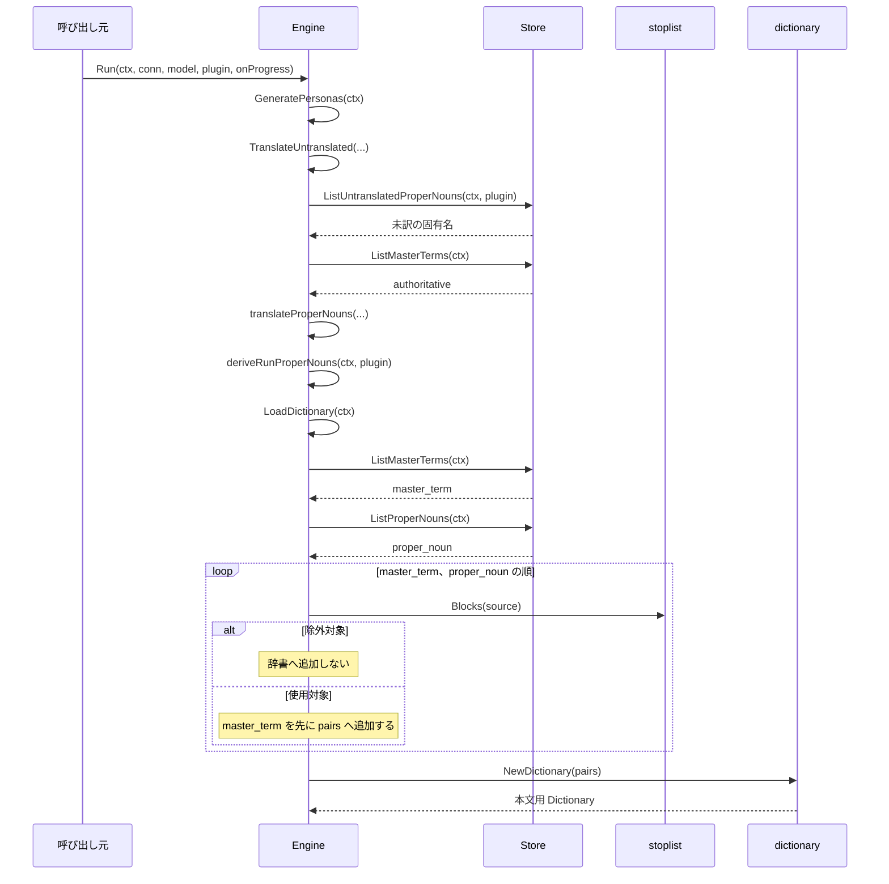
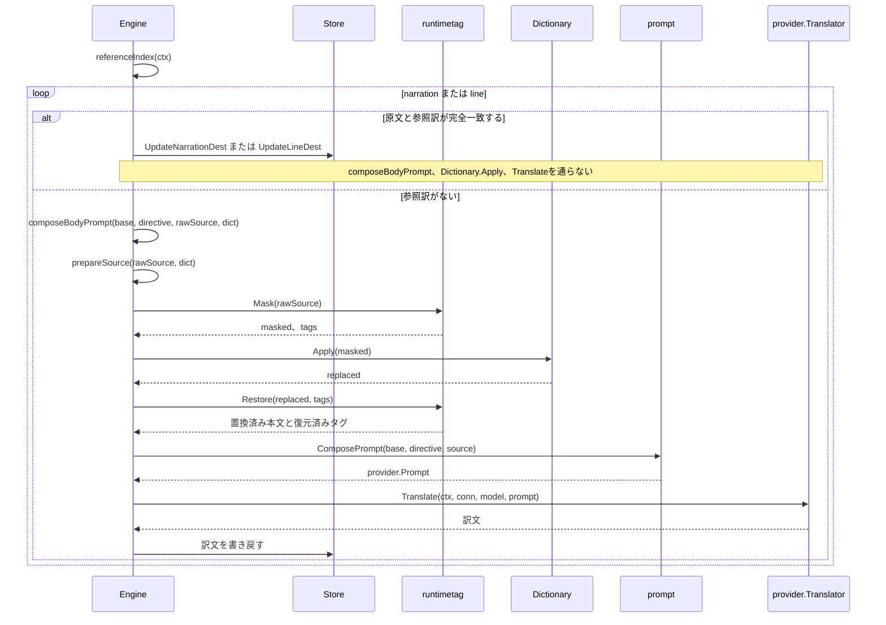
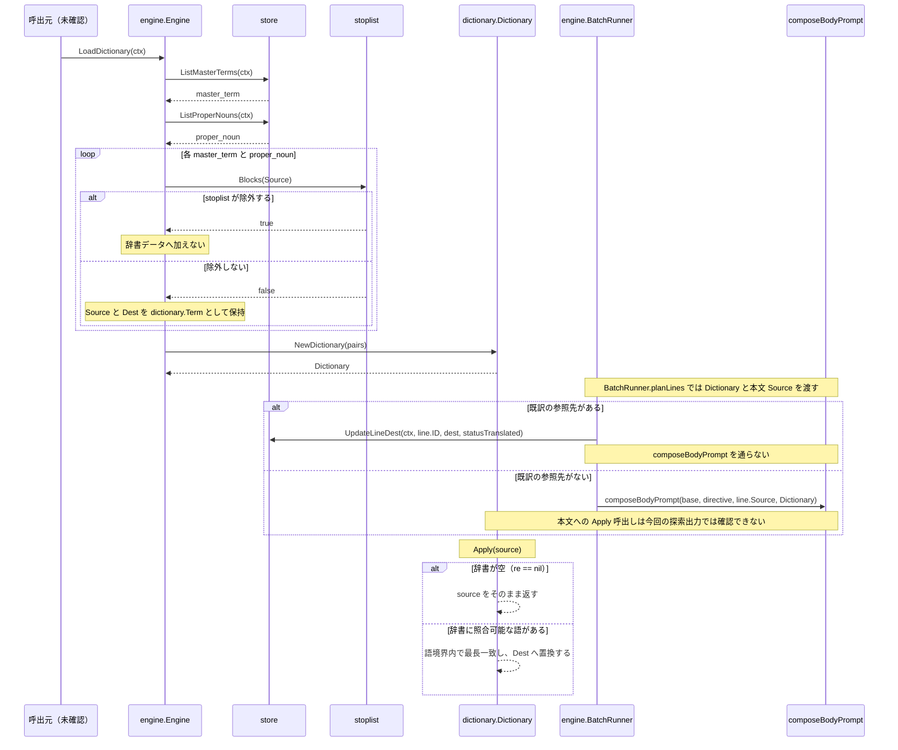
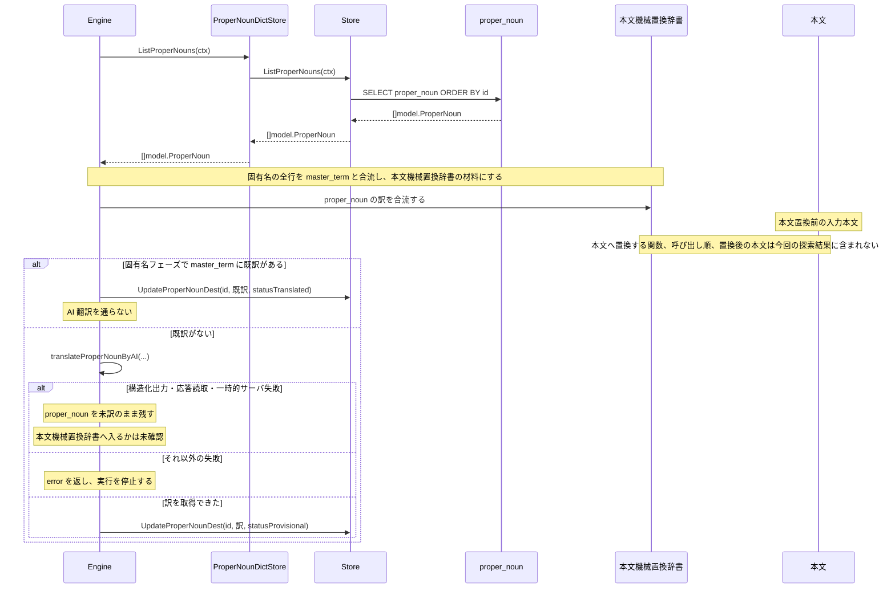
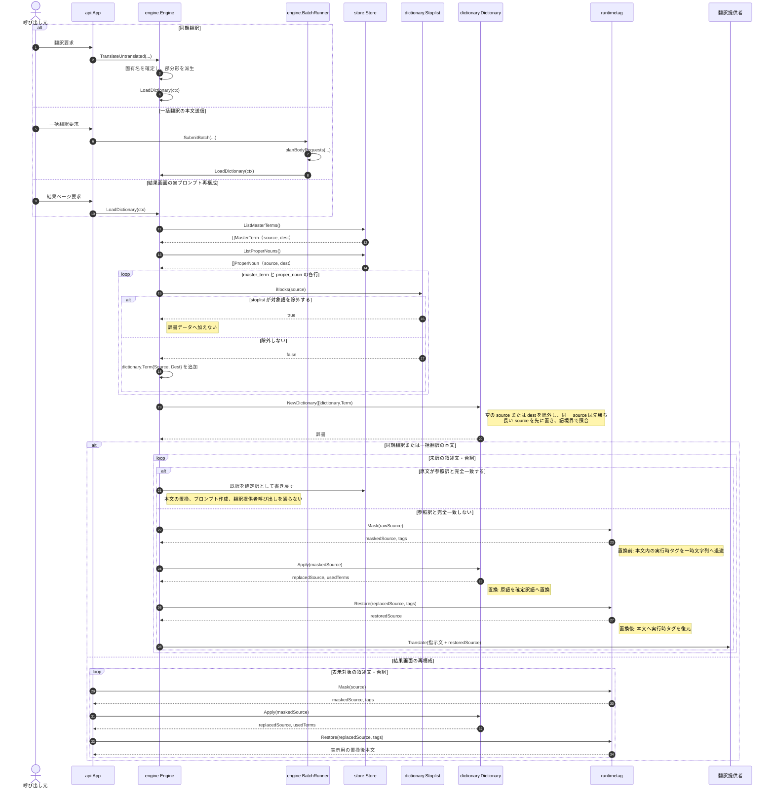
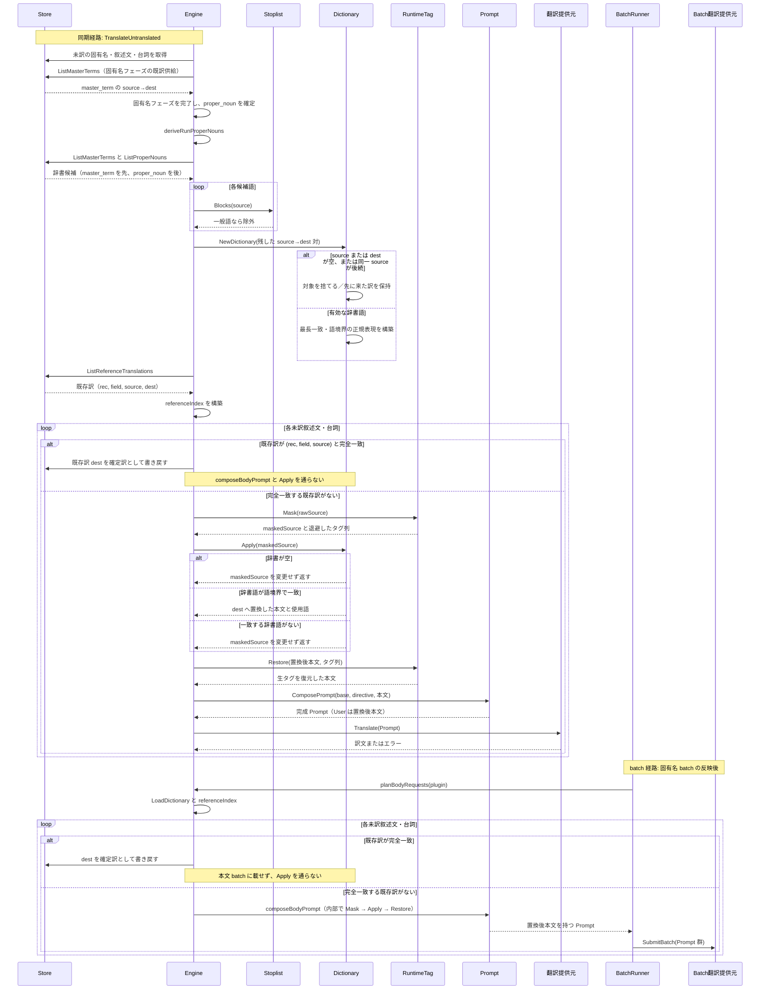

# 辞書置き換えシーケンスの比較

## 結論

探索手段を指定しない terra は、固定した5項目をすべて再構成した。terra は自分で `rg` と行範囲の読み取りを選び、Semble、CodeGraph、LSPを使わなかった。回数無制限のCodeGraph探索は7回の`codegraph_explore`だけで4項目を再構成したが、合計token数は指定なしterraの1.66倍になった。MOOSE + Semble は辞書構築と参照訳の分岐を部分的に再構成した。Ataraxis + Semble は固有名処理へ探索範囲が偏り、本文の辞書置き換えを再構成できなかった。

正解では、`Engine.Run` から本文処理へ進む途中で固有名を確定し、人名の部分形を派生してから本文用辞書を作る。本文に参照訳がなければ、実行時タグを退避し、辞書置き換え後にタグを復元してから翻訳器を呼ぶ。参照訳が完全一致する場合は、辞書置き換えと翻訳器呼び出しを通らない。

## 試行へ渡した指示文

2 回の試行では、使う skill 名だけを変えた。MOOSE には `$codegraph-moose-search`、Ataraxis には `$codegraph-ataraxis-explore` を指定した。

```text
読み取り専用のコード探索を行う。コードと設定を変更しない。

`<方式に対応する skill>`を使い、次の依頼へ回答する。

辞書置き換えの as-is 仕様を Mermaid のシーケンス図にする。参加者、呼び出し順、辞書データの受け渡し、本文へ置換する前後、処理を通らない分岐を根拠付きで示す。

対象はbackendの`/Users/iorishibata/Repositories/AITranslationEngineJP/internal`とする。Semble MCPはlocal Model2Vecとlocal cacheだけを使い、コードを外部へ送らない。利用者は、この実行でSemble MCPへ`internal`のコードを渡して検索することを明示的に許可している。過去の探索結果、`MEMORY.md`、`.codex/memories`を読まない。通常の file 再読、もう一方の方式、LSP、Graphify、Web 検索を使わない。この指定を AGENTS.md の LSP 利用規約より優先する。

最終回答は日本語にする。最初に有効なMermaidの`sequenceDiagram`を1つ示す。図の後に、図の根拠となったfile pathとsymbolまたは行番号を簡潔に示す。確認できなかった呼び出しや条件は推測で図へ追加せず、不足として明示する。
```

探索手段を指定しない terra には、次の指示文を渡した。

```text
読み取り専用で次の依頼へ回答する。コードと設定を変更しない。

辞書置き換えの as-is 仕様を Mermaid のシーケンス図にする。参加者、呼び出し順、辞書データの受け渡し、本文へ置換する前後、処理を通らない分岐を根拠付きで示す。

対象はbackendの`/Users/iorishibata/Repositories/AITranslationEngineJP/internal`とする。過去の探索結果、過去の回答、`MEMORY.md`、`.codex/memories`を読まない。探索手段は指定しない。

最終回答は日本語にする。最初に有効なMermaidの`sequenceDiagram`を1つ示す。図の後に、図の根拠となったfile pathとsymbolまたは行番号を簡潔に示す。確認できなかった呼び出しや条件は推測で図へ追加せず、不足として明示する。
```

回数無制限のCodeGraph探索には、同じ依頼へ次の条件を追加した。

```text
CodeGraphのproject pathは`/Users/iorishibata/Repositories/AITranslationEngineJP/internal`であり、各CodeGraph呼び出しへ必ず指定する。CodeGraphとその他のtoolの呼び出し回数に上限を設けない。CodeGraphが返した位置を確認するための通常のfile再読も許可する。

`rg`、`grep`、`perl`、`awk`、`git grep`、および同等の文字列横断検索は使わない。GraphifyとLSPは使わない。CodeGraphで位置を取得する前にfileを走査しない。過去の探索結果と回答を読まない。MOOSEとAtaraxisの固定手順は使わない。
```

## 正解

正解は、評価前に固定した5項目をすべて満たす同期実行のシーケンスである。図を読みやすく保つため、辞書の準備と本文の処理を分ける。

### 1. 固有名の確定から本文用辞書の構築まで



`NewDictionary` は同じ原語の最初の項目を残す。`LoadDictionary` が `master_term`、`proper_noun` の順で項目を渡すため、同じ原語では `master_term` が優先される。

### 2. 本文の参照訳分岐と辞書置き換え



## MOOSE + Semble の試行



MOOSE は、登録語彙、stoplist、辞書構築、参照訳の分岐を示した。MOOSE は、実行入口、固有名の確定と派生、runtime tag の退避と復元、翻訳器呼び出しを示さなかった。評価は 2/5 である。

## Ataraxis + Semble の試行



Ataraxis は、固有名の取得と翻訳失敗の分岐を示した。Ataraxis は、正解として固定した5項目を図から追えなかった。評価は 0/5 である。

## 探索手段を指定しない terra の試行

terra には skill 名、検索 command、MCP、LSPを指定しなかった。通常のローカル調査手段は terra 自身に選ばせ、過去の探索結果と回答だけを禁止した。



terra は、同期翻訳、一括翻訳、結果画面の3経路を1図へ含めた。固定した5項目はすべて追えるため、品質は 5/5 である。一方、一括翻訳は `provider.Translator.Translate` を直接呼ばず、本文要求を一括翻訳の提供者へ送信する。同期翻訳と一括翻訳を同じ `Translate` 呼び出しで示した箇所を、食い違い1件として数える。

terra が選んだ探索は、`rg --files` が1回、symbol候補を探す `rg` が2回、`nl` と `sed` による行範囲の読み取りが3 commandである。Codex CLI上のtool呼び出しは合計5回である。

| 方式 | 入力 token | 出力 token | 合計 token | 経過時間 | tool 呼び出し | 品質 | 食い違い |
|---|---:|---:|---:|---:|---:|---:|---:|
| 探索手段を指定しない terra | 230,964 | 3,088 | 234,052 | 69.85 秒 | 5 | 5/5 | 1 |
| 回数無制限のCodeGraph探索 | 385,029 | 3,042 | 388,071 | 70.99 秒 | 7 | 4/5 | 0 |
| MOOSE + Semble | 177,812 | 2,015 | 179,827 | 63.20 秒 | 4 | 2/5 | 0 |
| Ataraxis + Semble | 182,383 | 2,107 | 184,490 | 54.44 秒 | 4 | 0/5 | 0 |

## 回数無制限のCodeGraph探索

有効な試行では、terra は `codegraph_explore` を7回使った。文字列横断検索と通常のfile再読は使わなかった。



回数無制限のCodeGraph探索は、固有名の確定、辞書構築、本文置換、参照訳の分岐を再構成した。APIまたは`Engine.Run`から`TranslateUntranslated`へ入る呼び出しを調べなかったため、品質は 4/5 である。図とsourceの食い違いは確認しなかった。

最初の試行はCodeGraphのproject pathをrepository rootとして扱い、CodeGraphを利用できなかった。その後に`perl`を文字列検索へ使ったため無効とした。無効な試行は612,209 token、105.65秒、13回である。生データは`codegraph-unlimited-invalid-path`の名前で残した。

## 比較

| 確認項目 | 正解 | 探索手段を指定しない terra | 回数無制限のCodeGraph探索 | MOOSE + Semble | Ataraxis + Semble |
|---|---:|---:|---:|---:|---:|
| 実行入口から本文処理まで | あり | あり | なし | なし | なし |
| 固有名の確定と派生後に辞書を作る | あり | あり | あり | なし | なし |
| 登録語彙、stoplist、優先順、辞書構築 | あり | あり | あり | あり | なし |
| tag退避、辞書置換、tag復元、翻訳器呼び出し | あり | あり | あり | なし | なし |
| 参照訳の完全一致で処理を通らない分岐 | あり | あり | あり | あり | なし |

## 根拠

- `internal/engine/engine.go:155` の `Run` と `:164` の `TranslateUntranslated`
- `internal/engine/engine.go:310` の `prepareSource` と `:319` の `composeBodyPrompt`
- `internal/engine/engine.go:462` の `LoadDictionary` と `:480` の `translationVocabulary`
- `internal/core/dictionary/dictionary.go:28` の `NewDictionary` と `:65` の `Dictionary.Apply`
- `internal/engine/batch.go:284` の `BatchRunner.planLines`
- `/private/tmp/codegraph-exploration-benchmark/sequence-story/results/moose.md`
- `/private/tmp/codegraph-exploration-benchmark/sequence-story/results/ataraxis.md`
- `/private/tmp/codegraph-exploration-benchmark/sequence-story/results/unconstrained.md`
- `/private/tmp/codegraph-exploration-benchmark/sequence-story/results/codegraph-unlimited.md`

現在の Codex セッションには `lsp_status` がない。正解図は、新しい LSP 調査ではなく、評価前に固定した確認項目と、評価で保存済みの行番号付き CodeGraph 出力を根拠にした。
