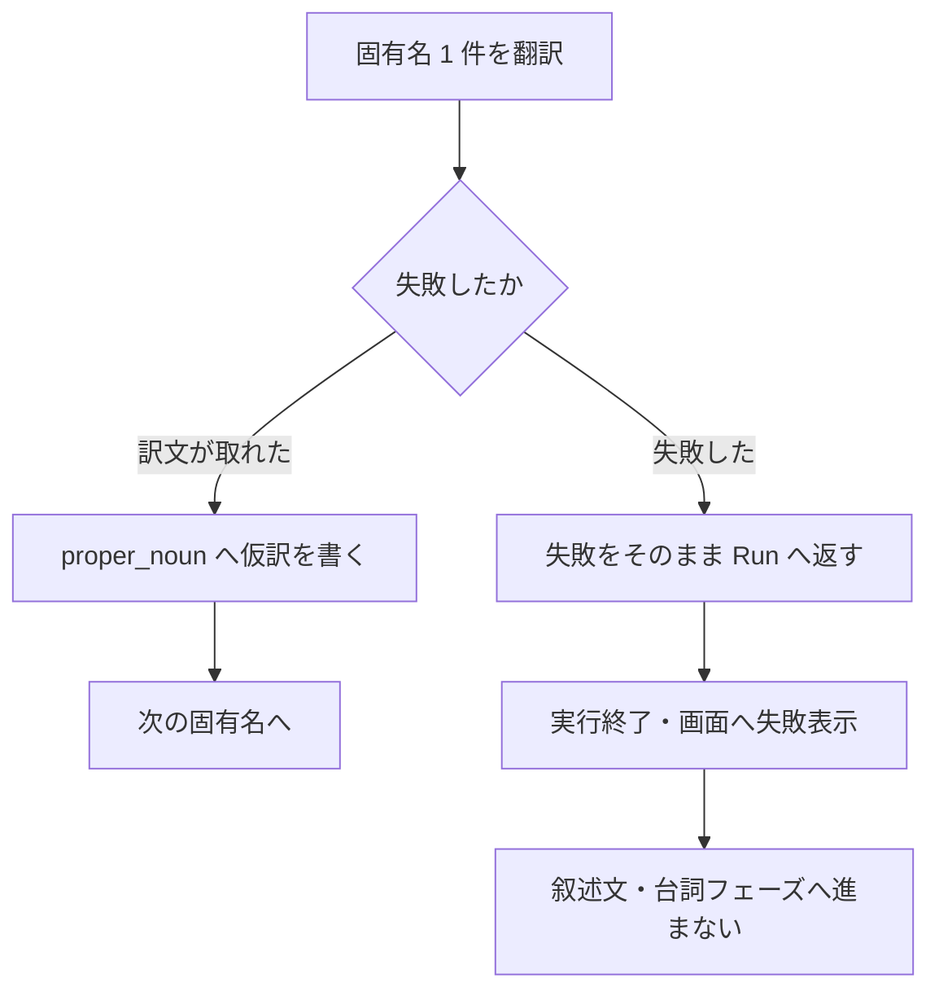
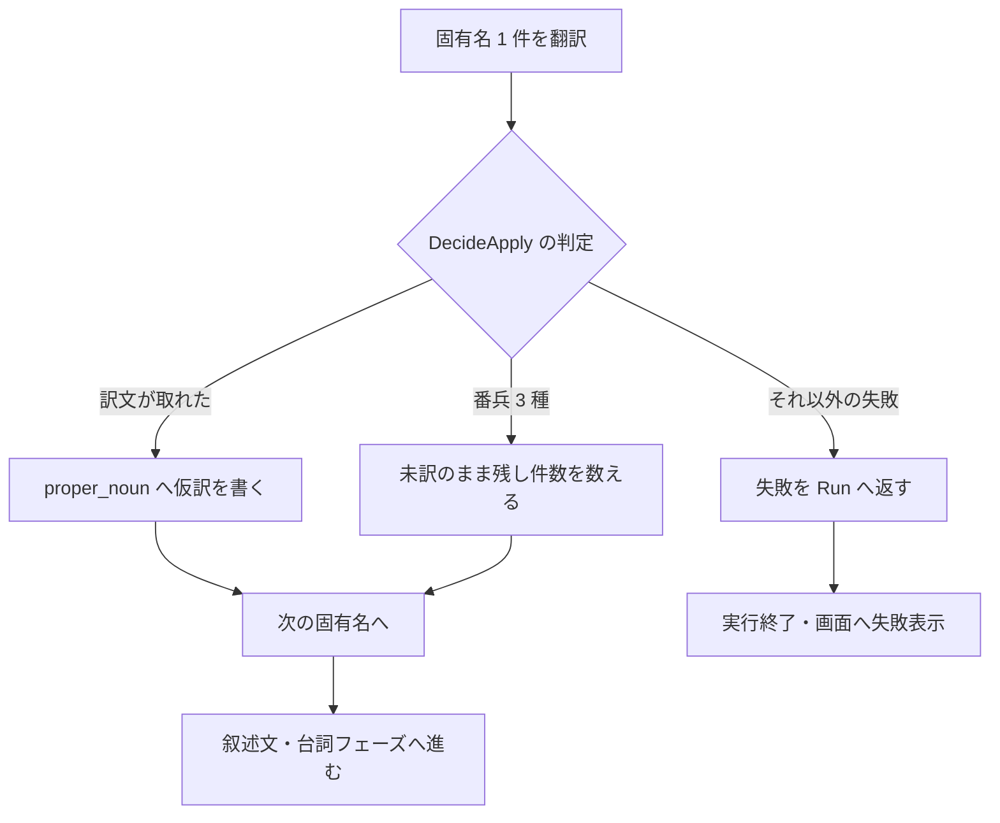
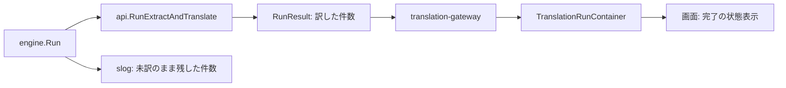
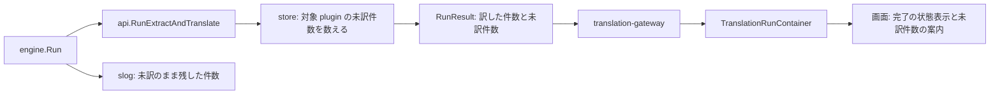

# Design: empty-translation-halts-run

`design.md` は「どう直すか」を人間が読んで判断するための説明を持つ。要求は `plan.md`、確定仕様は `spec.md`、再現確認と原因究明は `investigation.md` が持つ。
`design.md` と `spec.md` が食い違う場合は `spec.md` を優先する。

---

## R-1 固有名 1 件の skippable な失敗で実行を止めず、残り全件を訳し切る

### 現況の理解

**失敗分類を決める器**: `internal/provider/openai_compatible.go` が、翻訳応答から訳文を取れない場合を 3 つの番兵エラーへ分ける。`ErrStructuredParse`（構造化出力の空・スキーマ違反）、`ErrResponseUnreadable`（応答エンベロープの読み取り失敗）、`ErrServerTransient`（429・5xx）。同 file の doc コメントは、この 3 種について「engine は該当行を未訳のまま skip して run を続ける」を不変条件として明記する。認証・不正リクエストなど設定起因の失敗にはこの番兵を付けず、実行を止める失敗として区別する。

**振り分けを決める器**: `internal/core/batchplan/batchplan.go` の `DecideApply` が、訳文・失敗・欠落タグ数から書き戻し可否を決める純粋関数。doc コメントは「同期の本文フェーズと batch の反映が同じ関数を通し、外から見て同期と batch が変わらない」を不変条件として明記する。番兵 3 種は種別ごとの未訳据え置き（`ApplySkipStructuredParse` 等）、それ以外は `ApplyFatal`（同期は実行停止）を返す。

**振り分けを使う側**: 同期の本文フェーズ（`internal/engine/engine.go` の `translateNarrations`、`translateLines`）と batch の反映（`internal/engine/batch.go` の `applyOne`）が `DecideApply` を通す。同期の固有名フェーズ（`internal/engine/proper_noun.go` の `translateProperNouns`）だけが通さず、失敗をそのまま `Run` へ返す。`Run` は固有名フェーズの失敗で戻るため、後続の叙述文・台詞フェーズへ進まない（`investigation.md` の確定原因）。

**据え置き件数のログ**: `internal/engine/engine.go` の `lineSkips` が本文フェーズの据え置きを種別ごとに数え、`skips.log` が `where` 付きで 1 回だけ出す。loop 内の 1 件ごとのログを出さない規約（`docs/observability-logging.md`）に合わせた集約形。

| | 単位 |
| --- | --- |
| 要求が扱う対象 | 固有名 1 件の翻訳の成否 |
| 受け皿が持つキー | `proper_noun` の 1 行（`id`）。`DecideApply` は 1 件の訳文・失敗・欠落タグ数を受ける |

対象の単位と受け皿の単位はどちらも固有名 1 件で一致するため、寄せ先の判断は要らない。

### あるべき形

同期の固有名フェーズは、翻訳の失敗を `DecideApply` の振り分けに委ね、種別ごとに次の扱いをする。

- 訳文が取れた場合（`ApplyConfirm`）: 仮訳として `proper_noun` へ書く。現況と同じ。
- 番兵 3 種（`ApplySkipStructuredParse`、`ApplySkipResponseUnreadable`、`ApplySkipServerTransient`）: その固有名を未訳のまま残し、次の固有名へ進む。件数を種別ごとに数え、フェーズの終わりに 1 回だけログへ出す。
- それ以外の失敗（`ApplyFatal`）: 実行を止めて画面へ失敗を返す。認証・不正リクエスト・通信断は設定または環境の問題であり、続けても全件が同じ失敗になるため。

これにより、失敗分類に対する扱いが同期の固有名フェーズ・同期の本文フェーズ・batch の反映の 3 経路で揃う。未訳のまま残した固有名は `proper_noun` に未訳（`status = 0`）で残るので、再実行がその固有名だけを対象に取る。

未訳のまま残した固有名は機械置換辞書に載らないため、その固有名は本文中で英語のまま訳される。実行を完走させるための代償としてこれを受け入れる（`plan.md` の要求1）。

実行時タグの欠落判定（`ApplySkipTagLost`）は固有名では起きない。固有名の原文は `proper_noun.source` の語句であり、本文の実行時タグを含まないため、欠落タグ数は常に 0 として渡す。

### 変更点

**`internal/engine/proper_noun.go` の `translateProperNouns`**: AI 訳の分岐で、`e.provider.Translate` の戻り値を `batchplan.DecideApply(dest, err, 0)` へ通し、上の 4 分類で処理する。現況の「`err != nil` なら `fmt.Errorf("固有名の翻訳: %w", err)` を返す」を、`ApplyFatal` の場合だけに狭める。据え置き件数は `lineSkips` を関数内に持って数え、`skips.log(ctx, "translateProperNouns")` で 1 回出す。進捗の 1 歩（`onProcessed`）は、本文フェーズが確定時だけ数えているのに合わせ、据え置きでは呼ばない。

**`internal/engine/engine.go` の `lineSkips`**: 固有名フェーズからも使えるようにする。現況は同じ package 内の型なので、宣言の移動は要らない。doc コメントの「対象は provider の skippable な失敗」の説明へ、固有名フェーズも通ることを足す。

現況とあるべき形で、失敗 1 件に対する実行の続き方が変わる。2 図で示す。

**現況**

**あるべき形**

あるべき形で増える要素は、`DecideApply` の判定による分岐と、未訳のまま残して次へ進む経路である。現況から消える要素は、失敗すれば必ず実行が終わる経路である。

---

## R-2 実行完了時に、未訳のまま残した件数を画面へ出す

### 現況の理解

**据え置きの見え方**: 未訳のまま残した件数は `slog` の集約ログ（`lineSkips.log`、`logLostRuntimeTags`）にだけ出る。画面には出ない。実行完了後、翻訳実行画面は結果一覧を読み直して状態表示を `完了` にするだけで、何件残ったかを示さない（`frontend/src/ui/screens/translation-run/TranslationRunContainer.svelte` の `onRun`）。

**実行結果の受け皿**: `internal/api/app.go` の `RunResult` が `translatedCount`（訳した件数）1 つだけを持つ。doc コメントは「結果一覧は数万件になりうるためここでは返さず、frontend が `ListResultsPage` で取得する」を境界として明記する。`frontend/src/gateway/translation-gateway.ts` の `RunOutcome` が同じ形を写す。

**案内の表示欄**: `TranslationRunScreen.svelte` は案内用の `notice` prop を持つが、表示条件が `provider === "xai"` に限られる。同期の実行完了時には案内が出ない。

**同じ数を出している既存箇所**: `internal/store/target_plugin.go` の `targetPluginListQuery` が、対象 plugin ごとに翻訳対象の総数（`total`）と訳済み数（`translated`）を数える。叙述文・台詞・固有名を数え合わせ、機械派生した人名の部分形（`origin` が派生）は翻訳対象でないため分母にも分子にも入れない。翻訳対象プラグイン画面の進捗表示（`未着手 0 / 8803`）がこの数を使う。

| | 単位 |
| --- | --- |
| 要求が扱う対象 | 1 回の実行で未訳のまま残した件数 |
| 受け皿が持つキー | `RunResult`（実行 1 回の要約）。件数の出どころは対象 plugin ごとの集計 |

### あるべき形

実行完了時に、対象 plugin の未訳件数を実行結果の要約へ載せ、翻訳実行画面が案内として出す。

**件数の出どころ**: 実行が終わった直後に、対象 plugin の未訳件数（翻訳対象の総数 − 訳済み数）を DB から数える。実行は未訳の全件を対象に取るため、実行後に残る未訳件数がその実行で未訳のまま残した件数と一致する。数え方は翻訳対象プラグイン画面の進捗表示と同じ規則（機械派生した人名の部分形を除く）にし、2 つの画面が同じ数を示す。

この形を選ぶ理由は 2 つある。1 つは、engine の各フェーズが数えた件数を実行全体へ積み上げる形より、DB の状態を 1 度数える形の方が出どころが 1 つで済むこと。もう 1 つは、翻訳対象プラグイン画面の進捗と食い違わないことである。

**画面での出し方**: 未訳件数が 1 件以上なら、実行完了時に案内を出す。案内は残った件数と、再実行でその件数だけを訳し直せることを伝える。未訳件数が 0 件なら案内を出さず、完了の状態表示だけにする。案内欄は配送方式（同期・xAI）で出し分けず、案内の文があれば出す形へ揃える。

### 変更点

**`internal/store/target_plugin.go`**: 対象 plugin 1 件の未訳件数を返す関数を足す。集計規則は `targetPluginListQuery` と共有し（叙述文・台詞・固有名を数え合わせ、機械派生した人名の部分形を除く）、2 つの数え方が分かれないようにする。

**`internal/api/app.go`**: `RunResult` へ未訳件数の field を足す。`RunExtractAndTranslate` が `a.engine.Run` の後にその件数を数えて `RunResult` へ載せる。実行が失敗を返した場合は現況どおりエラーを返し、案内は出さない。

**`frontend/src/gateway/translation-gateway.ts`**: `RunOutcome` へ未訳件数を足し、`runExtractAndTranslate` が写す。

**`frontend/src/ui/screens/translation-run/TranslationRunContainer.svelte`**: `onRun` の成功後に、未訳件数から案内の文を組んで `notice` へ入れる。0 件なら `notice` を空にする。

**`frontend/src/ui/screens/translation-run/TranslationRunScreen.svelte`**: `notice` の表示条件から `provider === "xai"` を外し、`notice` に文があれば出す形にする。表示変更を伴うため、story の追加は `storybook-module` が扱う。

現況とあるべき形で、実行完了時の情報の流れが変わる。2 図で示す。

**現況**

**あるべき形**

あるべき形で増える要素は、実行後に未訳件数を数える段と、画面の案内である。`slog` の集約ログは現況のまま残す（種別ごとの内訳はログが持ち、画面は合計だけを出す）。

---

## 検討が必要なこと

- なし。
