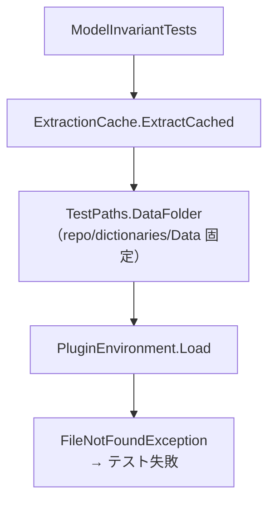
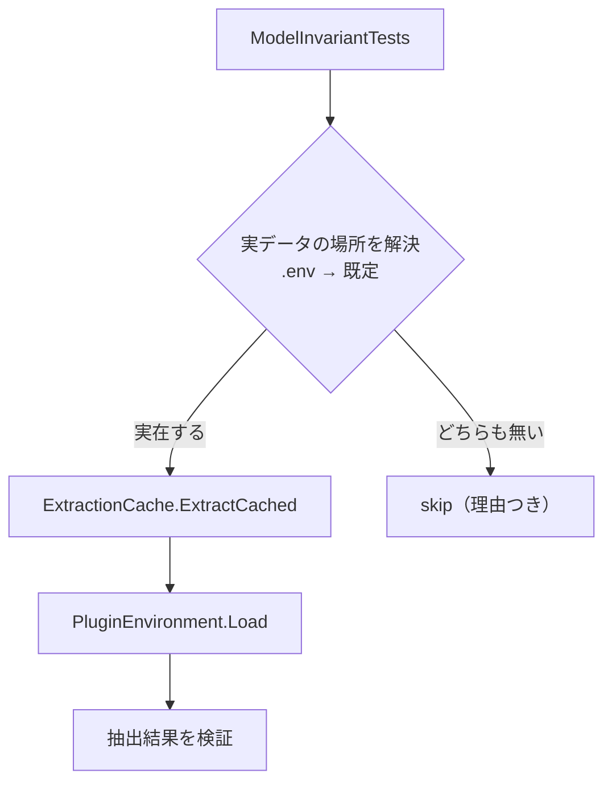

# Design: extractor-test-failures

`design.md` は「どう直すか」だけを持つ。再現確認と原因究明は `investigation.md` が持つ。

## 実装方針

確定原因は 2 つあり、直し方も 2 つに分かれる。どちらもテスト側の前提と後片付けを直すもので、抽出ロジック本体は変えない。

### どこまで動かすか

task 後に観測できる振る舞いは次のとおりで、観測点は単体テスト（`dotnet test tools/extractor.Tests`）とする。

- 実データの場所を `.env` で指していない機械では、30 件中 21 件が合格し、9 件が skip になる。失敗は 0 件になる。
- 実データの場所を `.env` で指した機械では、skip だった 9 件が実行される。9 件は実データ（`Dawnguard.esm`・`Update.esm`）の抽出結果を検証するもので、実行して初めて合否が分かる。合否そのものは本 task の goal に含めない。実データを指せば実行される状態にすることを goal とする。
- 一時 SQLite ファイルの削除は全件成功し、`IOException` による失敗は 0 件になる。

### AS-IS と TO-BE の対応

| 変更点 | AS-IS（現状） | AS-IS の根拠ソース | TO-BE（変更後） | 変更予定箇所と実現主張 |
| --- | --- | --- | --- | --- |
| 実データの場所指定 | 場所は `<repo>/dictionaries/Data` に固定で、外から変える手段が無い | `tools/extractor.Tests/ExtractionCache.cs:20`（`TestPaths.DataFolder` が `RepoRoot` と `dictionaries`・`Data` を連結して返す） | repo root の `.env` のキー `AITRANSLATIONENGINEJP_SKYRIM_DATA_DIR` を先に見て、無ければ既定 `<repo>/dictionaries/Data` を使う | `tools/extractor.Tests/ExtractionCache.cs` の `TestPaths` へ解決順を持たせる。`.env` は `KEY=VALUE` 行を拾い `#` 行を無視しクォートを剥がす単純パーサで読める。読む対象は `scripts/dev/run-wails.sh:9-12` が source するのと同じ repo root の `.env` |
| 実データ不在時の扱い | 実データが無いと例外で失敗し、環境の未整備と抽出の不具合を実行結果から区別できない | 例外の発生元は `tools/extractor/PluginEnvironment.cs:82`。呼び出し元は `tools/extractor.Tests/ModelInvariantTests.cs:11`・`99`・`119`（`ExtractionCache.ExtractCached`） | 解決した場所が実在しない場合は、該当テストを失敗ではなく skip として記録する | `tools/extractor.Tests/` へ `FactAttribute` を継承した属性を足し、`ModelInvariantTests` の `[Fact]` を差し替える。属性のコンストラクタで実在を見て `Skip` へ理由を入れる形は、同じ構成（xunit 2.9.2 + xunit.runner.visualstudio 2.8.2）で skip として記録されることを実測で確認済み |
| 一時 DB の後片付け | `File.Delete` を直接呼ぶため、接続プールがファイルを保持していて `IOException` になる | `tools/extractor.Tests/OracleInput.cs:68`、`tools/extractor.Tests/ExtractedFieldSqliteWriterTests.cs:69`・`121`・`143`、`tools/extractor.Tests/SpeakerSqliteWriterTests.cs:74`・`95` | 削除の前に `SqliteConnection.ClearPool` でプールを解放してから `File.Delete` を呼ぶ | 6 箇所へ散っている後片付けを 1 つのヘルパへ寄せ、解放と削除の順序をヘルパ 1 箇所に持たせる。ヘルパの置き場所と名前は実装時に決める。解放してから消せば削除が通ることは最小再現で確認済み |

### 系統 A: 実データの場所を指定できるようにする

**AS-IS**: 実データを読むテスト（`ModelInvariantTests`）は、`TestPaths.DataFolder` が返す `<repo>/dictionaries/Data` だけを見る。この場所は固定で、外から変える手段が無い。実データが別の場所にある機械では、テストは必ず `FileNotFoundException` で失敗する。実データを持たない機械でも同じく失敗する。失敗と skip の区別が無いため、「実データが無い」ことと「抽出が壊れている」ことを実行結果から見分けられない。

**TO-BE**: 実データの場所を 2 段の優先順で解決する。上から順に見て、最初に実在したものを使う。

1. repo root の `.env` に書かれたキー `AITRANSLATIONENGINEJP_SKYRIM_DATA_DIR`
2. 既定値 `<repo>/dictionaries/Data`

どちらも実在しない場合は、実データを要るテストを失敗ではなく skip にする。実行結果は「実データが無いので skip した」と読めるようになり、抽出の不具合と環境の未整備を区別できる。実データがある機械では従来どおり実行する。

指定手段を `.env` だけにし、プロセスの環境変数は読まない。`.env` を使うのは、repo に既に `.env` の規約があるためである。`scripts/dev/run-wails.sh:9-12` は repo root の `.env` を読み、`.env.example` が設定例を持ち、`.gitignore:16` が `.env` を追跡外にしている。`dotnet test` は `run-wails.sh` を経由しないので、テスト側で `.env` ファイルを直接読む。読み方は `KEY=VALUE` 形式の行を拾い、`#` で始まる行を無視し、値の前後のクォートを剥がす範囲に限る。パスに空白を含むため（`Skyrim Special Edition`）、`.env` 側ではクォートで囲む前提にする。

`.env.example` へは同じキーの設定例を追記する。`.env.example` は追跡対象なので、他の機械でも設定すべき項目として残る。

skip の実現手段は、`FactAttribute` を継承した属性で表す。使用中の xunit 2.9.2 は動的 skip（`Assert.Skip` 系）を持たず、`Assert.SkipUnless` はコンパイルが通らないことを確認した。属性のコンストラクタで実データの実在を見て、無ければ `Skip` プロパティへ理由を入れる手法は、同じ構成で skip として記録されることを確認済みである。repo には既に `OracleAttribute` という属性があり、属性でテストの性質を表す形は既存の書き方と揃う。

AS-IS の流れ。

TO-BE の流れ。

### 系統 B: 一時 DB を消す前に接続プールを解放する

**AS-IS**: 一時 DB を消す後片付けは `File.Delete` を直接呼ぶ。`Microsoft.Data.Sqlite` の接続プールがファイルを開いたまま保持しているため、削除が拒否されて `IOException` になる。テスト本体の検証は通っているのに、後片付けの例外で失敗と記録される。同じ後片付けが 6 箇所にあり、いずれも同じ理由で失敗する。

**TO-BE**: 一時 DB を消す前に、その DB を指す接続文字列のプールを `SqliteConnection.ClearPool` で解放してから `File.Delete` を呼ぶ。解放してから消せば削除が通ることは最小再現で確認済みである。

接続文字列に `Pooling=False` を付ける方法も削除は通るが、採らない。理由は、一時 DB へ書き込むのはテストではなく writer 側（`tools/extractor/ExtractedFieldSqliteWriter.cs:17` ほか）であり、writer が使う接続文字列はプロダクトコードが `Data Source={dbPath}` 固定で組み立てるため、テストからは変えられないことによる。テストの都合でプロダクトコードの接続文字列を変えるのは、テスト以外の実行にも影響するので避ける。

### 直さない直し方

- 削除失敗を `try`/`catch` で握り潰す形は採らない。ファイルが残り続ける事実を隠すだけで、原因（プールがファイルを保持している）は残る。
- `File.Delete` の前に待機や再試行を挟む形は採らない。プールは時間で解放されないので、待っても消えるとは限らない。
- 実データが無い場合に、テストの期待値を「空でもよい」へ緩める形は採らない。実データでの検証という目的が失われる。
- `dictionaries/Data` へ実データの複製を置く形は採らない。追跡外の巨大データを増やすうえ、機械ごとの場所の違いは解決しない。

## 検討が必要なこと

なし。

指定手段は `.env` だけとし、プロセスの環境変数は読まない（人間の判断で確定）。`.env` のキー名は `AITRANSLATIONENGINEJP_SKYRIM_DATA_DIR` とする。既存の `.env.example` が `AITRANSLATIONENGINEJP_` で始まる名前で揃っており、その並びに合わせる。実データが無い機械では `ModelInvariantTests` が skip になり、実データ検証が走ったかどうかは実行結果の skip 件数で判断する。
