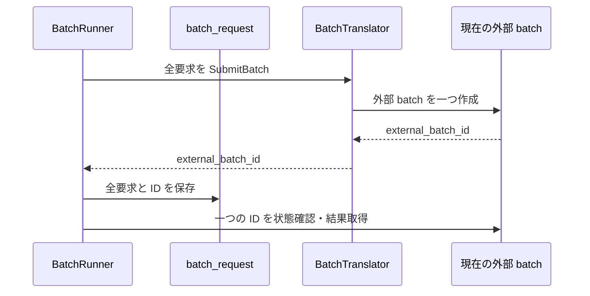
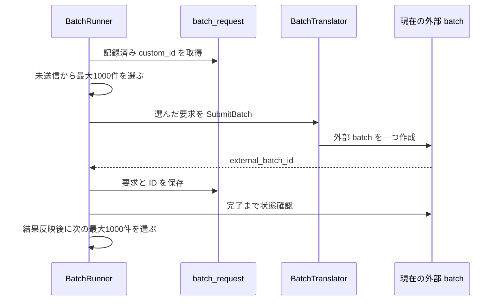
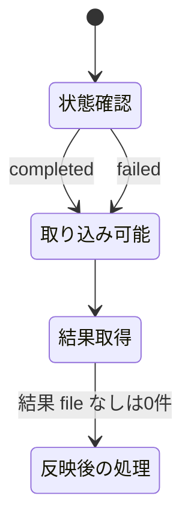
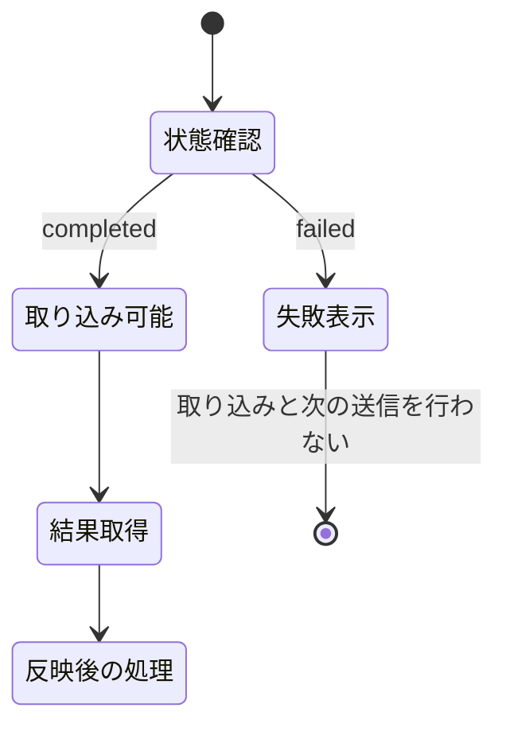

# Design: fix-batch-failure-handling

最大1000件の外部 batch を一つずつ処理する。現在の外部 batch が完了するまで次を送らないため、同じ実行が queued prompt tokens を同時に積み増さない。OpenAI が外部 batch を `failed` と返した場合は、結果 file の取得より前に処理を止め、既存の画面エラー表示へ失敗理由を返す。

OpenAI の公式資料では、`failed` は入力 file の検証失敗であり、結果を取得できる `completed` とは別の状態である。queued prompt tokens の上限は model ごとに異なる。1000件は利用者が指定した送信単位であり、OpenAI が定める上限値から算出した件数ではない。

根拠: [OpenAI Batch API](https://developers.openai.com/api/docs/guides/batch)

---

## R-1 batch を最大1000件ずつ順番に送る

### 現況の理解

`internal/engine/batch.go` の `sendStage` は、固有名または本文の全要求を `BatchTranslator.SubmitBatch` へ一度に渡す。`internal/provider/batch.go` の `SubmitBatch` は、要求群を一つの外部 batch として送り、外部 batch ID を一つ返す。

`internal/model/batch_translation.go` の `BatchTranslation` と `db/migrations/0013_batch_translation.sql` の `batch_translation` は、対象 plugin と1対1の進行を持つ。`proper_batch_id` と `body_batch_id` は、各段で現在処理している外部 batch ID を一つ持つ。

`batch_request` は送信した要求ごとに `batch_id`、`external_batch_id`、`custom_id` を持つ。`UNIQUE(batch_id, custom_id)` は、同じ進行で同じ翻訳対象を二重に記録しない。

`BatchRunner.ProgressStatus` と `BatchRunner.refreshOne` は、各段の外部 batch ID 一つだけを状態確認する。`refreshOne` は外部 batch が終端に達すると結果を反映し、固有名段なら本文段へ、本文段なら完了へ進める。

| | 単位 |
| --- | --- |
| 要求が扱う対象 | 最大1000件の要求を持つ外部 batch 一つ |
| 受け皿が持つキー | 対象 plugin と1対1の `batch_translation.id`、要求と1対1の `batch_request.custom_id`、現在処理している `external_batch_id` |

#### 現況

### あるべき形

`BatchRunner` は、固有名段と本文段の要求を先頭から最大1000件だけ外部 batch へ送る。`batch_translation` の各段の ID は、現在処理している外部 batch ID を持つ。

現在の外部 batch が完了した場合、`BatchRunner` は結果を反映する。`BatchRunner` は同じ段で未送信の要求が残る場合に、次の最大1000件を送る。未送信の要求が無い場合だけ、固有名段から本文段、または本文段から完了へ進める。

`batch_request` は、同じ段ですでに送信した `custom_id` を保持する。`BatchRunner` は、送信計画から記録済みの `custom_id` を除いて次の最大1000件を選ぶ。外部 batch を同時には送らない。

画面の総数、処理待ち、成功、失敗は、現在処理している最大1000件の外部 batch の件数を示す。

#### あるべき形

現況から消える要素は、全要求を一度に送る処理である。あるべき形で増える要素は、記録済みの要求を除く処理と、同じ段の次の最大1000件を送る判断である。

### 変更点

- `internal/engine/batch.go` の `BatchStore` に、進行 ID と進行段から送信済みの要求を読む操作を加える。
- `internal/store/batch_translation.go` に、`batch_request` を進行 ID と進行段で読む関数を加える。固有名段は `kind='p'`、本文段は `kind IN ('n','l')` で区別する。
- `internal/engine/batch.go` の `sendStage` は、記録済みの `custom_id` を除き、先頭の最大1000件だけを送信する。
- `internal/engine/batch.go` の `refreshOne` は、現在の外部 batch の結果を反映した後、同じ段の未送信要求が残る場合に次の最大1000件を送る。同じ段の未送信要求が無い場合だけ次の段へ進める。
- `internal/model/batch_translation.go` の `BatchTranslation` と `internal/store/batch_translation.go` のコメントは、各段の ID が現在処理している外部 batch ID であることへ揃える。
- `internal/core/batchplan/batchplan.go` の段を進める判断は、現在の外部 batch の完了だけで段を進めず、同じ段の未送信要求が無いことも呼び出し側が確認してから使う形へ揃える。

---

## R-2 failed の取り込みを止めて失敗理由を表示する

### 現況の理解

`internal/provider/openai_batch.go` の `openAIBatchTerminal` は、`completed`、`failed`、`expired`、`cancelled` の全てを `BatchStatus.Done=true` にする。`internal/core/batchplan/batchplan.go` の `BuildProgress` は `Done=true` を `CanApply=true` にする。

`BatchRunner.refreshOne` は `Done=true` の場合に `applyResults` を呼ぶ。`OpenAIBatch.FetchResults` は `output_file_id` と `error_file_id` が両方空の場合に空の結果を返す。したがって、`failed` は0件の結果を正常に取得した状態として段を進める。

`internal/api/app.go` の `GetBatchProgress` は engine のエラーを返す。`frontend/src/ui/screens/translation-run/TranslationRunContainer.svelte` の `onCheckStatus` と `onApply` は、返されたエラーを既存の `errorMessage` へ設定する。

| | 単位 |
| --- | --- |
| 要求が扱う対象 | OpenAI の外部 batch 一つの `failed` 状態 |
| 受け皿が持つキー | `external_batch_id` と OpenAI Batch object の `status`、`errors.data` |

#### 現況

### あるべき形

`OpenAIBatch` は `status=failed` を結果取得可能な終端として扱わない。`status=failed` の場合は、外部 batch ID と `errors.data` の `code` と `message` を含むエラーを返す。失敗理由が無い場合は、外部 batch ID と `failed` を含むエラーを返す。`completed`、`expired`、`cancelled` の既存動作は変えない。

`BatchRunner.ProgressStatus` と `BatchRunner.refreshOne` は、`failed` のエラーをそのまま上位へ返す。`refreshOne` は `FetchResults`、結果の書き戻し、次の最大1000件の送信、段の更新を行わない。

`OpenAIBatch.FetchResults` も Batch object を確認し、`status=failed` の場合は空結果を返さずエラーにする。呼び出し順が変わっても0件の正常取り込みにならない。

既存の API と画面はエラーを表示する経路を持つため、画面の構造、文言、style は変更しない。

#### あるべき形

現況から消える要素は、`failed` を取り込み可能とする遷移である。あるべき形で増える要素は、OpenAI の失敗理由を返して処理を止める遷移である。

### 変更点

- `internal/provider/openai_batch.go` の `openAIBatchObject` に、OpenAI Batch object の `errors.data` にある `code` と `message` を読む構造を加える。
- `internal/provider/openai_batch.go` の `PollBatch` は、`status=failed` の場合に失敗理由を含むエラーを返す。
- `internal/provider/openai_batch.go` の `FetchResults` は、`status=failed` の場合に空結果ではなく失敗理由を含むエラーを返す。
- `internal/provider/openai_batch.go` の `openAIBatchTerminal` は、`failed` を結果取得可能な終端として扱わない。`expired` と `cancelled` の既存動作は維持する。
- `internal/engine/batch.go` の `ProgressStatus` と `refreshOne` は provider のエラーを受けた場合に、結果取得、次の送信、段の更新を行わず上位へ返す既存の経路を維持する。

---

## 検討が必要なこと

- なし
