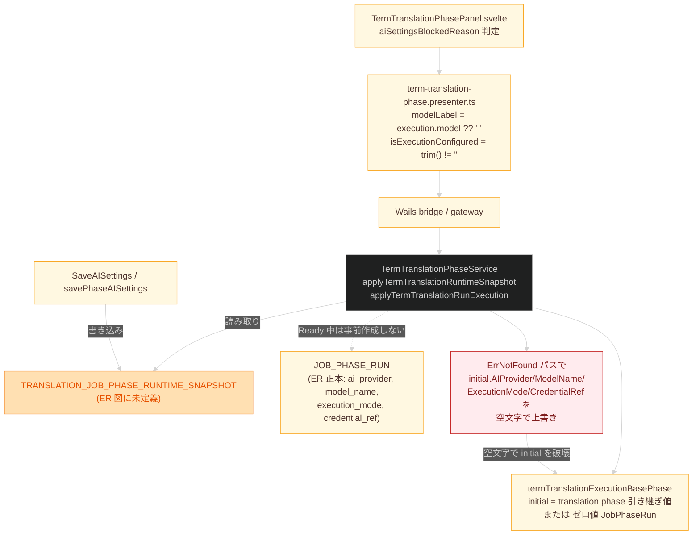
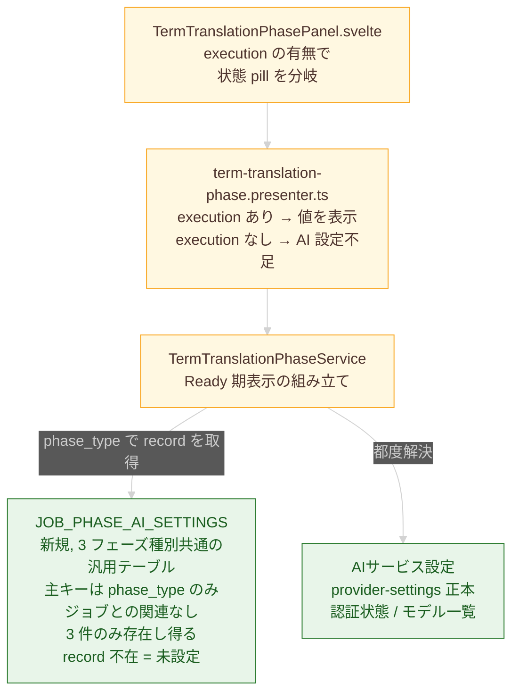
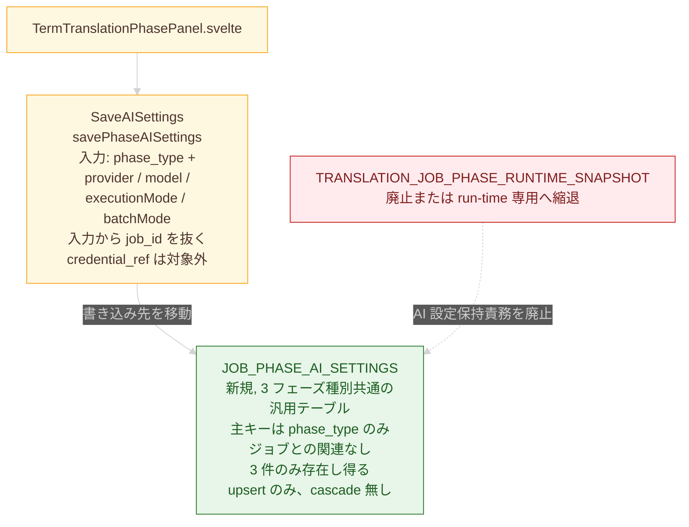
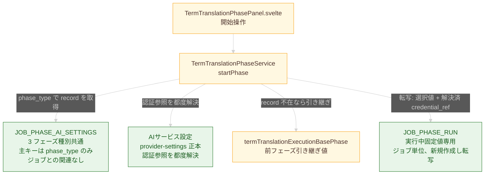
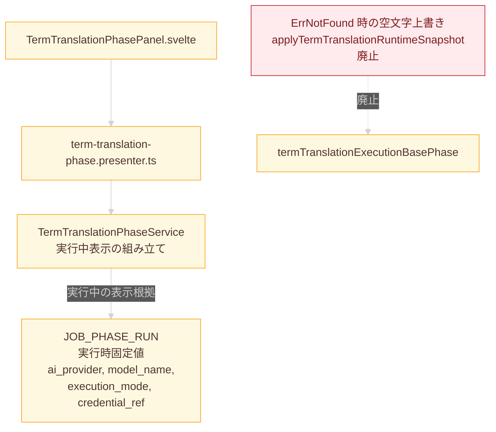
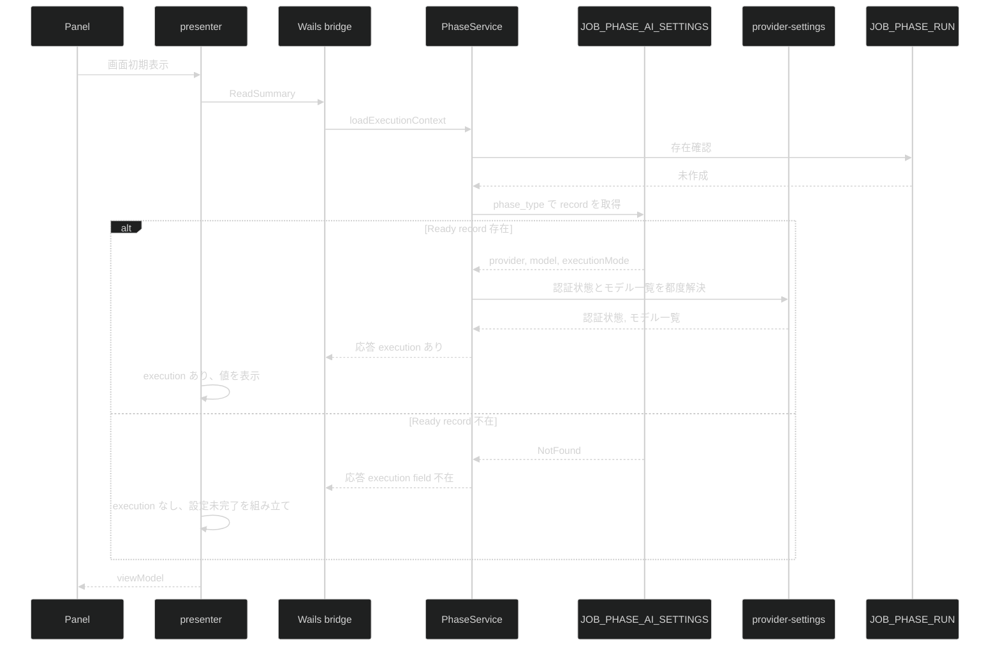
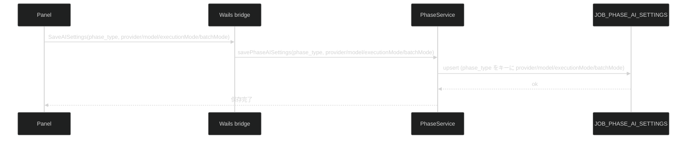
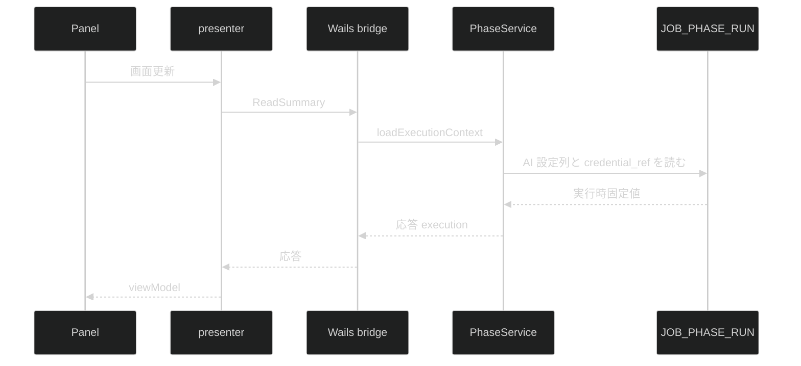

# fix-term-translation-model-settings-empty-fixed 設計差分図

## 概要

- 図化目的: 並走で固定された詳細仕様差分（方向 B 採用）に基づき、Ready 期 AI 設定の保持責務を独立テーブルへ移し、`JOB_PHASE_RUN` の AI 設定列を実行中固定値専用にする責務再配置を、人間設計レビューで判断するために図化する。
- 根拠参照:
  - `./detail-spec-diff.md`（並走で固定、方向 B 採用、`er-REQ-001`、`er-REQ-002`、`term-translation-phase-REQ-002`、`term-translation-phase-REQ-007`）
  - `./plan.md`（design-module 入口の想定 Y/N、人間レビュー指摘「空文字は異常結果でしかない」「snapshot は『動いてるぶん』だけ」「設定なしは record 不在で表現」）
  - `./fix-decision.md`（確定原因、採用方針、禁止修正）
  - `docs/er.md:23-26,64-73`（フェーズ別 AI 設定保持規約、Ready 期 `JOB_PHASE_RUN` 未作成規約）
  - `docs/diagrams/er/combined-data-model-er.puml:167-183`（`JOB_PHASE_RUN` AI 設定列定義）
  - `docs/screen-design/screens/term-translation-phase.md:91-129`（AI 設定状態分岐）
  - `internal/service/term_translation_phase_service.go:1454-1510`（`applyTermTranslationRuntimeSnapshot`、`applyTermTranslationRunExecution`）
  - `internal/service/provider_execution_snapshot.go:90-178`（`providerExecutionSnapshotFromRuntimeSnapshot`、`savePhaseAISettings`）
- 範囲: 単語翻訳フェーズの AI 設定永続化と読み取り経路に絞る。persona-generation、body-translation、画面構造、gateway 経路は変えない接続先として扱う。
- 確定済み回答（人間レビュー反映）:
  - `Q-001`: 3 フェーズ同時に ER 仕様変更と実装を適用する。`JOB_PHASE_AI_SETTINGS` を 3 フェーズ種別共通の汎用テーブルとして設計し、`phase_type` で区別する。
  - `Q-002`: 独立テーブルの正式名を `JOB_PHASE_AI_SETTINGS` に確定する。本図中の表記から「仮称」を外す。
  - `Q-004`: 主キーは `phase_type` のみとし、ジョブとの関連を持たない。3 フェーズ種別の 3 件のみが存在し得る。`SaveAISettings` 入力からも `job_id` を抜く。削除経路は上書き（upsert）のみで、cascade も明示削除 API も持たない。
- 未決: `Q-003`（Ready 期 record と provider-settings 正本の責務分担）は引き続き人間回答待ち。

## 差分凡例

- 赤: 削除する要素または経路を示す。
- 緑: 追加する要素または経路を示す。
- 黄色: 変更しない要素または経路を示す。
- 灰: 補足、確認観点。

## 採用根拠（方向 B）

並走の詳細仕様差分が方向 B を採用した。理由を本図の根拠として要約する。

- 人間レビュー指摘「snapshot は『動いてるぶん』だけ、設定は別の共有ストアで保持」「設定なしは record 不在で表現」と整合する。空文字 record で「未設定」を代理表現する構造を作らずに済む。
- ER 正本 `docs/er.md:67-68`「`Ready` job には `JOB_PHASE_RUN` を事前作成しない」を維持できる。Ready 期の保存値は別 record に置き、`JOB_PHASE_RUN` は実行情報専用に保つ。
- ER 正本 `docs/er.md:26`「フェーズ別 AI 設定、指示構成、最終 AI 実行情報は `JOB_PHASE_RUN` に保持する」は、実行中固定値の保持規約として残し、Ready 期保存値は独立テーブルが担う。
- 人間判断（`Q-001` 回答）により 3 フェーズ同時に同型 ER 差分を入れる。`JOB_PHASE_AI_SETTINGS` を 3 フェーズ種別共通の汎用テーブルとして再利用し、`phase_type` で区別する。fix-decision の「禁止修正 5」（影響範囲を単語翻訳に限定）は本回答で覆る。

方向 A（snapshot を ER 正本化）と方向 C（provider-settings 一本化）は不採用。方向 A は空文字代理表現の誘因が残り、方向 C は Ready 期にフェーズ単位の利用者選択を保持できない。

## 現状の責務関係（修正前）

### 現状の各箱の説明

- `TermTranslationPhasePanel.svelte`: 状態 pill と AI 設定パネルを描画する。`viewModel.modelLabel === "-"` で「設定未完了」へ分岐する判定を持つ。
- `term-translation-phase.presenter.ts`: backend 応答から `modelLabel`、`providerLabel`、`isExecutionConfigured` を派生する。空文字 `""` はそのまま通り抜ける。
- `Wails bridge / gateway`: backend と frontend を接続する。本 task では変えない。
- `TermTranslationPhaseService`: フェーズ実行コンテキストを組み立てる。`applyTermTranslationRuntimeSnapshot` と `applyTermTranslationRunExecution` で snapshot を読む。
- `termTranslationExecutionBasePhase`: `translation` フェーズ完了時の AI 設定をフェーズ初期値（`initial`）として返す。引き継ぎ値が無い場合はゼロ値 `JobPhaseRun` を返す。
- `TRANSLATION_JOB_PHASE_RUNTIME_SNAPSHOT`: 現状実装にだけ存在し、ER 図正本に定義が無いテーブル。Ready 状態のフェーズ AI 設定の保存先として使われている。
- `JOB_PHASE_RUN`: ER 正本で `ai_provider`、`model_name`、`execution_mode`、`credential_ref` を持つテーブル。`docs/er.md:67-68` により Ready 中は事前作成しない。
- `SaveAISettings / savePhaseAISettings`: ユーザーの AI 設定保存を受け、現状は `TRANSLATION_JOB_PHASE_RUNTIME_SNAPSHOT` へ直接書き込む。
- `BugPath`: snapshot 未存在時に `initial` を空文字で上書きする経路。fix-decision で確定した仕様逸脱。

## 採用案（方向 B）の責務関係（修正後）

採用案を 4 つの局面に分けて描く。テーブル名 `JOB_PHASE_AI_SETTINGS` は人間判断（`Q-002` 回答）で正式名に確定済み。

### 採用案 図 1: Ready 期表示

### 採用案 図 2: AI 設定保存

### 採用案 図 3: フェーズ開始時の転写

### 採用案 図 4: 実行中の表示と廃止経路

### 採用案の各箱の説明

- `JOB_PHASE_AI_SETTINGS (新規)`: Ready 期にフェーズ種別単位で利用者が保存した AI 選択値（AI サービス、モデル、処理方式）を保持する独立 record。3 フェーズ種別（term-translation、persona-generation、body-translation）共通の汎用テーブルとして設計し、`phase_type` で区別する。主キーは `phase_type` のみとし、ジョブとの関連を持たない。3 件のみが存在し得る。record 不在で「未設定」を表す。削除経路は upsert（上書き）のみとし、cascade や明示削除 API を持たない。認証参照（`credential_ref`）は本 record に保持しない。認証参照、認証状態、モデル一覧は AIサービス設定（provider-settings 正本）の責務とする。
- `AIサービス設定 (provider-settings 正本)`: 利用者単位で登録された AI サービスごとの認証参照、認証状態、モデル一覧を保持する正本。本 task では既存正本として扱い、Ready 期表示時と開始時の認証参照解決経路だけを追加する。値は record に複製せず、都度解決で参照する。
- `SaveAISettings / savePhaseAISettings`: 書き込み先を `TRANSLATION_JOB_PHASE_RUNTIME_SNAPSHOT` から `JOB_PHASE_AI_SETTINGS` へ移す。入力は `phase_type` と `provider`、`model`、`executionMode`、`batchMode` とし、`job_id` を入力から抜く。upsert 対象は `provider`、`model`、`executionMode`、`batchMode` に限定し、`credential_ref` は upsert 対象に含めない。空文字フィールドで未設定を代理表現しない。
- `フェーズ開始時の転写 (StartTransfer)`: フェーズ開始が許可された時点で `JOB_PHASE_RUN` を新規作成する（`JOB_PHASE_RUN` は引き続きジョブ単位）。`phase_type` をキーに Ready 期 record を取得し、選択値（provider / model / executionMode）を読み、provider-settings 正本から認証参照（`credential_ref`）を解決し、両者を合わせて `JOB_PHASE_RUN` の AI 設定列へ転写する。Ready 期 record の不在は開始操作の拒否理由（AI 設定不足）になるため、転写は record 存在を前提に成立する。
- `JOB_PHASE_RUN (実行中固定値専用)`: ER 正本 `docs/er.md:26` の規定どおり、実行中の固定値を保持する。`credential_ref` 列は、フェーズ開始時に provider-settings から解決した認証参照値の記録に責務を絞る。Ready 期保存値の保持には使わない。Ready 中の事前作成は引き続き禁止する。
- `TRANSLATION_JOB_PHASE_RUNTIME_SNAPSHOT`: AI 設定保持責務を `JOB_PHASE_AI_SETTINGS` へ移す。table 自体を廃止するか、`provider_execution_snapshot.go` の他の責務（run-time の観測用 snapshot）に限定して縮退するかは実装範囲固定時に判断する。
- `TermTranslationPhaseService`: 読み取り元を Ready 期と実行中で明確に分岐する。未開始（`JOB_PHASE_RUN` 未作成）の表示は `JOB_PHASE_AI_SETTINGS` を、実行中の表示は `JOB_PHASE_RUN` を根拠にする。認証状態とモデル一覧は Ready 期表示時に provider-settings から都度解決する。応答は「Ready 期 record の値全体」または「設定なし応答（`execution` field 不在）」の二択とし、Service 側で派生情報（blocked reason、設定不足の理由）を組み立てない。`applyTermTranslationRuntimeSnapshot` の `ErrNotFound` 内の空文字上書きは廃止する。
- `Presenter / UI`: 応答 DTO の `execution` field の有無で AI 設定状態を判定する。`execution` あり → 値を表示、`execution` なし → AI 設定不足として表示する。「設定不足の理由」「blocked reason」など派生表現は presenter / UI 側で組み立て、backend から受け取らない。

### 採用案の差分点

- 追加: `JOB_PHASE_AI_SETTINGS`（仮称、`credential_ref` を持たない）を ER 正本に新設する。`SaveAISettings` の書き込み先と upsert 対象（`credential_ref` を含めない）を新テーブルに変更する。フェーズ開始時の Ready 期 record と provider-settings 解決結果を合わせた `JOB_PHASE_RUN` への転写経路を追加する。Ready 期表示時の provider-settings 都度解決経路を追加する。Presenter / UI の判定根拠を `execution` field の有無に変更する。
- 削除: `TRANSLATION_JOB_PHASE_RUNTIME_SNAPSHOT` の AI 設定保持責務。`applyTermTranslationRuntimeSnapshot` の `ErrNotFound` 内の空文字上書き。空文字フィールドで未設定を代理表現する経路。backend が「blocked reason」「設定不足の理由」などの派生情報を組み立てて返す経路。
- 移動なし: ER 正本 `docs/er.md:67-68`（Ready 中の `JOB_PHASE_RUN` 未作成）、`docs/er.md:26`（実行中固定値の保持先）、画面構造、gateway 経路、`termTranslationExecutionBasePhase` の前フェーズ引き継ぎ責務、provider-settings 正本の責務範囲。

## シーケンス図（方向 B、4 場面に分割）

### シーケンス図 場面 1: Ready 期の画面初期表示

注: 派生情報（blocked reason、設定不足の理由）は backend では組み立てず presenter 側で組み立てる。

### シーケンス図 場面 2: AI 設定保存

注: 入力から job_id を抜く。credential_ref は upsert 対象に含めない。削除経路は upsert のみで cascade も明示削除 API も持たない。

### シーケンス図 場面 3: フェーズ開始時の転写

```mermaid
%%{init: {"theme":"dark"}}%%
sequenceDiagram
    participant UI as Panel
    participant Bridge as Wails bridge
    participant Service as PhaseService
    participant Ready as JOB_PHASE_AI_SETTINGS
    participant Provider as provider-settings
    participant Run as JOB_PHASE_RUN

    UI->>Bridge: StartPhase
    Bridge->>Service: startPhase
    Service->>Ready: phase_type で record を取得
    alt Ready record 存在
        Ready-->>Service: provider, model, executionMode
        Service->>Provider: 当該 provider の認証参照を都度解決
        alt credential 解決可
            Provider-->>Service: credential_ref
            Service->>Run: JOB_PHASE_RUN を新規作成（ジョブ単位）、Ready record の選択値と provider-settings の credential_ref を転写
            Run-->>Service: created
            Service-->>UI: 開始成立
        else credential 解決不可
            Provider-->>Service: 認証参照解決失敗
            Service-->>UI: 開始拒否
        end
    else Ready record 不在
        Ready-->>Service: NotFound
        Service-->>UI: 開始拒否
    end
```

### シーケンス図 場面 4: 実行中の表示

## 検証観点

- 方向 B との整合: 図中の Ready 期 record と `JOB_PHASE_RUN` の責務分担が、詳細仕様差分 `er-REQ-001`（Ready 期 record の独立保持）、`er-REQ-002`（`JOB_PHASE_RUN` の AI 設定列を実行中固定値に限定）、`term-translation-phase-REQ-002`、`term-translation-phase-REQ-007` の記述と一致することを確認する。
- 名称の確定: 図中のテーブル名 `JOB_PHASE_AI_SETTINGS` は人間判断（`Q-002` 回答）で正式名として確定済みであり、「仮称」表記が図と本文から除かれていることを確認する。
- 主キーとジョブ非関連の明示: `JOB_PHASE_AI_SETTINGS` の主キーが `phase_type` のみであることが各図の box 説明に明記され、ジョブとの関連を表すエッジが図に登場しないことを確認する。3 フェーズ種別の 3 件のみが存在し得る旨も box 説明に書かれていることを確認する。
- 適用範囲の確定（fix-decision との整合）: `Q-001` の人間回答により 3 フェーズ同時に同型 ER 差分を入れる方針が確定した。fix-decision の「禁止修正 5」（影響範囲を単語翻訳に限定）は本回答で覆る点が本図の採用根拠節に記述されていることを確認する。
- `SaveAISettings` 入力の確定: `SaveAISettings` の入力から `job_id` が抜かれ、`phase_type` と `provider`、`model`、`executionMode`、`batchMode` の組に限定されていることを図 2 と場面 2 で確認する。
- 削除経路の確定: Ready record の削除経路が upsert（上書き）のみであり、cascade も明示削除 API も図と説明に登場しないことを確認する。
- 差分凡例の整合: 赤、緑、黄色が「削除、追加、変更しない」に対応していることを各図で確認する。
- 範囲の閉じ: 図に出てくる箱が「単語翻訳フェーズの AI 設定の永続化と読み取り経路」に限定され、persona-generation、body-translation、画面構造、gateway 経路は変えない接続先として描かれ、修正後の差分側に登場しないことを確認する。
- ER 仕様整合: 採用案を反映する `docs/er.md` と `docs/diagrams/er/combined-data-model-er.puml` への追記・変更点が図と一致するかを、詳細仕様差分側で確認する（`docs/er.md:26` 既存規約「フェーズ別 AI 設定は `JOB_PHASE_RUN`」は実行中固定値の規約として残し、Ready 期保存値は独立テーブルに分けることが文章で読み取れる形になっていること）。
- snapshot テーブルの扱い: `TRANSLATION_JOB_PHASE_RUNTIME_SNAPSHOT` の廃止か縮退かは、`provider_execution_snapshot.go` の他の責務（run-time 観測用 snapshot 等）の有無で実装範囲固定時に判断する点が、図と説明で確認できることを確認する。
- 画面影響不在: `TermTranslationPhasePanel.svelte` と `term-translation-phase.presenter.ts` の差分は「`execution` field 有無を判定根拠にする」のロジック変更に留め、layout、文言、style、状態値追加を含めないことを確認する。画面設計差分（`screen_design_diff: N/A`）と整合する。
- backend 応答の二択性: backend の Ready 期表示応答が「Ready 期 record の値全体を含む `execution`」または「`execution` field を含めない応答（設定なし）」の二択に閉じていること。「不在を意味する派生 DTO」「blocked reason」「設定不足の理由」など派生情報を backend が組み立てて返す経路が図と説明に残っていないことを確認する。
- credential を Ready record に含めない: `JOB_PHASE_AI_SETTINGS`（仮称）の保持列、`SaveAISettings / savePhaseAISettings` の upsert 対象、Ready 期表示応答のいずれにも `credential_ref` が含まれていないことを確認する。`JOB_PHASE_RUN.credential_ref` は実行時固定値として残り、フェーズ開始時に provider-settings から解決した参照値の記録に責務が絞られていることを確認する。
- provider-settings 都度解決の責務分離: 認証状態、認証参照、モデル一覧が provider-settings 正本の責務として保持され、Ready 期表示時と開始時に都度解決される経路が図と説明に明示されていることを確認する。これらの値が Ready 期 record に複製されないことを確認する。
- Mermaid 記述確認: 各 Mermaid ブロックに `flowchart TB` または `sequenceDiagram` の図種別、箱または参加者、接続、`classDef` 凡例が揃っていることを確認した。
