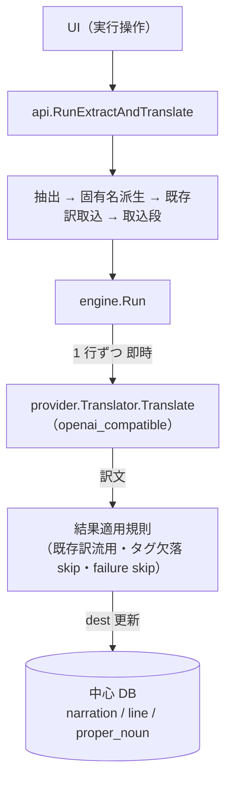
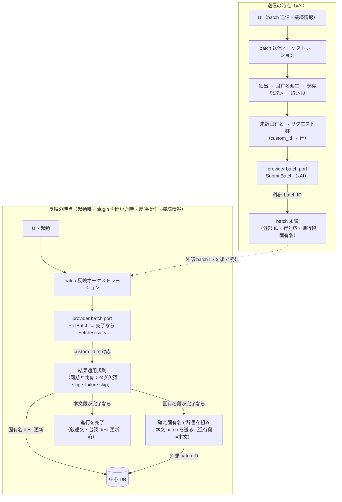

# Design: gemini-xai-batch-translation

本 task は xAI の batch API（非同期の大量翻訳）に対応する。Gemini は後続へ回す。
batch を、対象 plugin 単位の翻訳永続化（`translation-persistence`）の上に、同期と並ぶ 2 つ目の配送方式として乗せる。

## 実装方針

### AS-IS: 同期翻訳は 1 プロセスで完結する

現状の翻訳は、抽出から書き戻しまでを 1 回の実行（`api.RunExtractAndTranslate`）で閉じる。

- 実行の流れ: 抽出 → 固有名派生 → 既存訳取込 → 取込段 → `engine.Run`。
- `engine.Run` は未訳行を 1 行ずつ `provider.Translator.Translate` へ送り、応答を即時に受け取り、`dest` を更新して確定する。
- 結果適用の規則は行ごとに `engine` の本文フェーズが持つ。既存訳と完全一致する行は AI を呼ばず流用し、実行時タグが AI 出力から欠落した行は未訳のまま残し、`provider` の skippable な失敗（構造化出力の空・スキーマ違反、応答エンベロープの読み取り失敗、サーバ一時失敗）は未訳のまま飛ばす。
- 接続情報（endpoint・API key）は実行のたびに UI から渡し、永続化しない。

### TO-BE: xAI は batch 専用の配送で、送信と反映の 2 時点へ割れる

xAI プロバイダは batch だけで動かす（同期経路は持たせない）。同期 `openai_compatible` は LM Studio・OpenAI 互換のための既存経路として残す。
batch では即時応答が無く、送信の時点と、後から結果を反映する時点の 2 つへ割れる。2 時点の間はアプリを閉じてよく、外部 batch ID と送信行の対応を永続して橋渡しする。

固有名は本文へ機械置換で注入するため、本文より先に確定する必要がある（設計レビュー回答 B）。よって xAI の 1 回の翻訳は、固有名 batch と本文 batch の 2 段を逐次でたどる。1 つの対象 plugin が進行中に持つ batch は、固有名→本文の 1 進行だけに限る。

- 送信の時点: 抽出から取込段までは同期と同じ。まず未訳の固有名から固有名 batch を送り、外部 batch ID・送信行の対応・進行段（固有名）を永続する。この時点では `dest` を確定しない。接続情報は UI から渡す。
- 反映の時点: 起動時・対象 plugin を開いた時・反映操作の時点だけ、永続した外部 batch ID で状態を確認する。接続情報は反映のたびに UI から再入力する（永続化しない）。
  - 固有名 batch が完了: 結果を固有名の `dest` へ書き戻し、確定固有名で本文の機械置換辞書を組み、続けて本文 batch を送って進行段を本文へ進める（同じ反映操作の中で連鎖する。接続情報が手元にあるため送れる）。
  - 本文 batch が完了: 結果を叙述文・台詞の `dest` へ書き戻し、進行を完了にする。
- 結果適用規則は同期と共有する。既存訳と完全一致する行は送信前に流用して batch へ載せず、実行時タグが欠落した結果と skippable な失敗（構造化出力の空・スキーマ違反、応答エンベロープの読み取り失敗、サーバ一時失敗）は未訳のまま据え置く。一部失敗・期限切れ（`expires_at`）の未反映行も未訳のまま残し、利用者の再送信で回収する（設計レビュー回答）。
- 外から見て、batch で訳した行と同期で訳した行は、結果一覧・`dest`・訳状態のいずれでも区別が付かない。

### provider へ 2 つ目の port を足す

同期の port（`Translator`）は変えず、非同期の port を別に足す。xAI の batch API は vendor 固有の経路（作成・投入・状態確認・結果取得）のため、専用の concrete 実装を足す。xAI は本 port だけで動かし、同期経路は持たせない。

- 非同期 port は、送信（リクエスト群 → 外部 batch ID）・状態確認（外部 batch ID → 未処理／成功／失敗の件数と終端判定）・結果取得（外部 batch ID → custom_id ごとの訳文または失敗）の 3 つの操作を持つ。
- custom_id は「種別:id」の複合キーにする。本文 batch は叙述文（`narration`）と台詞（`line`）を同一 batch に混ぜるが、両テーブルの id はテーブルごと独立採番で衝突する。結果ページングの cursor と同じ種別接頭（`n:`／`l:`／`p:`）で名前空間化し、xAI の「custom_id はファイル内一意」制約も満たす。
- xAI のモデル一覧の取得経路を定義する。非同期 port には翻訳の 3 操作しか置かないため、モデル選択 UI が使うモデル一覧は別に持つ。xAI の `/v1/models` は OpenAI 互換のため、モデル一覧だけは互換経路で引く（翻訳の同期経路は持たせない方針と両立する）。batch 非対応モデル（`grok-4.5` など）は選択肢から除く。
- xAI 実装は `openai_compatible` と同じく HTTP クライアントを狭い interface で受け、fake クライアントで単体テストできる形にする。実 xAI API へは自動テストで触れない。
- 本文リクエストは同期と同じ構造化出力指定（`response_format` の `json_schema` strict）を付けて送る。xAI batch で同指定が効くかは doc に明記が無いため、まず同指定だけで実装し、手動 e2e で実挙動を確かめてから plain text 応答の受け皿の要否を決める（設計レビュー回答）。
- xAI batch の結果は vendor 固有の入れ子（`batch_request_id` と `batch_result` の中の応答）で返る。同期の応答エンベロープとは形が違うため、xAI 実装の中で訳文の取り出しを吸収し、port の外へは同期と同じ「訳文または失敗種別」だけを渡す。

### batch 管理を単一モジュールへ寄せ、純粋核を 100% カバレッジにする

batch のライフサイクル判断（送信・状態解釈・結果適用）のうち、IO を伴わない決定規則を純粋モジュールへ切り出し、単体テスト 100% カバレッジを基準にする（`core` の純粋不変ルール 100% 方針に従う）。IO（xAI への HTTP・DB）は薄いシェルに置き、fake で検査する。

- 純粋核が持つ判断: 未訳行群から送信リクエスト群を組む対応付け、状態確認の件数から終端かどうかを解釈する判定、進行段（固有名 → 本文 → 完了）を次へ進める遷移の判定、取得結果を行ごとの書き戻し可否へ変換する規則。
- 同期と共有する範囲は成功系に限る。共有するのは「1 件の本文リクエストを組む文面構築」（タグ退避 → 辞書機械置換 → 生タグ復元 → base 指示＋directive＋原文の合成）と、「1 件の訳文を 1 行へ適用する判断」（確定・タグ欠落で未訳据え置き・skippable 失敗で未訳据え置き）の 2 つ。ここが「外から見て同期と batch が変わらない」不変条件の担保点になる。現状は両方とも `engine` の本文フェーズ loop 内に inline のため、振る舞いを変えない抽出（behavior-preserving refactor）で純粋関数へ寄せ、既存の engine テストで同一入力に同一の store 呼び出し・訳状態になることを回帰で担保する。plan.md の「同期の翻訳本体は変えない」は、振る舞い不変の抽出を許容する意味とする。
- 共有しない範囲を明示する。同期の非 skippable 失敗（4xx 認証など）は run 全体を止める abort だが、batch の個別リクエスト失敗は「未訳据え置き」へ一本化するため、abort 分岐は共有しない。固有名フェーズは同期では 1 件失敗で全体停止する一方、固有名 batch は未訳据え置きとするため、固有名 batch 専用の結果適用ルールを 1 つ設計する（本文の skip 関数を固有名へ流用しない）。
- シェルが持つ IO: `provider` batch port の呼び出しと、batch 永続テーブルの読み書き。純粋核の判断を IO へ束ねるだけにする。
- 進行段の遷移は原子性と冪等を担保する。固有名 `dest` 確定の後、本文 batch 送信の直前でクラッシュや送信失敗が起きても、再反映で本文 batch を二重送信しない。永続に持つ「本文 batch の外部 ID の有無」で送信済みを判定し、無い時だけ送る。期限切れ（`expires_at`）超過と一部失敗は、未反映行を未訳のまま残して進行を完了扱いにする（利用者の再送信で回収する）。
- 送信 HTTP 失敗で進行が半端に残った場合を復旧可能にする。送信を xAI へ投げる前に永続の進行行を作るため、送信の HTTP が失敗すると現段の外部 ID が空のまま進行行が残りうる。再送信の拒否は「現段の外部 batch ID が非空」（本当に xAI へ投げ済みで反映により回収・前進できる）進行に限る。現段の外部 ID が空の半端な進行は、再送信で reset して作り直せるよう拒否しない。これで削除に頼らず送信失敗から回復する。

### batch 固有の永続情報を batch 側の内部に閉じる

batch の橋渡しに要る情報（外部 batch ID、送信行と結果の対応、batch の状態）を専用テーブルへ持つ。同期は本テーブルを経由しない。

- 追加は migration 1 本（`0013`）。既存の翻訳対象行（`narration`・`line`・`proper_noun`）の `status`・`dest` の意味は変えない。
- batch テーブルは対象 plugin 値（`narration.plugin` 等と同値の plugin ファイル名）で束ねる列を持つ。対象 plugin 単位の永続（`target_plugin`）の下に置く。
- 対象 plugin の削除は FK cascade でなく Go 側の手続き DELETE（`internal/store/target_plugin.go` の `DeleteTargetPlugin`）で行う既存方式にそろえる。よって batch テーブルの DELETE を、既存の削除文リスト（`targetPluginDeleteStmts`）へ子（送信行対応・結果対応）から親（batch 本体）の順で追記する。「一緒に消える」は cascade でなく削除文追記で実現する（決定事項）。
- データモデル追加のため `docs/er.md` §2 へ feature commit 時に同期する。`docs/architecture.md` は 2 つ目の多態 port（非同期 batch port）の追加で §5 の「多態の port は provider 1 つだけ」の記述に触れる。新しい純粋核 package と薄いシェルを足す場合は `.go-arch-lint.yml` の component と import 規則の追記も要る。よって architecture 反映の要否は「不要の見込み」でなく、port 追加・新モジュールの構造変化を勘定に入れて finalization で再判断する。

### どこまで動かすか（観測できる振る舞い）と観測点

- 観測できる振る舞い: xAI batch を送信でき、外部 batch ID を永続し、アプリ再起動をまたいで反映操作で結果が対象 plugin の `dest` へ書き戻り、結果一覧で同期翻訳と区別なく訳済として見える。
- 観測点（単体）: batch 管理（純粋核）の決定規則を fake で網羅し 100% カバレッジにする。xAI batch 実装（HTTP クライアント）は fake HTTP で検査する。
- 観測点（結合）: fake batch プロバイダ（実 xAI API に触れない in-memory 実装）で、送信→永続→反映→書き戻しの全経路を Go 内で通す結合テストを持つ。固有名 batch 送信 → fake が完了を返す → 反映で固有名 `dest` 確定かつ本文 batch を送る → fake が完了を返す → 反映で叙述文・台詞 `dest` 確定、の 2 段連鎖を検査する。永続を読み直す境界（アプリ再起動相当）をまたいでも反映が続くこと、および batch で書いた `dest`・訳状態が同期経路と一致する（外から見て変わらない）ことを表明する。fake は「固有名 batch 完了 → 反映 → 本文 batch 受理 → 本文 batch 完了」を状態遷移として返す。課金しない。
- 観測点（手動）: 実 xAI batch API への疎通と構造化出力の実挙動は、手動 e2e で 1 度だけ確かめる（課金する自動テストは持たない）。
- 最小実装・空テーブルで goal を満たしたことにしない。再起動をまたいだ反映で `dest` が更新されるところまでを完了条件にする。

## 検討が必要なこと

未解決の論点は無し。設計レビュー（2026-07-20）で 6 論点を次のとおり解消し、実装方針へ織り込んだ。

- 固有名と batch の順序: **B**。固有名 batch を先に確定し、完了後に本文 batch を送る（2 段の逐次 batch）。一貫性を最優先する。
- 実行フローと選択: **xAI は batch 専用で最小**。xAI に同期経路を持たせず、選択は「xAI を選ぶ＝batch」に一本化する。
- 構造化出力（`json_schema`）の未確定: **まず json_schema 指定で実装し、手動 e2e で実挙動を確認してから** plain text 受け皿の要否を決める。
- 部分失敗・期限切れ（`expires_at`）: **未訳のまま残し、利用者の再送信で回収する**（同期の skip と同じ思想）。
- 1 つの対象 plugin の batch 数: 進行中は固有名→本文の **1 進行だけ**に限る（最小の既定）。同一 plugin への 2 度目の送信は、xAI へ送信済みで待機中の batch がある間だけ拒否する（送信前に永続を確認する）。送信失敗で外部 ID が空のまま残った半端な進行は拒否せず、再送信で作り直す。
- 反映時の接続情報: **反映のたびに UI から再入力する**（永続化しない方針を維持、最小の既定）。

opus fresh レビュー（2026-07-20）で AS-IS 整合性と TO-BE 実現性を検査し、次の 6 点を実装方針へ補強した。custom_id の種別複合キー化、共有抽出の範囲（成功系のみ・固有名と abort は共有外）と振る舞い不変前提、手続き削除への追記、xAI のモデル一覧経路と batch 非対応モデル、進行段の原子性・冪等、architecture.md §5 と `.go-arch-lint.yml` への波及の再判断。
