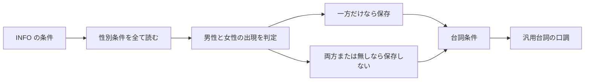

# Design: gender-conditional-generic-tone

---

## R-1 条件分岐の性別を汎用として扱う

### 現況の理解

抽出機は INFO の条件から性別を一つ選び，抽出済み条件として永続化する。
複数の性別条件がある場合，後から読んだ性別条件が前の性別条件を置き換える。
男女が同じ INFO の条件に現れても，抽出済み条件には男性または女性のどちらか一方が残る。
汎用台詞の口調は，抽出済み条件から作られた台詞条件の性別を使う。
根拠は REF-1，REF-2，REF-3，REF-4，REF-5 にある。

要求が扱う対象の単位と，受け皿が持つキーを並べる。

| | 単位 |
| --- | --- |
| 要求が扱う対象 | 同一 INFO の条件に現れる性別の集合 |
| 受け皿が持つキー | INFO の plugin と form ID |

### あるべき形

抽出機は，同一 INFO の全ての性別条件から男性と女性の出現をそれぞれ記録する。
抽出機は，男性だけが現れる場合に男性を抽出済み条件へ永続化する。
抽出機は，女性だけが現れる場合に女性を抽出済み条件へ永続化する。
抽出機は，男性と女性の両方が現れる場合に性別を永続化しない。
抽出機は，性別条件が無い場合に性別を永続化しない。
既存の台詞条件と汎用台詞の口調生成は，性別が永続化されない場合に男女汎用の口調を使う。
声型による既存の性別判定は変更しない。

あるべき形では性別条件の集合を判定する。

前者の図から最後の性別を選ぶ責務が消える。
後者の図には男性と女性の出現を判定する責務が加わる。
