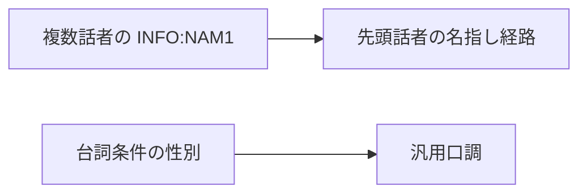
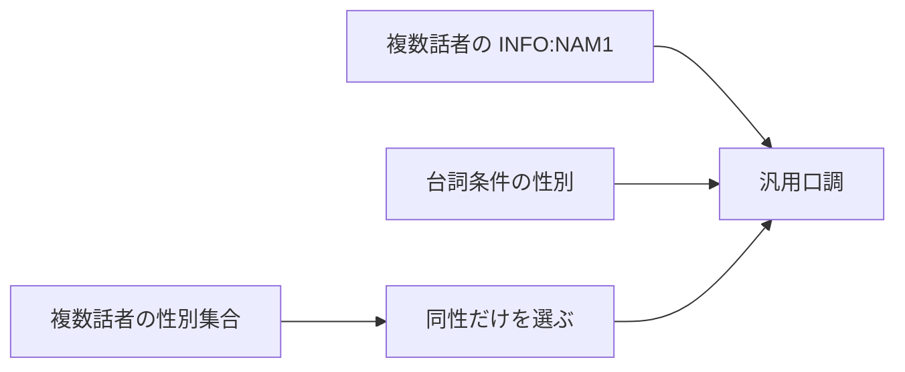

# Design: generic-tone-multi-speaker-sex

---

## R-1 複数話者の性別を汎用口調へ反映する

### 現況の理解

翻訳エンジンは複数話者を持つ台詞を先頭話者の生成済みペルソナで名指し話者経路へ入れる。
汎用セリフは台詞条件に保存された性別だけを口調生成へ渡す。
話者連関は台詞ごとに複数の話者を保存できる。
話者の性別は話者ごとに保存される。
汎用セリフの口調生成は複数話者の性別を読まない。
根拠は REF-1，REF-2，REF-3，REF-4 にある。

要求が扱う対象の単位と，受け皿が持つキーを並べる。

| | 単位 |
| --- | --- |
| 要求が扱う対象 | 台詞に結ばれた話者の性別集合 |
| 受け皿が持つキー | 台詞 ID と話者 ID |

### あるべき形

保存層は台詞ごとに全話者の性別集合を読み，男性だけ，女性だけ，男女混在，性別不明を区別する。
翻訳エンジンは複数話者を持つ INFO:NAM1 の台詞を汎用口調へ振り分ける。
翻訳エンジンは複数話者を持つ INFO:NAM1 の台詞本文を汎用口調の特徴抽出へ渡す。
翻訳エンジンは INFO:RNAM の PC 発話と単一話者を持つ INFO の既存経路を維持する。
翻訳エンジンは汎用セリフの口調生成で台詞条件の性別を優先する。
翻訳エンジンは台詞条件の性別が無い場合だけ話者の性別集合を使う。
翻訳エンジンは全話者が男性だけの場合に男性口調を使う。
翻訳エンジンは全話者が女性だけの場合に女性口調を使う。
翻訳エンジンは男女混在または性別不明の場合に性別を指定しない。
複数話者を持つ INFO:NAM1 以外の名指し話者経路は変更しない。

現況では話者性別が汎用口調に届かない。

あるべき形では話者性別集合が条件性別の代替入力になる。

前者の図では複数話者の INFO:NAM1 が先頭話者の名指し話者経路へ入る。
後者の図では複数話者の INFO:NAM1 が汎用口調へ入り，台詞条件の性別が無い場合だけ同性集合を使う。
