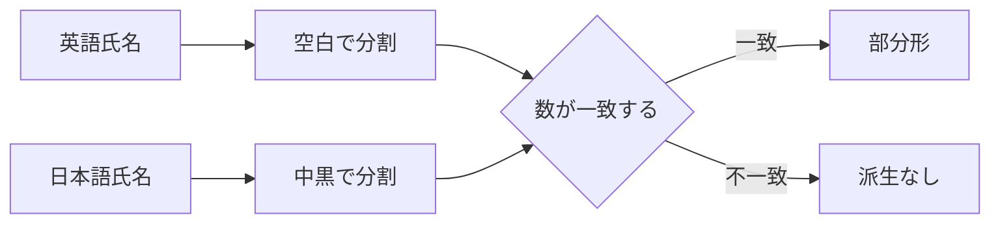
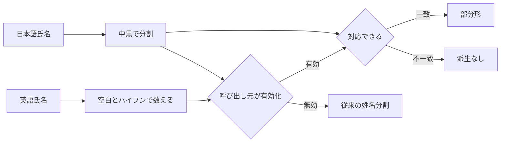

# Design: hyphenated-npc-name-derivation

---

## R-1 ハイフンを含む NPC 氏名の部分形を本文の参考語へ加える

### 現況の理解

姓名分割の規則は、英語を空白で分けた数と、日本語を中黒で分けた数が一致する場合だけ、対応する各部分形を作る。根拠は REF-1 である。

`Hoge Black-Briar` は英語が二つに分かる。`ホゲ・ブラック・ブライア` は日本語が三つに分かる。この組は規則を通らない。根拠は REF-1 と REF-2 である。

事前作成辞書の NPC と翻訳対象 mod の翻訳済み NPC は、同じ人名派生規則を使う。前者は実行中の本文参考語だけへ加わる。後者は既存の対象 mod の固有名として保存される。横断辞書を作る人名派生も同じ規則を使う。根拠は REF-3、REF-4、REF-5 である。

| | 単位 |
| --- | --- |
| 要求が扱う対象 | 英語の空白区切り部分と、その部分に含まれるハイフン区切りを持つ NPC 氏名の英日対 |
| 受け皿が持つキー | 部分形の英語と日本語の組 |

### あるべき形

人名派生規則は、ハイフンを含む姓の部分形を作るかを呼び出し元ごとに選べる。

事前作成辞書の NPC と翻訳対象 mod の翻訳済み NPC は、ハイフンを含む姓の部分形を作る選択を使う。

横断辞書を作る人名派生は、従来の姓名分割だけを使う。

ハイフンを含む姓の部分形を作る選択では、英語の各空白区切り部分に含まれるハイフン区切りの数だけ、日本語の連続する中黒区切り部分を対応付ける。

`Hoge Black-Briar` と `ホゲ・ブラック・ブライア` からは、`Hoge` と `ホゲ`、`Black-Briar` と `ブラック・ブライア` を作る。

英語の空白区切り部分と、その中のハイフン区切りの合計数が日本語の中黒区切り数と一致しない組は作らない。

各部分形は既存の安全規則、既出英語の除外、同一英語の先勝ちを通す。

この規則は、ハイフンを含む姓の部分形を作る選択を使う二つの人名派生だけに適用する。

