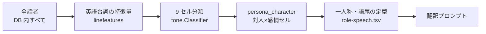
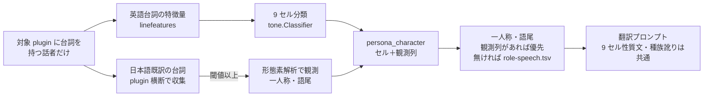

# Design: japanese-tone-persona

## 実装方針

**主張**: 話者の口調の一貫性を 3 層に分け、機械的に固定できる 2 層だけを公式日本語既訳の観測へ置き換える。残る 1 層は現行のペルソナをそのまま使う。ペルソナ全体を日本語既訳から作り直すのではない。

### 口調の一貫性の 3 層（設計の土台）

翻訳出力の口調が話者ごとに揺れないことは、次の 3 層の重なりで決まる。層ごとに必要な手段が違うため、層ごとに扱いを分ける。

| 層 | 内容 | 手段 | 外部データ |
| --- | --- | --- | --- |
| 一人称 | 同じ話者が「私」「俺」を行ごとに揺らさない | 既訳台詞の形態素解析（代名詞の品詞タグ） | 不要 |
| 語尾 | 敬体・常体、終助詞の癖が行ごとに揺れない | 既訳台詞の形態素解析（助動詞の活用型・終助詞の品詞タグ） | 不要 |
| 言い回しの性格 | 丁寧さ・攻撃性・種族訛りといった話し方の傾向 | 現行ペルソナ（9 セル性質文・`role-speech.tsv`・種族訛り注記） | 不要 |

上 2 層は品詞の問題であり、語彙辞書を持ち込む必要がない。日本語側で感情語・罵倒語を判定しないため、日本語の感情語彙・罵倒語彙の導入は本 task の対象外になる。

### AS-IS（現状）

- **生成対象**: DB 内の全話者。
  - ペルソナ生成（`GeneratePersonas`）に対象 plugin による絞り込みが無い。
- **口調の根拠**: 英語台詞の機械検出特徴量。
  - 話者の英語台詞から特徴量（丁寧定型・命令文・罵倒語・感嘆符などの数）を取る（`linefeatures.ExtractFeatures`）。
  - `tone.Classifier` が対人段階×感情段階の 9 セルへ分類する。
  - 公式日本語訳は参照しない。
- **一人称と語尾の導出**: 翻訳時の TSV lookup。
  - ペルソナは 9 セルだけを持ち、一人称・語尾は保存しない。
  - 翻訳時に `assets/role-speech.tsv` を種族区分×性別×セルで引いて一人称・語尾の定型を組み立てる。
  - 定型なので、公式既訳で「カジート」が一人称の話者にも一般的な一人称が当たる。
- **fallback**: 対人段階は 3 段の連鎖で決まる。
  1. 本文の印が閾値以上なら本文経路。
  2. 足りなければ声型 prior。
  3. それも無ければ保留（中立）。

### TO-BE（変更後）

- **生成対象**: 対象 plugin に台詞を持つ話者だけ。
  - 話者の同定は既存の FormID キー（`speaker` の plugin＋form_id、LinkCache で定義元 master へ解決済み）をそのまま使う。
- **台詞集合**: 各話者の台詞は plugin 横断で集める。
  - mod が base ゲームの NPC に台詞を足した場合、その NPC の base 側台詞（公式日本語既訳つき）も観測の材料に入る。
- **base 側台詞の供給（Strings 抽出の拡張、人間確定）**: 対象 plugin の抽出時に、base マスター側の台詞を参照専用データとして DB へ入れる。
  - 何を: 対象 plugin が参照する話者の base マスター側台詞を、C# 抽出器が列挙する。
  - どうやって: 既存の英日 Strings 解決と同じ仕組みで、日本語既訳つきにして入れる。
  - 前提: 抽出器は load order 全体（master 連鎖込み）を既に読み込んでいるため、base マスターを翻訳対象として別途抽出する必要はない。
  - 扱い: 参照専用の台詞は翻訳対象一覧・翻訳実行に含めない。
  - 時期: 取り込みは抽出時に自動で動き、利用者操作は不要。
- **一人称と語尾の観測（新しい主経路）**: 話者の日本語既訳台詞を形態素解析し、一人称と語尾を観測して保存する。
  - 理由: 一人称と語尾は品詞で決まるので、既訳という実物がある話者に定型を当てる理由が無い。
  - 対象行: 日本語既訳が入っている行。対象 plugin 自身の行と、上記の参照専用取り込みで入る base 側の行。
  - 条件: 日本語既訳台詞が閾値以上ある話者だけが観測対象になる。
  - 形態素解析器: `kagome` v2 と `kagome-dict/ipa`（pure Go、cgo 不要）を採用する。ライブラリ本体は MIT、同梱の mecab-ipadic は NAIST・ICOT 由来の再配布可条件で、NOTICE の同梱で満たせる。バイナリ増は実測 15MB（`kagome-dict/uni` は 87MB あるため使わない）。
  - 実装位置: 既存の `linefeatures` package に日本語観測の関数として追加する（新 package は作らない）。解析器インスタンスは既存の `sharedProseModel` と同じ `sync.Once` 共有にする。
- **9 セル分類の扱い**: 変更しない。
  - 全話者について、従来どおり英語台詞の特徴量から `tone.Classifier` で決める。
  - 理由: 9 セルが担うのは第 3 層（言い回しの性格）であり、一人称・語尾の観測とは軸が違う。日本語特徴を `tone.Features` へ写す設計は取らない。
  - 帰結: `decision_path` の意味と値は不変。日本語経路の決定経路値は追加しない。
- **ペルソナの持ち方**: 観測した一人称・語尾を話者単位で追加保存する。
  - 保存: 一人称・文末体・語尾の癖を `persona_character` へ列追加（ALTER）で持たせる。既存の 9 セル列はそのまま残る。
  - 注入: 翻訳時、観測列が非空ならその話者の一人称・語尾は観測値を使い、`role-speech.tsv` の定型より優先する。9 セル性質文と種族訛り注記は両方の話者で従来どおり載せる。
  - 観測が無い話者: 観測列が空のままなので、従来の TSV 定型がそのまま当たる。経路が分岐するのではなく、上書きが起きないだけになる。
  - 保護: `hand_edited=1` の行は観測列も再生成で上書きしない（既存保護と同じ）。
- **キャッシュ**: 持たない。
  - 観測は話者ごとに 1 回だけ走り、`line_analysis` のような本文単位の再利用が起きないため。

AS-IS から消える要素: 既訳が十分な話者への TSV 由来の一人称・語尾の定型。
TO-BE で増える要素: 生成対象の plugin 絞り込み、base 側既訳台詞の取り込み、形態素解析による一人称・語尾の観測と優先注入。

### AS-IS と TO-BE の対応（ソース根拠）

| 変更点 | AS-IS（現状） | AS-IS の根拠ソース | TO-BE（変更後） | 変更予定箇所と実現主張 |
| --- | --- | --- | --- | --- |
| 生成対象 | 台詞を持つ全話者が対象。対象 plugin による絞り込みが無い | `internal/store/persona_character.go` の `ListSpeakerLineSources`（SELECT に plugin 条件が無い） | 対象 plugin に台詞を持つ話者だけを対象にする | `ListSpeakerLineSources` へ対象 plugin の引数を追加し、SQL を 2 段構えにする。(1) 話者特定: `line.plugin` が対象 plugin の台詞を 1 行以上持つ話者を選ぶ（`speaker.plugin` では絞らない。話者の定義元 master で絞ると base 定義の話者が誤って落ちるため）。(2) 行収集: 選ばれた話者の全台詞を plugin 横断で集める。引数は `internal/engine/persona_generate.go` の `Generate` → `internal/engine/engine.go` の `GeneratePersonas` の順で通す。`GeneratePersonas` の呼び出し元は `engine.go` の `Run`（同期経路）と `batch.go` の `planBodyRequests`（非同期一括翻訳経路）の 2 箇所で、どちらも plugin を既にスコープに持つ |
| 日本語本文の供給 | `Generate` は `model.SpeakerLineSource` の英語本文しか束ねない | `internal/store/persona_character.go` の `ListSpeakerLineSources` の SELECT 列、`internal/model` の `SpeakerLineSource` | 話者ごとの日本語既訳本文を観測へ届ける | `ListSpeakerLineSources` の SELECT へ `line.dest` を追加し、`model.SpeakerLineSource` へ同名 field を足す。束の中で dest 非空行を数えれば観測の成立条件を判定できる。前提: `line.dest` は現状、取込段（`internal/engine/ingest.go` の `Dispatch`、`internal/store/ingest.go` の `IngestLines`）が伝播しないため抽出直後は常に空で、`UpdateLineDest` は翻訳実行時にしか呼ばれない。`GeneratePersonas` は `engine.go` の `Run` で `translateLines` より前に走るので、この行は下の「base 側台詞の供給」行 (6) の dest 伝播が入って初めて成立する |
| 一人称と語尾の導出 | 翻訳時に `role-speech.tsv` を種族区分×性別×セルで引いて定型を当てる。既訳を参照しない | `internal/core/personatone/personatone.go` の `BuildToneTraits` と `roleSpeechLine`、`assets/role-speech.tsv` | 既訳が閾値以上ある話者は、形態素解析で観測した一人称・語尾を定型より優先して使う | `internal/core/linefeatures` へ日本語観測の関数を追加する（新 package は作らない。品詞タグ参照が既存の prose 利用と同じ層のため）。`go.mod` へ `github.com/ikawaha/kagome/v2` と `github.com/ikawaha/kagome-dict/ipa` を追加し、解析器は `linefeatures.go:142` の `sharedProseModel` と同じ `sync.Once` 共有にする。`persona_generate.go` の `Generate` で話者ごとに観測して保存する。注入側は `personatone.go` の `roleSpeechLine`（`BuildToneTraits` から呼ばれる）を、観測値が非空ならそちらを返す分岐にする。9 セル性質文（`toneTraitOf`）と種族訛り注記（`raceMarkerTrait`）は分岐させない |
| 9 セル分類 | 英語特徴から `ExtractFeatures` → `Classify` で全話者を分類する | `internal/core/linefeatures/linefeatures.go` の `ExtractFeatures`、`internal/core/tone/classifier.go` の `Classify` | 変更しない | 変更なし。日本語特徴を `tone.Features` へ写さないため、`classifier.go` と `decision_path` の値集合、frontend の `DecisionPath` 型は触らない。既存テスト `persona_generate_test.go` の 9 セル契約も維持される |
| ペルソナの持ち方 | `persona_character` は 9 セル（対人×感情）だけを持ち、一人称・語尾は保存しない | `db/migrations/0005_persona_character.sql` の列定義 | 観測した一人称・文末体・語尾の癖を追加列で持つ | `persona_character` へ ALTER で列を追加する（列追加は ALTER でよい既定運用）。観測値を翻訳時へ届ける中継 2 箇所（`internal/store/persona_character.go:119` の `LoadLinePersonas` の SELECT 列、`internal/model/persona.go:52` の `LinePersonaInput` 構造体）へ同じ列を追加する |
| base 側台詞の供給 | `extracted_field.dest` は対象 plugin 自身の英日対だけ。`ExtractDialogues` は `env.TargetMod.DialogTopics` だけを走査し、対象 plugin が触っていない base 側 DIAL/INFO は現れない | `tools/extractor/PluginExtractor.cs` の `ExtractDialogues`（TargetMod 単方向走査）と `JapanesePairs` 解決、`db/migrations/0014_extracted_field_dest.sql` | 対象 plugin が参照する話者の base マスター側台詞を、日本語既訳つきの参照専用データとして抽出時に自動で取り込む | 探索と橋渡しの 2 面で変える。探索（C#）: (1) 対象 plugin の走査で集めた話者 FormKey の集合を作る（`ExtractInfoNode` が `info.Speaker` と条件由来話者から `SpeakerIds` を既に組んでいる）、(2) `PluginEnvironment.LoadOrder`（`IReadOnlyList<ISkyrimModGetter>`、master 連鎖込みで読み込み済み）の対象 plugin 以外の mod の `DialogTopics` を走査し、話者 FormKey が集合に入る INFO だけを拾う逆引き、(3) 拾った行を既存の `JapanesePairs` 解決で dest を埋めて書く。橋渡し（writer と取込段）: (4) `ExtractedFieldSqliteWriter.cs` の `plugin` 固定（`result.TargetPlugin` で全行一定）を行ごとの実 plugin へ変える、(5) `SpeakerSqliteWriter.cs` の `UpsertInfoSpeaker` も `info_plugin` の `_targetPlugin` 固定を行ごとの実 plugin へ変え、`LinkLineSpeakersFromStaging`（`l.plugin = st.info_plugin` で結合）が base 側行でも話者を解決できるようにする、(6) 取込段（`internal/engine/ingest.go` の `Dispatch`、`internal/store/ingest.go` の `IngestLines`）で `extracted_field.dest` を `line.dest` へ伝播し、参照専用を表す列を `line` へ ALTER で追加する（migration 追加。`status` 値の流用はしない。status は訳の進行状態を表し意味が濁るため）。翻訳対象一覧・翻訳実行・件数集計の SELECT はこの列で参照専用行を除外する。除外対象には結果一覧のページング（`internal/store/line.go` の `LinesAfter`、`internal/api/app.go` の `ResultPage` から呼ばれる）を含める。`LinesAfter` は id 順の絞り込みしか持たないため、除外を入れないと参照専用の base 側台詞が翻訳結果一覧に並ぶ |

### 日本語既訳からの観測規則

観測はすべて形態素解析の品詞タグに基づき、乱数・モデル推定を使わない。同じ入力からは常に同じ結果が出る。数値は下の PoC の分布観測で確定した値で、単体テストで固定する。定数は 1 箇所に置く。

- **観測の成立条件**: 話者の日本語既訳行が 5 行以上。未満は観測列を空のままにする。
- **文分割**: 本文を句点・感嘆符・疑問符（全角半角の両方）で文に区切り、空文は数えない。
- **一人称**:
  - 品詞が代名詞で、かつ一人称の語形である語を候補にする。mecab-ipadic は一人称・二人称・指示語・疑問詞をまとめて代名詞にするため、品詞タグだけでは一人称を選べない。代名詞に落ちない語（「わし」「儂」「我」「拙者」やカタカナ表記など、いずれも名詞-一般になる）も語形で補う。
  - 語形リストと品詞タグの対応は辞書更新で変わりうるので、対応を検査するテストを置く。
  - 最頻の候補を採用する。採用条件は 2 回以上の出現。最頻が同数なら出現行数の多い方、それも同数なら観測なしにする。
- **文末体（敬体か常体か）**:
  - 敬体文 = 文末の助動詞が丁寧の活用型（特殊・マス／特殊・デス）である文。表記ゆれの列挙は不要で、活用型で判定する。
  - 敬体文の割合が 5 割以上なら敬体、2 割以下なら常体、中間の混在話者は観測なしにする。
- **語尾の癖**:
  - 文末に連なる終助詞を、品詞タグで切り出して 1 個ずつ独立に数える。「ですわね」なら「わ」と「ね」を 1 回ずつ数える。固定候補リストは持たない。
  - 丁寧さや活用の違いは語尾の癖では区別しない（文末体が担う）。連なり全体を 1 つの形として数えると、同じ癖が活用ごとに割れて過小評価されるため。
  - 終助詞を含まない文末（助動詞だけで終わる形）は数えない。常体そのものを拾ってしまい、文末体と重複するため。
  - 全文の 1 割以上かつ 2 回以上に現れる終助詞だけを注入する。上限 2 個、超えた場合は頻度の高い順に採り、同数なら文字列の昇順で決める。
- **見本台詞**: 持たない。既訳台詞をそのままプロンプトへ載せる案は、下の PoC の外れ値観測の結果、採らない。

### PoC（実施済み。上の規則はこの観測で確定した）

実装本体の前に PoC を置き、上の規則の数値を実データで決めた。PoC で書いた観測関数は `internal/core/linefeatures/japanese.go` へ本実装としてそのまま残し、PoC ドライバは `cmd/poc-jatone` に置いた（先例は `cmd/poc-tone`）。

- **入力**:
  - 話者別: dev DB の Dawnguard.esm 抽出結果の `extracted_field.dest`（C# 抽出器が japanese Strings から入れた公式既訳）。`line.dest` は翻訳実行で書かれる値なので使わない。既訳 5 行以上の話者は 44 人。
  - 全体分布: `dictionaries/Data/strings/skyrim_japanese.ilstrings`（台詞 34427 件・61374 文、UTF-8）。話者との対応は持たないが、語彙と外れ値の分布は取れる。
- **確定値での取得率（44 話者が母数）**: 一人称 43.2%（19 人）、文末体 100%（44 人）、語尾の癖 68.2%（30 人）。どれも取れない話者は 0 人。
- **確定の根拠**:
  - 文末体の 5 割・2 割: 敬体割合の分布が 0.10 未満に 42 人、0.12 に 1 人、0.58 に 1 人と二極化しており、当初の 7 割では敬体一貫の話者が 0 人になる。0.2 と 0.5 の間に話者が居ないため、観測なしも発生しない。
  - 常体が支配的なのは実態: 全体 61374 文のうち丁寧の活用型を持つ文は 4.9%、活用型では拾えないが「です」「ます」を含む文が 0.7%。仮に後者を全部足しても 5.6% で、検出漏れではない。
  - 語尾を終助詞 1 個ずつ数える形: 当初の「連なりを 1 つの形として数える」規則では、Serana の「わ」系が ですわ 11.3%・ですわね 4.0%・ませんわ 4.0%・ますわ 2.7%・ましたわ 2.0% に割れ、合計 25.3% の癖が 11.3% としか見えなかった。終助詞単位で数えると「わ」が 30.7% に集約される。
  - 語尾の 1 割・2 回: 当初の 2 割・3 回では採用が 0 人になる。Aela の「よ」「わ」がともに 16.7% で、実データの癖がこの帯に集まる。
  - 助動詞だけの文末を数えない: 当初規則で採れていた 7 話者はすべて「だ」で、常体そのものであり文末体と重複していた。
- **見本台詞を持たない根拠**: 外れ値（カジートのように自分の種族名で自称する型）は全体 34427 件のうち「カジート」を含む台詞が 63 件（0.18%）で、そのうち自称は一部にとどまり、多くは呼びかけと三人称だった。規則を書かずに未知の言い回しを運ぶ手段としての価値が、列追加とプロンプト増分に見合わない。
- **一人称の取得率 43.2% を許容する根拠**: 取れない理由は主語を省く訳文であり、規則の欠陥ではない（採用条件を 1 回へ緩めても 56.8% までしか上がらない）。取れなかった話者は観測列が空のまま従来の `role-speech.tsv` の定型に落ちるので、現状より悪くなる話者は無い。
- **コスト（実測）**: バイナリ増 11.1MB。Dawnguard.esm の全話者の観測が 0.3 秒、Skyrim.esm 全 34427 行の走査が 1.3 秒。

### どこまで動かすか（task 後に観測できる振る舞い）

- Dawnguard.esm（日本語既訳 100%）のペルソナ再生成で、既訳のある話者に観測した一人称・語尾が保存される。
- その話者の翻訳プロンプトで、一人称と語尾が `role-speech.tsv` の定型ではなく観測値になる。
- mod（既訳ゼロ）の新規 NPC は観測列が空のままで、従来と同じ定型が当たる。
- 観測点: 観測関数の単体テスト（純粋ルール、カバレッジ 100% を基準）、および dev DB の実データで再生成して数話者の一人称・語尾を目視で確かめる。

## 検討が必要なこと

なし（PoC の実データ観測で解消済み）。

解消済みの論点は次のとおり。

- 見本台詞は持たないと確定した。外れ値が 0.18% で、列追加とプロンプト増分に見合わないため。
- 閾値は確定した。文末体は 5 割・2 割、語尾の癖は 1 割・2 回、一人称は 2 回、観測の成立条件は既訳 5 行。
- 語尾の癖の数え方は、文末の連なりを 1 つの形として数える案から、終助詞を 1 個ずつ数える案へ変えた。

- 口調の持ち方は、既訳話者をペルソナごと日本語既訳へ置き換える案から、一人称・語尾の 2 層だけを観測で上書きする案へ人間指示で確定した。9 セル性質文・種族訛りは全話者で共通に残る。
- 日本語の感情語彙・罵倒語彙の外部辞書導入は不要と確定した。9 セル分類を英語特徴のまま据え置くため、日本語側に語彙判定が発生しない。
- 形態素解析器の採用は確定した。品詞で決まる一人称・語尾を文字列規則の表記ゆれ列挙で追う設計を避けるため。ライセンスとバイナリ増（15MB）は実測で確認済み。
- base 側台詞の供給は、base マスターの別途抽出ではなく「対象 plugin の抽出時に、参照する話者の base 台詞を Strings 解決つきで参照専用に取り込む」拡張に確定した（人間提案。抽出器が load order 全体を読み込み済みであることを実装確認済み）。
- 取り込み時期は抽出時の自動実行に確定した。
