# job-run-phase-fetch-redesign review diff

## 概要

- 図化目的: 取得・表示フローの作り直しによる構造差分を人間設計レビューで確認する。起動主体と取得回数の変更、処理対象一覧の反映取りこぼし防止（summary は独立反映）、開き直し時の再取得、初回取得中の操作排他、reactive 反映経路、可否判断の責務移動（backend→frontend application 層）、body 取得経路の統合（専用取得廃止）、等価性条件を対比する。
- 根拠参照: `./detail-spec-diff.md`、`./screen-design-diff.job-run.md`、`./plan.md`（スコープ拡大節、第2回設計レビューの追加決定節）、`frontend/src/application/usecase/term-translation-phase/term-translation-phase.usecase.ts`、`frontend/src/ui/screens/job-run/JobRunPage.svelte`、`internal/service/term_translation_phase_service.go`
- 範囲: `JobRunPage`（取得起動経路）、各段階 `*PhaseUseCase`（`fetchSummaryAndReadiness` と反映ガード）、`store`（状態保持）、`viewModel`（derived 変換）、`JobRunPage`（`currentProcessingTargetPageState` の derived 評価）、backend service（`readinessFromState` 等の可否導出関数）、gateway-contract（`*ReadinessResponse` / `*ActionEnablement` DTO）、body 専用取得（`GetBodyTranslationOutputReadiness`）

---

## 図 1: 取得起動経路の before/after（コンポーネント図）

### before（従来）

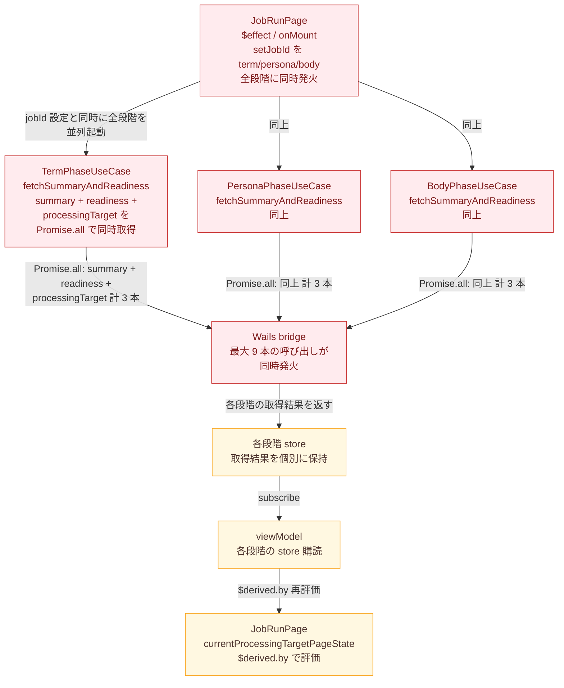

### after（改定）

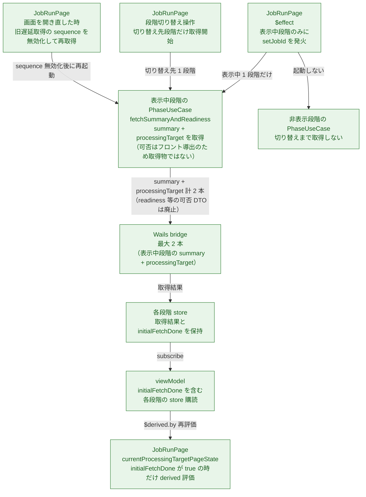

---

## 図 2: 処理対象一覧の反映取りこぼし防止の before/after（コンポーネント図）

### before（従来 — 非対称ガード）

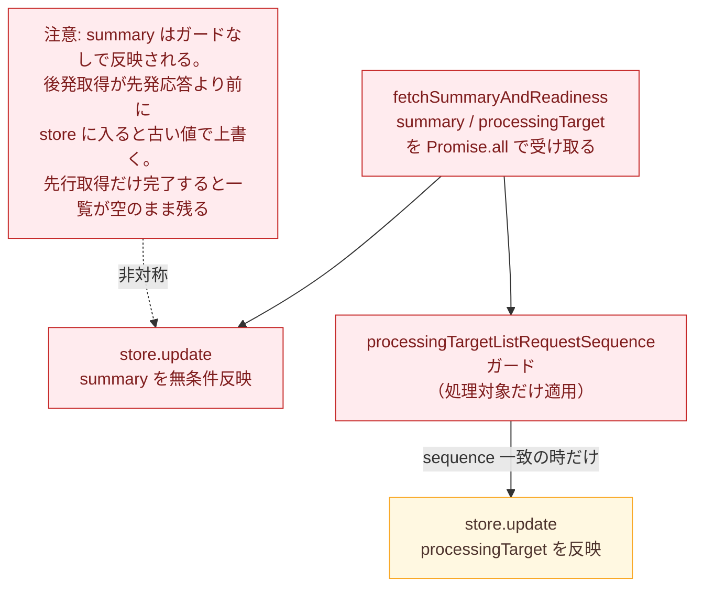

### after（改定 — 独立反映 + 一覧は連番ガード）

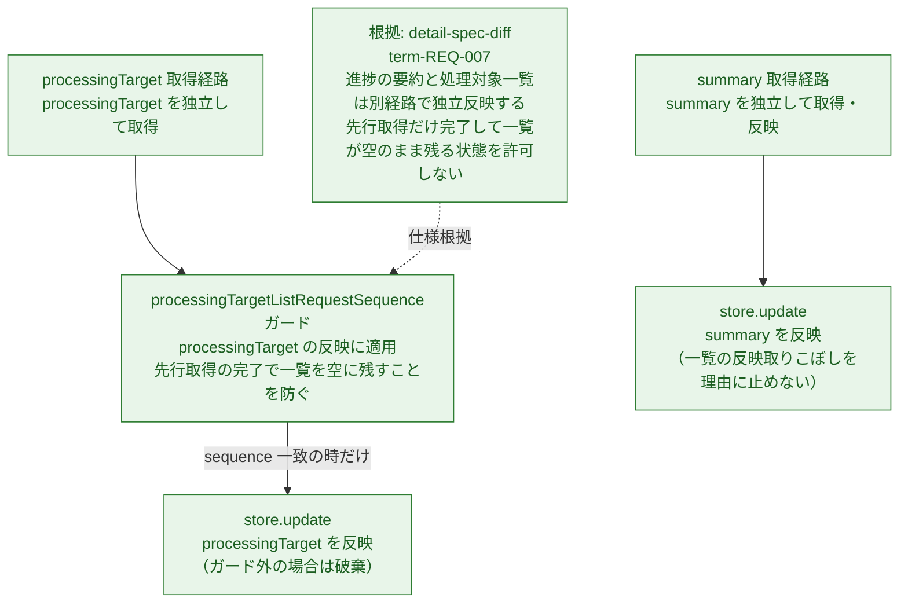

---

## 図 3: 開き直し時の再取得と旧取得破棄（シーケンス図）

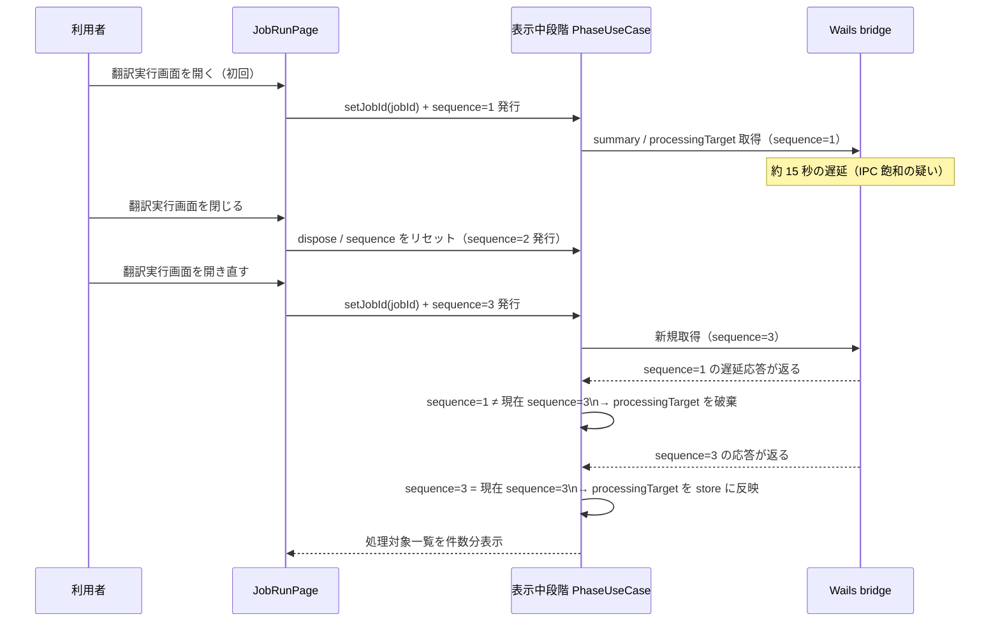

---

## 図 4: 初回取得中ローディングレイヤーによる操作排他（シーケンス図）

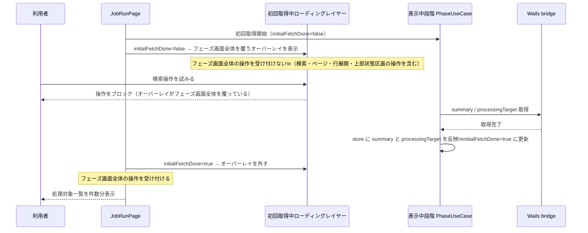

---

## 図 5: bridge → store → viewModel → 画面の reactive 反映経路（コンポーネント図）

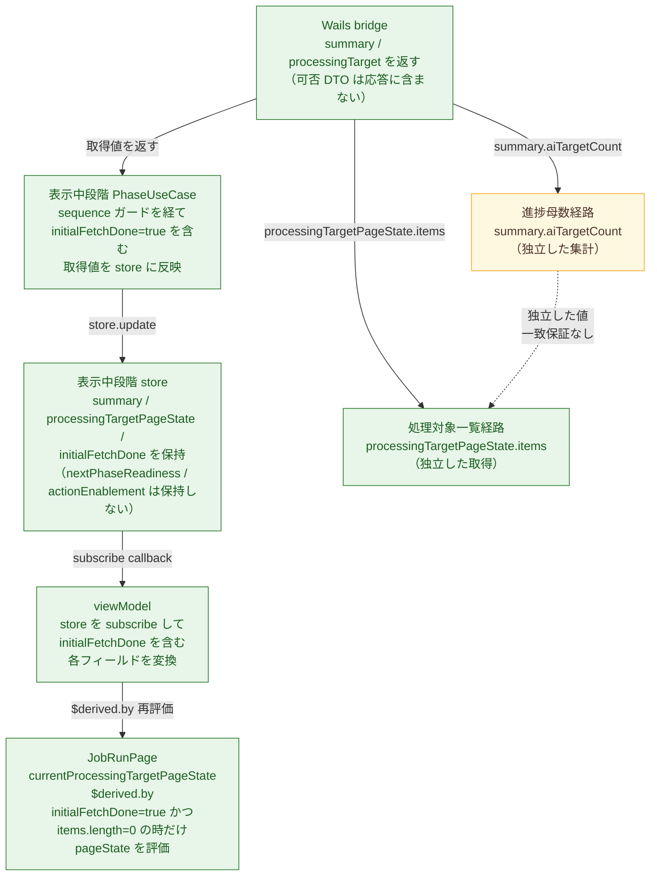

---

## 図 6: 可否判断の責務移動 before/after（コンポーネント図）

この図はスコープ拡大分（`plan.md` 「スコープ拡大」節・「第2回設計レビューの追加決定」節、`detail-spec-diff.md` の `*-REQ-008` / `body-...-REQ-007`）に対応する。before は backend service が事実状態から可否を導出して応答 DTO に含める。after は backend が事実状態だけ返し、frontend の application 層が同じ導出を行う。

### before（従来 — backend で可否を導出）

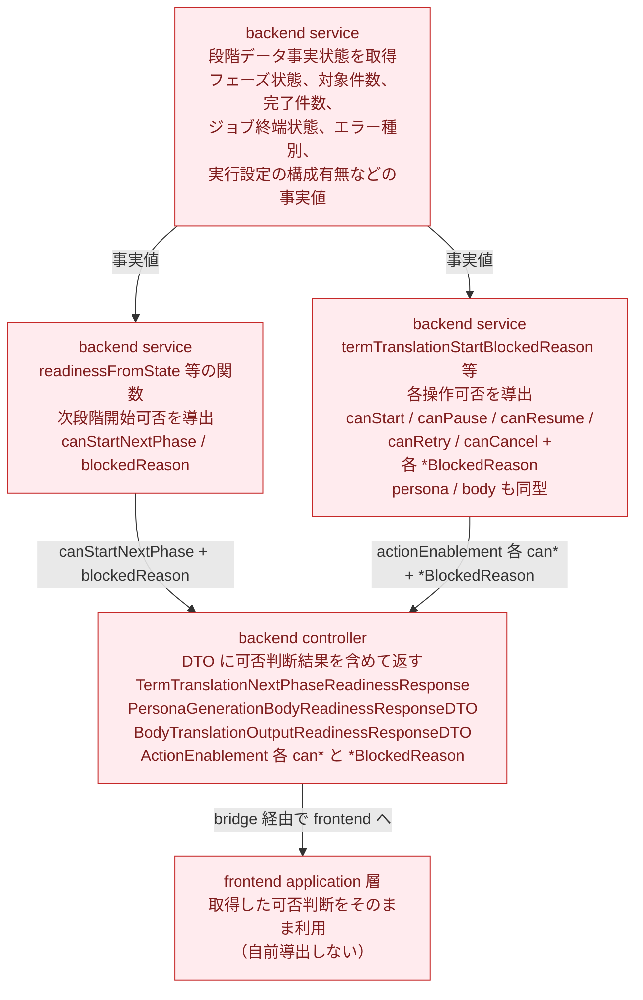

### after（改定 — frontend application 層で可否を導出）

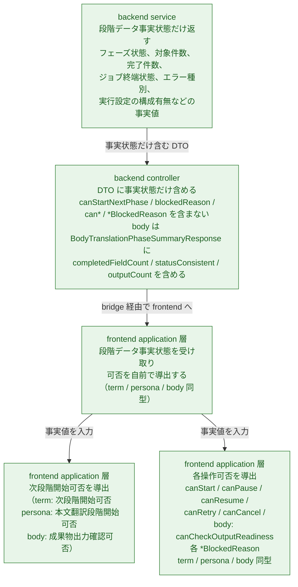

---

## 図 7: body 取得経路の統合 before/after（コンポーネント図）

この図はスコープ拡大分（`detail-spec-diff.md` の `body-translation-phase-REQ-007`、`Q-005` 回答）に対応する。before は body 段階で段階要約取得と専用取得の 2 本が存在する。after は専用取得を廃止し段階要約取得 1 本へ統合、出力可否はフロント導出。

### before（従来 — 2 経路）

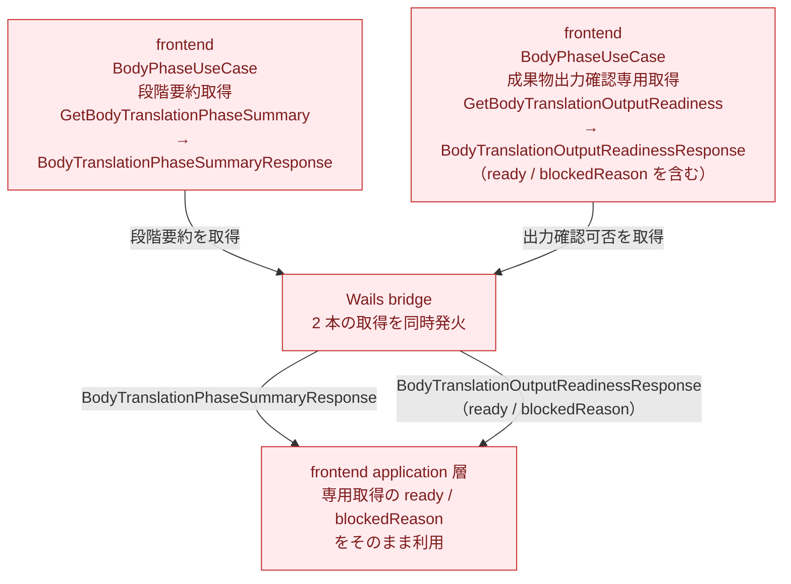

### after（改定 — 1 経路へ統合）

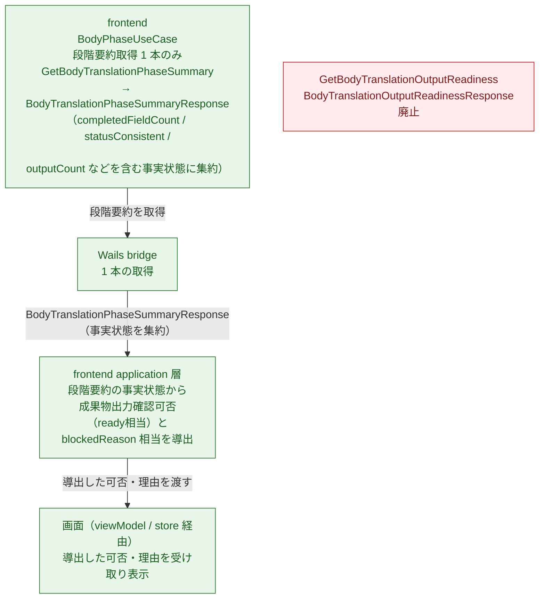

---

## 図 8: 等価性条件の確認（コンポーネント図）

この図はスコープ拡大分（`detail-spec-diff.md` の `term-REQ-008`、`persona-REQ-008`、`body-...-REQ-007` の等価性条件）に対応する。責務再配置の前後で、同じ事実入力に同じ可否・理由が得られることを示す。

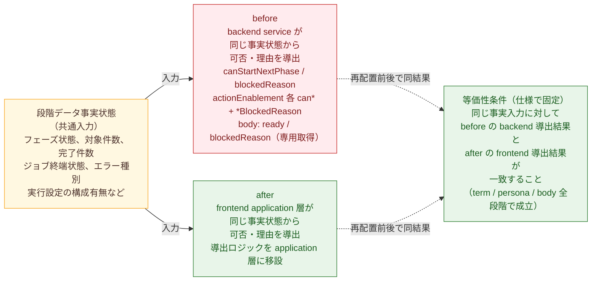

---

## 差分凡例

- 赤: 削除する要素または経路を示す。
- 緑: 追加する要素または経路を示す。
- 黄色: 変更しない要素または経路を示す。

---

## 各箱の説明

### 図 1（取得起動経路）

- `JobRunPage $effect / onMount（before）`: ジョブ選択時に term / persona / body の全 3 段階に `setJobId` を同時発火する既存の起動経路。削除対象。
- `JobRunPage $effect（after）`: ジョブ選択時に表示中の 1 段階だけに `setJobId` を発火する改定後の起動経路。追加する。
- `JobRunPage 段階切り替え操作`: 利用者が段階タブを切り替えた時に、切り替え先 1 段階だけ取得を開始する経路。追加する。
- `表示中段階 PhaseUseCase（after）`: 表示中の 1 段階の `fetchSummaryAndReadiness` を呼ぶ。取得本数は summary と processingTarget の最大 2 本。可否 DTO は取得物ではなくなるため、従来の readiness 取得本数は 0 本になる。追加する。
- `非表示段階 PhaseUseCase`: 切り替えまで取得を行わない。段階切り替え時に初めて起動する。追加する。
- `Wails bridge（before）`: 最大 9 本（3 段階 × 3 本）が同時発火する既存経路。削除対象。
- `Wails bridge（after）`: 最大 2 本（表示中 1 段階の summary + processingTarget）に削減する。readiness 等の可否 DTO 取得はなくなる。追加する。
- `JobRunPage 開き直し`: 翻訳実行画面を閉じて再び開いた時に、旧取得の sequence を無効化して再取得を開始する経路。追加する。
- `各段階 store`: 取得結果を保持する。`initialFetchDone` フラグを新規に追加する。`nextPhaseReadiness` や `actionEnablement` は保持しなくなる。
- `viewModel`: 各段階の store を購読して変換する。`initialFetchDone` を含む点が変更。可否判断値は store に保持しないため、viewModel の変換対象からも外れる。
- `JobRunPage currentProcessingTargetPageState`: `$derived.by` で処理対象ページ状態を評価する。`initialFetchDone` を評価条件に加える点が変更。

### 図 2（処理対象一覧の反映取りこぼし防止）

- `fetchSummaryAndReadiness（before）`: `Promise.all` で取得し、summary は無条件反映、processingTarget だけ sequence ガード内で反映する非対称な既存実装。削除対象。
- `store.update summary（before）`: ガードなしで summary を反映する。先行取得だけが完了すると一覧が空のまま残る原因になる。削除対象。
- `processingTargetListRequestSequence ガード（before）`: 処理対象だけに適用している既存ガード。削除対象（改定後は処理対象一覧の取得に適用し、summary は独立経路で別管理）。
- `summary 取得経路（after）`: summary を独立して取得・反映する。一覧の反映取りこぼしを理由に止めない。追加する。
- `processingTarget 取得経路（after）`: processingTarget を独立して取得する。追加する。
- `processingTargetListRequestSequence ガード（after）`: processingTarget の反映に適用する改定後のガード。先行取得だけが完了して一覧が空のまま残ることを防ぐ。追加する。
- `store.update（after）`: summary と processingTarget を独立した経路でそれぞれ反映する。processingTarget は sequence が一致する時だけ反映し、ガード外の場合は破棄する。追加する。
- 注: 第1回図2の「3値を同一ガードで揃える」表現は、仕様注記3（`detail-spec-diff.md`）に従い修正済み。summary は独立反映であり、3値の束ね反映は本図では採用しない。

### 図 3（開き直し時の再取得）

- sequence=1 の遅延応答が sequence=3 で無効化されて破棄される経路が差分の核心。
- 閉じる操作で sequence をリセット（または dispose）し、開き直しで新しい sequence を発行することで、旧遅延応答が store に入ることを防ぐ。
- 改定後は summary と processingTarget の 2 本が対象。readiness 等の可否 DTO は取得物ではなくなる。

### 図 4（初回取得中ローディングレイヤー）

- `初回取得中ローディングレイヤー`: `initialFetchDone=false` の間、`phase-loading-overlay`（`position: absolute; inset: 0; z-index: 20`）としてフェーズ画面全体を覆うオーバーレイを表示し、操作を受け付けない新規エレメント。上部状態区画も含むフェーズ画面全体に排他が及ぶ。`screen-design-diff.job-run.md` 差分 2 に対応する。
- 検索操作・ページ切り替え・行展開を含むフェーズ画面全体の操作は `initialFetchDone=true` になるまでブロックする。初回取得と利用者操作の同時進行自体を起こさせない排他。
- 改定後は summary と processingTarget の両方の取得完了を `initialFetchDone=true` の判定に使う。

### 図 5（reactive 反映経路）

- `PhaseUseCase → store`: sequence ガードを経て `initialFetchDone=true` を含む取得値を入れる。`nextPhaseReadiness` や `actionEnablement` は store に入れない。変更部分。
- `store`: `initialFetchDone` フラグを新規に保持する。可否判断値は保持しない。変更部分。
- `viewModel`: `initialFetchDone` を含む変換を行う。可否判断値は変換対象から外れる。変更部分。
- `currentProcessingTargetPageState $derived.by`: `initialFetchDone=true` かつ `items.length=0` の時だけ pageState を評価する評価条件の追加。変更部分。
- `進捗母数経路（summary.aiTargetCount）` と `処理対象一覧経路（processingTargetPageState.items）`: 別 bridge 呼び出し・別集計の独立した経路であることを明示する。変更しない接続先。
- `Wails bridge`: 可否 DTO を応答に含まなくなる。変更部分。

### 図 6（可否判断の責務移動）

- `backend service（before）`: `readinessFromState`、`termTranslationStartBlockedReason` 等が事実状態から次段階開始可否と操作可否を導出する。削除対象（application 層へ移設）。
- `backend controller DTO（before）`: `TermTranslationNextPhaseReadinessResponse`（`canStartNextPhase`、`blockedReason`）、`PersonaGenerationBodyReadinessResponseDTO`、`BodyTranslationOutputReadinessResponseDTO`、`ActionEnablement` の各 `can*` と `*BlockedReason` を含む。削除対象。
- `backend service（after）`: 段階データ事実状態だけ返す。可否の導出はしない。追加する。
- `backend controller DTO（after）`: 事実状態だけ含む。可否判断結果の真偽値と理由文字列を含まない。body は `BodyTranslationPhaseSummaryResponse` に `completedFieldCount`、`statusConsistent`、`outputCount` を含める。追加する。
- `frontend application 層（after）`: 事実状態を受け取り、次段階開始可否と操作可否の両方を自前で導出する。term / persona / body 同型。追加する。
- `等価性条件`: 再配置前後で同じ事実入力に同じ可否・理由が得られることが仕様で固定済み。`detail-spec-diff.md` の `term-REQ-008`、`persona-REQ-008`、`body-...-REQ-007` が根拠。

### 図 7（body 取得経路の統合）

- `GetBodyTranslationOutputReadiness + BodyTranslationOutputReadinessResponse（before）`: body 成果物出力確認の専用取得。削除対象。
- `BodyTranslationPhaseSummaryResponse（before）`: 事実状態の一部だけを含む既存の段階要約取得応答。修正対象（`completedFieldCount`、`statusConsistent`、`outputCount` を集約して拡張する）。
- `段階要約取得 1 本（after）`: `BodyTranslationPhaseSummaryResponse` に `completedFieldCount`、`statusConsistent`、`outputCount` を含める形で事実状態を集約する。取得経路は 2 本から 1 本になる。追加する。
- `frontend application 層（after）`: 段階要約取得の事実から成果物出力確認可否（`ready` 相当）と `blockedReason` 相当を導出する。追加する。

### 図 8（等価性条件の確認）

- `段階データ事実状態（共通入力）`: before の backend 導出と after の frontend 導出が共通して使う事実入力。変更しない（事実の取得元は backend のまま）。
- `before の backend 導出`: `readinessFromState` 等が行っていた可否算出。削除対象。
- `after の frontend 導出`: application 層が引き継ぐ可否算出。追加する。
- `等価性条件`: 同じ事実入力に対して before と after が同じ結果を返すことを仕様で固定済み。term / persona / body 全段階に成立することが条件。

---

## 検証

- Mermaid 記述確認: flowchart TB（図 1 × 2、図 2 × 2、図 5、図 6 × 2、図 7 × 2）、flowchart LR（図 8）、sequenceDiagram（図 3、図 4）の合計 12 図の Mermaid コードブロックを確認した。各図に図種別、箱または参加者、接続、凡例 classDef が記述されていることを確認した。
- Markdown 確認: 各図に見出し、説明、差分凡例、各箱の説明が揃っていることを確認した。
- 差分凡例確認: 赤（removed）、緑（added）、黄色（unchanged）の 3 区分を全図で統一している。
- 追加予定・削除予定・変更しない接続先の区別: 削除対象を赤（removed）、追加対象を緑（added）、変更しない要素を黄色（unchanged）で区別している。全図で統一している。
- detail-spec-diff.md との整合確認:
  - 図 2（after）は `term-REQ-007`（summary と処理対象一覧の独立反映、一覧の反映取りこぼし防止）に対応し、第1回図2の「3値を同一ガードで揃える」表現を修正した。
  - 図 3 は `translation-job-management-REQ-006`（開き直し時に再取得、旧取得結果を破棄）に対応する。取得対象を summary と processingTarget の 2 本に修正した。
  - 図 4 は `term-REQ-007`（初回取得完了までフェーズ画面全体の操作を行えない）および `screen-design-diff.job-run.md` 差分 2 に対応する。`phase-loading-overlay` がフェーズ画面全体（上部状態区画を含む）を覆うオーバーレイであることを反映した。
  - 図 6 は `term-REQ-008`、`persona-REQ-008`、`body-...-REQ-007`（可否判断の責務再配置、backend は事実だけ返す）に対応する。term / persona / body 同型を示した。
  - 図 7 は `body-...-REQ-007`（専用取得廃止、段階要約取得一本化、出力可否はフロント導出）に対応する。
  - 図 8 は `term-REQ-008`、`persona-REQ-008`、`body-...-REQ-007` の等価性条件を図で示した。
- screen-design-diff.job-run.md との整合確認: 差分 6（操作可否・次段階開始可否のフロント導出）は図 6 に対応する。差分 7（body 成果物出力確認の取得経路統合）は図 7 に対応する。
- backend / bridge 仕様変更の範囲確認: bridge 伝送機構自体の破壊的変更は含まない。bridge の呼び出し本数削減（before: 最大 9 本、after: 最大 2 本）と、backend 応答 DTO から可否判断値を除外することは含む。これは仕様で確定済みのスコープ拡大分である。
