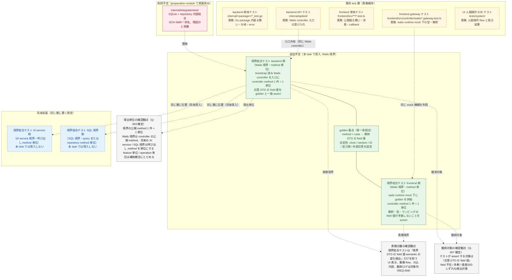
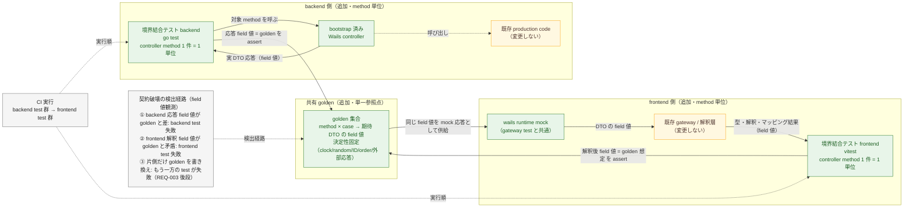
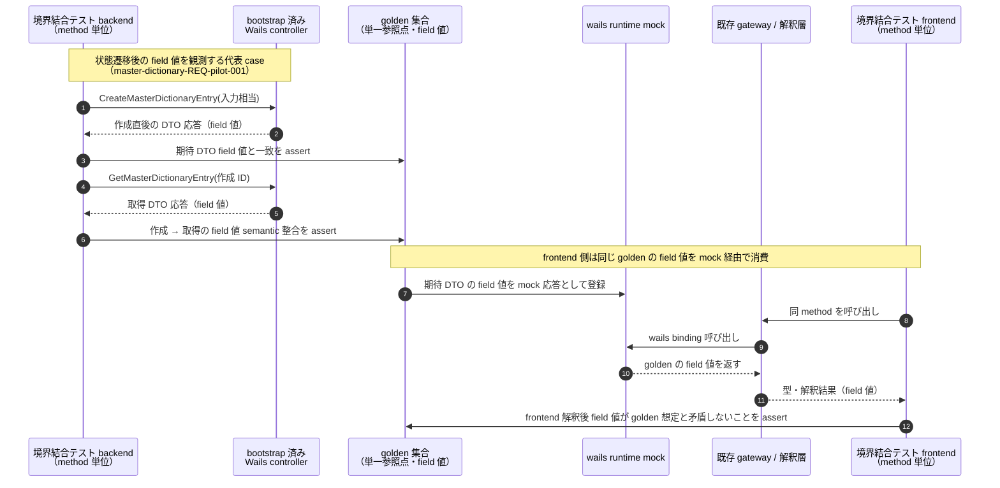
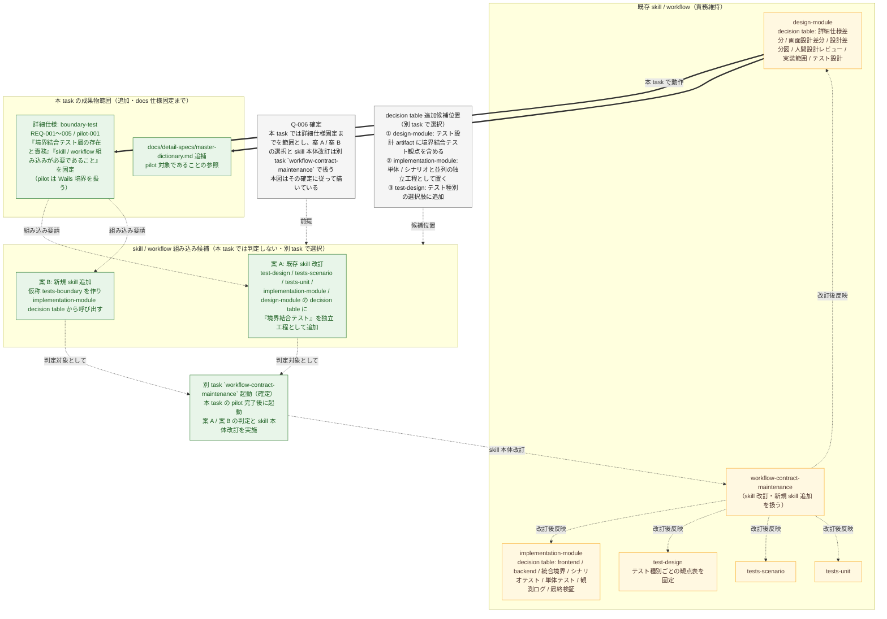

# master-dictionary-boundary-test 設計差分図

- `skill`: diagramming
- `source_plan`: `./plan.md`
- `source_detail_spec_diff`: `./detail-spec-diff.md`
- `status`: human-review-resolved

## 概要

- 図化目的: 境界結合テストを新規 test 層として repo に導入する際の、test 層階層、golden 共有 flow、skill / workflow 組み込みの 3 観点を、人間設計レビューと後続 implementation-scope 固定の判断材料として可視化する。`frontend-backend` 境界に限定せず、AI service、SQL など将来の境界一般を同じ層に置く想定を含む。
- 根拠参照:
  - `./plan.md`（想定 3 Y、decision table）
  - `./detail-spec-diff.md`（`boundary-test-REQ-001` 〜 `005`、`master-dictionary-REQ-pilot-001`）
  - `docs/architecture.md`、`internal/apitest/README.md`
  - `frontend/src/controller/wails/master-dictionary.gateway.test.ts`、`tests/system/master-dictionary-management.spec.ts`
  - 既存 test 層配置（`internal/*/*_test.go`、`internal/apitest/`、`frontend/src/**/*.test.ts`、`tests/system/`）
- 範囲: test 層階層、apitest と frontend test の golden 共有 flow、skill / workflow 上の組み込み候補位置。プロダクト production code、UI、業務 flow は含めない。

## 差分凡例

- 緑: 追加する要素または経路を示す。
- 赤: 削除する要素または経路を示す。
- 黄色: 変更しない要素または経路を示す。
- 灰色: 確認観点または注記を示す。

## 人間レビュー確定事項

本図は人間レビュー後の確定回答（Q-001 / Q-003 / Q-006 / Q-007）を反映済み。

- `Q-001`（層の表記名）: 「境界結合テスト」に確定。`frontend-backend` 限定の呼称は使わず、AI service、SQL なども含む境界一般の概念として扱う。図 A の階層関係は将来 AI service 側 / SQL 側も同じ層に置く想定を将来拡張 node として示す。
- `Q-003`（導出単位）: Wails controller method 単位で確定。図のノードラベル、説明、シーケンス図参加者で method 単位を明示する。feature 単位や operation 単位は補助概念にとどめる。
- `Q-006`（skill 改訂の扱い）: 「本 task では詳細仕様固定まで、skill 本体改訂は別 task `workflow-contract-maintenance` で扱う」で確定。案 A / 案 B の選択は別 task で行う。
- `Q-007`（REC 取捨観測）: 境界結合テストが観測する対象は「応答 DTO の field 値」で確定（フィールド観測）。図 B とシーケンス図でテスト assert 対象を field 値として明示する。

---

## 図 A: test 層の階層関係

### 各箱の説明

- `internal/integrationtest/`（赤）: SQLite + repository を直接呼ぶ内部結合層。`SCN-SMR-*` という古い設計文書由来の scenario ID で書かれ、現状の設計判断と乖離していたため preparation-module 段階で削除済み。「結合テスト」の名前空間を境界結合テストへ譲るための削除である。
- backend 単体テスト（黄）: package 内の公開振る舞い、分岐、エラー経路を assert する。境界 DTO 値の semantic は責務にしない（REQ-001）。
- backend API テスト（黄）: `internal/apitest/` 配下で Wails controller または bootstrap 済み controller を入口に受け入れ条件を assert する。frontend 側の解釈は責務にしない。境界結合テスト backend 側と同じ入口（Wails controller）を使うが、観測責務（受け入れ条件 vs DTO 値 semantic の固定）が異なる。
- frontend 単体テスト（黄）: frontend の公開振る舞い、状態、callback を assert する。backend が実際に返す値の生成は責務にしない。
- frontend gateway テスト（黄）: `frontend/src/controller/wails/*.gateway.test.ts` で wails runtime を mock し、frontend 側の型・解釈・マッピングを assert する。backend が同じ値を実際に生成することは責務にしない。境界結合テスト frontend 側と mock 機構は共有するが、観測対象（frontend 単独の解釈 vs golden 経由で固定された両側契約）が異なる。
- UI 人間操作 E2E テスト（黄）: `tests/system/` の playwright ベース test。人間操作の主要 flow と表示結果を assert する。UI に露出しない境界 DTO 値の差分は責務にしない。
- 境界結合テスト backend 側（緑）: bootstrap 済み Wails controller を入口にし、controller の公開 method 1 件を 1 単位として、対象 case に対する応答 DTO の field 値が golden と一致することを assert する（REQ-003、Q-003 確定、Q-007 確定）。
- 境界結合テスト frontend 側（緑）: wails runtime を mock した上で同じ golden を応答として供給し、controller の公開 method 1 件を 1 単位として、frontend の解釈・型・マッピングが返す field 値が golden と矛盾しないことを assert する（REQ-003、Q-003 確定、Q-007 確定）。
- golden 集合（緑）: 対象 method × 代表 case ごとに「入力相当の説明」と「期待される応答 DTO の field 値」を含む単一参照点。両側 test から同一の値として読める。表現形式（JSON / TS const / Go embed）は `implementation-scope` で決める（Q-004 提案）。
- 将来拡張 AI service 側 / SQL 境界側（青・破線）: 本 task では導入しないが、Q-001 確定により同じ「境界結合テスト」層として位置づける。導入時の単位は AI service 呼び出し method、SQL 境界の query または repository method を想定する。
- 責務分離 Note（灰）: `boundary-test-REQ-004` の assert 対象 / 非対象境界。
- 導出単位 Note（灰）: `boundary-test-REQ-002` と Q-003 確定の導出単位（境界の公開 method 1 件 = 1 単位）。
- 観測対象 Note（灰）: Q-007 確定の観測対象（応答 DTO の field 値）。

---

## 図 B: backend apitest と frontend test の golden 共有 flow

### 各箱の説明

- 境界結合テスト backend（緑）: Wails controller の公開 method 1 件を 1 単位として呼び、応答 DTO の field 値と golden を一致 assert する。決定性のため clock / random / ID / 並び順 / 外部応答を固定する（REQ-003、Q-003 / Q-007 確定）。
- bootstrap 済み Wails controller（緑）: backend API テストと同じ入口だが、境界結合テストでは「DTO の field 値 semantic の固定」のために使う。
- 既存 production code（黄）: production Go code と frontend gateway / 解釈層は触らない（plan の想定 6 N、5 N）。
- golden 集合（緑）: 単一参照点。method × case → 期待 DTO の field 値。両側 test から同一の値として読める。
- wails runtime mock（緑）: 既存 gateway test の mock 機構を共有しつつ、応答に golden の field 値を流し込む形で frontend 解釈を駆動する。
- 境界結合テスト frontend（緑）: Wails controller の公開 method 1 件を 1 単位として、golden を mock 応答として与え、frontend 解釈結果の field 値が golden の想定と矛盾しないことを assert する。
- CI 実行（灰）: backend test 群と frontend test 群の実行順序は CI 上の連動関係として注記する。どちらの片側でも golden 不一致を検出すれば test が落ちる。具体的な CI workflow 変更は `implementation-scope` で決める。
- 契約破壊の検出経路 Note（灰）: 「契約が壊れた時に test が落ちる経路」を 3 系統に分けて明示する。これは `boundary-test-REQ-003` 後段の「片側だけ書き換えても他方が失敗する状態を維持する」を実装上どう成立させるかの確認観点になる。

### シーケンス図（pilot の代表 case: `CreateMasterDictionaryEntry` → `GetMasterDictionaryEntry`）

### シーケンス図の確認観点

- 同一 controller method の同一 case に対して、backend 側は実応答の field 値を golden に突き当て、frontend 側は golden の field 値を mock 応答として供給する。両側で golden を読む向きが対称になり、片側だけの書き換えで他方が失敗する状態が成立する（REQ-003 後段、Q-003 / Q-007 確定）。
- pilot で扱う「作成 → 取得」「更新 → 取得」「削除 → 取得（`null` 応答へ遷移）」の 3 連鎖は、いずれもこのシーケンスのバリエーションとして導出し、各 method 単位で field 値 assert を行う（`master-dictionary-REQ-pilot-001`）。

---

## 図 C: skill / workflow への組み込み図

### 各箱の説明

- `design-module`（黄）: 既存責務を維持。本 task では `designer` を経由して詳細仕様差分・設計差分図・実装範囲・テスト設計を固定する。decision table に「境界結合テスト観点」を含める改訂は本 task では行わない。
- `implementation-module`（黄）: 既存責務を維持。境界結合テスト工程を decision table に置く改訂は別 task で扱う。
- `test-design` / `tests-scenario` / `tests-unit`（黄）: 既存責務を維持。境界結合テスト観点の取り扱いは別 task で扱う。
- `workflow-contract-maintenance`（黄）: skill 本体・agent 定義・許可済みコマンド・CLAUDE.md の作業流れ記述を変更する skill。境界結合テストの skill 組み込み改訂はここで扱う前提とする。
- 詳細仕様 `boundary-test`（緑）: 本 task で追加する正本。「境界結合テスト層の存在と責務」「skill / workflow 組み込みが必要であること」までを固定する（REQ-001〜005、pilot-001）。pilot は Wails 境界で扱う。Q-001 確定により名称は `boundary-test` とし、`frontend-backend` 限定の呼称は使わない。
- `docs/detail-specs/master-dictionary.md` 追補（緑）: pilot 対象であることの参照。case 表本体は境界結合テスト側に置く（Q-008 提案）。
- 案 A（緑・候補）: 既存 skill 改訂で組み込む。`test-design` / `tests-scenario` / `tests-unit` / `implementation-module` / `design-module` の decision table と本文を改訂する。選択は別 task で行う。
- 案 B（緑・候補）: 新規 skill `tests-boundary` を追加し、`implementation-module` decision table から呼び出す。選択は別 task で行う。
- 別 task `workflow-contract-maintenance` 起動（緑・確定）: 本 task の pilot 完了後に起動する別 task として、案 A / 案 B の判定と skill 本体改訂を行う。本 task の `plan.md` の「後続モジュールへの引き継ぎ予定論点」と整合する。
- Q-006 確定 Note（灰）: 本 task では詳細仕様固定までを範囲とし、案 A / 案 B の選択と skill 本体改訂は別 task で扱うことを明示する。
- decision table 追加候補位置 Note（灰）: 案 A / 案 B のいずれを採っても、組み込み候補位置は同じ 3 か所（design-module のテスト設計 artifact、implementation-module の独立工程、test-design のテスト種別）に集約される。実際の選択は別 task で行う。

---

## 検証

- Markdown 確認: 図成果物は 1 つの Markdown に集約し、3 図（A: test 層階層、B: golden 共有 flow + シーケンス、C: skill / workflow 組み込み）を含む。
- Mermaid 記述確認:
  - 図 A・図 B・図 C はいずれも `flowchart` で記述し、ノード ID と subgraph 名に重複がない。
  - シーケンス図は `sequenceDiagram` で参加者・呼び出し順序・状態遷移後の case を含む。
  - 差分凡例（赤 = 削除、緑 = 追加、黄 = 変更なし、灰 = 注記）は 4 図すべてに classDef として適用済み。
- 差分凡例の充足: 図 A に削除予定（`internal/integrationtest/`）、追加予定（境界結合テスト両側 + golden）、変更なし（既存 5 層）を区別して配置。図 B は追加要素と既存 production code の保持を区別。図 C は追加成果物と既存 skill 群を区別。
- 図化目的の充足:
  - 図 A: 既存 test 層と新規境界結合テストの位置関係、各層の責務、削除した `internal/integrationtest/` との置き換え関係を表示。
  - 図 B: golden の出力経路、消費経路、置き場所相当（単一参照点）、CI 連動、契約破壊の検出経路を表示。シーケンス図で「片側書き換えで他方が落ちる」非対称検出を補強。
  - 図 C: 既存 skill / workflow への組み込み候補位置、案 A / 案 B の選択肢、別 task との切り出し境界、Q-006 の判断材料を表示。
- 確定事項の図上扱い: Q-001 / Q-003 / Q-006 / Q-007 を冒頭の「人間レビュー確定事項」と各図の Note ノードで明示。Q-001 確定により層名は「境界結合テスト」、Q-003 確定により導出単位は境界の公開 method 1 件 = 1 単位、Q-006 確定により skill 改訂は別 task `workflow-contract-maintenance`、Q-007 確定により観測対象は応答 DTO の field 値。
- 含めない範囲の確認: UI / 業務フロー / プロダクト production code / docs 正本本文は本図に含めていない（plan の想定 2 N、4 N、5 N、6 N、7 N と整合）。
