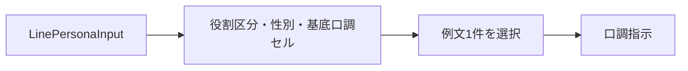
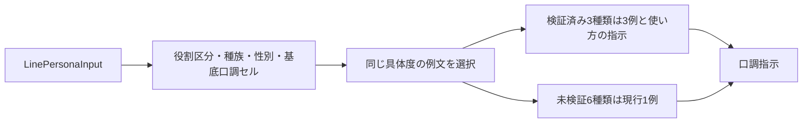
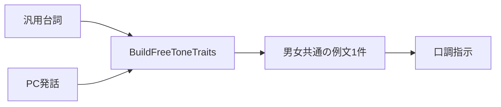
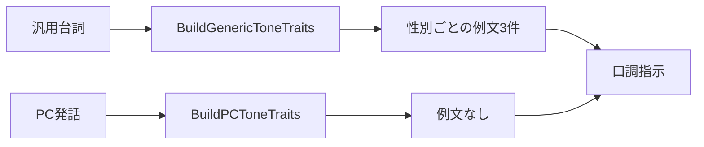
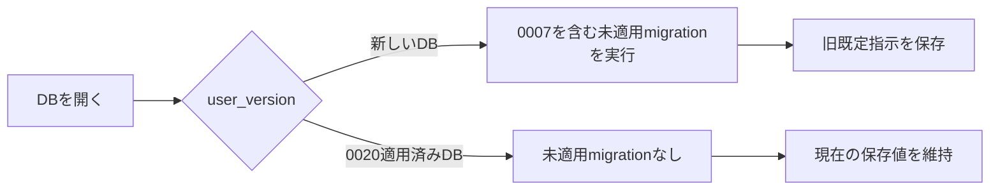
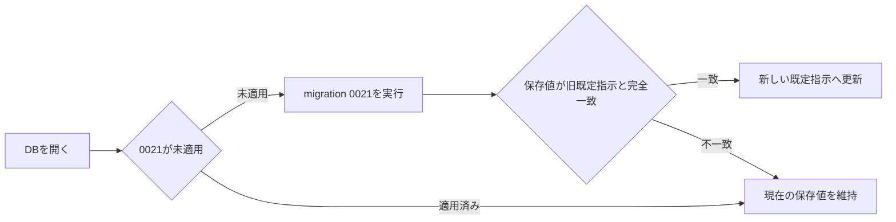

# Design: persona-tone-effectiveness-application

採用済みfew-shotは、既存の口調指示生成経路へ追加する。平明・ぞんざい・物腰やわだけを3例へ置換し、未検証の6種類は現行1例を維持する。

---

## R-1 ペルソナ・性別・年齢・種族の組み合わせに応じた採用済みfew-shotを口調指示へ適用する

### 現況の理解

`assets/role-speech-examples.tsv` は、年齢に相当する役割区分・性別・基底口調セルをキーとして例文を1件持つ。`internal/core/rolespeech.ParseRoleSpeechExamples` が表を読み、`Table.Lookup` が最も具体的な1件を `Template.Example` へ格納する。

`internal/core/personatone.roleSpeechLines` は、`LinePersonaInput` の性別・種族EditorIDから求めた役割区分・基底口調セルで `Table.Lookup` を呼ぶ。`formatRoleSpeech` は例文を `- 例: 英語原文 → 日本語訳文` の1行へ整形する。種族EditorIDは年齢の役割区分へ畳まれるため、Khajiitかどうかは例文選択に使われない。

| | 単位 |
| --- | --- |
| 要求が扱う対象 | ペルソナ・性別・年齢・種族の組み合わせ1件 |
| 受け皿が持つキー | 役割区分・性別・基底口調セル |

現況の流れは次のとおりである。

### あるべき形

口調の例文表は、役割区分・Khajiitか特別扱いなしか・性別・基底口調セルをキーとして、同じ具体度の例文を複数件持つ。平明・ぞんざい・物腰やわでは、採用済みのF1・F2・F3を3件とも選ぶ。Khajiit以外は特別扱いなしとして同じ例文を選ぶ。

`rolespeech.Template` は一人称と言い回しだけを持つ。`Table.Lookup` は現行どおり役割語の3キーから `Template` を1件返す。例文は `Table` 内の別の行集合に保持し、`Table.LookupExamples` が役割区分・種族区分・性別・基底口調セルの4キーで最も具体度が高い行を入力順にすべて返す。役割語の検索と例文の検索を分離し、3キーと4キーを同じ戻り値へ混在させない。

例文3件の後には、例を語句の写し替えに使わず、同じ自称・終助詞・命令形を1台詞で反復しない指示を置く。「来い」「ぞ」「おらん」「おくれ」は禁止せず、性別や年齢を示すためだけに選ばないよう指示する。

平明・ぞんざい・物腰やわ以外の6種類は、現行の例文1件を維持する。

あるべき流れは次のとおりである。

### 変更点

- `assets/role-speech-examples.tsv` の例文キーへ種族区分を追加し、平明・ぞんざい・物腰やわの行を `fewshot-matrix-v3.md` のF1・F2・F3へ置換する。他の6種類は現行訳を維持する。
- `internal/core/rolespeech/rolespeech.go` の `Template` から単一の `Example` を分離する。`Table.Lookup` は3キーの役割語だけを返す。`ParseRoleSpeechExamples` は、役割区分・種族区分・性別・基底口調セル・英語原文・日本語訳文の6列を例文の行集合へ読む。新しい `Table.LookupExamples` は4キーで最も具体度が高い例文を入力順にすべて返す。Khajiitを専用区分へ、それ以外を特別扱いなしへ畳む関数を置く。
- `internal/core/personatone/personatone.go` の `roleSpeechLines` と `formatRoleSpeech` は、複数例を入力順で口調指示へ加える。3例を加えた時だけ、例の使い方の指示を直後へ加える。
- `internal/bootstrap/bootstrap.go` と `cmd/goldcap/main.go` は同じassetを読み続ける。schemaの説明だけを6列へ合わせる。
- `internal/harness/run.go` の `syntheticRoleSpeechExamples` を6列へ合わせる。結合harnessは合成例を1件だけ使う責務を維持する。
- `internal/harness/oracle_test.go` の説明を、役割語の3キー検索と例文の4キー検索を別々に行う形へ合わせる。
- `assets/CLAUDE.md` の例文表のschemaとキーの説明を6列・4キーへ合わせる。
- `internal/core/rolespeech/rolespeech_test.go`、`assets_test.go` と `internal/core/personatone/personatone_test.go` は、役割語検索と例文検索の分離、複数例、最具体一致、Khajiitと特別扱いなしの選択、未検証6種類の1例維持を確認する。

---

## R-2 汎用台詞では性別に応じてfew-shotを変え、PC発話にはfew-shotを追加しない

### 現況の理解

`internal/core/personatone.BuildFreeToneTraits` と `freeRoleSpeechLines` は、汎用台詞とPC発話で共用されている。`freeRoleSpeechLines` は成人・性別・セルなしで `Table.Lookup` を呼ぶ。`assets/role-speech-examples.tsv` のセルなし向け3行は、男性・女性・性別不明のすべてで同じ英日対を持つ。このため、性別行は異なっても例文から男女差を読み取れない。

`internal/engine.freeTonePersona` はrecordとfieldから汎用台詞とPC発話を判別しているが、両方を同じ `BuildFreeToneTraits` へ渡すため、例文の有無を経路別に変えられない。

| | 単位 |
| --- | --- |
| 要求が扱う対象 | 性別を取得できる汎用台詞1件とPC発話1件 |
| 受け皿が持つキー | 成人・性別・セルなし |

現況の流れは次のとおりである。

### あるべき形

性別を取得できる汎用台詞は、成人・特別扱いなし・平明の採用済みF1・F2・F3を性別ごとに選ぶ。性別を取得できない汎用台詞は、性別を固定する例を加えない。

PC発話は、現行の自由記述の口調、性別、感情、言い回しを維持するが、口調の例文を加えない。汎用台詞とPC発話を組む公開関数を分け、共通処理だけを非公開関数で共有する。

あるべき流れは次のとおりである。

### 変更点

- `assets/role-speech-examples.tsv` のセルなし経路へ、成人・特別扱いなし・男性または女性に対応する平明のF1・F2・F3を置く。
- `internal/core/personatone/personatone.go` は `BuildFreeToneTraits` を、汎用台詞用の `BuildGenericToneTraits` とPC発話用の `BuildPCToneTraits` へ分ける。両方が性別・感情・言い回しを組む非公開処理を共有し、汎用台詞だけが `Table.LookupExamples` で成人・特別扱いなし・性別・セルなしの複数例を引く。性別不明では性別別の例へ一致させない。
- `internal/engine/engine.go` の `freeTonePersona` は、汎用経路で `BuildGenericToneTraits`、PC経路で `BuildPCToneTraits` を呼ぶ。
- `internal/core/personatone/personatone_test.go` と `internal/engine/engine_test.go` は、汎用台詞で男性・女性の例が異なること、性別不明の汎用台詞では性別別の例が出ないこと、PC発話では性別と感情を維持して例文だけが出ないことを確認する。

---

## R-3 汎用台詞の既定指示から衛兵の前提を外す

### 現況の理解

`db/migrations/0007_generic_tone.sql` は、`tone_default.generic_tone_text` の既定値へ「衛兵などの不特定多数」「職務的で簡潔」と書く。`internal/store.GetPromptTemplate` が保存値を読み、汎用台詞の自由記述の口調として翻訳時に使う。

| | 単位 |
| --- | --- |
| 要求が扱う対象 | 汎用台詞の既定指示1件 |
| 受け皿が持つキー | `tone_default`のid=1 |

現況の流れは次のとおりである。

### あるべき形

汎用台詞の既定指示は「話者を特定できない汎用的な台詞。特定の職業や立場を仮定せず、原文に合う自然な口調で訳す。」とする。新しいDBと、旧既定指示を編集せず使っているDBは新しい既定指示を持つ。利用者が編集した保存値は変更しない。

あるべき流れは次のとおりである。

### 変更点

- `db/migrations/0021_generic_tone_default.sql` を追加し、旧既定指示と完全一致する `tone_default.generic_tone_text` だけを新しい既定指示へ更新する。
- `internal/store/seed_test.go` は、新しいDBの既定指示、0020まで適用した既存DBの旧既定指示を0021が更新すること、利用者が編集した保存値を0021が保持することを確認する。
- 画面の文言・構造・style、表示用fixture、入力項目、保存処理は変更しない。

---

## 検討が必要なこと

- なし
