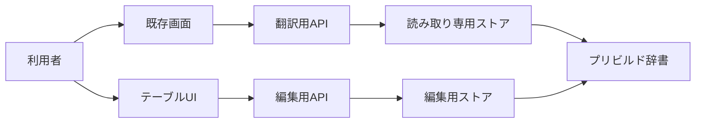

# Design: prebuilt-dictionary-editor

---

## R-1 プリビルド辞書を編集する

### 現況の理解

プリビルド辞書の正本は原語を一意に持ち，原語に複数の意味を結べる構造である。意味には訳語，品詞，意味を区別する説明，変更番号がある。既存のMCPは意味の取得，追加，更新を持つが，削除を持たない。既存のアプリケーション画面はプリビルド辞書を表示または編集しない。根拠は REF-1，REF-2，REF-3，REF-4，REF-5 である。

| | 単位 |
| --- | --- |
| 要求が扱う対象 | プリビルド辞書のテーブルUIに表示する意味 |
| 受け皿が持つキー | 原語ごとの識別子と意味ごとの識別子 |

### あるべき形

テーブルUIは意味を1件ずつ表示し，原語，訳語，品詞，意味を区別する説明を列として持つ。テーブルUIは表示中の意味を選び，追加，詳細表示，更新，削除を行う。編集の作成と更新は変更番号を照合し，競合した更新を保存しない。削除は選択した意味と意味に従属するデータをデータベースの制約に従って削除し，変更履歴を残す。

現況は翻訳用APIだけが読み取り専用ストアへ接続する。

あるべき形ではテーブルUI，編集用API，編集用ストアを追加する。翻訳用APIと読み取り専用ストアは残す。編集用ストアは意味の作成，取得，更新，削除と，50件単位の検索を所有する。

---

## R-2 テーブルUIで絞り込む

### 現況の理解

既存の辞書検索は検索条件と件数上限を持つが，ページ位置を指定する仕組みを持たない。既存の画面のページャーは翻訳結果専用である。フロントエンドにテーブルUIはない。根拠は REF-6，REF-7，REF-8 である。

| | 単位 |
| --- | --- |
| 要求が扱う対象 | テーブルUIに表示する意味の集合 |
| 受け皿が持つキー | 原語，訳語，品詞，意味を区別する説明，意味ごとの識別子 |

### あるべき形

テーブルUIは原語，訳語，品詞，意味を区別する説明の各列に独立したフィルタを持つ。編集用APIはフィルタ条件，ページ番号，1ページの件数を受け取り，該当する意味と総件数を返す。ページの件数は常に50件とする。テーブルUIは総件数とページ番号から前後のページを表示する。

---

## R-3 編集APIを読み取り経路から分離する

### 現況の理解

翻訳用APIは起動時に読み取り専用のプリビルド辞書を注入される。読み取り専用ストアは読み取り専用接続で開かれ，翻訳処理へ辞書の参照を渡す。アプリケーションの起動と終了は開いたストアを管理する。根拠は REF-3，REF-9，REF-10，REF-11 である。

| | 単位 |
| --- | --- |
| 要求が扱う対象 | プリビルド辞書への編集要求 |
| 受け皿が持つキー | 編集用ストアが開く書き込み接続 |

### あるべき形

編集用APIは翻訳用APIとは別の公開面を持つ。編集用ストアは読み取り専用ストアとは別の書き込み接続を持つ。編集用APIと編集用ストアは読み取り専用ストアの型，接続，検索，翻訳処理の呼び出しを共有しない。起動と終了は編集用ストアを読み取り専用ストアとは別の資源として開閉する。

---

## R-4 行ごとの変更を確定する

### 現況の理解

既存の表示案は詳細の編集領域で編集操作を受ける。既存の更新は意味全体と変更番号を受け取る。既存の検索とページングは操作中の変更を持たない。根拠は REF-2，REF-6，REF-12 である。

| | 単位 |
| --- | --- |
| 要求が扱う対象 | テーブルUIに表示する意味の各行と各カラム |
| 受け皿が持つキー | 意味ごとの識別子と変更番号 |

### あるべき形

テーブルUIの表示コンポーネントは，各行の各カラムに編集値と変更前の値を持つ。行の削除操作は削除保留を表示し，削除保留の行をグレーアウトする。画面状態を所有するコンテナは編集済みの行と削除保留の行を保持する。変更がある間はページングを無効化し，取消と確定を表示する。取消は保留状態を捨てる。確定は削除保留を削除要求へ，編集済みの行を変更済みの項目だけを含む更新要求へ分ける。編集用ストアは各更新要求で変更番号を照合し，変更履歴を残す。
