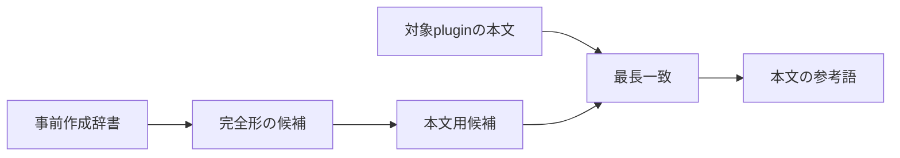
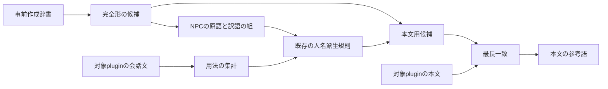

# 事前作成辞書の NPC 人名派生

## 結論

事前作成辞書にある `NPC_` の氏名から、既存の二つ名と姓名分割の規則で人名の部分形の訳を作る。

事前作成辞書に `FULL` と `SHRT` の field はないため、短縮名を通す規則は適用しない。

事前作成辞書、横断辞書、翻訳する plugin の固有名は書き換えない。

## 現況

事前作成辞書の候補は完全形だけで本文の参考語になる。

`NPC_` は候補のカテゴリとして読めるが、`FULL` と `SHRT` は読めない。

## あるべき形

本文用候補を作る engine が、`NPC_` の原語と訳語の組だけを既存の人名派生規則へ渡す。

完全形または対象 plugin の翻訳済み固有名が既に持つ原語には、派生した訳を加えない。

翻訳する plugin の `SHRT` が人名の部分形と同じ英語を持つ時は、`SHRT` を優先する。

## 確認する範囲

- 二つ名の前部と姓名分割で作った部分形が、同期翻訳と batch 翻訳の両方の本文参考語へ出ること。
- `NPC_` 以外、短縮名、一般語として現れる候補、既存原語との衝突を除くこと。

機械向けの設計と仕様は `design.md` と `spec.md` に置く。
