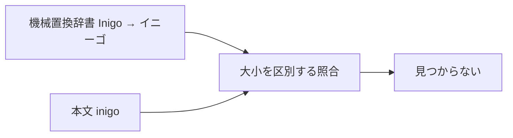
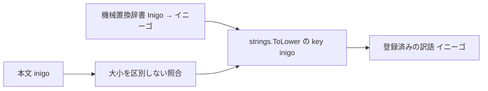

# Design: proper-noun-case-insensitive-replacement

`design.md` は修正方法を人間が判断するための説明を持つ。
要求は `plan.md`、確定仕様は `spec.md`、再現確認と原因は `investigation.md` が持つ。
`design.md` と `spec.md` が食い違う場合は `spec.md` を優先する。

## R-1 固有名置換の安定化

### 現況の理解

`docs/vocabulary.md` は、機械置換辞書を、本文中の固有名を訳語へ置き換えるために横断辞書と plugin 内訳語を合流して組む表と定義している。
開発用 database のコピーで、原語と訳語が空でない横断辞書と plugin 内訳語を機械置換辞書の入力として合流すると、大文字小文字だけが異なる組は22組あった。
機械置換辞書へ入る22組には異なる訳語がなかったため、原文の表記による置換結果の違いは辞書データの訳語の違いではない。

`internal/core/dictionary/dictionary.go` の `Dictionary` は、本文の固有名を語境界と最長一致で見つけ、訳語へ置換する。
`NewDictionary` は原語をそのまま `bySource` の key にし、大小を区別する正規表現を作る。
`Dictionary.Apply` も正規表現が返した表記をそのまま key にする。

`internal/core/mention/mention.go` の `Detector` は、本文から横断辞書と plugin 内訳語の固有名を見つける。
`NewDetector` と `Detector.Detect` は `Dictionary` と同じ大小区別、語境界、最長一致を不変条件として持ち、同じ完全一致の正規表現と key を使う。
`internal/engine/mention.go` の `Engine.mentionDetector` は、`Engine.LoadDictionary` と同じ `translationVocabulary` を同じ順序で渡す。

| | 単位 |
| --- | --- |
| 要求が扱う対象 | 大文字小文字だけが異なる同じ固有名 |
| 受け皿が持つ key | 大文字小文字を含む原語の完全一致文字列 |

### あるべき形

`Dictionary` と `Detector` は、辞書データから取り出した固有名を `strings.ToLower` した文字列を照合用 key に使う。
本文から固有名を見つける正規表現は大文字小文字を区別しない。
正規表現が返した表記も `strings.ToLower` して同じ key で辞書データを取得する。
通常の取得は `strings.ToLower` の key で候補を絞る。
同じ key に複数の登録済み固有名がある場合は、既存 package 内で `strings.EqualFold` を使って正規表現と同じ固有名を選ぶ。
Go の正規表現では同じ固有名だが `strings.ToLower` の key が異なる場合だけ、登録済み固有名の全体から `strings.EqualFold` で選ぶ。
新しい大小対応の処理は作らず、Go 標準ライブラリの規則だけを使う。

原文、辞書データの固有名、訳語は小文字へ書き換えない。
置換内訳には、機械置換辞書へ登録された固有名と訳語を返す。
本文に同じ固有名が異なる大文字小文字で複数回あっても、置換内訳と `Detector` の戻り値では `strings.EqualFold` で同じ登録済みの固有名の重複を1件にまとめる。

既存の語境界、最長一致、辞書データの供給順、一般語の除外を維持する。
正規表現の選択肢は rune 数が多い固有名から並べる。Go の大小を区別しない正規表現が1 rune を1 rune に対応させるため、同じ位置から始まる固有名の最長一致を維持できる。
database の保存形式と保存済みの言及記録は変更しない。

### 変更点

- `internal/core/dictionary/dictionary.go` の `Dictionary` は、`strings.ToLower` した key から登録済みの `Term` の候補を取得する map と、`strings.EqualFold` で確認する登録済みの `Term` の一覧を保持する。置換内訳へ登録表記を返すためである。
- `internal/core/dictionary/dictionary.go` の `NewDictionary` は、原語を `strings.ToLower` した key ごとの候補として辞書データを保持し、大小を区別しない正規表現を作る。`strings.EqualFold` で同じ固有名は最初の1件へまとめる。正規表現の選択肢は `utf8.RuneCountInString` の降順で並べる。
- `internal/core/dictionary/dictionary.go` の `Dictionary.Apply` は、一致した表記を `strings.ToLower` して候補を絞り、候補を `strings.EqualFold` で確認して登録済みの `Term` を取得する。候補にない場合だけ登録済みの `Term` の全体を `strings.EqualFold` で確認する。重複判定は取得した登録済みの `Term` を使う。
- `internal/core/dictionary/dictionary.go` の説明は、大小区別を不変条件とする記述を大文字小文字を区別しない照合へ更新する。
- `internal/core/dictionary/dictionary_test.go` は、登録表記、小文字、全大文字を同じ訳語へ置換し、置換内訳を同じ固有名の1件にまとめることを検証する。既存の語境界と最長一致も検証する。
- `internal/core/mention/mention.go` の `NewDetector` と `Detector.Detect` は、`Dictionary` と同じ `strings.ToLower` の key ごとの候補、`strings.EqualFold` による選択、大小を区別しない正規表現、rune 数の順序、重複判定を使う。
- `internal/core/mention/mention.go` と `internal/core/mention/mention_test.go` の説明と検証は、大小区別を不変条件とする記述を大文字小文字を区別しない照合へ更新する。
- 新しい package と外部依存は追加しない。
- `.go-arch-lint.yml`、database schema、frontend、公開境界は変更しない。
- 最終検証では、結果画面の prompt 再構成経路で大小が異なる固有名が同じ訳語へ置換され、置換内訳が1件になることを確認する。

## 検討が必要なこと

- なし。
