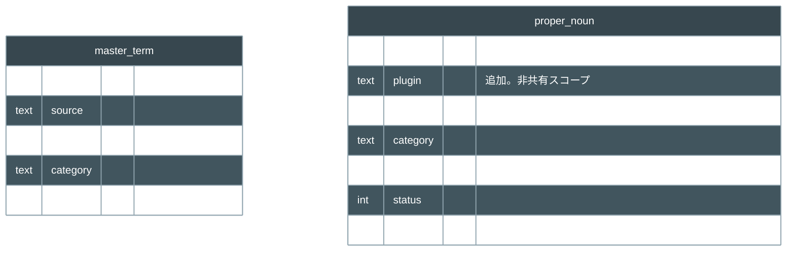

# 設計: proper-noun-plugin-scoping（共有/非共有辞書の分離：mod 固有名を plugin スコープ化）

- 寿命: 恒久（本 task の設計正本。人間設計レビュー対象）。
- 対象 task: `proper-noun-plugin-scoping`。
- 根拠参照: `internal/engine/ingest.go`・`proper_noun.go`、`internal/store/proper_noun.go`・`export.go`・`ingest.go`、`internal/model/proper_noun.go`、`db/migrations/0003_master_term.sql`・`0006_record_type_translation.sql`、`tools/extractor/MasterTermXmlWriter.cs`。

## 1. 主張（先に結論）

**主張**: 固有名の辞書を「共有」と「非共有」に分ける。`master_term`（公式 strings 由来の既訳辞書。Mod 横断で永続）は共有として据え置く。`proper_noun`（mod 固有名の AI 訳の単位）は、現状の横断重複排除をやめ、plugin スコープの非共有へ変える。

**理由**: 2つある。

- 本文置換のノイズ: mod 固有語を全 mod 共有プールに貯めると、多数 mod を訳すほど本文機械置換のノイズ源になる。
- Job 境界: 後続の翻訳永続化（Job を plugin と1対1）で、Job が `narration`・`line` と同じく固有名も plugin で所有でき、境界が綺麗になる。

**本 task の範囲**: `proper_noun` を plugin スコープの storage にするところまで。翻訳実行を plugin へ絞る run スコープ化（本文置換辞書・未訳抽出・言及語彙の plugin 絞り）は後続 `translation-persistence` が担う。

## 2. 固有名辞書の現状と変更（as-is → to-be）

固有名の辞書は2系統ある。`master_term` は公式 strings 由来の既訳辞書で、Mod 横断で共有する（`0003` に「Mod 横断で永続」と明記）。`proper_noun` は mod 固有名の訳を1行ずつ持つ単位だ。本 task は後者だけを触り、横断共有のプールから plugin 単位の非共有へ変える。前者は据え置く。

変更は `proper_noun` の3決定に閉じる。各決定の現状と変更後を対で示す。

| 決定 | 現状（as-is） | 本 task の変更（to-be） |
|---|---|---|
| 取込で残す情報 | `Dispatch` が `extracted_field`（plugin を持つ）から `source`・`category` だけ取り、plugin・form_id・位置を捨てる | `Dispatch` が `plugin` も保持し、`model.ProperNoun` に `plugin` を通す |
| 同一性（重複排除） | `UNIQUE(category, source)` で全 plugin 横断に1行へまとめる | `UNIQUE(plugin, category, source)` で plugin 内だけにまとめる |
| export の位置解決 | `ProperNounPlacementsForExport` が `source`・`category` で `extracted_field` と結び、`ef.plugin` で絞る | 結合に `pn.plugin = ef.plugin` を足し、plugin ごとの固有名だけ位置解決する |

`plugin` 列の追加、それに伴うテーブル再作成 migration、`IngestProperNouns` の INSERT 列追加は、上記決定の機械的帰結だ。実装機構の詳細は実装段で扱う。

変えない点が2つある。

- 権威訳の流用（`SelectSupply`）は不変。固有名フェーズは、既知名を `master_term` から流用し（`status=1`）、未知名だけ plugin ごとに AI 訳する（`status=3`）。書き先は現状どおり `proper_noun` で、`master_term` へは書かない。
- 本文置換辞書（`LoadDictionary`・`translationVocabulary`）と未訳抽出（`ListUntranslatedProperNouns`）・言及語彙の plugin 絞りは本 task で触らない（範囲は §1）。現状は単一 plugin ＋ 起動時 flush のため、`master_term` と `proper_noun` の全件が当該 plugin 分と一致し、破綻しない。plugin 絞りは翻訳実行の run スコープ化が前提で、後続 `translation-persistence` が行う。

## 3. 検討した代替と却下理由

- `proper_noun` を共有のまま維持（現状）
  - 却下: 多数 mod を訳すと mod 固有語が本文置換のノイズになり、Job 境界も緩い。
- `master_term` も plugin スコープ化する
  - 却下: 公式既訳は横断で正当に共有すべきで、ノイズにならない。共有/非共有の境界は「既訳（共有）／mod 固有の AI 訳（非共有）」で引く。
- 同綴りの mod 固有名を横断で1度だけ訳す挙動を残す
  - 却下: 非共有化の目的に反する。mod 固有語は mod ごとに別で扱う。

## 4. 図（proper_noun の差分。他テーブルは不変）

図は `proper_noun` の差分だけを示す。`plugin` 行の追加と `UNIQUE` の変更が非共有化の実体だ。`master_term` は比較のため不変で併記する。

## 5. 影響範囲

変更は `store` と `engine` に閉じる。層・依存・Wails 境界は不変で、新 component も新 port も無い。`docs/architecture.md` の反映は不要。

- `store`（永続層）に影響
  - `proper_noun` の schema と重複排除規則（列追加・`UNIQUE` 変更・テーブル再作成）。
  - export の位置解決の結合（`ProperNounPlacementsForExport`）。
  - `ListProperNouns` 等の SELECT は列追加に自然追従する。
- `engine`（取込・翻訳層）に影響
  - `Dispatch` の取込項目に `plugin` を追加（`model.ProperNoun` も同）。
  - 翻訳アルゴリズム（`SelectSupply`・固有名フェーズ）は不変。
- 影響しないもの
  - C#↔Go 契約。`proper_noun` は Go 取込段が `extracted_field` から作る。C# は `master_term` を書くが本 task で触らない。
  - UI。結果一覧が列追加に追従するのみ。plugin 表示の要否は本 task の対象外（表示変更があれば storybook 側で別途）。
  - 正本反映。`docs/architecture.md` は不要。`docs/er.md`・concept-model への `proper_noun.plugin` 反映は finalization で扱う。

## 6. テストの要点（純粋部分を単体、統合は E2E）

- `Dispatch` が `f.Plugin` を保持して `proper_noun` を作る（純粋関数、単体）。
- plugin 内 dedup と plugin 跨ぎ非共有: 同綴りの mod 固有名が別 plugin なら別行になる（`UNIQUE(plugin, category, source)` の効き）。
- `SelectSupply` の権威訳流用が不変（回帰。既知名は `master_term` から流用）。
- export の位置解決が `pn.plugin = ef.plugin` で正しく plugin 別に出る（統合寄り、E2E で確認）。

## 7. 確認してほしい点

1. 本 task の範囲を「`proper_noun` を plugin スコープの storage にする」までとし、本文置換辞書・未訳抽出・言及語彙の plugin スコープ化（run スコープ依存）は `translation-persistence` へ回す、でよいか。
2. `proper_noun` の同一性を `UNIQUE(plugin, category, source)` にし、2つの mod に同綴りの mod 固有名は別行・別訳にする、でよいか。
3. `master_term` は据え置き（横断共有・plugin スコープ化しない）、でよいか。
