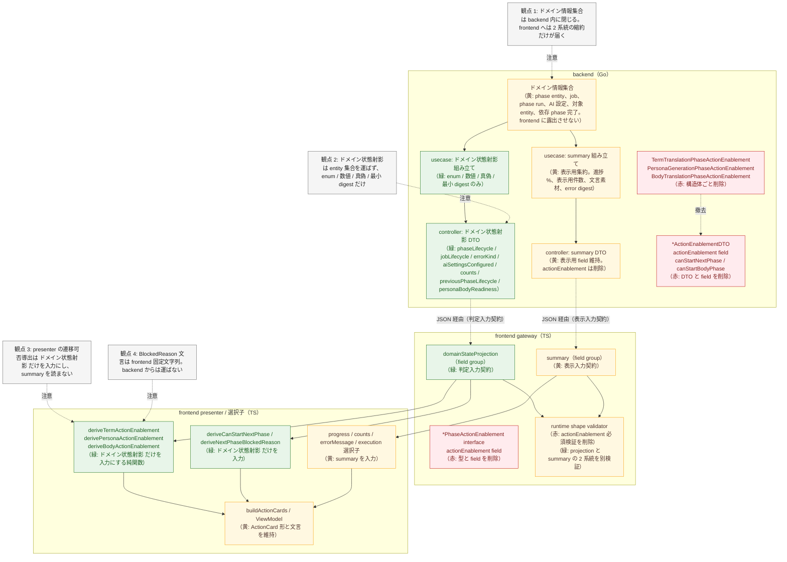
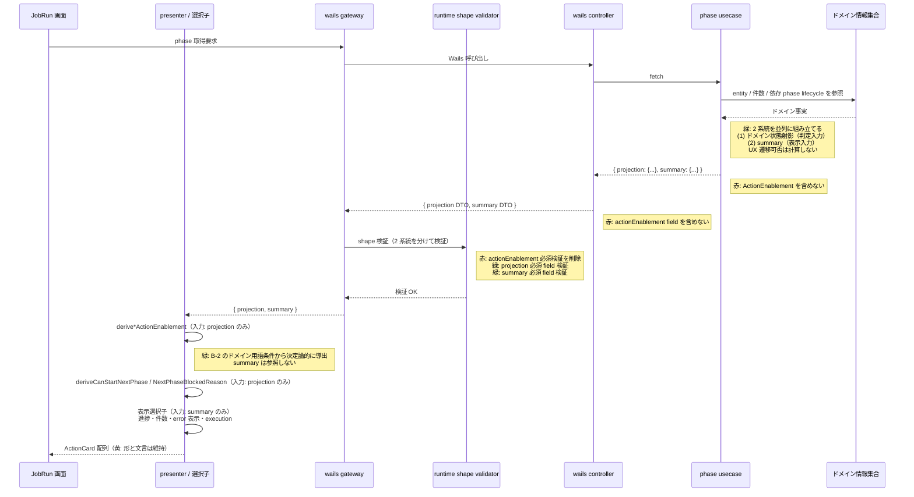

# refactor-action-enablement-derive-on-frontend 設計差分図

## 概要

- 図化目的: backend が返していた UX 遷移可否 flag（`canStart` / `canPause` / `canResume` / `canRetry` / `canCancel` / `canStartNextPhase` 系）と `*BlockedReason` 群を除去し、UX 遷移判定を frontend の presenter / 選択子へ集約する責務再配置を、人間設計レビューと実装着手判断のために固定する。本改稿の主眼は、ドメイン情報集合・ドメイン状態射影・summary（集約ビュー）・UX 遷移可否の 4 責務分離を明示し、UX 遷移可否の唯一の判定入力を「ドメイン状態射影」に固定したことにある。summary は画面表示用集約ビューに限定し、判定入力としては使わない。
- 根拠参照:
  - `docs/exec-plans/active/refactor-action-enablement-derive-on-frontend/plan.md`
  - `docs/coding-guidelines-backend.md` 第 7 節（UX 遷移可否 flag を backend が返さない原則、状態・種別・条件を返す原則）
  - `internal/usecase/term_translation_phase_contract.go`（`TermTranslationPhaseSummaryResult` と `TermTranslationPhaseActionEnablement` の構造）
  - `internal/usecase/persona_generation_phase_contract.go`（`PersonaGenerationPhaseSummaryResult` と `PersonaGenerationPhaseActionEnablement`、`PersonaGenerationBodyReadinessResult`）
  - `internal/usecase/body_translation_phase_contract.go`（`BodyTranslationPhaseSummaryResult` と `BodyTranslationPhaseActionEnablement`、`BodyTranslationOutputReadinessSummary`）
  - `internal/controller/wails/term_translation_phase_controller.go`（`TermTranslationPhaseActionEnablementDTO`）
  - `internal/controller/wails/persona_generation_phase_controller.go`
  - `internal/controller/wails/body_translation_phase_controller.go`
  - `frontend/src/application/gateway-contract/term-translation-phase/term-translation-phase-gateway-contract.ts`
  - `frontend/src/application/gateway-contract/persona-generation-phase/persona-generation-phase-gateway-contract.ts`
  - `frontend/src/application/gateway-contract/body-translation-phase/body-translation-phase-gateway-contract.ts`
  - `frontend/src/controller/wails/term-translation-phase.gateway.ts:247-265` runtime shape validator
  - 既存導出ロジック: `frontend/src/application/presenter/term-translation-phase/term-translation-phase.presenter.ts:406-568`
- 範囲: 3 phase（term / persona / body）の usecase contract、Wails controller DTO、frontend gateway contract、runtime shape validator、presenter の責務再配置に限る。phase 状態 enum 値、ジョブ lifecycle、件数、設定構成有無、依存 phase 完了判定の意味は変更しない。画面文言と layout は変更しない。

## 差分凡例

- 赤: 削除する要素または経路を示す。
- 緑: 追加する要素または経路を示す。
- 黄色: 変更しない要素または経路を示す。

## A. 用語整理

責務境界を 4 つに分けて固定する。本書中で各語は常にこの定義で使う。

- ドメイン情報集合: backend のドメインモデル側に存在する事実集合のこと。phase entity、job entity、phase run entity、AI 設定 entity、処理対象 entity（数万件規模）、依存 phase の完了状態などを含む。frontend には露出させない。
- ドメイン状態射影（domain state projection）: UX 遷移可否の導出にだけ使うために backend が作って frontend に運ぶ「状態 enum 値、種別 enum 値、条件根拠（数値、真偽、依存 phase の lifecycle 値、readiness の最小 digest）」の集合のこと。entity 集合を運ばず、enum / 数値 / 真偽 / 短い digest だけで構成する。**UX 遷移可否の唯一の判定入力**として位置付ける。
- summary（集約ビュー）: 画面表示用に backend が作って frontend に運ぶ集約形のこと。進捗 %、表示用件数、表示用文言素材、error message digest、AI 設定の表示用値などを含む。ActionCard の有効化以外の画面要素（進捗バー、件数表示、error 表示、execution 表示）の入力に使う。
- UX 遷移可否: ボタンが押せるかどうかという画面側の判定結果のこと。frontend presenter がドメイン状態射影だけを入力に決定論的に導出する。backend は導出しない。

要点: summary は「画面表示用」、ドメイン状態射影は「UX 遷移可否判定用」と用途で完全に分ける。summary を判定入力に流用しない理由は、summary が画面要件で形を変える集約形であり、UX 遷移可否の正しさが画面表示要件の変更に従属してしまうのを避けるためである。同じ backend method の response 内であっても、ドメイン状態射影と summary は別 field group（または別 result/DTO）として並べる。意味が重なる値（例: phase lifecycle）が両側に出ても、契約上の所属を取り違えない。

## B. action ごとの有効化条件分解

3 phase × 4 共通 action（start / pause / resume / retry）、persona / body の cancel、phase 跨ぎ 1 action（startNextPhase）について、まずドメイン用語で有効化条件を定義し、各条件の根拠をドメイン状態射影 field に照合する。**summary field は本節に現れない**。

### B-1. 共通定義（ドメイン用語）

- terminal: job lifecycle が終端（完結 / 失敗確定 / 中止）である。
- idleReady: 当該 phase の phase run が存在しないか、phase lifecycle が起動前段階（pending / idle_ready / ready / 空文字）である。
- running: phase run の lifecycle が実行中（running / in_progress / processing）である。
- paused: phase run lifecycle が paused である。
- recoverableFailed: phase run lifecycle が再開可能失敗（recoverable_failed / retryable_failed）であるか、error 種別 enum が `recoverable` である。
- completed: phase lifecycle が完了系（completed / succeeded / done）である。
- aiSettingsConfigured: 当該 phase の AI 設定が保存済みかつ provider / model / executionMode が確定している（真偽）。
- hasProcessingTarget: 当該 phase の処理対象件数 > 0。
- previousPhaseCompleted: 直前 phase（persona の場合は term、body の場合は persona）の lifecycle 値が completed である。
- aiTargetSatisfied: 当該 phase の確定件数が AI 対象件数以上（`confirmedCount >= aiTargetCount`）。term→persona 移行の下流条件。
- personaBodyReady: persona 完了結果が body 入力として参照可能（`bodyReadiness === true` または `snapshotReferenceStatus === "available"`）。persona→body 移行および body の start で使う。

### B-2. action × 有効化条件 × 根拠ドメイン状態射影 field

term phase の表（persona / body の差分は B-3）。

| action | ドメイン用語の有効化条件 | 根拠となるドメイン状態射影 field（term） |
| --- | --- | --- |
| start | not terminal かつ not running かつ idleReady かつ aiSettingsConfigured かつ hasProcessingTarget | `jobLifecycle`、`phaseLifecycle`、`aiSettingsConfigured`、`aiTargetCount` |
| pause | not terminal かつ running | `jobLifecycle`、`phaseLifecycle` |
| resume | not terminal かつ（paused または recoverableFailed） | `jobLifecycle`、`phaseLifecycle`、`errorKind` |
| retry | not terminal かつ recoverableFailed | `jobLifecycle`、`phaseLifecycle`、`errorKind` |
| startNextPhase | not terminal かつ completed かつ aiTargetSatisfied | `jobLifecycle`、`phaseLifecycle`、`confirmedCount`、`aiTargetCount` |

phase 別の下流条件:

- term 完了後の startNextPhase（→ persona）: aiTargetSatisfied。
- persona 完了後の startNextPhase（→ body）: personaBodyReady（`personaBodyReadiness.bodyReadiness` または `personaBodyReadiness.snapshotReferenceStatus` の最小 digest を参照）。
- body 完了後の startNextPhase: 後続なし。

### B-3. persona / body 固有

- persona: cancel が存在する。条件は「not terminal かつ（running または paused または recoverableFailed）」。根拠は `jobLifecycle`、`phaseLifecycle`、`errorKind`。
- persona の start には「previousPhaseCompleted（term 完了）」が要る。根拠は `previousPhaseLifecycle`。
- body: cancel は persona と同型。start には「previousPhaseCompleted（persona 完了）かつ personaBodyReady」が要る。根拠は `previousPhaseLifecycle`、`personaBodyReadiness`。
- body の startNextPhase は存在しない。

## C. ドメイン状態射影の field 設計

UX 遷移可否導出に必要な値を、phase ごとに「ドメイン状態射影」として再露出する。entity 集合は含めず、enum / 数値 / 真偽 / 最小 digest だけで構成する。summary 側に意味が重なる値があっても、契約上は別所属として並べる。

### C-1. term phase のドメイン状態射影 field

| field | 型 | 意味 | 由来ドメイン entity |
| --- | --- | --- | --- |
| `phaseLifecycle` | string enum（`pending` / `idle_ready` / `running` / `paused` / `recoverable_failed` / `unrecoverable_failed` / `completed` / `canceled` の集合から該当値） | term phase run の lifecycle 値 | JOB_PHASE_RUN（term） |
| `jobLifecycle` | string enum（`ready` / `running` / `paused` / `completed` / `failed` / `canceled` の集合から該当値） | 親 job の lifecycle 値 | TRANSLATION_JOB |
| `errorKind` | string enum（`none` / `recoverable` / `unrecoverable`） | 直近 error 種別 | JOB_PHASE_RUN（term）の error |
| `aiTargetCount` | number | AI 対象件数 | term ドメインの対象件数集約 |
| `confirmedCount` | number | 確定件数 | term ドメインの確定件数集約 |
| `aiSettingsConfigured` | bool | AI 設定が provider / model / executionMode 含めて確定済みか | term phase の AI 設定 entity |

### C-2. persona phase のドメイン状態射影 field

term の C-1 と同型の `phaseLifecycle` / `jobLifecycle` / `errorKind` / `aiSettingsConfigured` に加え、以下を持つ。

| field | 型 | 意味 | 由来ドメイン entity |
| --- | --- | --- | --- |
| `targetCount` | number | persona 対象件数 | persona ドメインの対象件数集約 |
| `previousPhaseLifecycle` | string enum（C-1 `phaseLifecycle` と同集合） | 直前 term phase の lifecycle 値 | JOB_PHASE_RUN（term） |

### C-3. body phase のドメイン状態射影 field

term の C-1 と同型の `phaseLifecycle` / `jobLifecycle` / `errorKind` / `aiSettingsConfigured` に加え、以下を持つ。

| field | 型 | 意味 | 由来ドメイン entity |
| --- | --- | --- | --- |
| `targetCount` | number | body 対象件数 | body ドメインの対象件数集約 |
| `previousPhaseLifecycle` | string enum（C-1 `phaseLifecycle` と同集合） | 直前 persona phase の lifecycle 値 | JOB_PHASE_RUN（persona） |
| `personaBodyReadiness` | object（`bodyReadiness: bool`、`snapshotReferenceStatus: string enum`） | persona snapshot を body 入力として参照可能かの最小 digest | persona snapshot |

### C-4. summary 側に残す field（参考、表示用）

ドメイン状態射影と分けて、summary 側は画面表示要件に応じた集約として残す。判定入力には使わない。

- 進捗 %、表示用件数、AI 設定の公開可能値、execution の表示用 field、`errorSummary.message` などの error 表示 digest、`resultSummary` の表示用 field（件数表示、bodyReadiness 等は personaBodyReadiness と意味重複可、所属は summary）。

### C-5. 削除対象

UX 遷移可否 flag と BlockedReason 群、および入れ物の型を削除する。

| 削除候補 | 理由 |
| --- | --- |
| `actionEnablement` 配下の `canStart` / `canPause` / `canResume` / `canRetry` / `canCancel`（3 phase） | UX 遷移可否は backend の責務外 |
| `*BlockedReason` 群（3 phase） | UX 表示文言。frontend の responsibility |
| `canStartNextPhase` / `canStartBodyPhase` 等の command response flag | 同上 |
| `TermTranslationPhaseActionEnablement` / `PersonaGenerationPhaseActionEnablement` / `BodyTranslationPhaseActionEnablement` 型 | 上記 field 削除に伴い型ごと撤去 |

## D. コンポーネント図（責務再配置）

ドメイン情報集合・ドメイン状態射影・summary・UX 遷移可否の 4 責務を経路で分けて描く。usecase は **2 系統**（ドメイン状態射影、summary）を並列に縮約する。gateway contract も 2 field group に分ける。presenter の `derive*ActionEnablement` はドメイン状態射影だけを入力にし、summary は ActionCard 以外の画面要素へ向かう。

### D-補. 各箱の説明

- ドメイン情報集合（黄）: backend ドメイン側の事実集合。本リファクタで露出経路は増やさない。
- usecase: ドメイン状態射影組み立て（緑）: ドメイン情報集合から enum / 数値 / 真偽 / 最小 digest を抜き出す。entity 集合を運ばない。
- usecase: summary 組み立て（黄）: 既存の表示用集約論理を維持。`PhaseState`、`Progress`、件数表示、`Execution`、`ErrorSummary` 等。
- `*ActionEnablement` 構造体（赤）: usecase result から削除。
- controller: ドメイン状態射影 DTO（緑）: C 節で定義した field 群を JSON 化。
- controller: summary DTO（黄）: 表示用 field を維持しつつ `actionEnablement` field を撤去。
- frontend gateway の 2 field group（緑 + 黄）: 同じ response 内であっても判定入力契約と表示入力契約を別 field group として並べる。
- runtime shape validator（赤 + 緑）: `actionEnablement` 必須検証を削除し、projection / summary の 2 系統に必須検証を分けて持つ。motivating bug（`canStartNextPhase` 必須検証で落ちる）は本削除で解消する。
- presenter `derive*ActionEnablement`（緑）: ドメイン状態射影だけを入力に決定論的に導出。summary は読まない。出力 `{ canStart, canPause, canResume, canRetry, (canCancel), *BlockedReason }` の形は維持し、画面表示は変えない。
- 表示選択子（黄）: 進捗・件数・error 表示・execution 表示は summary を入力に維持。
- `buildActionCards` / ViewModel（黄）: 出力 `ActionCard` 形と文言を変えない。

## E. シーケンス図（取得から ActionCard 生成まで）

## F. 検証

- 4 責務分離確認: A 節でドメイン情報集合 / ドメイン状態射影 / summary / UX 遷移可否を定義し、本文・図 D・図 E のすべてで 4 区分が一貫して現れていることを確認した。summary を判定入力に使わない理由を A 節で明示した。
- 遷移可否導出経路確認: presenter の `derive*ActionEnablement` と `deriveCanStartNextPhase` は図 D・図 E ともに「ドメイン状態射影」からの矢印だけを入力に持ち、summary からの矢印が ActionCard 以外の表示要素へ向かうことを確認した。summary 由来の矢印が presenter の遷移可否導出関数へ入っていないことを論理レベルで担保した。
- ドメイン状態射影の構成確認: C 節で列挙した field がすべて enum 値 / 数値 / 真偽 / 最小 digest だけで構成され、entity 集合を運ぶ案を採っていないことを確認した。
- 条件分解確認: B 節で action ごとの有効化条件をドメイン用語で先に定義し、根拠 field を「ドメイン状態射影 field」として列挙していることを確認した。summary field は B 節に現れない。
- 図整合確認: 図 D に backend usecase の 2 系統経路（projection / summary）と削除 field 群（赤）が同時に現れ、ドメイン情報集合が backend 内に閉じていることを確認した。
- 差分凡例確認: 赤（削除）、緑（追加）、黄色（変更なし）が各図と凡例節で揃っていることを確認した。
- 範囲確認: 画面構造、文言、layout、表示順、phaseState 意味、件数意味は変更対象に含めていない。
- 整合確認: 図と表の責務再配置は `plan.md` の decision table（仕様 N、画面 N、内部構造 Y、frontend ロジック Y、backend Y）と一致する。
- motivating bug 解消確認: runtime shape validator の `actionEnablement` 必須検証削除が図 D・図 E ともに残っている。

## G. 修正対象ごとの判定論理（日本語）

本節は B-1 の条件語彙を再利用する。全 presenter の derive 関数は **ドメイン状態射影だけ** を入力にする。判定論理中で参照する field 名は projection 側の名前に統一する。BlockedReason 文字列は frontend 固定文字列として 1 文ずつ定義する。

### G-1. frontend presenter（term phase）

#### G-1-a. `deriveTermActionEnablement`

- 対象: `frontend/src/application/presenter/term-translation-phase/term-translation-phase.presenter.ts` の `deriveTermActionEnablement`
- 入力: term phase のドメイン状態射影（`jobLifecycle` / `phaseLifecycle` / `errorKind` / `aiSettingsConfigured` / `aiTargetCount` / `confirmedCount`）。summary は読まない。
- 判定論理:
  - terminal = `jobLifecycle` ∈ { completed, failed, canceled }
  - running = `phaseLifecycle` ∈ { running, in_progress, processing }
  - paused = `phaseLifecycle` === paused
  - recoverableFailed = `phaseLifecycle` ∈ { recoverable_failed, retryable_failed } または `errorKind` === recoverable
  - idleReady = `phaseLifecycle` ∈ { pending, idle_ready, ready, "" }
  - hasProcessingTarget = `aiTargetCount` > 0
  - canStart = not terminal かつ not running かつ idleReady かつ `aiSettingsConfigured` かつ hasProcessingTarget
  - canPause = not terminal かつ running
  - canResume = not terminal かつ（paused または recoverableFailed）
  - canRetry = not terminal かつ recoverableFailed
- BlockedReason 決定論理（上位から順に評価、最初に該当した文を返す。全条件満足時は空文字）:
  - startBlockedReason
    - terminal → 「ジョブが終端状態のため開始できません。」
    - running → 「実行中の翻訳段階があるため開始できません。」
    - `aiSettingsConfigured` でない → 「実行設定が未構成のため開始できません。」
    - hasProcessingTarget でない → 「処理対象が 0 件のため開始できません。」
    - idleReady でない → 「ジョブが開始可能状態ではありません。」
  - pauseBlockedReason
    - terminal → 「ジョブが終端状態のため中断できません。」
    - running でない → 「フェーズが実行中ではありません。」
  - resumeBlockedReason
    - terminal → 「ジョブが終端状態のため再開できません。」
    - paused でも recoverableFailed でもない → 「フェーズが再開可能な状態ではありません。」
  - retryBlockedReason
    - terminal → 「ジョブが終端状態のため再試行できません。」
    - recoverableFailed でない → 「フェーズが再試行可能な状態ではありません。」
- 等価条件根拠: 現行 `term-translation-phase.presenter.ts:442-512` の論理と等価。差分は (a) terminal を `jobLifecycle` 直読に切替、(b) recoverableFailed 判定で `errorKind` enum を使う、(c) hasProcessingTarget を canStart に明示追加の 3 点。

#### G-1-b. `deriveCanStartNextPhase`（term → persona 移行）

- 対象: 同ファイルの `deriveCanStartNextPhase` と `deriveNextPhaseBlockedReason`
- 入力: term phase のドメイン状態射影のみ。
- 判定論理:
  - completed = `phaseLifecycle` ∈ { completed, succeeded, done }
  - aiTargetSatisfied = `confirmedCount` >= `aiTargetCount`
  - canStartNextPhase = not terminal かつ completed かつ aiTargetSatisfied
- BlockedReason 決定論理:
  - terminal → 「ジョブが終端状態のため次段階を開始できません。」
  - completed でない → 「単語翻訳段階が未完了のため次段階を開始できません。」
  - aiTargetSatisfied でない → 「確定件数が AI 対象件数に達していないため次段階を開始できません。」
  - 全満足 → 空文字
- 等価条件根拠: 現行 `term-translation-phase.presenter.ts:406-440` と等価（入力経路を projection に切替）。

### G-2. frontend presenter（persona phase）

#### G-2-a. `derivePersonaActionEnablement`

- 対象: `frontend/src/application/presenter/persona-generation-phase/persona-generation-phase.presenter.ts` の `derivePersonaActionEnablement`
- 入力: persona phase のドメイン状態射影（`jobLifecycle` / `phaseLifecycle` / `errorKind` / `aiSettingsConfigured` / `targetCount` / `previousPhaseLifecycle`）。summary は読まない。
- 判定論理:
  - previousPhaseCompleted = `previousPhaseLifecycle` ∈ { completed, succeeded, done }
  - hasProcessingTarget = `targetCount` > 0
  - canStart = not terminal かつ not running かつ not paused かつ not recoverableFailed かつ idleReady かつ `aiSettingsConfigured` かつ hasProcessingTarget かつ previousPhaseCompleted
  - canPause = not terminal かつ running
  - canResume = not terminal かつ（paused または recoverableFailed）
  - canRetry = not terminal かつ recoverableFailed
  - canCancel = not terminal かつ（running または paused または recoverableFailed）
- BlockedReason 決定論理:
  - startBlockedReason
    - terminal → 「ジョブが終端状態のため開始できません。」
    - running または paused または recoverableFailed → 「実行中の翻訳段階があるため開始できません。」
    - previousPhaseCompleted でない → 「単語翻訳段階が完了していないためペルソナ生成を開始できません。」
    - `aiSettingsConfigured` でない → 「実行設定が未構成のため開始できません。」
    - hasProcessingTarget でない → 「処理対象が 0 件のため開始できません。」
    - idleReady でない → 「ジョブが開始可能状態ではありません。」
  - pause / resume / retry は G-1-a と同一文言。
  - cancelBlockedReason
    - terminal → 「ジョブが終端状態のためキャンセルできません。」
    - running でも paused でも recoverableFailed でもない → 「フェーズがキャンセル可能な状態ではありません。」
- 等価条件根拠: 現行 `persona-generation-phase.presenter.ts:506-570` と等価。差分は (a) 入力経路を projection に切替、(b) canStart の条件式を B-2 に揃えて明示化の 2 点。

#### G-2-b. `derivePersonaCanStartBodyPhase`（persona → body 移行）

- 対象: 同ファイルの `derivePersonaCanStartBodyPhase` と `derivePersonaBodyReadinessBlockedReason`
- 入力: persona phase のドメイン状態射影のみ。**`personaBodyReadiness` は body 側 projection に置く**ため、persona 側からの本判定では持たない。本判定は persona 完了済みでかつ body 開始が物理的に可能であることまでを扱い、body 側の readiness は body の derive 側で判定する設計に統一する。
- 判定論理:
  - canStartNextPhase = not terminal かつ completed
- BlockedReason 決定論理:
  - terminal → 「ジョブが終端状態のため本文翻訳を開始できません。」
  - completed でない → 「ペルソナ生成段階が未完了のため本文翻訳を開始できません。」
- 注記: 現行ロジックは persona summary の `resultSummary.snapshotReferenceStatus` / `bodyReadiness` を判定に使っているが、新設計では readiness を body phase 側の projection（`personaBodyReadiness`）に集約する。よって持ち場を body 側 derive に移す。等価性は G-3-a の canStart 条件と組み合わせて担保する。

### G-3. frontend presenter（body phase）

#### G-3-a. `deriveBodyActionEnablement`

- 対象: `frontend/src/application/presenter/body-translation-phase/body-translation-phase.presenter.ts` の `deriveBodyActionEnablement`
- 入力: body phase のドメイン状態射影（`jobLifecycle` / `phaseLifecycle` / `errorKind` / `aiSettingsConfigured` / `targetCount` / `previousPhaseLifecycle` / `personaBodyReadiness`）。summary は読まない。
- 判定論理:
  - previousPhaseCompleted = `previousPhaseLifecycle` ∈ { completed, succeeded, done }
  - hasProcessingTarget = `targetCount` > 0
  - personaBodyReady = `personaBodyReadiness.bodyReadiness` === true または `personaBodyReadiness.snapshotReferenceStatus` === "available"
  - canStart = not terminal かつ not running かつ not paused かつ not recoverableFailed かつ idleReady かつ `aiSettingsConfigured` かつ hasProcessingTarget かつ previousPhaseCompleted かつ personaBodyReady
  - canPause / canResume / canRetry / canCancel は G-2-a と同一。
- BlockedReason 決定論理:
  - startBlockedReason
    - terminal → 「ジョブが終端状態のため開始できません。」
    - running または paused または recoverableFailed → 「実行中の翻訳段階があるため開始できません。」
    - previousPhaseCompleted でない → 「ペルソナ生成段階が完了していないため本文翻訳を開始できません。」
    - personaBodyReady でない → 「ペルソナ snapshot 参照が準備できていないため本文翻訳を開始できません。」
    - `aiSettingsConfigured` でない → 「実行設定が未構成のため開始できません。」
    - hasProcessingTarget でない → 「処理対象が 0 件のため開始できません。」
    - idleReady でない → 「ジョブが開始可能状態ではありません。」
  - pause / resume / retry / cancel は G-2-a と同一文言。
- 等価条件根拠: 現行 `body-translation-phase.presenter.ts:306-369` と等価。差分は (a) 入力経路を projection に切替、(b) canStart 条件式の明示化、(c) personaBodyReady を body 側 projection で判定する設計に集約の 3 点。startNextPhase 系は新設しない。

### G-4. frontend gateway runtime shape validator

#### G-4-a. term gateway validator

- 対象: `frontend/src/controller/wails/term-translation-phase.gateway.ts:247-265` 付近の `assertSummaryShape` 等
- 責務: response の 2 系統を分けて必須検証する。
- 判定論理（projection 必須検証）: `phaseLifecycle` が文字列、`jobLifecycle` が文字列、`errorKind` が文字列、`aiSettingsConfigured` が真偽、`aiTargetCount` が number、`confirmedCount` が number。
- 判定論理（summary 必須検証）: 既存表示用 field の存在検証を維持。
- 判定論理（削除）: `actionEnablement` および内部 `canStart` / `canPause` / `canResume` / `canRetry` / `canStartNextPhase` の必須検証。
- BlockedReason は validator で扱わない。

#### G-4-b. persona gateway validator

- 対象: `frontend/src/controller/wails/persona-generation-phase.gateway.ts`
- 追加（projection 必須）: `phaseLifecycle`、`jobLifecycle`、`errorKind`、`aiSettingsConfigured`、`targetCount`、`previousPhaseLifecycle`
- 削除: `actionEnablement`、`canStartBodyPhase`

#### G-4-c. body gateway validator

- 対象: `frontend/src/controller/wails/body-translation-phase.gateway.ts`
- 追加（projection 必須）: `phaseLifecycle`、`jobLifecycle`、`errorKind`、`aiSettingsConfigured`、`targetCount`、`previousPhaseLifecycle`、`personaBodyReadiness`（object: `bodyReadiness: bool`、`snapshotReferenceStatus: string`）
- 削除: `actionEnablement`

### G-5. backend usecase contract（2 系統 result の併存）

#### G-5-a. `term_translation_phase_contract.go`

- 対象: `internal/usecase/term_translation_phase_contract.go`
- 修正方針: summary result とドメイン状態射影 result の 2 系統を併存させる。両者は同じ fetch 経路で組み立て、controller へ並べて返す。
- ドメイン状態射影 result の組み立て論理:
  - `PhaseLifecycle`: term phase run の lifecycle 値（未生成時は空文字）。
  - `JobLifecycle`: TRANSLATION_JOB の lifecycle 値（未生成時は空文字）。
  - `ErrorKind`: `none` / `recoverable` / `unrecoverable` のいずれか。
  - `AISettingsConfigured`: AI 設定 entity が provider / model / executionMode を満たすかの真偽。
  - `AITargetCount`: AI 対象件数。
  - `ConfirmedCount`: 確定件数。
- summary result の組み立て論理: 既存の `PhaseState` / `Progress` / `AITargetCount`（表示用、projection と意味重複可）/ `AISettings`（表示用）/ `Execution` / `ErrorSummary` / `ResultSummary` を維持。
- 削除対象: `TermTranslationPhaseActionEnablement` 型、`CanStart` / `CanPause` / `CanResume` / `CanRetry` / 各 `*BlockedReason`、command result の `CanStartNextPhase`。

#### G-5-b. `persona_generation_phase_contract.go`

- ドメイン状態射影 result の組み立て論理:
  - `PhaseLifecycle` / `JobLifecycle` / `ErrorKind` / `AISettingsConfigured`: G-5-a と同形式。
  - `TargetCount`: persona 対象件数。
  - `PreviousPhaseLifecycle`: 直前 term phase の JOB_PHASE_RUN lifecycle 値（未生成時は空文字）。
- summary result: 既存維持。
- 削除対象: `PersonaGenerationPhaseActionEnablement` 型、各 `Can*` / `*BlockedReason`、command result の `CanStartBodyPhase`。

#### G-5-c. `body_translation_phase_contract.go`

- ドメイン状態射影 result の組み立て論理:
  - `PhaseLifecycle` / `JobLifecycle` / `ErrorKind` / `AISettingsConfigured`: 同形式。
  - `TargetCount`: body 対象件数。
  - `PreviousPhaseLifecycle`: 直前 persona phase の lifecycle 値。
  - `PersonaBodyReadiness`: `BodyReadiness: bool` と `SnapshotReferenceStatus: string` の最小 digest object。snapshot 無し時は zero 値。
- summary result: 既存維持。
- 削除対象: `BodyTranslationPhaseActionEnablement` 型と内部 field。

### G-6. backend wails controller DTO（2 系統 DTO の併存）

#### G-6-a. `term_translation_phase_controller.go`

- 修正方針: response に projection DTO と summary DTO を並べる field group として併存させる（同じ method の戻り値構造の中で別 field group として配置）。
- 追加 DTO: `TermTranslationPhaseProjectionDTO`（`phaseLifecycle` / `jobLifecycle` / `errorKind` / `aiSettingsConfigured` / `aiTargetCount` / `confirmedCount`）。
- 維持: summary DTO（表示用 field）。
- 削除対象: `TermTranslationPhaseActionEnablementDTO`、summary DTO の `actionEnablement` field、command response の `canStartNextPhase` / `nextPhaseBlockedReason`。

#### G-6-b. `persona_generation_phase_controller.go`

- 追加 DTO: `PersonaGenerationPhaseProjectionDTO`（`phaseLifecycle` / `jobLifecycle` / `errorKind` / `aiSettingsConfigured` / `targetCount` / `previousPhaseLifecycle`）
- 削除対象: `PersonaGenerationPhaseActionEnablementDTO`、summary の `actionEnablement`、command response の `canStartBodyPhase` / `bodyReadinessBlockedReason`

#### G-6-c. `body_translation_phase_controller.go`

- 追加 DTO: `BodyTranslationPhaseProjectionDTO`（`phaseLifecycle` / `jobLifecycle` / `errorKind` / `aiSettingsConfigured` / `targetCount` / `previousPhaseLifecycle`、`personaBodyReadiness: { bodyReadiness: bool, snapshotReferenceStatus: string }`）
- 削除対象: `BodyTranslationPhaseActionEnablementDTO`、summary の `actionEnablement`

### G-7. 等価性検証の参照

- term: 現行 `term-translation-phase.presenter.ts:406-512` の判定結果と、本節 G-1（入力を projection に切替、recoverableFailed を errorKind enum 経由で判定、hasProcessingTarget を canStart に明示化）が同条件入力に対して同じ ActionCard 出力を返すこと。
- persona: 現行 `persona-generation-phase.presenter.ts:476-570` と本節 G-2 が同等価。canStart 条件の明示化が現行の `!terminal && !isActive` と意味同値であることを実装時に確認する。
- body: 現行 `body-translation-phase.presenter.ts:268-369` と本節 G-3 が同等価。personaBodyReady の判定持ち場を body 側に移しても出力 ActionCard が同じになることを実装時に確認する。

## H. ボタン軸の判定論理（論理式）

本節は G 節（条件項軸）と双方向に整合する形で、画面上の各ボタンを 1 ブロックで提示する。論理式は条件項の抽象名を使わず、ドメイン状態射影 field の値そのものへの直接条件（enum 集合への所属 `∈` / `∉`、真偽 `=` / `≠`、数値比較 `>` / `≥`）と命題 connectives（`∧` / `∨` / `¬`）だけで書く。BlockedReason は frontend 固定文字列、上から順に評価し最初に該当した文を返す。

各論理式中で使う enum 集合の略号:
- `TERMINAL_JOB` = { completed, failed, canceled }
- `RUNNING_PHASE` = { running, in_progress, processing }
- `IDLE_READY_PHASE` = { pending, idle_ready, ready, "" }
- `PAUSED_PHASE` = { paused }
- `RECOVERABLE_FAILED_PHASE` = { recoverable_failed, retryable_failed }
- `COMPLETED_PHASE` = { completed, succeeded, done }

### H-1. 単語翻訳: 開始ボタン

- ボタン: 「開始」（action: `start`）
- 対象 phase: term
- 有効化 ⇔
    - `jobLifecycle ∉ TERMINAL_JOB`
    - ∧ `phaseLifecycle ∉ RUNNING_PHASE`
    - ∧ `phaseLifecycle ∈ IDLE_READY_PHASE`
    - ∧ `aiSettingsConfigured = true`
    - ∧ `aiTargetCount > 0`
- 無効化時に表示する BlockedReason（上から評価）:
    - `jobLifecycle ∈ TERMINAL_JOB` → 「ジョブが終端状態のため開始できません。」
    - `phaseLifecycle ∈ RUNNING_PHASE` → 「実行中の翻訳段階があるため開始できません。」
    - `aiSettingsConfigured ≠ true` → 「実行設定が未構成のため開始できません。」
    - `aiTargetCount ≤ 0` → 「処理対象が 0 件のため開始できません。」
    - `phaseLifecycle ∉ IDLE_READY_PHASE` → 「ジョブが開始可能状態ではありません。」
- 由来ドメイン entity: TRANSLATION_JOB（jobLifecycle）、term JOB_PHASE_RUN（phaseLifecycle）、term AI 設定 entity（aiSettingsConfigured）、term 処理対象 entity 集合の集計（aiTargetCount）

### H-2. 単語翻訳: 中断ボタン

- ボタン: 「中断」（action: `pause`）
- 対象 phase: term
- 有効化 ⇔
    - `jobLifecycle ∉ TERMINAL_JOB`
    - ∧ `phaseLifecycle ∈ RUNNING_PHASE`
- 無効化時に表示する BlockedReason（上から評価）:
    - `jobLifecycle ∈ TERMINAL_JOB` → 「ジョブが終端状態のため中断できません。」
    - `phaseLifecycle ∉ RUNNING_PHASE` → 「フェーズが実行中ではありません。」
- 由来ドメイン entity: TRANSLATION_JOB（jobLifecycle）、term JOB_PHASE_RUN（phaseLifecycle）

### H-3. 単語翻訳: 再開ボタン

- ボタン: 「再開」（action: `resume`）
- 対象 phase: term
- 有効化 ⇔
    - `jobLifecycle ∉ TERMINAL_JOB`
    - ∧ ( `phaseLifecycle ∈ PAUSED_PHASE` ∨ `phaseLifecycle ∈ RECOVERABLE_FAILED_PHASE` ∨ `errorKind = recoverable` )
- 無効化時に表示する BlockedReason（上から評価）:
    - `jobLifecycle ∈ TERMINAL_JOB` → 「ジョブが終端状態のため再開できません。」
    - `phaseLifecycle ∉ PAUSED_PHASE` ∧ `phaseLifecycle ∉ RECOVERABLE_FAILED_PHASE` ∧ `errorKind ≠ recoverable` → 「フェーズが再開可能な状態ではありません。」
- 由来ドメイン entity: TRANSLATION_JOB（jobLifecycle）、term JOB_PHASE_RUN（phaseLifecycle、errorKind）

### H-4. 単語翻訳: 再試行ボタン

- ボタン: 「再試行」（action: `retry`）
- 対象 phase: term
- 有効化 ⇔
    - `jobLifecycle ∉ TERMINAL_JOB`
    - ∧ ( `phaseLifecycle ∈ RECOVERABLE_FAILED_PHASE` ∨ `errorKind = recoverable` )
- 無効化時に表示する BlockedReason（上から評価）:
    - `jobLifecycle ∈ TERMINAL_JOB` → 「ジョブが終端状態のため再試行できません。」
    - `phaseLifecycle ∉ RECOVERABLE_FAILED_PHASE` ∧ `errorKind ≠ recoverable` → 「フェーズが再試行可能な状態ではありません。」
- 由来ドメイン entity: TRANSLATION_JOB（jobLifecycle）、term JOB_PHASE_RUN（phaseLifecycle、errorKind）

### H-5. 単語翻訳: 次段階へボタン（→ persona）

- ボタン: 「次段階へ」（action: `startNextPhase`）
- 対象 phase: term
- 有効化 ⇔
    - `jobLifecycle ∉ TERMINAL_JOB`
    - ∧ `phaseLifecycle ∈ COMPLETED_PHASE`
    - ∧ `confirmedCount ≥ aiTargetCount`
- 無効化時に表示する BlockedReason（上から評価）:
    - `jobLifecycle ∈ TERMINAL_JOB` → 「ジョブが終端状態のため次段階を開始できません。」
    - `phaseLifecycle ∉ COMPLETED_PHASE` → 「単語翻訳段階が未完了のため次段階を開始できません。」
    - `confirmedCount < aiTargetCount` → 「確定件数が AI 対象件数に達していないため次段階を開始できません。」
- 由来ドメイン entity: TRANSLATION_JOB（jobLifecycle）、term JOB_PHASE_RUN（phaseLifecycle）、term 確定件数集約（confirmedCount）、term AI 対象件数集約（aiTargetCount）

### H-6. ペルソナ生成: 開始ボタン

- ボタン: 「開始」（action: `start`）
- 対象 phase: persona
- 有効化 ⇔
    - `jobLifecycle ∉ TERMINAL_JOB`
    - ∧ `phaseLifecycle ∉ RUNNING_PHASE`
    - ∧ `phaseLifecycle ∉ PAUSED_PHASE`
    - ∧ `phaseLifecycle ∉ RECOVERABLE_FAILED_PHASE`
    - ∧ `phaseLifecycle ∈ IDLE_READY_PHASE`
    - ∧ `aiSettingsConfigured = true`
    - ∧ `targetCount > 0`
    - ∧ `previousPhaseLifecycle ∈ COMPLETED_PHASE`
- 無効化時に表示する BlockedReason（上から評価）:
    - `jobLifecycle ∈ TERMINAL_JOB` → 「ジョブが終端状態のため開始できません。」
    - `phaseLifecycle ∈ RUNNING_PHASE` ∨ `phaseLifecycle ∈ PAUSED_PHASE` ∨ `phaseLifecycle ∈ RECOVERABLE_FAILED_PHASE` → 「実行中の翻訳段階があるため開始できません。」
    - `previousPhaseLifecycle ∉ COMPLETED_PHASE` → 「単語翻訳段階が完了していないためペルソナ生成を開始できません。」
    - `aiSettingsConfigured ≠ true` → 「実行設定が未構成のため開始できません。」
    - `targetCount ≤ 0` → 「処理対象が 0 件のため開始できません。」
    - `phaseLifecycle ∉ IDLE_READY_PHASE` → 「ジョブが開始可能状態ではありません。」
- 由来ドメイン entity: TRANSLATION_JOB（jobLifecycle）、persona JOB_PHASE_RUN（phaseLifecycle）、persona AI 設定 entity（aiSettingsConfigured）、persona 対象件数集約（targetCount）、term JOB_PHASE_RUN（previousPhaseLifecycle）

### H-7. ペルソナ生成: 中断ボタン

- ボタン: 「中断」（action: `pause`）
- 対象 phase: persona
- 有効化 ⇔
    - `jobLifecycle ∉ TERMINAL_JOB`
    - ∧ `phaseLifecycle ∈ RUNNING_PHASE`
- 無効化時に表示する BlockedReason（上から評価）:
    - `jobLifecycle ∈ TERMINAL_JOB` → 「ジョブが終端状態のため中断できません。」
    - `phaseLifecycle ∉ RUNNING_PHASE` → 「フェーズが実行中ではありません。」
- 由来ドメイン entity: TRANSLATION_JOB（jobLifecycle）、persona JOB_PHASE_RUN（phaseLifecycle）

### H-8. ペルソナ生成: 再開ボタン

- ボタン: 「再開」（action: `resume`）
- 対象 phase: persona
- 有効化 ⇔
    - `jobLifecycle ∉ TERMINAL_JOB`
    - ∧ ( `phaseLifecycle ∈ PAUSED_PHASE` ∨ `phaseLifecycle ∈ RECOVERABLE_FAILED_PHASE` ∨ `errorKind = recoverable` )
- 無効化時に表示する BlockedReason（上から評価）:
    - `jobLifecycle ∈ TERMINAL_JOB` → 「ジョブが終端状態のため再開できません。」
    - `phaseLifecycle ∉ PAUSED_PHASE` ∧ `phaseLifecycle ∉ RECOVERABLE_FAILED_PHASE` ∧ `errorKind ≠ recoverable` → 「フェーズが再開可能な状態ではありません。」
- 由来ドメイン entity: TRANSLATION_JOB（jobLifecycle）、persona JOB_PHASE_RUN（phaseLifecycle、errorKind）

### H-9. ペルソナ生成: 再試行ボタン

- ボタン: 「再試行」（action: `retry`）
- 対象 phase: persona
- 有効化 ⇔
    - `jobLifecycle ∉ TERMINAL_JOB`
    - ∧ ( `phaseLifecycle ∈ RECOVERABLE_FAILED_PHASE` ∨ `errorKind = recoverable` )
- 無効化時に表示する BlockedReason（上から評価）:
    - `jobLifecycle ∈ TERMINAL_JOB` → 「ジョブが終端状態のため再試行できません。」
    - `phaseLifecycle ∉ RECOVERABLE_FAILED_PHASE` ∧ `errorKind ≠ recoverable` → 「フェーズが再試行可能な状態ではありません。」
- 由来ドメイン entity: TRANSLATION_JOB（jobLifecycle）、persona JOB_PHASE_RUN（phaseLifecycle、errorKind）

### H-10. ペルソナ生成: キャンセルボタン

- ボタン: 「キャンセル」（action: `cancel`）
- 対象 phase: persona
- 有効化 ⇔
    - `jobLifecycle ∉ TERMINAL_JOB`
    - ∧ ( `phaseLifecycle ∈ RUNNING_PHASE` ∨ `phaseLifecycle ∈ PAUSED_PHASE` ∨ `phaseLifecycle ∈ RECOVERABLE_FAILED_PHASE` ∨ `errorKind = recoverable` )
- 無効化時に表示する BlockedReason（上から評価）:
    - `jobLifecycle ∈ TERMINAL_JOB` → 「ジョブが終端状態のためキャンセルできません。」
    - `phaseLifecycle ∉ RUNNING_PHASE` ∧ `phaseLifecycle ∉ PAUSED_PHASE` ∧ `phaseLifecycle ∉ RECOVERABLE_FAILED_PHASE` ∧ `errorKind ≠ recoverable` → 「フェーズがキャンセル可能な状態ではありません。」
- 由来ドメイン entity: TRANSLATION_JOB（jobLifecycle）、persona JOB_PHASE_RUN（phaseLifecycle、errorKind）

### H-11. ペルソナ生成: 次段階へボタン（→ body）

- ボタン: 「次段階へ」（action: `startNextPhase`）
- 対象 phase: persona
- 有効化 ⇔
    - `jobLifecycle ∉ TERMINAL_JOB`
    - ∧ `phaseLifecycle ∈ COMPLETED_PHASE`
- 無効化時に表示する BlockedReason（上から評価）:
    - `jobLifecycle ∈ TERMINAL_JOB` → 「ジョブが終端状態のため本文翻訳を開始できません。」
    - `phaseLifecycle ∉ COMPLETED_PHASE` → 「ペルソナ生成段階が未完了のため本文翻訳を開始できません。」
- 由来ドメイン entity: TRANSLATION_JOB（jobLifecycle）、persona JOB_PHASE_RUN（phaseLifecycle）
- 注記: persona snapshot 参照可否（personaBodyReady）は body 側 projection で判定するため、本ボタンの有効化条件には含めない（G-2-b に対応）。

### H-12. 本文翻訳: 開始ボタン

- ボタン: 「開始」（action: `start`）
- 対象 phase: body
- 有効化 ⇔
    - `jobLifecycle ∉ TERMINAL_JOB`
    - ∧ `phaseLifecycle ∉ RUNNING_PHASE`
    - ∧ `phaseLifecycle ∉ PAUSED_PHASE`
    - ∧ `phaseLifecycle ∉ RECOVERABLE_FAILED_PHASE`
    - ∧ `phaseLifecycle ∈ IDLE_READY_PHASE`
    - ∧ `aiSettingsConfigured = true`
    - ∧ `targetCount > 0`
    - ∧ `previousPhaseLifecycle ∈ COMPLETED_PHASE`
    - ∧ ( `personaBodyReadiness.bodyReadiness = true` ∨ `personaBodyReadiness.snapshotReferenceStatus = "available"` )
- 無効化時に表示する BlockedReason（上から評価）:
    - `jobLifecycle ∈ TERMINAL_JOB` → 「ジョブが終端状態のため開始できません。」
    - `phaseLifecycle ∈ RUNNING_PHASE` ∨ `phaseLifecycle ∈ PAUSED_PHASE` ∨ `phaseLifecycle ∈ RECOVERABLE_FAILED_PHASE` → 「実行中の翻訳段階があるため開始できません。」
    - `previousPhaseLifecycle ∉ COMPLETED_PHASE` → 「ペルソナ生成段階が完了していないため本文翻訳を開始できません。」
    - `personaBodyReadiness.bodyReadiness ≠ true` ∧ `personaBodyReadiness.snapshotReferenceStatus ≠ "available"` → 「ペルソナ snapshot 参照が準備できていないため本文翻訳を開始できません。」
    - `aiSettingsConfigured ≠ true` → 「実行設定が未構成のため開始できません。」
    - `targetCount ≤ 0` → 「処理対象が 0 件のため開始できません。」
    - `phaseLifecycle ∉ IDLE_READY_PHASE` → 「ジョブが開始可能状態ではありません。」
- 由来ドメイン entity: TRANSLATION_JOB（jobLifecycle）、body JOB_PHASE_RUN（phaseLifecycle）、body AI 設定 entity（aiSettingsConfigured）、body 対象件数集約（targetCount）、persona JOB_PHASE_RUN（previousPhaseLifecycle）、persona snapshot（personaBodyReadiness）

### H-13. 本文翻訳: 中断ボタン

- ボタン: 「中断」（action: `pause`）
- 対象 phase: body
- 有効化 ⇔
    - `jobLifecycle ∉ TERMINAL_JOB`
    - ∧ `phaseLifecycle ∈ RUNNING_PHASE`
- 無効化時に表示する BlockedReason（上から評価）:
    - `jobLifecycle ∈ TERMINAL_JOB` → 「ジョブが終端状態のため中断できません。」
    - `phaseLifecycle ∉ RUNNING_PHASE` → 「フェーズが実行中ではありません。」
- 由来ドメイン entity: TRANSLATION_JOB（jobLifecycle）、body JOB_PHASE_RUN（phaseLifecycle）

### H-14. 本文翻訳: 再開ボタン

- ボタン: 「再開」（action: `resume`）
- 対象 phase: body
- 有効化 ⇔
    - `jobLifecycle ∉ TERMINAL_JOB`
    - ∧ ( `phaseLifecycle ∈ PAUSED_PHASE` ∨ `phaseLifecycle ∈ RECOVERABLE_FAILED_PHASE` ∨ `errorKind = recoverable` )
- 無効化時に表示する BlockedReason（上から評価）:
    - `jobLifecycle ∈ TERMINAL_JOB` → 「ジョブが終端状態のため再開できません。」
    - `phaseLifecycle ∉ PAUSED_PHASE` ∧ `phaseLifecycle ∉ RECOVERABLE_FAILED_PHASE` ∧ `errorKind ≠ recoverable` → 「フェーズが再開可能な状態ではありません。」
- 由来ドメイン entity: TRANSLATION_JOB（jobLifecycle）、body JOB_PHASE_RUN（phaseLifecycle、errorKind）

### H-15. 本文翻訳: 再試行ボタン

- ボタン: 「再試行」（action: `retry`）
- 対象 phase: body
- 有効化 ⇔
    - `jobLifecycle ∉ TERMINAL_JOB`
    - ∧ ( `phaseLifecycle ∈ RECOVERABLE_FAILED_PHASE` ∨ `errorKind = recoverable` )
- 無効化時に表示する BlockedReason（上から評価）:
    - `jobLifecycle ∈ TERMINAL_JOB` → 「ジョブが終端状態のため再試行できません。」
    - `phaseLifecycle ∉ RECOVERABLE_FAILED_PHASE` ∧ `errorKind ≠ recoverable` → 「フェーズが再試行可能な状態ではありません。」
- 由来ドメイン entity: TRANSLATION_JOB（jobLifecycle）、body JOB_PHASE_RUN（phaseLifecycle、errorKind）

### H-16. 本文翻訳: キャンセルボタン

- ボタン: 「キャンセル」（action: `cancel`）
- 対象 phase: body
- 有効化 ⇔
    - `jobLifecycle ∉ TERMINAL_JOB`
    - ∧ ( `phaseLifecycle ∈ RUNNING_PHASE` ∨ `phaseLifecycle ∈ PAUSED_PHASE` ∨ `phaseLifecycle ∈ RECOVERABLE_FAILED_PHASE` ∨ `errorKind = recoverable` )
- 無効化時に表示する BlockedReason（上から評価）:
    - `jobLifecycle ∈ TERMINAL_JOB` → 「ジョブが終端状態のためキャンセルできません。」
    - `phaseLifecycle ∉ RUNNING_PHASE` ∧ `phaseLifecycle ∉ PAUSED_PHASE` ∧ `phaseLifecycle ∉ RECOVERABLE_FAILED_PHASE` ∧ `errorKind ≠ recoverable` → 「フェーズがキャンセル可能な状態ではありません。」
- 由来ドメイン entity: TRANSLATION_JOB（jobLifecycle）、body JOB_PHASE_RUN（phaseLifecycle、errorKind）

### H-補. G 節との整合性

- H 節の各論理式は G 節の条件項定義を field 値の集合に展開したものに等しい。例: G の `terminal` は `jobLifecycle ∈ TERMINAL_JOB`、`running` は `phaseLifecycle ∈ RUNNING_PHASE`、`recoverableFailed` は `phaseLifecycle ∈ RECOVERABLE_FAILED_PHASE ∨ errorKind = recoverable`、`idleReady` は `phaseLifecycle ∈ IDLE_READY_PHASE`、`completed` は `phaseLifecycle ∈ COMPLETED_PHASE`、`aiTargetSatisfied` は `confirmedCount ≥ aiTargetCount`、`personaBodyReady` は `personaBodyReadiness.bodyReadiness = true ∨ personaBodyReadiness.snapshotReferenceStatus = "available"` に対応する。
- BlockedReason の評価順序と固定文字列は G 節 G-1〜G-3 と一致する。両節を編集する時は同期して更新する。
