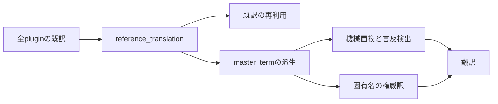
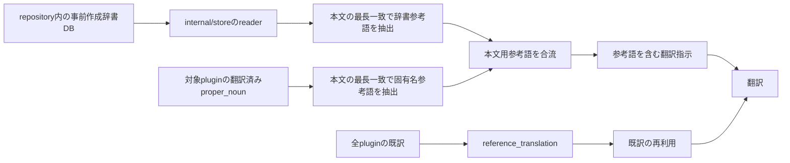

# Design: replace-extraction-to-prebuilt-dictionary

`design.md` は「どう実装し、どう直すか」を人間が読んで判断するための説明を持つ。要求は `plan.md`、確定仕様は `spec.md` が持つ。

---

## R-1 事前作成済み翻訳辞書へ置き換える

### 現況の理解

`internal/api.App.prepareForTranslation` は、対象pluginを登録した後に `Extractor.CollectReferences`、`Extractor.Extract`、`Engine.DeriveMasterTerms`、`Engine.Ingest` を呼ぶ。`CollectReferences` はData folderの全pluginから既訳を `reference_translation` へ保存する。`DeriveMasterTerms` は `reference_translation` から `master_term` を派生する。根拠は `internal/api/app.go` の `RunExtractAndTranslate`、`prepareForTranslation`、`Extractor`、`internal/engine/engine.go` の `DeriveMasterTerms` である。

`reference_translation` は翻訳辞書だけの入力ではない。`Engine.referenceIndex` は完全一致する既訳を再利用し、同期翻訳とbatch翻訳が利用する。対象pluginを削除しても `reference_translation` は削除しない。根拠は `internal/engine/reference.go` の `referenceIndex`、`internal/engine/engine.go`、`internal/engine/batch.go`、`internal/store/target_plugin.go` の `targetPluginDeleteStmts` である。

`internal/engine.Engine.translationVocabulary` は中心DBの `master_term` と `proper_noun` をstoplistで選別する。この語彙は `LoadDictionary` による翻訳前機械置換と、`mentionDetector` による言及検出の共通供給源である。言及は `narration_mention` と `line_mention` に保存し、各行は中心DBの `master_term_id` または `proper_noun_id` への外部キーを持つ。根拠は `internal/engine/engine.go` の `LoadDictionary`、`translationVocabulary`、`internal/engine/mention.go` の `mentionDetector`、`recordMentions`、`internal/store/mention.go` である。

`master_term` は固有名翻訳前の権威訳でもある。`Engine.authoritativeTerms` は `master_term` から原語と訳語を組み、`translateProperNouns` へ渡す。根拠は `internal/engine/engine.go` の `TranslateUntranslated`、`authoritativeTerms`、`translateProperNouns` である。

`Dictionary.Apply` は、語境界、最長一致、大文字小文字の区別、置換済み原語の出現順での一意化を守る。同期翻訳、batch翻訳、翻訳結果の再構成は `LoadDictionary` を利用する。根拠は `internal/core/dictionary/dictionary.go` の `Apply`、`internal/engine/engine.go` の `prepareSource`、`internal/engine/batch.go`、`internal/api/app.go` の翻訳結果再構成である。

現在の `dictionary/dictionary.sqlite3` は、英語表記を `dictionary_term`、意味ごとの訳語を `dictionary_sense` に保存する事前作成済み翻訳辞書DBである。本taskは事前作成済み翻訳辞書DBを `db/dictionary.sqlite3` へ移動する。`inclusion_decision` と `review_stage` はDB単体で収録判断を管理するメタデータであり、アプリの機械置換の選択条件にしない。削除済みなのはmigrationを適用する中心DBの `db/aitranslation.dev.sqlite3` である。中心DBは既存のmigration適用で生成する。根拠は人間判断、`dictionary/schema.sql`、`internal/bootstrap/bootstrap.go`、`internal/store` のDB open処理である。

2026-08-09の読み取り専用集計では、全 `dictionary_sense` は17,346件である。同じ原語と訳語の重複は1,142組、2,552件である。同じ原語に異なる訳語を持つ項目は19原語、46意味候補である。既存の `internal/core/dictionary.Dictionary` は原語ごとに一つの訳語しか使えない。根拠は `dictionary/schema.sql`、`internal/core/dictionary/dictionary.go`、正規DBの読み取り専用集計である。

要求が扱う単位と既存の受け皿のkeyは異なる。

| | 単位 |
| --- | --- |
| 要求が扱う対象 | DBに保存された全ての意味ごとの原語と訳語 |
| 事前作成済み翻訳辞書DB | `dictionary_sense` ごとの原語と訳語 |
| 翻訳前機械置換 | 原語ごとに一つの訳語 |
| 言及記録 | 中心DBの `master_term_id` または `proper_noun_id` |

現況図は、既存の辞書抽出が機械置換以外にも接続する関係を示す。`reference_translation` と `master_term` を単純に削除すると、既訳の再利用、言及記録、固有名の権威訳が失われる。

### あるべき形

翻訳Engineは、本文で一致した原語について、事前作成済み翻訳辞書DBに保存された全ての訳語、品詞、意味、Skyrimのカテゴリを読み取り専用で使う。`inclusion_decision` と `review_stage` は選択条件にしない。

候補の共有型は `internal/model/translation_reference.go` が所有する。`model.TranslationReference` は原語、訳語、品詞、意味、Skyrimのカテゴリ、出どころを持つ。`internal/store` の辞書readerは事前作成済み翻訳辞書の `[]model.TranslationReference` を返す。Engineは翻訳済みの `proper_noun` を同じmodel型へ変換する。Engineのconsumer interfaceは同じmodel型を受け、本文用の `prompt.BodyReference` へ変換する。`internal/store` は `internal/core/prompt` に依存せず、`internal/engine` は `internal/store` に依存しない。`internal/model` は両componentが依存を許可される共有層である。

辞書readerは `internal/store` が所有する。`OpenPrebuiltDictionary` は読み取り専用のSQLite接続を作り、実ファイルから `PRAGMA schema_version` を読んで接続先が読取り可能なDBであることを確認する。`OpenPrebuiltDictionary` はschemaのtable、column、全原語と訳語の読取りを検証しない。readerは同じ原語、訳語、品詞、意味、Skyrimのカテゴリを持つ候補だけを一意にして返し、接続のCloseを提供する。`internal/bootstrap.NewApp` は中心DBとreaderを持つapplication lifecycle closerを返す。`main.go` はapplication lifecycle closerをdeferし、中心DBとreaderを同じ終了処理でCloseする。

参考語用の候補は、`translationVocabulary` と分離した新しいEngineのconsumer interfaceから受け取る。既存辞書抽出処理から流用するのは `reference_translation` による既訳再利用だけである。`translationVocabulary` による言及記録と `authoritativeTerms` による固有名の権威訳は流用しない。本文翻訳の前に対象pluginの翻訳済みmod固有名だけを取得し、事前作成済み翻訳辞書DBの候補と合流して本文用の参考語を組み立てる。別pluginの `proper_noun` は参考語へ入れない。

`prepareForTranslation` は `CollectReferences` を継続する。`CollectReferences` は既訳の再利用を支えるためである。`DeriveMasterTerms` は停止する。`Ingest` は `recordMentions` を呼ばない。翻訳Engineは中心DBの `master_term` を機械置換、言及記録、固有名の権威訳へ使わない。翻訳済みの `proper_noun` は本文用の参考語としてだけ使う。

事前作成済み翻訳辞書の検証は、`LoadDictionary` だけに置かない。`LoadDictionary` は固有名のAI翻訳後に呼ばれるためである。Engineの新しい `ValidatePrebuiltDictionary` は、reader接続が開いていること、必要なschemaとtableとcolumnがあること、全原語、訳語、品詞、意味、Skyrimのカテゴリを読めることを読み取り専用で検証する。同じ原語の異なる訳語は検証失敗にしない。

`Engine.TranslateUntranslated` は、未訳の取得後、`translateProperNouns` の前に `ValidatePrebuiltDictionary` を呼ぶ。`BatchRunner.SubmitBatch` は、`planProperRequests` の前に同じ検証を呼ぶ。検証失敗時は、同期経路とbatch経路のどちらも固有名と本文のAI送信、batchの計画送信、翻訳結果の保存を開始せず、errorを既存の翻訳画面へ返す。reader接続の所有者とCloseはapplication lifecycle closerのままであり、実行ごとの検証は接続をCloseしない。

本文翻訳は、事前作成済み翻訳辞書DBの原語と翻訳済みのmod固有名を同じ候補集合として、既存の文字長貪欲マッチで本文から抽出する。抽出は `internal/core/dictionary.Dictionary` の語境界、最長一致、大文字小文字の区別、出現順で一意化する規則を使う。抽出は本文を置換しない。Engineは抽出した原語ごとにreaderから全ての訳語候補を取得し、同じ原語の翻訳済みmod固有名を取得する。各候補と翻訳済みのmod固有名を参考語として `composeBodyPrompt` と `prompt.ComposeBodyPrompt` へ渡す。本文はMaskとRestoreを通した元の英語のままAIへ送る。

同じ原語に異なる訳語がある場合は、候補を一つへ絞らない。翻訳指示は各候補を同じ原語の別の参考語として列挙し、AIが本文と品詞、意味、Skyrimのカテゴリから使い分ける。同期翻訳とbatch翻訳は共通の `composeBodyPrompt` を使うため、同じ本文と同じ参考語を送る。

Engineは、本文用promptを組み立てた時点の `[]model.TranslationReference` とpromptのSHA-256を中心DBの `translation_reference_snapshot` へ保存する。snapshotの対象plugin keyは、`target_plugin.plugin` と同じplugin名文字列である。同期翻訳はproviderへ送る前にplugin名、kind、row IDへupsertする。batch翻訳は、外部batch送信より前に本文kindのbatch requestだけへ `custom_id` ごとの候補とhashを仮状態で保存する。固有名kindのbatch requestは候補とhashを持たない。外部batch送信の成功後にexternal batch IDを保存して仮状態を送信済みへ更新する。外部batch送信が失敗した場合は仮状態を送信失敗へ更新し、同じ `custom_id` で再送できる状態にする。本文kindの再送は候補とhashも同じ値を使う。送信済みだけを既送として除外する。

`applyResults` は送信済み本文kindのbatch requestから対応するplugin名、kind、row IDを取り、narrationまたはlineの更新成功後に `translation_reference_snapshot` へ同じ候補とhashをupsertする。固有名kindはsnapshotを転記しない。結果表示はDBを再読して候補を作り直さず、plugin名、kind、row IDのsnapshotを読む。保存した候補と本文から再構成したpromptのhashが送信時のhashと一致しない場合は結果表示を作らずerrorにする。本文の完全一致で既訳を再利用した結果、migration前から翻訳済みの結果、固有名の結果はsnapshotを持たない。snapshotを持たない結果は参考語なしで表示し、表示を止めない。翻訳結果の再構成は本文へ辞書訳を置換せず、snapshotがある結果だけ送信時に保存した全参考語を候補ごとに表示する。

あるべき形は、事前作成済み翻訳辞書DBと対象pluginの翻訳済みmod固有名を翻訳指示の参考語の供給元にする。既訳再利用だけを既存辞書抽出処理から流用する。言及記録と固有名の権威訳は中心DBのIDと既存語彙に依存するため、既存動作としては残さない。

### 変更点

次の変更である。

- `internal/store/prebuilt_dictionary.go` を追加する。`OpenPrebuiltDictionary` にSQLite接続と `PRAGMA schema_version` の実行を置き、指定pathのDBを起動時に開いて読めることを確認する。全 `dictionary_term`、`dictionary_sense`、`dictionary_occurrence` から、原語、訳語、品詞、意味、Skyrimのカテゴリを読む。readerは原語、訳語、品詞、意味、Skyrimのカテゴリが全て同じ候補だけを重複除去し、異なる意味またはカテゴリを保持する。Closeを置く。`dictionary/` は `package main` の独立commandであり、翻訳Engineは `dictionary/store.go` をimportしない。
- 事前作成済み翻訳辞書DBを `dictionary/dictionary.sqlite3` から `db/dictionary.sqlite3` へ移動する。`dictionary/dictionary.pre-r4.sqlite3` は過去のbackup SQLiteとして削除する。中心DBの `db/aitranslation.dev.sqlite3` は移動元でも移動対象でもない。移動後に `PRAGMA integrity_check` を実行する。
- `dictionary/main.go` と `dictionary/run-mcp.sh` を変更する。`main.go` はMCP起動だけをdispatchし、MCP起動に使う既定DB pathを `db/dictionary.sqlite3` へ揃える。standaloneのimport command、classify command、`runImport`、`runClassify` は削除する。翻訳アプリのreaderは読み取り専用で開く。MCPは今後の辞書DBメンテナンス手段として既存の読書きtoolを保つ。本taskのMCP接続先検証は検索だけを実行する。書込みを行う `dictionary_classify` を含むtoolは登録だけを確認し、呼ばない。classifyの書込み動作は、DB backupまたはrollbackを明示した将来の辞書メンテナンスで確認する。
- `dictionary/import.go`、`dictionary/dictionary-mcp`、`dictionary/reference/wnjpn.db.gz` を削除する。MCPから呼ばれないimport commandと `main.go` のimport command dispatchを削除する。MCPの `dictionary_classify` が使う `classify.go`、MCPのschema、store、search、match queue、review、history、migration、helper、展開済みWordNet参照SQLite `dictionary/reference/wnjpn.db`、WordNetのLICENSEとREADMEは残す。`dictionary/reference/README.md` は、削除するgzipの取得元、展開、gzip checksum、保持方針を削除し、MCP実行時に残す `wnjpn.db` の用途、path、上流出どころ、SQLite整合性確認、保持方針を記録する。`dictionary/dictionary_test.go` はMCPに残る動作だけを検証する形へ整理する。
- dictionary viewerはすでにworkspaceに存在しないため、再追加しない。`package.json` を変更し、存在しない `dictionary/viewer/server.mjs` を直接参照する `dictionary-viewer` scriptを削除する。
- `.gitignore` の `db/*.sqlite3`、`db/*.sqlite3-wal`、`db/*.sqlite3-shm` が既にGit管理から除外されていることを確認する。`.gitignore` は変更しない。
- `internal/model/translation_reference.go` を追加する。`TranslationReference`、batch requestへ保存する候補snapshot、`translation_reference_snapshot` へ保存する候補snapshotを置く。`internal/store` と `internal/engine` がこの共有型を使う。
- `internal/store/prebuilt_dictionary.go` のreaderに `ValidatePrebuiltDictionary` を置く。接続、schema、必要なtableとcolumn、全原語、訳語、品詞、意味、Skyrimのカテゴリの読取りを検証する。
- `db/migrations/` にmigrationを追加する。`batch_request` へ本文kindだけに使う候補snapshot、prompt hash、送信状態を保存するnullable columnを追加し、external batch IDを仮状態では空にできる形へ変更する。plugin名、kind、row IDをkeyにした `translation_reference_snapshot` tableを追加する。
- `internal/core/batchplan/batchplan.go` の `PlannedRequest` と `BuildBatchRequests` を変更する。本文計画で作った候補snapshot JSONとprompt hashを、kind、row ID、promptとともにbatchの永続化まで運ぶ。固有名計画の候補snapshotとprompt hashは空にする。batchplanはmodelへ依存せず、候補snapshotをJSON文字列として保持する。
- `internal/model/batch_translation.go`、`internal/store/batch_translation.go` にbatch requestの候補snapshot、prompt hash、送信状態の保存および読取りを追加する。`internal/store/translation_reference_snapshot.go` にplugin名、kind、row IDによるsnapshot tableのupsertと読取りを置く。batch requestの `custom_id` と対象rowの対応を使い、本文kindの `applyResults` だけがbatch requestのsnapshotを `translation_reference_snapshot` へ転記する。
- `internal/core/dictionary/dictionary.go` に、既存の語境界、最長一致、大文字小文字の区別、出現順で一意化する規則で原語を抽出し、本文を変更しないsymbolを追加する。`Apply` の置換規則は変更しない。
- `internal/store/proper_noun.go` とEngine側のconsumer interfaceを変更する。対象pluginと翻訳済みstatusで絞る `proper_noun` の読取りを追加する。全pluginを返す既存の `ListProperNouns` を本文参考語の供給に使わない。
- `internal/engine/engine.go` の `Engine`、`New`、`LoadDictionary`、`TranslateUntranslated`、`prepareSource`、`composeBodyPrompt` を変更する。参考語専用のreader interfaceと `ValidatePrebuiltDictionary` を追加する。`prepareSource` は辞書置換を行わず、事前作成済み翻訳辞書の原語と対象pluginの翻訳済み `proper_noun` だけを候補集合として本文から抽出し、抽出した原語の全参考語を `composeBodyPrompt` へ渡す。`TranslateUntranslated` は `translateProperNouns` より前に検証する。`translationVocabulary` と `authoritativeTerms` の呼び出しを停止する。
- `internal/engine/batch.go` の `BatchRunner.SubmitBatch` を変更する。`planProperRequests` より前に `ValidatePrebuiltDictionary` を呼ぶ。失敗時は `sendStage` を呼ばない。
- `internal/engine/ingest.go` の `Ingest` から `recordMentions` の呼び出しを削除する。`internal/engine/mention.go` の `recordMentions` と `mentionDetector`、`internal/store/mention.go` の関連読取りは翻訳経路から外す。既存の言及行は変更しない。
- `internal/core/prompt/prompt.go` に、本文用の `ComposeBodyPrompt` と本文用の参考語DTOを追加する。既存の3引数の `ComposePrompt` は固有名翻訳で使い続ける。`ComposeBodyPrompt` は元の英語本文を変えず、本文から抽出した原語ごとの事前作成済み翻訳辞書の全参考語を訳語、品詞、意味、Skyrimのカテゴリ付きで追加し、翻訳済みのmod固有名を原語と訳語と出どころ付きで追加する。`internal/engine/engine.go` の本文翻訳と `internal/api/app.go` の本文結果再構成だけが `ComposeBodyPrompt` を使う。`internal/engine/proper_noun.go` と `internal/engine/batch.go` の固有名翻訳は既存の `ComposePrompt` を使い続ける。
- `internal/engine/engine.go` と `internal/engine/batch.go` を変更する。同期翻訳ではprovider送信前に `translation_reference_snapshot` へ保存する。`SubmitBatch` は仮状態または送信失敗状態のbatch requestを持つ進行中batchで `StartBatchProgression` を呼ばず、`ResumeBatchProgression` を呼ぶ。`ResumeBatchProgression` は、仮状態または送信失敗状態のproper kindがあればproper段から再開する。仮状態または送信失敗状態の本文kindがあり、proper kindがないか全て送信済みであれば本文段から再開する。proper kindが0件で本文kindが仮状態または送信失敗状態の場合も本文段から再開する。新規batchだけが `StartBatchProgression` を呼ぶ。本文計画はproper段の結果を反映した後の `proper_noun` と事前作成済み翻訳辞書DBを参考語集合へ合流し、候補snapshotとprompt hashを `PlannedRequest` へ載せる。`sendStage` が外部batch送信前に仮状態のbatch requestを永続化する。`sendStage` は外部batch送信成功後にexternal batch IDと送信済み状態へ更新する。外部batch送信失敗時は送信失敗状態へ更新する。`nextStageRequests` は送信済みだけを除外し、仮状態と送信失敗状態の同じbatch requestを再送に使う。再送は本文kindの候補snapshotとprompt hashを変更しない。`internal/engine/batch.go` の `applyOneResult` は本文kindのnarrationまたはline更新成功後だけ、batch requestのsnapshotをplugin名、kind、row IDの `translation_reference_snapshot` へ転記する。
- `internal/api/app.go` の `TermView` と `ResultView` を変更する。plugin名、kind、row IDで取得した候補snapshotを候補ごとの配列として返す。各 `TermView` は原語、訳語、品詞、意味、Skyrimのカテゴリ、出どころを持つ。`ResultView` はprompt hashを持つ。保存した候補から再構成したprompt hashが一致しない場合は結果を返さない。snapshotがない既訳再利用、migration前の翻訳済み、固有名の結果は参考語の配列を空にする。辞書訳による本文の再置換を行わない。
- `frontend/src/ui/screens/translation-run/translation-run-view.ts`、`TranslationResultRow.svelte`、`translation-run.fixtures.ts`、`TranslationResultRow.stories.ts`、`TranslationRunScreen.stories.ts` を変更する。Wails生成型を更新する。frontendの `ReplacedTerm` はbackendの `TermView` と同じ原語、訳語、品詞、意味、Skyrimのカテゴリ、出どころを持つ。候補ごとの参考語を原語でまとめ、同じ原語の複数候補を訳語、品詞、意味、Skyrimのカテゴリ、出どころとともに表示する。参考語の配列が空の結果は参考語を表示しない。Storybookで人間が確認する。
- `internal/bootstrap/bootstrap.go` の `NewApp` を変更する。開発時の `db/dictionary.sqlite3` を `OpenPrebuiltDictionary` へ渡し、中心DBとreaderをCloseするapplication lifecycle closerを返す。DB fileを開けない、または `PRAGMA schema_version` を読めない起動時のerrorは `NewApp` から `main.go` の `log.Fatalf` へ渡し、Wailsを起動しない。schema、table、column、全原語、訳語、品詞、意味、Skyrimのカテゴリの読取りの失敗は翻訳実行前の `ValidatePrebuiltDictionary` が `internal/api.App.RunExtractAndTranslate` のerrorとして返し、既存のfrontend error表示経路へ渡す。
- `internal/api/app.go` の `prepareForTranslation` を変更する。既訳再利用を保つため `Extractor.CollectReferences` を残し、`Engine.DeriveMasterTerms` を呼ばない。
- `internal/store/target_plugin.go` の `targetPluginDeleteStmts` を変更する。対象pluginの `translation_reference_snapshot` を、batch requestとbatch translationを削除する前に削除する。
- `scripts/windows/build-windows.ps1` と配布物の配置規約は変更しない。配布先への事前作成済み翻訳辞書DBの共有は本taskの対象外とする。開発時はrepository内の `db/dictionary.sqlite3` をreaderの入力にする。新readerは既存の `internal/store` componentに置き、既存の `bootstrap` から `store` への依存だけを使うため、`.go-arch-lint.yml` のcomponentまたは依存許可は追加しない。architecture lintで既存の境界を確認する。
- `docs/architecture.md` を変更する。事前作成済み翻訳辞書DBのSQLite readerを `internal/store` の責務として正本化する。

### 検討が必要なこと

- なし。
